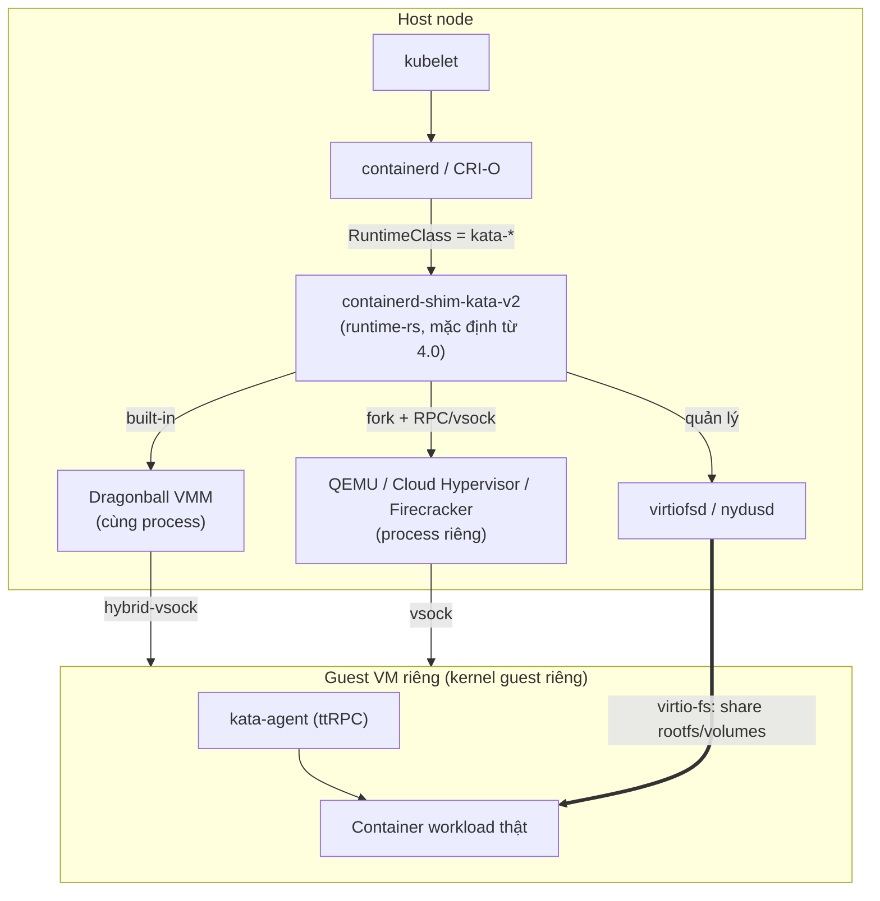

# Kata Containers — v4.1.0 (Rust runtime / runtime-rs mặc định)
Tags: #kubernetes #container-runtime #sandboxing #security #cks #virtualization
Last updated: 2026-09-06

> ⚠️ **Cảnh báo phiên bản trước khi đọc**: Kata Containers 4.0.0 (phát hành 2026-07-20) là một **rewrite kiến trúc lớn** — runtime viết bằng Rust (`runtime-rs`) thay thế runtime Go làm mặc định. Go runtime bị **deprecated** (không gỡ bỏ, không thêm tính năng mới) kể từ 4.0. Bản mới nhất tại thời điểm viết là **4.1.0** (2026-08-21). Nếu hệ thống bạn sắp nhận bàn giao được cài trước tháng 7/2026, nhiều khả năng **vẫn đang chạy Go runtime (kiến trúc 3.x)** — kiến trúc, đường dẫn file, và một số config khác khá nhiều so với note này. **Việc đầu tiên khi nhận bàn giao: chạy lệnh ở [Ops Runbook](#8-ops-runbook--production-notes) để xác định runtime đang chạy.**
> Nguồn: [GitHub Releases](https://github.com/kata-containers/kata-containers/releases), [4.0.0 blog](https://katacontainers.io/blog/kata-containers-4-0-0-release-overview/), [migrating-config-go-runtime-to-runtime-rs.md](https://github.com/kata-containers/kata-containers/blob/main/docs/migrating-config-go-runtime-to-runtime-rs.md)

---

### **1. What — Nó là cái gì?**

Kata Containers là một OCI/CRI-compatible container runtime chạy mỗi container (hoặc mỗi Pod trong K8s) bên trong một **VM nhẹ (lightweight VM)** riêng, có kernel guest riêng, thay vì share kernel host như `runc`. Nó "giả dạng" một container runtime bình thường (implement containerd shim v2 / `io.containerd.kata.v2`) nên tích hợp vào Kubernetes/containerd/CRI-O mà không cần đổi ứng dụng — chỉ chọn qua `RuntimeClass`.

### **2. Why — Tại sao tồn tại / Vấn đề nó giải quyết?**

Nếu không có Kata: một pod chạy bằng `runc` chỉ được cách ly bằng namespace + cgroup + seccomp — tất cả pod trên node **share chung 1 kernel host**. Một lỗ hổng kernel (container breakout, CVE kiểu Dirty Pipe, runc CVE...) trên 1 pod độc hại có thể ảnh hưởng toàn bộ node và các pod khác (multi-tenant risk). Kata thêm một lớp cách ly phần cứng (hardware virtualization) ở giữa: workload độc hại muốn chiếm host phải phá vỡ được ranh giới VM (hypervisor/KVM), không chỉ namespace — khó hơn nhiều bậc. Đây chính là lý do CKS đưa "container runtime sandbox (gVisor, Kata Containers)" vào domain **Minimize Microservice Vulnerabilities** (~20% điểm thi).

### **3. When — Dùng khi nào / KHÔNG dùng khi nào?**

**Dùng khi:**
- Chạy workload multi-tenant, không tin tưởng lẫn nhau (SaaS chạy code khách hàng, CI/CD runner chạy job untrusted, PaaS).
- Cần "defense in depth" cho workload internet-facing dễ bị RCE (image processing, PDF parser, sandbox chạy code người dùng nhập vào).
- Cần Confidential Computing (Intel TDX / AMD SEV-SNP) — Kata là nền tảng của [Confidential Containers](https://confidentialcontainers.org/).

**KHÔNG dùng khi (quan trọng hơn danh sách "dùng khi"):**
- Node là **VM lồng VM (nested) mà host cloud không bật nested virtualization** — Kata sẽ không tạo được sandbox (thiếu `/dev/kvm`). Nhiều VPS/cloud instance rẻ tiền tắt nested virt mặc định.
- Cần `hostNetwork: true` — **không được hỗ trợ**, và có thể phá luôn networking của host nếu cố dùng (xem [[kata--limitations]]).
- Workload cần start rất nhanh (sub-100ms cold start) ở mật độ cực cao — overhead boot VM (dù đã tối ưu nhiều ở runtime-rs) vẫn cao hơn `runc` thuần.
- Cần chia sẻ network namespace giữa nhiều container (`docker --net=container:X`) — không hỗ trợ.
- Dùng Podman — **chưa được hỗ trợ chính thức** (issue #722, còn mở tại thời điểm viết).
- Team vận hành chưa có kinh nghiệm debug KVM/QEMU — troubleshooting Kata khó hơn troubleshooting container thường một bậc (phải biết cả layer VM).

### **4. Where - Architecture — Nó nằm ở đâu trong hệ thống?**



- **Vị trí trong hệ thống**: nằm giữa CRI (containerd/CRI-O) và hypervisor — thay thế `runc` ở vị trí "low-level runtime", nhưng bản thân nó gọi ra một VMM để tạo sandbox.
- **Component chính**: `containerd-shim-kata-v2` (runtime/shim), `kata-agent` (chạy trong guest), VMM (Dragonball built-in hoặc QEMU/Cloud Hypervisor/Firecracker external), `virtiofsd`/`nydusd` (chia sẻ filesystem).
- **Traffic/data flow**: control-plane đi qua **vsock** (virtio-vsock) giữa shim/VMM và agent trong guest; filesystem (rootfs, volume, configmap/secret) đi qua **virtio-fs**; network qua `tap` device → `virtio-net` trong guest.
- **Dependency**: KVM (`/dev/kvm`), CPU virtualization extension (VT-x/AMD-V), kernel module `vhost_vsock` + `vhost_net`, containerd ≥ v2.1.x (khuyến nghị) hoặc CRI-O.
- Chi tiết đầy đủ (built-in vs external VMM, layered architecture, async I/O): [[kata--architecture-runtime-rs]]

### **5. How — Cơ chế hoạt động**

Core concepts quan trọng nhất:

1. **Sandbox = Pod**, không phải container. Kata tạo 1 VM cho mỗi Pod (Kubernetes pod sandbox), các container trong cùng Pod chạy chung 1 VM đó (giống model namespace của K8s).
2. **Hai chế độ VMM** (từ 4.0): *Built-in* (Dragonball chạy chung process với shim, không IPC — hiệu năng cao nhất, mặc định khuyến nghị) và *External* (QEMU/Cloud Hypervisor/Firecracker chạy process riêng, giao tiếp qua fork+RPC/vsock — cần khi cần GPU, TDX/SEV-SNP, hoặc hypervisor cụ thể). Xem [[kata--hypervisors]].
3. **kata-agent** là init process (PID 1 tương đương) trong guest, nhận lệnh qua ttRPC từ shim (tạo container, exec, copy file...) và optionally **enforce Agent Policy (OPA/Rego)** cho từng request — quan trọng cho confidential containers. Xem [[kata--security-policy]].
4. **RuntimeClass** là điểm chọn runtime ở tầng K8s — mỗi shim/hypervisor có 1 RuntimeClass riêng (`kata-qemu-runtime-rs`, `kata-dragonball`, `kata-qemu` [Go, deprecated]...). Xem [[kata--k8s-integration]].
5. **Async I/O (Tokio)** ở runtime-rs: giảm số OS thread từ `4 + 12*M` (Go, sync) xuống `2 + N` (Rust, async worker pool) với M = số container, N = số worker thread — lý do chính runtime-rs tiết kiệm RAM/CPU hơn hẳn ở mật độ cao.

Không cần hiểu hết source code — chỉ cần nhớ: **mọi request từ containerd đều phải xuyên qua vsock vào 1 VM riêng** trước khi chạm container thật, đó là nguồn gốc của mọi khác biệt hành vi so với `runc` (xem [[kata--limitations]]).

### **6. Key Config — Cấu hình cần nhớ**

- **File config chính**: `/opt/kata/share/defaults/kata-containers/configuration*.toml` (khi cài qua `kata-deploy` Helm chart — cách khuyến nghị). **Không sửa trực tiếp file này** — dùng drop-in `config.d/*.toml` (xử lý theo alphabet, file sau đè file trước; prefix `10-*`/`20-*`/`30-*`/`50-*` do kata-deploy dùng, tự đặt custom nên dùng `50-89`). Chi tiết: [[kata--configuration]].
- **`/etc/kata-containers/configuration.toml` có độ ưu tiên cao hơn** package default nếu tồn tại — đây là bẫy phổ biến: sửa nhầm 1 file cũ ở đây sẽ **ghi đè âm thầm** mọi thay đổi bạn làm ở nơi khác, kể cả sau khi upgrade Kata.
- **`runtime_path` trong `/opt/kata/containerd/config.d/kata-deploy.toml`** quyết định bạn đang dùng Go runtime (`/opt/kata/bin/containerd-shim-kata-v2`) hay Rust runtime (`/opt/kata/runtime-rs/bin/containerd-shim-kata-v2`) — **đọc file này trước khi debug bất cứ thứ gì**, vì rất nhiều option config khác nhau hoàn toàn giữa hai runtime (xem bảng so sánh trong [[kata--configuration]]).
- **`privileged_without_host_devices = true`** (containerd/CRI-O runtime option, không phải trong configuration.toml) — mặc định **phải bật** cho Kata, nếu không một Pod `privileged: true` sẽ cố pass-through toàn bộ host device vào guest (không hoạt động đúng vì khác kernel) và có thể gây lỗi khó hiểu. `kata-deploy` tự cấu hình đúng, nhưng nếu bạn tự viết containerd config tay — đây là default nguy hiểm nhất cần nhớ.
- **`enable_annotations`** (whitelist annotation hypervisor được phép override per-pod) — mặc định rỗng/hạn chế; đừng thêm `virtio_fs_extra_args` vào danh sách trừ khi tin tuyệt đối mọi nguồn tạo pod annotation (có thể bị lợi dụng chạy lệnh tuỳ ý phía host qua `virtiofsd`).
- **`default_memory` / `default_vcpus`** (`[hypervisor.qemu]` hoặc tương đương) — default thường thấp (ví dụ 2048 MiB) để tiết kiệm, dễ khiến workload nặng bị OOM **trong guest** dù node host còn dư tài nguyên — đây là constraint 2 lớp (guest kernel + hypervisor), xem "constraints challenge" trong [[kata--limitations]].

### **7. Security Considerations**

- **Attack surface** nằm ở: (1) hypervisor/VMM (QEMU có surface lớn nhất do đầy đủ tính năng; Firecracker/Cloud Hypervisor nhỏ hơn vì minimal), (2) virtio device backend (`vhost` chạy trong kernel host = rủi ro cao hơn `vhost-user`/VMM userspace), (3) `virtiofsd` (chạy as root theo thiết kế, tự sandbox bằng seccomp + mount namespace riêng), (4) VFIO passthrough (DMA attack nếu thiếu IOMMU group cô lập đúng).
- **Misconfiguration gây breach thực sự**:
  - Quên set `privileged_without_host_devices = true` → pod `privileged: true` có thể lấy được host device.
  - Bật `enable_annotations` cho `virtio_fs_extra_args` hoặc `jailer_path`/`path` (hypervisor path) mà không giới hạn `valid_hypervisor_paths`/`valid_jailer_paths` → cho phép ai đó set annotation để runtime **thực thi 1 binary tuỳ ý trên host**.
  - Dùng `hostPath` type Block Device hoặc mount `/dev/*` mà không hiểu Kata sẽ **hotplug thẳng thiết bị đó vào guest** — hành vi khác `runc` (bind-mount thường), có thể cấp quyền rộng hơn dự kiến.
  - Guest-pulled image (nydus) mà không set `runAsUser`/`runAsGroup`/`fsGroup` rõ ràng → container có thể chạy với UID/GID không như kỳ vọng, và Agent Policy tự sinh (`genpolicy`) có thể reject workload.
- **Hardening checklist tối thiểu**:
  1. Luôn cài qua `kata-deploy` Helm chart (tự cấu hình `privileged_without_host_devices`, RBAC tối thiểu) thay vì tự tay viết containerd/CRI-O config.
  2. Không thêm annotation hypervisor vào `enable_annotations` trừ khi thật sự cần, và luôn kèm whitelist giá trị (`valid_*_paths`).
  3. Với confidential/multi-tenant nghiêm ngặt: bật **Agent Policy (OPA/Rego)** — mặc định Kata Agent Policy **cho phép tất cả** (permissive) nếu không build với `AGENT_POLICY=yes` và tự viết policy. Xem [[kata--security-policy]].
  4. Không dùng `--net=host` / `HostNetwork` với Kata — vừa không hỗ trợ vừa có thể phá networking host.
  5. Với node chạy `kata-deploy` ở `deploymentMode: job` (mặc định từ các version gần đây) — pod cài đặt trên host **không giữ ServiceAccount token** (`automountServiceAccountToken: false`), giảm rủi ro nếu node bị chiếm; nếu bạn dùng `deploymentMode: daemonset` (legacy), DaemonSet pod chạy privileged liên tục — cân nhắc migrate.
- Threat model đầy đủ (VM escape, kernel vuln host dùng chung KVM giữa nhiều VM, VFIO DMA attack, ACPI hotplug attack...): [[kata--security-policy]].

### **8. Ops Runbook — Production Notes**

**Việc đầu tiên khi nhận bàn giao — xác định runtime đang chạy:**
```bash
# Xem RuntimeClass nào đang tồn tại trên cluster
kubectl get runtimeclasses

# Trên từng node: kiểm tra shim nào đang được containerd trỏ tới
cat /opt/kata/containerd/config.d/kata-deploy.toml | grep runtime_path
# .../bin/containerd-shim-kata-v2          -> Go runtime (3.x, deprecated)
# .../runtime-rs/bin/containerd-shim-kata-v2 -> Rust runtime (4.x, mặc định)

containerd-shim-kata-v2 --version
kata-runtime --version   # chỉ tồn tại nếu có Go runtime cài
```

- **Health check**: chạy thử pod test với `runtimeClassName` tương ứng, `command: ["uname", "-r"]` — nếu kernel version in ra **khác** `uname -r` của host → Kata đang hoạt động đúng (đang chạy trong guest kernel riêng).
- **Log quan trọng**: `sudo journalctl -t kata` (cả Go runtime lẫn runtime-rs đều log vào journald với identifier `kata`). Go runtime **còn log qua containerd log** — cần bật `containerd` debug (`[debug] level = "debug"`) mới thấy đầy đủ; runtime-rs **không cần** bật containerd debug, tự log thẳng vào journald.
- **Bật debug**: set `enable_debug = true` trong `configuration.toml` (nên làm qua drop-in `config.d/`, không sửa file gốc); runtime-rs còn có `log_level = "trace|debug|info|warn|error|critical"` chi tiết hơn theo từng component (`[runtime]`, `[hypervisor.*]`, `[agent.kata]`).
- **Thu thập log để báo bug**: script `kata-collect-data.sh` (chỉ có ở Go runtime tại thời điểm viết — runtime-rs chưa có script tương đương chính thức, dùng `journalctl -t kata` + `kata-log-parser` thay thế).
- **Metric**: `kata-monitor` (DaemonSet riêng, scrape `kata-agent`) + Prometheus + Grafana — xem [[kata--monitoring]]. Lưu ý doc chính thức ghi rõ setup mẫu **chỉ để evaluation, không dùng nguyên bản cho production**.
- **journald rate limiting**: bật `enable_debug` sinh log rất nhiều — `systemd-journald` có thể tự động **drop bớt log** (`RateLimitInterval`/`RateLimitBurst`), kiểm tra bằng `journalctl --since today | grep Suppressed`. Nếu đang debug incident nghiêm trọng mà thấy thiếu log → check cái này đầu tiên.
- **Restart/rollback**: Kata không có `checkpoint`/`restore` (không tương đương CRIU) — không có cách "suspend" 1 sandbox đang chạy để rollback; xử lý sự cố = xoá pod và tạo lại (stateless). Upgrade Kata version: dùng `helm upgrade` (nếu cài qua kata-deploy) — **không tự ý xoá tay** `/opt/kata` vì có thể để lại RBAC/artifact rác.
- Chi tiết debug console (vào được guest VM để soi trực tiếp), attach debugger vào shim: [[kata--troubleshooting]].

### **9. Gotchas & Lessons Learned**

> Phần này ghi lại pitfall đã được xác nhận **từ tài liệu chính thức** (Limitations, threat-model, migrating-config docs) — chưa phải kinh nghiệm vận hành thực tế của bạn. Khi thao tác trực tiếp trên hệ thống thật, hãy bổ sung thêm case cụ thể vào đây.

- **`emptyDir.sizeLimit` bị vượt dù workload ghi rất ít dữ liệu**: với `block-plain`/`block-encrypted` emptyDir mode, Kata size block device theo **tổng dung lượng filesystem host chứa emptyDir**, không theo `sizeLimit`. Overhead ext4 metadata (~0.08% dung lượng logical) có thể tự nó đã vượt `sizeLimit` nhỏ → pod bị evict oan. Chưa có config nào giới hạn việc này (issue #2438 còn mở). → Nếu dùng emptyDir sizeLimit nhỏ với Kata, để dư headroom nhiều hơn bình thường, hoặc đặt volume trên filesystem host nhỏ dành riêng.
- **`volumeMounts.subPath` không hoạt động** trên Kata — pattern rất phổ biến khi mount ConfigMap/Secret vào 1 file cụ thể trong container sẽ fail âm thầm hoặc khác hành vi so với `runc`.
- **Mount `/proc`/`/sysfs` bị giới hạn nghiêm ngặt** (do CVE-2019-16884, CVE-2019-19921) — chỉ 8 path cụ thể được bind-mount vào `/proc/*` (`cpuinfo`, `diskstats`, `meminfo`, `stat`, `swaps`, `uptime`, `loadavg`, `net/dev`). Tool monitoring/APM cố bind-mount toàn bộ `/proc` từ host sẽ bị chặn.
- **Migrate config Go → runtime-rs không phải copy-paste được**: nhiều option đổi tên, đổi đơn vị (giây → mili-giây ở `dial_timeout`/`cdh_api_timeout`), đổi bảng TOML (`[runtime] guest_selinux_label` → `[hypervisor.qemu] selinux_label`), hoặc bị drop hẳn (`enable_numa`, rate limiter mạng chưa có ở runtime-rs). Copy nguyên `configuration.toml` cũ qua runtime-rs mà không đối chiếu bảng migrate = nguy cơ mất tính năng âm thầm (không lỗi, chỉ đơn giản option bị ignore).
- **`guest_swap` bị QEMU plugin ở runtime-rs từ chối** dù option `enable_guest_swap` tồn tại trong config — validation reject thẳng, không có thông báo rõ ràng nếu không đọc kỹ changelog.
- **File `/etc/kata-containers/configuration.toml` "ma"**: đây là leftover thói quen từ hướng dẫn cũ/Kata 1.x-2.x. Nếu file này tồn tại trên node (kể cả rỗng), nó **luôn thắng** mọi config packaged mới hơn — là nguyên nhân kinh điển của "tôi sửa `config.d/` mà không có tác dụng gì".
- **`kubectl exec`/log hoạt động bình thường** nhưng bất cứ debug tool nào cần truy cập trực tiếp `/proc` của host hoặc namespace host đều sẽ không thấy được gì hữu ích — vì process thật nằm trong 1 VM khác hẳn network/PID namespace của host.

### **10. Resources**

- Official docs (repo chính, luôn theo `main` branch — không có "stable branch" riêng, xem [[kata--configuration]]): https://github.com/kata-containers/kata-containers/tree/main/docs
- Quick start: https://github.com/kata-containers/kata-containers/blob/main/docs/quick-start-guide.md
- Kiến trúc 4.0 đầy đủ: https://github.com/kata-containers/kata-containers/blob/main/docs/design/architecture_4.0/architecture.md
- Threat model chính thức: https://github.com/kata-containers/kata-containers/blob/main/docs/threat-model/threat-model.md
- Limitations (danh sách issue-tracked, luôn cập nhật): https://github.com/kata-containers/kata-containers/blob/main/docs/Limitations.md
- Helm chart config đầy đủ (deployment modes, node selector, TEE shim...): https://github.com/kata-containers/kata-containers/blob/main/docs/helm-configuration.md
- CKS liên quan (domain Minimize Microservice Vulnerabilities — container runtime sandbox): tự luyện trên cluster thật với `RuntimeClass` + Kata/gVisor, không có "official CKS doc" riêng — đề thi dựa trên [Kubernetes docs RuntimeClass](https://kubernetes.io/docs/concepts/containers/runtime-class/).
