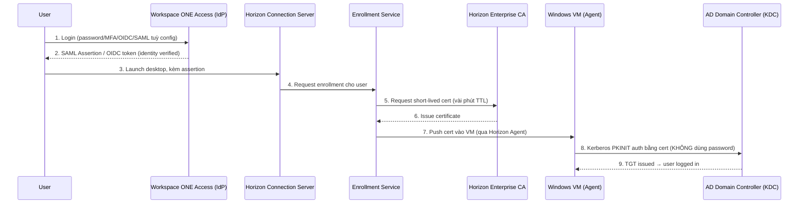

# IAM Knowledge Tree — cho lab Horizon True SSO

> Mindset trước: **AuthN** = "mày là ai", **AuthZ** = "mày được làm gì", **SSO** = UX layer ngồi trên cả 2, không phải protocol riêng. Nhiều người confuse SSO = SAML, sai — SSO là _khái niệm_, SAML/OIDC/Kerberos là _cách hiện thực_.

```
IAM (Identity & Access Management)
│
├── 1. AUTHENTICATION (AuthN) — "who are you"
│   ├── Password-based (form login, basic auth) — legacy, weak, avoid
│   ├── Kerberos — ticket-based, domain-native (AD dùng cái này)
│   │   ├── KDC (Key Distribution Center)
│   │   ├── TGT (Ticket Granting Ticket)
│   │   └── PKINIT — Kerberos auth bằng certificate thay vì password
│   │       └── ⚠️ ĐÂY LÀ CÁI HORIZON TRUE SSO DÙNG
│   ├── Certificate-based / PKI / mTLS
│   │   ├── Smart Card logon (Windows)
│   │   ├── Client cert auth (mTLS)
│   │   └── Short-lived cert issuance (Horizon Enrollment Service model)
│   ├── MFA/OTP (TOTP, push, WebAuthn/FIDO2)
│   └── Federated AuthN (identity federation — auth ở chỗ khác, tin tưởng lẫn nhau)
│       ├── SAML 2.0 — XML-based, enterprise/legacy web SSO
│       │   ├── IdP (Identity Provider) — nơi verify identity (vd: Workspace ONE Access)
│       │   ├── SP (Service Provider) — app cần login (vd: Horizon)
│       │   ├── Assertion — "chứng chỉ" IdP ký gửi cho SP
│       │   └── Metadata / trust exchange (cert exchange giữa IdP-SP)
│       ├── OAuth 2.0 — KHÔNG PHẢI authN gốc, là AUTHORIZATION framework
│       │   ├── Grant types: Auth Code, Client Credentials, Device Code...
│       │   ├── Access Token / Refresh Token
│       │   └── Bị lạm dụng để "login" → đó là lý do OIDC ra đời
│       └── OpenID Connect (OIDC) — lớp AuthN đắp lên trên OAuth2
│           ├── ID Token (JWT) — chứa identity claims
│           └── Modern replacement cho SAML (JSON > XML, mobile-friendly)
│
├── 2. AUTHORIZATION (AuthZ) — "what can you do"
│   ├── RBAC (Role-Based Access Control)
│   ├── ABAC (Attribute-Based Access Control)
│   ├── OAuth 2.0 Scopes / Token-based access
│   └── Policy engines (OPA, Casbin) — nếu muốn scale sang k8s/cloud-native sau này
│
├── 3. SSO (Single Sign-On) — UX layer, gộp nhiều AuthN method lại
│   ├── Enterprise/Windows SSO — Kerberos/NTLM, domain-joined machine
│   ├── Web SSO — SAML hoặc OIDC federation giữa nhiều web app
│   ├── Certificate-based SSO — Smart Card / True SSO (no password ever)
│   └── Session/Cookie SSO — reverse proxy chia sẻ session cookie (ít dùng enterprise)
│
└── 4. TRUST BACKBONE — cái nền để mấy thứ trên hoạt động
    ├── LDAP / Active Directory — directory service, source of truth cho identity
    ├── IdP vs SP relationship — ai tin ai, trust được thiết lập qua cert/metadata
    └── PKI / CA chain — root CA → issuing CA → cert cho user/device
```

---

## Map vào flow thực tế của Horizon True SSO

True SSO **không dùng SAML/OAuth để login vào Windows** — nó dùng SAML/OIDC để login vào **Workspace ONE Access**, rồi đổi sang **certificate** để login Windows qua Kerberos PKINIT. Đây là chỗ nhiều người lab xong vẫn không hiểu vì sao "no password" lại work.



**Điểm mấu chốt (mấy cái này lab xong mới thấm):**

- SAML/OIDC ở bước 1-2 chỉ lo **AuthN vào Workspace ONE**, KHÔNG liên quan gì đến login Windows.
- Cert ở bước 5-7 mới là thứ thật sự login vào máy — nó là "cầu nối" giữa web-based identity và domain-based identity.
- Nếu cert chain (bước 5-6) sai — Root CA của Horizon Enrollment Service không được AD trust — thì bước 8 **fail silent**, user rớt về màn hình nhập password. Đây là lỗi 90% ae hay dính khi lab True SSO.
- Attack surface cần để ý: cert TTL càng ngắn càng an toàn (giảm blast radius nếu cert bị leak), và **Enrollment Service phải là internal-only**, không được expose ra ngoài — vì nó có quyền issue cert domain-trusted.

---

## Gợi ý học tiếp (theo hướng career path của mày — K8s/DevSecOps)

- Mấy concept này y chang OIDC dùng trong **K8s API server auth** (`--oidc-issuer-url`) — học kỹ ở đây là double dip cho CKA/production K8s sau này.
- Vault PKI secrets engine cũng dùng model "short-lived cert" y hệt Horizon Enrollment Service — đáng thử lab song song để hiểu sâu hơn về cert-based trust.


