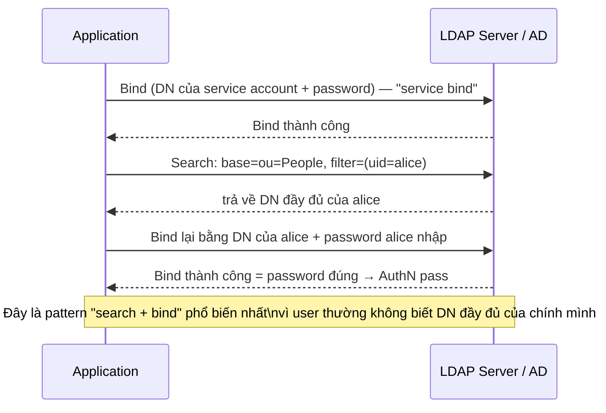

# IAM — Directory Services (LDAP / Active Directory)
Tier: 2
Parent: [[Kubernetes/Security/iam/iam]]
Related: [[iam--authentication]], [[iam--scim-provisioning]], [[iam--sso]]
Tags: #iam #ldap #active-directory #directory

## What it does

Directory service là kho dữ liệu chuyên biệt (không phải RDBMS thông thường) lưu thông tin identity (user, group, computer, tổ chức) dưới dạng cây phân cấp, tối ưu cho **đọc nhiều/ghi ít** và tra cứu theo thuộc tính. LDAP (Lightweight Directory Access Protocol) là giao thức chuẩn để query/update directory; Active Directory (AD) là implementation của Microsoft, dùng LDAP làm 1 trong các giao thức truy cập (cùng với Kerberos cho AuthN).

## Why it exists

Trước directory service, mỗi hệ thống (server, ứng dụng nội bộ) tự có danh sách user/password riêng — không nhất quán, không có 1 nơi trung tâm để quản lý vòng đời nhân viên. Directory giải quyết bằng cách làm **nguồn dữ liệu identity thô** (system of record) mà mọi hệ thống khác (IdP, VPN, file server, app nội bộ) đọc/bind vào, thay vì tự lưu bản sao. Đây là lớp **dưới cùng** trong kiến trúc IAM — IdP hiện đại (Keycloak, Okta) thường không tự lưu user mà **liên kết (federate)** với LDAP/AD sẵn có của doanh nghiệp.

## When — Dùng khi nào / KHÔNG dùng khi nào?

**Dùng khi:** doanh nghiệp có hạ tầng Windows/AD sẵn có, cần 1 nguồn identity trung tâm cho cả hệ thống nội bộ (file share, VPN, print server — vốn chỉ hỗ trợ LDAP/Kerberos, không hỗ trợ OIDC/SAML).

**KHÔNG dùng khi:** xây mới hệ thống cloud-native/SaaS thuần — dùng thẳng IdP hiện đại (Okta, Auth0...) làm system of record, không cần dựng thêm LDAP/AD làm lớp trung gian nếu không có ràng buộc legacy. Nhiều tổ chức vẫn giữ AD nội bộ + đồng bộ (sync) 1 chiều sang cloud IdP (Azure AD Connect, Okta AD Agent) để vừa giữ hệ thống nội bộ vừa có SSO hiện đại.

## How it works (flow/diagram)

**Mô hình cây LDAP (DIT — Directory Information Tree):**

```
dc=company,dc=com
├── ou=People
│   ├── uid=alice,ou=People,dc=company,dc=com
│   └── uid=bob,ou=People,dc=company,dc=com
└── ou=Groups
    ├── cn=engineering,ou=Groups,dc=company,dc=com
    └── cn=finance,ou=Groups,dc=company,dc=com
```

Mỗi entry có **DN (Distinguished Name)** — đường dẫn định danh duy nhất (vd `uid=alice,ou=People,dc=company,dc=com`), và tập thuộc tính theo **schema** (objectClass quy định thuộc tính bắt buộc/tuỳ chọn — vd `inetOrgPerson` có `cn`, `sn`, `mail`...).

**Bind (xác thực) — thao tác nền tảng của LDAP:**



**Active Directory bổ sung so với LDAP thuần:** Kerberos (giao thức AuthN chính trong domain, cho phép SSO trong mạng nội bộ mà không gửi password qua lại nhiều lần — ticket-based), Group Policy (quản lý cấu hình máy trạm hàng loạt), và Global Catalog (index tìm kiếm nhanh xuyên nhiều domain trong forest).

## Config gotchas

- **Service account bind với quyền quá rộng** — nhiều app chỉ cần read-only search nhưng được cấp bind account có quyền write/admin toàn directory — vi phạm least privilege nghiêm trọng vì đây thường là credential dễ bị lộ nhất (hardcode trong config file app).
- **LDAP không TLS (`ldap://` thay vì `ldaps://`/`StartTLS`)** — bind password đi qua mạng dạng plaintext (hoặc base64, tương đương plaintext), dễ bị sniff trên mạng nội bộ không segment kỹ.
- **LDAP injection** — filter LDAP ghép chuỗi trực tiếp từ input user (giống SQL injection) — vd input `*)(uid=*))(|(uid=*` có thể phá vỡ logic filter, bypass điều kiện tìm kiếm. Luôn escape ký tự đặc biệt LDAP (`, ( ) \ NUL /`) hoặc dùng thư viện hỗ trợ parameterized filter.
- **Anonymous bind vẫn bật** — nhiều AD/LDAP server mặc định hoặc cấu hình nhầm cho phép bind không cần credential, lộ toàn bộ cấu trúc directory (user list, group membership) cho bất kỳ ai truy cập được mạng.
- **Nested group quá sâu** — AD cho phép group chứa group, tính toán "user có thuộc group X không" qua nhiều tầng nested dễ gây sai sót logic phân quyền nếu app tự tính toán thay vì dùng API chuẩn (`tokenGroups` trong AD).

## Security notes

- **AD compromise = compromise toàn bộ domain** — Active Directory là mục tiêu hàng đầu trong pentest/ransomware thực tế (Kerberoasting, DCSync, Golden Ticket, Pass-the-Hash) vì kiểm soát AD gần như đồng nghĩa kiểm soát mọi máy join domain. Đây là lý do khuyến nghị **Tiered Administration Model** (tách biệt tài khoản quản trị Domain Controller khỏi tài khoản dùng hàng ngày).
- **Kerberoasting** — bất kỳ authenticated user nào cũng request được service ticket (mã hoá bằng hash password của service account) cho các SPN (Service Principal Name) đã đăng ký, rồi crack offline — service account với password yếu là mục tiêu dễ khai thác nhất.
- **LDAPS/StartTLS bắt buộc cho mọi kết nối** (đặc biệt service bind) — không có lý do chính đáng để chạy LDAP plaintext trong 2026.
- **Giám sát thay đổi nhóm quyền cao** (Domain Admins, Enterprise Admins) — thêm 1 user vào nhóm này là escalation nghiêm trọng nhất có thể xảy ra trong domain, cần alert real-time.

## Tools / Implementations

- **LDAP server mã nguồn mở:** OpenLDAP, 389 Directory Server (Red Hat), FreeIPA (bundle LDAP + Kerberos + CA, thường coi là "AD cho Linux").
- **Active Directory:** Microsoft AD DS (on-prem), Azure AD Domain Services (managed).
- **Client tools:** `ldapsearch`/`ldapmodify` (CLI), Apache Directory Studio, JXplorer (GUI browse).
- **AD security auditing:** BloodHound (map attack path qua quan hệ AD — dùng trong pentest có phép), PingCastle, Purple Knight.
- **Đồng bộ AD ↔ Cloud IdP:** Microsoft Entra Connect (Azure AD Connect), Okta AD Agent, JumpCloud AD Bridge.

## Refs

- RFC 4511 — LDAP: The Protocol: https://datatracker.ietf.org/doc/html/rfc4511
- Microsoft — Active Directory Security Best Practices: https://learn.microsoft.com/en-us/windows-server/identity/ad-ds/plan/security-best-practices/best-practices-for-securing-active-directory
- OWASP LDAP Injection Prevention Cheat Sheet: https://cheatsheetseries.owasp.org/cheatsheets/LDAP_Injection_Prevention_Cheat_Sheet.html
- BloodHound docs (hiểu attack path trong AD — dùng cho mục đích phòng thủ/pentest hợp pháp): https://bloodhound.readthedocs.io/
