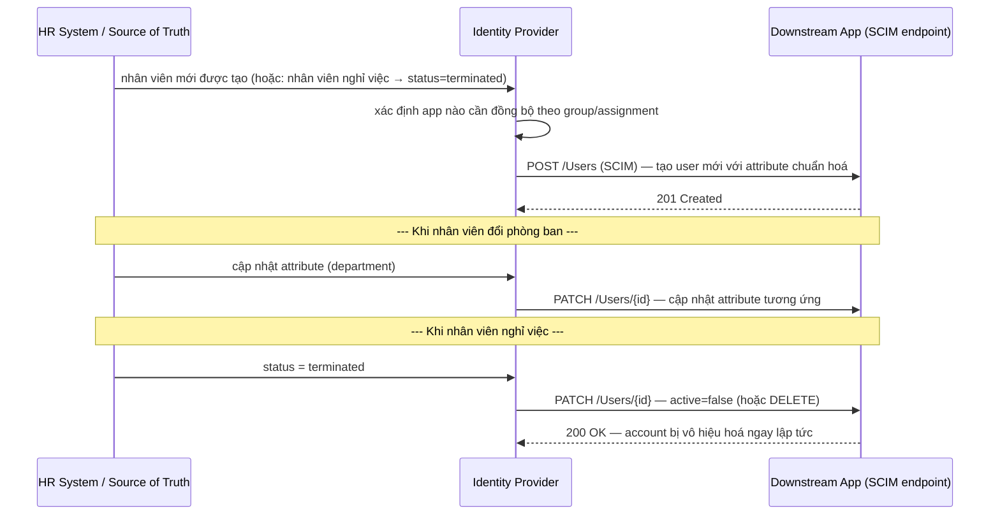

# IAM — SCIM (Provisioning)
Tier: 2
Parent: [[Kubernetes/Security/iam/iam]]
Related: [[iam--directory-ldap-ad]], [[iam--sso]], [[iam--authorization]]
Tags: #iam #scim #provisioning

## What it does

SCIM (System for Cross-domain Identity Management) là chuẩn REST/JSON để **tự động tạo, cập nhật, vô hiệu hoá (deprovision)** account ở các ứng dụng downstream khi identity thay đổi ở nguồn trung tâm (thường là IdP hoặc HR system) — không cần admin thủ công tạo/xoá tài khoản ở từng app.

## Why it exists

SSO (SAML/OIDC) chỉ giải quyết **xác thực** — nó không tạo sẵn account cho user ở phía SP; nhiều hệ thống dùng **JIT (Just-In-Time) provisioning** qua SSO (tự tạo account lúc login đầu tiên) nhưng cách này **không xử lý được deprovisioning** (không có sự kiện "user login" khi họ bị sa thải). Nếu không có SCIM, offboarding phải làm thủ công ở từng app — chậm, dễ quên, để lại "orphaned account" tồn tại sau khi nhân viên đã nghỉ, chính là 1 trong những nguồn rủi ro bảo mật phổ biến nhất trong audit thực tế (ex-employee vẫn truy cập được hệ thống nhiều tháng sau khi nghỉ).

## When — Dùng khi nào / KHÔNG dùng khi nào?

**Dùng khi:** tổ chức có ≥ vài chục nhân viên và nhiều SaaS app — chi phí vận hành thủ công tăng tuyến tính theo cả số người lẫn số app, SCIM giúp offboarding tức thời và nhất quán.

**KHÔNG cần khi:** tổ chức rất nhỏ (vài người, vài app) — quản lý thủ công vẫn khả thi, thêm SCIM integration cho mỗi app tốn effort setup không tương xứng với lợi ích ở quy mô này.

## How it works (flow/diagram)

**2 resource chuẩn cốt lõi:** `/Users` và `/Groups` — schema chuẩn hoá attribute phổ biến (`userName`, `emails`, `active`, `groups`...) để bất kỳ IdP nào cũng tích hợp được với bất kỳ app nào hỗ trợ SCIM mà không cần custom mapping riêng cho từng cặp.

## Config gotchas

- **Chỉ implement provisioning, quên deprovisioning** — nhiều app "hỗ trợ SCIM" trên marketing nhưng thực tế chỉ nhận sự kiện tạo mới, không xử lý đúng `active=false`/DELETE — cần test rõ luồng offboarding thực tế, không chỉ luồng onboarding lúc demo.
- **Mapping attribute sai giữa hệ thống nguồn và SCIM schema** — vd `department` ở HR system map sai sang custom attribute ở app đích, dẫn tới nhóm/quyền gán sai mà không ai để ý cho tới khi audit.
- **Không xử lý user bị xoá ở nguồn nhưng vẫn còn ref ở group/permission tại app đích** — orphaned reference gây lỗi ở 1 số app nếu không cascade đúng.
- **API rate limit của app đích** — đồng bộ hàng loạt (bulk import lúc mới triển khai) dễ bị throttle nếu không dùng SCIM Bulk operation (chuẩn có hỗ trợ endpoint bulk riêng).

## Security notes

- **Token xác thực SCIM endpoint bị lộ = attacker tự thêm/xoá account tuỳ ý** ở app đích — bearer token dùng cho SCIM API cần được coi như credential nhạy cảm tương đương admin API key, rotate định kỳ.
- **Trễ đồng bộ (sync lag) là cửa sổ rủi ro thực sự** — nếu IdP→App chạy theo batch định kỳ (không phải real-time webhook/event-driven), có khoảng trễ giữa lúc HR đánh dấu "terminated" và lúc account thực sự bị khoá ở app — cần biết rõ SLA đồng bộ của từng integration, đặc biệt cho app chứa dữ liệu nhạy cảm.
- **Deprovisioning phải test định kỳ, không chỉ test lúc setup** — nhiều tổ chức chỉ verify SCIM hoạt động đúng lúc go-live rồi không bao giờ kiểm tra lại; app đích có thể đổi API mà không báo, âm thầm làm hỏng luồng deprovision.
- **Audit log của mọi thao tác provisioning/deprovisioning** cần lưu tối thiểu theo yêu cầu compliance (SOC2 thường yêu cầu chứng minh được offboarding xảy ra đúng hạn).

## Tools / Implementations

- **IdP hỗ trợ SCIM client (đẩy provisioning):** Okta, Entra ID, OneLogin, JumpCloud — hầu hết IdP SaaS lớn.
- **App hỗ trợ SCIM server (nhận provisioning):** phần lớn SaaS enterprise (Slack, Salesforce, GitHub Enterprise, Zoom...) có endpoint SCIM sẵn, thường ở gói pricing "Enterprise".
- **Thư viện tự implement SCIM server:** `scim2-schema`/`scim2-server` (Java), `django-scim2` (Python), `scimgateway` (Node, dùng làm bridge nhiều nguồn).

## Refs

- RFC 7643 — SCIM Core Schema: https://datatracker.ietf.org/doc/html/rfc7643
- RFC 7644 — SCIM Protocol: https://datatracker.ietf.org/doc/html/rfc7644
- Okta — SCIM Provisioning overview: https://developer.okta.com/docs/concepts/scim/
