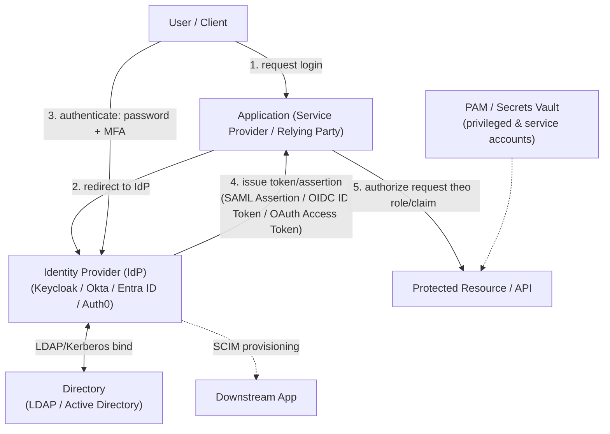

# IAM — Identity & Access Management
Tags: #iam #security #authentication #authorization #sso #moc
Last updated: 2026-08-29

---

### **1. What — Nó là cái gì?**

IAM là tập hợp policy + hệ thống trả lời 2 câu hỏi xuyên suốt vòng đời của một identity (user, service, device): **"đây có đúng là ai/cái gì đang claim không?"** (Authentication) và **"nó được phép làm gì?"** (Authorization). Nó bao trùm từ lúc tạo account, cấp quyền, xác thực mỗi lần truy cập, cho tới khi thu hồi (offboarding).

### **2. Why — Tại sao tồn tại / Vấn đề nó giải quyết?**

Nếu không có IAM tập trung: mỗi service tự quản lý bảng `users` riêng → password lặp lại giữa các hệ thống (1 leak = credential stuffing toàn công ty), không ai revoke được access tức thời khi nhân viên nghỉ việc (phải nhớ tắt account ở N hệ thống), không có single source of truth để audit "user X có quyền gì, trên hệ thống nào". IAM giải quyết 3 bài toán cùng lúc: (1) **centralize identity** — 1 nơi định nghĩa user là ai, (2) **federate trust** — cho phép nhiều app/tổ chức tin tưởng lẫn nhau mà không phải chia sẻ password (đây là lý do SAML/OAuth/OIDC tồn tại), (3) **enforce & audit policy** nhất quán thay vì mỗi team tự code kiểm tra quyền theo cách riêng.

Đánh đổi: tạo ra một single point of failure/trust — IdP (Identity Provider) sập hoặc bị chiếm là toàn bộ hệ thống phụ thuộc nó cũng tê liệt hoặc bị chiếm theo.

### **3. When — Dùng khi nào / KHÔNG dùng khi nào?**

**Dùng khi:**
- Có ≥ 2 hệ thống/app cần user dùng chung 1 identity (nội bộ hoặc B2B/B2C).
- Cần audit trail "ai làm gì" cho compliance (SOC2, ISO 27001, PCI-DSS).
- Cần offboarding tức thời (revoke 1 chỗ = mất quyền mọi nơi) — critical cho security posture.

**KHÔNG dùng / không over-engineer khi:**
- Hệ thống nội bộ nhỏ, 1 app, 1 team — dựng cả 1 IdP (Keycloak cluster...) chỉ để serve login cho 5 người là phí vận hành, dùng auth built-in của framework là đủ.
- Đừng tự viết lại OAuth/SAML server từ đầu — protocol này có rất nhiều edge case bảo mật (xem [[iam--oauth2]], [[iam--saml]]) mà implementation tự chế gần như chắc chắn có lỗ hổng. Dùng IdP có sẵn (Keycloak, Auth0, Entra ID...) trừ khi có lý do đặc biệt (air-gapped, compliance yêu cầu tự host, nghiên cứu).
- Đừng chọn ABAC/policy engine phức tạp (OPA, Cedar) khi RBAC đơn giản là đủ trả lời bài toán — phức tạp hoá authorization là nguồn lỗi bảo mật phổ biến (policy sai logic khó test hơn nhiều so với role check đơn giản).

### **4. Where - Architecture — Nó nằm ở đâu trong hệ thống?**

- **Vị trí trong hệ thống:** IdP đứng giữa, là "trust broker" — user không login trực tiếp vào từng app, mà login 1 lần vào IdP rồi app tin tưởng token/assertion do IdP phát hành.
- **Component chính:** Directory (nguồn identity thô — LDAP/AD), IdP (xác thực + phát hành token, chạy protocol SAML/OIDC/OAuth), Service Provider/Relying Party (app tiêu thụ token), PAM (quản lý credential có quyền cao/service account), provisioning layer (SCIM) đồng bộ account xuống các app downstream.
- **Traffic/data flow:** login request → redirect tới IdP → xác thực (password/MFA) → IdP phát token/assertion → app verify chữ ký/claim → cấp session cục bộ → mọi request sau dùng session hoặc token đó để authorize.
- **Dependency:** clock sync giữa các bên (SAML/JWT đều check `exp`/`NotOnOrAfter`, lệch giờ là fail hàng loạt rất khó debug), PKI/certificate để verify chữ ký, network reachability tới IdP (nếu IdP down, **không ai login được vào bất kỳ app nào** — đây là lý do IdP luôn cần HA).

### **5. How — Cơ chế hoạt động**

3 khái niệm nền tảng cần phân biệt rõ trước khi đọc các note con:

- **AuthN (Authentication)** — xác minh danh tính. Xem [[iam--authentication]], [[iam--mfa]].
- **AuthZ (Authorization)** — xác định quyền sau khi đã biết danh tính. Xem [[iam--authorization]].
- **Federation/SSO** — cơ chế để 1 lần xác thực được nhiều hệ thống tin tưởng, không cần login lại. Xem [[iam--sso]].

Federation được hiện thực qua 3 protocol chính, dễ nhầm lẫn nhất trong toàn mảng IAM:

| | **SAML 2.0** | **OAuth 2.0** | **OIDC (OpenID Connect)** |
|---|---|---|---|
| Mục đích gốc | Xác thực (AuthN) cho web enterprise/SSO | **Ủy quyền (Authorization)** — cấp access có giới hạn cho 1 app dùng API thay mặt user | Xác thực (AuthN) — xây **trên nền** OAuth 2.0 |
| Định dạng token | XML Assertion, ký bằng XML-DSig | Access Token (thường opaque hoặc JWT, "chỉ IdP hiểu") | ID Token = **JWT chuẩn hoá**, chứa claim danh tính |
| Câu hỏi trả lời | "User này là ai, IdP xác nhận chưa?" | "App này được phép gọi API nào, thay mặt ai?" | "User này là ai?" (dùng cơ chế token của OAuth) |
| Use case điển hình | Enterprise SSO (Okta → Salesforce, Workday...) | App A truy cập Google Drive API thay mặt user | "Login with Google/Facebook" |
| Còn dùng mới không? | Legacy nhưng vẫn phổ biến enterprise B2B | Có, là nền tảng cho OIDC | Có, chuẩn khuyến nghị cho login hiện đại |

Chi tiết từng protocol: [[iam--saml]] · [[iam--oauth2]] · [[iam--oidc]] · [[iam--jwt]] (định dạng token dùng chung bởi OIDC và nhiều hệ OAuth).

Các thành phần vận hành đi kèm không thể tách rời IAM thực tế:
- [[iam--session-token-management]] — sau khi có token/assertion, app quản lý phiên đăng nhập thế nào (cookie, refresh token, revocation).
- [[iam--directory-ldap-ad]] — nguồn dữ liệu identity thô mà IdP đọc/bind vào.
- [[iam--scim-provisioning]] — tự động tạo/xoá account ở app downstream khi HR thêm/xoá nhân viên.
- [[iam--pam-privileged-access]] — quản lý riêng các credential có quyền cao (admin, service account, root) — khác với user thường.

### **6. Key Config — Cấu hình cần nhớ**

- **Clock skew tolerance** — SAML/OIDC/JWT đều dựa vào timestamp để chống replay; lệch giờ giữa server (thường do NTP không sync) là nguyên nhân hàng đầu gây lỗi "token expired" ngẫu nhiên, rất khó reproduce nếu không nghĩ tới nguyên nhân này đầu tiên.
- **Redirect URI / Assertion Consumer Service URL allowlist** — phải khớp **chính xác** (exact match, không phải prefix match lỏng lẻo), đây là điểm bị misconfigure phổ biến nhất dẫn tới open redirect / token theft (xem chi tiết ở [[iam--oauth2]], [[iam--saml]]).
- **Token/session lifetime** — access token nên ngắn (phút), refresh token dài hơn nhưng phải rotate được và revoke được; session cookie cần `Secure`, `HttpOnly`, `SameSite`.
- **Signing key rotation** — IdP key dùng để ký token/assertion phải rotate định kỳ và hỗ trợ **đa key song song** (key rollover) để không làm gián đoạn service đang verify bằng key cũ.

### **7. Security Considerations**

- **Attack surface tổng quát:** IdP login page (phishing), token/assertion trong transit (nếu không TLS = MITM), storage của token phía client (XSS đánh cắp token nếu lưu ở `localStorage`), trust relationship config (SP/RP tin nhầm issuer giả).
- **Misconfiguration nguy hiểm nhất:** IdP compromise = "keys to kingdom" — attacker chiếm được IdP thì impersonate **bất kỳ user nào** vào **bất kỳ app nào** tin tưởng IdP đó. Đây là lý do IdP phải là hệ thống được harden kỹ nhất, giám sát chặt nhất trong toàn bộ hạ tầng.
- **Hardening checklist tối thiểu:**
  1. MFA bắt buộc cho mọi tài khoản có quyền quản trị IdP, ưu tiên phishing-resistant (WebAuthn/FIDO2) — xem [[iam--mfa]].
  2. Token/assertion lifetime ngắn nhất có thể chấp nhận được về UX; luôn có cơ chế revoke.
  3. Validate signature + issuer + audience + expiry cho **mọi** token nhận vào — không bao giờ trust token chỉ vì decode được (xem lỗi `alg=none` ở [[iam--jwt]]).
  4. Log mọi authentication event (thành công lẫn thất bại) tập trung, alert theo pattern bất thường (brute force, impossible travel).
  5. Nguyên tắc least privilege cho authorization — mặc định deny, whitelist quyền chứ không blacklist.

### **8. Ops Runbook — Production Notes**

- **Health check:** IdP phải có health endpoint riêng, monitor uptime độc lập vì downstream toàn bộ phụ thuộc nó; test định kỳ full flow (login thử end-to-end), không chỉ ping port.
- **Log quan trọng:** authentication success/failure log (cả IdP lẫn từng app), audit log thay đổi permission/role, log thay đổi trust config (thêm SP/RP mới, đổi signing cert).
- **Metric cần alert:** tỷ lệ login failure tăng đột biến (brute force hoặc outage), token issuance latency, chứng chỉ (cert) sắp hết hạn (cả TLS lẫn signing cert — hết hạn signing cert là outage toàn hệ thống, không chỉ 1 app).
- **Incident response nếu nghi ngờ IdP compromise:** rotate toàn bộ signing key ngay, force logout toàn bộ session/token đang active, review audit log tìm token/assertion phát hành bất thường, thông báo mọi SP/RP để họ blacklist token cũ.

### **9. Gotchas & Lessons Learned**

> Phần dưới là kiến thức chung từ thực tế triển khai/community — cần xác nhận/bổ sung khi đã vận hành thật trong môi trường của bạn.

- SAML và OIDC hay bị nhầm là "chọn 1 trong 2 vì làm cùng việc" — thực ra OIDC xây trên OAuth (authorization framework), còn SAML là chuẩn AuthN độc lập cũ hơn. Nhiều hệ thống enterprise chạy **cả hai song song** cho các integration khác nhau.
- "SSO" không phải là 1 protocol — nó là **kết quả** (trải nghiệm đăng nhập 1 lần), đạt được bằng SAML hoặc OIDC (hoặc Kerberos trong mạng nội bộ). Xem [[iam--sso]].
- Test IdP integration ở môi trường staging với **đồng hồ lệch cố ý** vài phút — nhiều bug clock-skew chỉ lộ ra khi lên production vì infra khác nhau.
- Đừng để logic authorization rải rác trong code từng service — khi audit sẽ không ai chắc chắn được tổng thể "user X có quyền gì" mà phải grep code từng nơi.

### **10. Resources**

- NIST SP 800-63 (Digital Identity Guidelines) — chuẩn tham chiếu cho AuthN/identity assurance: https://pages.nist.gov/800-63-3/
- OWASP ASVS (Application Security Verification Standard), chương V2/V3 về AuthN/Session: https://owasp.org/www-project-application-security-verification-standard/
- OpenID Foundation (chủ quản OIDC): https://openid.net
- OASIS (chủ quản SAML): https://www.oasis-open.org
- IETF OAuth Working Group (RFC 6749 và các RFC mở rộng): https://datatracker.ietf.org/wg/oauth/documents/

---

## Index — Các note con

**Nền tảng (core concepts):**
- [[iam--authentication]] — AuthN: factor, flow, adaptive auth
- [[iam--authorization]] — AuthZ: RBAC/ABAC/ReBAC, policy engine
- [[iam--mfa]] — Multi-factor authentication: TOTP, WebAuthn/FIDO2, push, SMS risk

**Federation / SSO protocols:**
- [[iam--sso]] — Single Sign-On: khái niệm, IdP-initiated vs SP-initiated
- [[iam--saml]] — SAML 2.0: assertion, binding, flow
- [[iam--oauth2]] — OAuth 2.0: roles, grant types, PKCE
- [[iam--oidc]] — OpenID Connect: ID Token, discovery, UserInfo
- [[iam--jwt]] — JSON Web Token: cấu trúc, ký, lỗi validate thường gặp

**Vận hành identity:**
- [[iam--session-token-management]] — session/cookie/refresh token, revocation
- [[iam--directory-ldap-ad]] — LDAP / Active Directory
- [[iam--scim-provisioning]] — SCIM: tự động provision/deprovision account
- [[iam--pam-privileged-access]] — PAM: quản lý credential quyền cao
