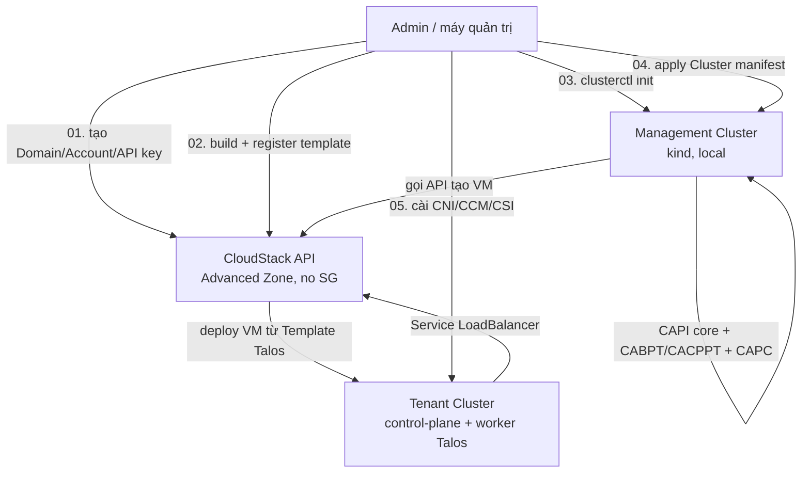

# Lab Series - Kubernetes as a Service bằng CAPI + Talos trên Apache CloudStack

- **Bối cảnh và vấn đề**: đã có sẵn 1 cụm Apache CloudStack Advanced Zone (không dùng Security Groups) chạy hoàn chỉnh. Muốn cung cấp Kubernetes cluster cho nhiều "khách hàng" (tenant) một cách tự động, không phải tạo VM/join node bằng tay mỗi lần có yêu cầu mới.
- **Cách giải quyết**: dùng Cluster API (CAPI) làm control plane điều phối, Cluster API Provider CloudStack (CAPC) làm infrastructure provider để CAPI biết nói chuyện với CloudStack, và Talos Linux làm OS cho node (immutable, không SSH, chỉ quản trị qua API) thay cho Ubuntu/kubeadm truyền thống.
- **Kết quả sau khi hoàn thành series**: có 1 management cluster chạy CAPI, từ đó deploy được workload cluster Talos+Kubernetes hoàn toàn tự động trên CloudStack hiện có, có CNI/CCM/CSI hoạt động (Service LoadBalancer dùng được CloudStack LB, PVC dùng được CloudStack volume), và biết cách rollback/troubleshoot khi có sự cố.

> [!WARNING]
> Series lab này được viết để dùng làm tài liệu triển khai **production**, nhưng có **2 điểm kỹ thuật chưa tìm được case study CloudStack + Talos nào đã verify công khai** tại thời điểm viết (04/10/2026):
> 1. Cách Talos (platform `nocloud`) đọc machine config từ metadata service riêng của CloudStack (không phải chuẩn NoCloud gốc) — xem cảnh báo chi tiết ở [[02-build-talos-image-cloudstack]].
> 2. Compatibility giữa CAPI core v1.14.x và CABPT/CACPPT (provider Talos, hiện do cộng đồng maintain, không còn do Sidero Labs chính thức phát triển) — xem cảnh báo ở [[03-setup-management-cluster]].
>
> **Bắt buộc dựng thử trên 1 cụm lab/non-production trước**, đừng áp thẳng vào production nếu chưa tự verify qua được 2 điểm này.

## Thứ tự đọc

| # | File | Nội dung | Kết quả đạt được |
|---|------|----------|-------------------|
| 01 | [[01-chuan-bi-cloudstack]] | Domain/Account/API key riêng cho CAPC, Network, Service Offering, Network ACL/Port Forwarding | CloudStack sẵn sàng nhận request từ CAPC |
| 02 | [[02-build-talos-image-cloudstack]] | Build image Talos qua Image Factory, convert QCOW2, register Template | Có Template Talos dùng được trên CloudStack |
| 03 | [[03-setup-management-cluster]] | Bootstrap management cluster (kind) + `clusterctl init` (CAPI core + CABPT/CACPPT + CAPC) | Management cluster sẵn sàng nhận `Cluster` object |
| 04 | [[04-trien-khai-tenant-cluster]] | Viết manifest `CloudStackCluster`/`CloudStackMachineTemplate`/`TalosControlPlane`/`MachineDeployment`, deploy cluster đầu tiên | 1 workload cluster Talos+K8s chạy trên CloudStack |
| 05 | [[05-cni-ccm-csi]] | Cài Cilium (CNI), cloudstack-kubernetes-provider (CCM), CSI driver | Service LoadBalancer + PersistentVolume hoạt động |

Kiến thức nền (không phải bước thao tác, đọc trước nếu chưa quen component nào): [[CAPI]], [[CAPC]], [[Talos]], [[talos--capi-integration]], [[Image-Pipeline]], [[Networking]], [[Storage]].

## Giả định môi trường

- Cụm CloudStack đã có: **Advanced Zone**, **không bật Security Groups** (network isolation dùng Isolated Network + Virtual Router, không dùng Security Group) — đúng theo giới hạn hỗ trợ của CAPC (CAPC không hỗ trợ zone có Security Groups).
- Người thực hiện lab có quyền **Domain Admin hoặc Root Admin** trên CloudStack để tạo Domain/Account/API key mới (lab 01), và có 1 máy Linux/macOS dùng làm "máy quản trị" (chạy `talosctl`, `clusterctl`, `kubectl`, `cmk`, `qemu-img`).
- Phiên bản phần mềm pin trong series này — xem lý do pin ở từng lab tương ứng, **tự kiểm tra lại ngay trước khi chạy** vì đây là hệ sinh thái nhiều thành phần release độc lập nhau:

| Phần mềm | Version pin trong lab | Nguồn |
|---|---|---|
| Kubernetes (control plane + CAPI) | v1.14.2 | [github.com/kubernetes-sigs/cluster-api/releases](https://github.com/kubernetes-sigs/cluster-api/releases) |
| Talos Linux | v1.14.2 | [github.com/siderolabs/talos/releases](https://github.com/siderolabs/talos/releases) |
| CAPC (fork `leaseweb`, thay cho `kubernetes-sigs` đã dừng release từ v0.6.1/2024) | v0.15.0 | [github.com/leaseweb/cluster-api-provider-cloudstack/releases](https://github.com/leaseweb/cluster-api-provider-cloudstack/releases) |
| CABPT (bootstrap provider Talos) | v0.6.13 | [github.com/siderolabs/cluster-api-bootstrap-provider-talos/releases](https://github.com/siderolabs/cluster-api-bootstrap-provider-talos/releases) |
| CACPPT (control-plane provider Talos) | v0.5.14 | [github.com/siderolabs/cluster-api-control-plane-provider-talos/releases](https://github.com/siderolabs/cluster-api-control-plane-provider-talos/releases) |

> [!NOTE]
> Đã verify trực tiếp `metadata.yaml` của cả 3 release trên (04/10/2026): CABPT v0.6.13, CACPPT v0.5.14, và CAPC fork `leaseweb` v0.15.0 **đều khai contract `v1beta1`** — khớp nhau, và CAPI core v1.14.2 vẫn **serve** `v1beta1` (chỉ unserved từ v1.16, xem [[CAPI]] mục 9). Combo version pin trong bảng trên vì vậy contract-aligned trên giấy tờ. Rủi ro còn lại không phải version-skew mà là: (1) chưa có ai public verify tổ hợp CAPC+Talos này chạy thật (xem [[CAPC]]), (2) README chính thức của CABPT/CACPPT có banner "Sidero Labs is no longer actively developing" (khuyến nghị dùng [Omni](https://github.com/siderolabs/omni) thay thế, support chuyển sang community) — nhưng vẫn có commit cập nhật Talos 1.14 gần đây (18-21/09/2026) từ đúng các kỹ sư Sidero Labs, nên "ngừng đầu tư chính thức" ≠ "đã chết". CABPT đã có nhánh `v0.7.0-alpha.3` (17/09/2026) implement contract `v1beta2`, nhưng CACPPT **chưa có** nhánh tương đương — đây là điểm nghẽn thật khi cần upgrade CAPI core qua v1.16 sau này, theo dõi riêng trang Releases của CACPPT trước khi lên kế hoạch đó.

## Thông tin Planning chung (toàn series)

Bảng dưới đây là **nguồn giá trị duy nhất** dùng xuyên suốt cả 5 lab — mỗi lab chỉ lặp lại đúng phần mình cần, không tự đặt tên khác. Điền cột "Giá trị" theo môi trường thật trước khi bắt đầu Lab 01.

| Thành phần | Placeholder | Giá trị môi trường thật | Dùng ở lab |
|---|---|---|---|
| CloudStack API endpoint | `<cs-api-url>` | ví dụ `http://cloudstack.example.local:8080/client/api` | 01, 03 |
| CloudStack Domain (mới tạo cho CAPC) | `<cs-domain>` | ví dụ `kaas` | 01 |
| CloudStack Account (mới tạo cho CAPC) | `<cs-account>` | ví dụ `capi-capc` | 01, 04 |
| CloudStack Zone (đã có sẵn) | `<cs-zone>` | tên Zone Advanced đang dùng | 01, 04 |
| Network Offering (đã có hoặc tạo mới, có SourceNat+Lb) | `<cs-network-offering>` | | 01, 04 |
| Network name (CAPC tự tạo nếu chưa tồn tại) | `<cs-network-name>` | ví dụ `k8s-lab-net` | 01, 04 |
| Service Offering - control-plane | `<cs-offering-cp>` | ví dụ `k8s-control-plane` (2 vCPU / 4 GB tối thiểu) | 01, 04 |
| Service Offering - worker | `<cs-offering-worker>` | ví dụ `k8s-worker` (2 vCPU / 4 GB tối thiểu) | 01, 04 |
| Template Talos đã register | `<cs-talos-template>` | ví dụ `talos-v1.14.2-cloudstack` | 02, 04 |
| Control-plane endpoint (VIP hoặc IP tĩnh) | `<cluster-endpoint-ip>` | IP rảnh trong dải public/NAT của Isolated Network | 04 |
| Tên cluster tenant đầu tiên | `<cluster-name>` | ví dụ `capi-talos-lab01` | 03, 04, 05 |
| Namespace chứa CR trên management cluster | `<capi-namespace>` | ví dụ `capi-lab` | 03, 04, 05 |

## Diagram tổng thể

## Reference

- [[K8s-Provider-Overview]] — bản đồ kiến thức đầy đủ của toàn bộ series kiến thức (không phải lab)
- [The Cluster API Book](https://cluster-api.sigs.k8s.io/)
- [The Cluster API Provider CloudStack Book](https://cluster-api-cloudstack.sigs.k8s.io/)
- [Talos Linux Documentation](https://docs.siderolabs.com/talos/v1.14/)
