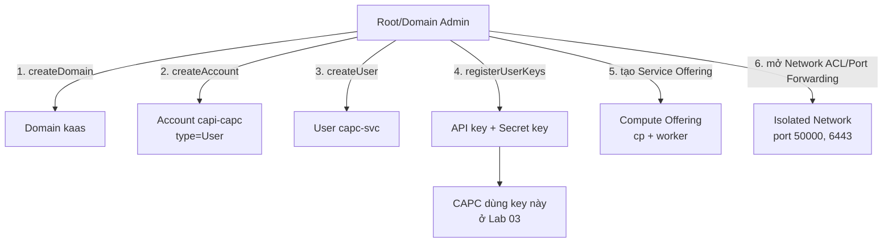

# CloudStack - Chuẩn bị Domain/Account/Network cho CAPC

- **Bối cảnh và vấn đề**: CAPC (Cluster API Provider CloudStack) cần 1 API key/secret key để gọi CloudStack API tạo VM/network/LB tự động. Nếu dùng chung tài khoản Admin hiện tại, mọi thứ CAPC làm sai (bug, misconfig YAML) có thể ảnh hưởng tới toàn bộ hạ tầng CloudStack, không chỉ phần dành cho Kubernetes.
- **Cách giải quyết**: tạo riêng 1 Domain + Account + User cho CAPC, chỉ cấp quyền User thường (không phải Admin), rồi tạo Service Offering và mở đúng port cần thiết qua Network ACL/Port Forwarding (vì zone không dùng Security Group).
- **Kết quả sau khi hoàn thành**: có 1 API key/secret key scoped riêng cho CAPC, biết đủ Zone ID/Network Offering ID/Service Offering ID để điền vào [[00-README]], và VM Talos sau này accessible đúng port cần (50000 cho Talos API, 6443 cho Kubernetes API).

> [!NOTE]
> Lab này dùng `cmk` (CloudMonkey, bản Go port từ v6.0.0) để minh hoạ lệnh. Nếu quản trị CloudStack qua UI, mọi bước dưới đều có màn hình tương ứng trong **Accounts** / **Network** / **Service Offerings** / **Compute Offerings**.

## Prerequisites

- **Hạ tầng**: cụm CloudStack Advanced Zone đang chạy healthy, zone **không bật Security Groups**.
- **Máy chủ / VM**: 1 máy quản trị (Linux/macOS) có thể truy cập CloudStack API endpoint.
- **Tài khoản và quyền**: người thực hiện lab có quyền **Root Admin** hoặc **Domain Admin** trên domain cha để tạo Domain/Account/User con.
- **Mạng**: máy quản trị reach được CloudStack Management Server (port 8080 hoặc port API đang cấu hình).
- **Kiến thức nền**: khái niệm Domain/Account/User, Isolated Network, Virtual Router của CloudStack — xem [Roles, Accounts, Users, and Domains](https://docs.cloudstack.apache.org/en/latest/adminguide/accounts.html) nếu chưa quen.

## Thông tin Planning liên quan

| Thành phần | Giá trị | Ghi chú |
|---|---|---|
| CloudStack API endpoint | `<cs-api-url>` | ví dụ `http://cloudstack.example.local:8080/client/api` |
| Domain mới cho CAPC | `<cs-domain>` | ví dụ `kaas`, tạo dưới `ROOT` |
| Account mới cho CAPC | `<cs-account>` | ví dụ `capi-capc` |
| User của account trên | `<cs-user>` | ví dụ `capc-svc` |
| Zone Advanced đã có sẵn | `<cs-zone>` | lấy ID ở Bước 2 |
| Network Offering cần SourceNat + Lb | `<cs-network-offering>` | lấy ID ở Bước 2, tạo mới nếu chưa có offering phù hợp |
| Service Offering control-plane | `<cs-offering-cp>` | tạo ở Bước 4, tối thiểu 2 vCPU / 4 GB |
| Service Offering worker | `<cs-offering-worker>` | tạo ở Bước 4, tối thiểu 2 vCPU / 4 GB |

> [!TODO] Cần xác nhận
> Mức CPU/RAM tối thiểu "2 vCPU / 4 GB" ở trên là khuyến nghị chung cho node Kubernetes (kubeadm/K8s upstream), **không phải số chính thức từ Talos hay CAPC**. Talos tự thân nhẹ hơn (không có package manager/SSH daemon), nhưng control-plane vẫn cần đủ RAM cho etcd + kube-apiserver + controller-manager + scheduler. Benchmark lại với workload thật trước khi chốt size cho production.

## Diagram



---

## Installation

### Bước 1 - Tạo Domain riêng cho CAPC

Tách Domain riêng để toàn bộ resource Kubernetes-as-a-Service nằm trong 1 namespace quản trị độc lập, không lẫn với account khác trên CloudStack.

```bash
cmk create domain name=<cs-domain>
```

- Kiểm tra kết quả bước này:

```bash
cmk list domains name=<cs-domain>
```

Kết quả mong đợi: trả về 1 domain với `name` đúng `<cs-domain>`, ghi lại `id` trả về — dùng làm `<cs-domain-id>` cho các bước sau.

### Bước 2 - Tạo Account và User cho CAPC

Dùng `accounttype=0` (User thường) — **không** dùng `accounttype=1` (Admin) hay `accounttype=2` (Domain Admin). CAPC chỉ cần thao tác trong phạm vi Account của chính nó (deploy VM, tạo network/LB rule trong account đó), không cần quyền quản trị toàn CloudStack.

```bash
cmk create account username=<cs-user> password=<StrongPassword> \
  firstname=capc lastname=service email=capc-svc@example.local \
  accounttype=0 domainid=<cs-domain-id> account=<cs-account>
```

> [!WARNING]
> `password` ở trên chỉ là password đăng nhập CloudStack UI/API theo kiểu user/password — **không dùng password này cho CAPC**. CAPC xác thực bằng API key/secret key tạo ở Bước 3, tách biệt hoàn toàn khỏi password. Đặt 1 password đủ mạnh rồi lưu vào vault nội bộ, không cần dùng tới trong vận hành bình thường.

- Kiểm tra kết quả bước này:

```bash
cmk list accounts name=<cs-account> domainid=<cs-domain-id>
```

Kết quả mong đợi: `accounttype` trả về `0`, `state` là `enabled`.

> [!TIP]
> `accounttype=0` dùng role template "User" mặc định của CloudStack — vẫn cho phép khá nhiều API ngoài phạm vi CAPC cần. Để least-privilege thật (khuyến nghị cho production), tạo riêng 1 **Custom Role** chỉ chứa đúng API call CAPC cần, theo danh sách đã verify từ docs chính thức CAPC (`docs/book/src/topics/cloudstack-permissions.md`, xác thực lần cuối theo E2E suite 11/10/2022 — danh sách có thể thiếu API mới hơn nếu CAPC đã thêm feature, như multi-NIC ở bản v0.6+):
>
> ```bash
> cmk create role name=capc-minimal type=User description="Least-privilege role cho CAPC"
> # Lặp lại createRolePermission cho từng API trong danh sách sau (rule=Allow):
> # assignToLoadBalancerRule, associateIpAddress, createAffinityGroup, createEgressFirewallRule,
> # createLoadBalancerRule, createNetwork, createTags, deleteAffinityGroup, deleteNetwork,
> # deleteTags, deployVirtualMachine, destroyVirtualMachine, disassociateIpAddress, getUserKeys,
> # listAccounts, listAffinityGroups, listDiskOfferings, listLoadBalancerRuleInstances,
> # listLoadBalancerRules, listNetworkOfferings, listNetworks, listPublicIpAddresses,
> # listServiceOfferings, listSSHKeyPairs, listTags, listTemplates, listUsers,
> # listVirtualMachines, listVirtualMachinesMetrics, listVolumes, listZones,
> # queryAsyncJobResult, startVirtualMachine, stopVirtualMachine, updateVMAffinityGroup
> cmk create roleperm roleid=<role-id> rule=assignToLoadBalancerRule permission=Allow
> # ... lặp lại cho các API còn lại
> cmk update account account=<cs-account> domainid=<cs-domain-id> roleid=<role-id>
> ```
>
> Lưu ý quan trọng từ chính docs CAPC: nếu account thiếu quyền **expunge** VM, VM bị `destroyVirtualMachine` sẽ kẹt ở trạng thái "destroyed" và phải xoá tay — nếu gặp tình huống này, thêm quyền expunge (hoặc API tương đương) vào role trên.

### Bước 3 - Generate API key và Secret key cho user

```bash
cmk list users account=<cs-account> domainid=<cs-domain-id>
```

Ghi lại `id` của user trả về (gọi là `<cs-user-id>`), rồi chạy:

```bash
cmk register userkeys id=<cs-user-id>
```

- Kiểm tra kết quả bước này:

Kết quả mong đợi: output trả về 2 field `apikey` và `secretkey`. Lưu tạm 2 giá trị này — sẽ dùng để tạo `cloud-config` ở [[03-setup-management-cluster]], **không ghi 2 giá trị này vào bất kỳ file commit lên Git nào**.

> [!CAUTION]
> `secretkey` chỉ hiển thị **1 lần duy nhất** lúc tạo. Nếu làm mất, phải `cmk register userkeys id=<cs-user-id>` lại để tạo cặp key mới (key cũ sẽ bị revoke).

### Bước 4 - Tạo Service Offering cho control-plane và worker

Lấy danh sách Service Offering hiện có trước, tránh tạo trùng:

```bash
cmk list serviceofferings
```

Nếu chưa có offering phù hợp (tối thiểu 2 vCPU / 4096 MB cho cả control-plane và worker), tạo mới:

```bash
cmk create serviceoffering name=<cs-offering-cp> \
  displaytext="K8s control-plane - 2 vCPU 4GB" \
  cpunumber=2 cpuspeed=2000 memory=4096
```

```bash
cmk create serviceoffering name=<cs-offering-worker> \
  displaytext="K8s worker - 2 vCPU 4GB" \
  cpunumber=2 cpuspeed=2000 memory=4096
```

- Kiểm tra kết quả bước này:

```bash
cmk list serviceofferings name=<cs-offering-cp>
cmk list serviceofferings name=<cs-offering-worker>
```

Kết quả mong đợi: cả 2 offering xuất hiện, ghi lại `id` của từng offering.

### Bước 5 - Xác nhận Zone ID và Network Offering phù hợp

```bash
cmk list zones name=<cs-zone>
```

Ghi lại `id` (gọi là `<cs-zone-id>`) và kiểm tra `securitygroupsenabled` trả về `false` (xác nhận đúng zone không dùng Security Group).

```bash
cmk list networkofferings state=Enabled
```

Tìm 1 network offering có `guestiptype=Isolated`, và trong `service` list có cả `SourceNat` và `Lb` (cần `Lb` để [[05-cni-ccm-csi]] dùng CloudStack LB cho Service type=LoadBalancer). Ghi lại `id` (gọi là `<cs-network-offering-id>`).

> [!NOTE]
> Nếu không có network offering nào có sẵn service `Lb`, phải tạo mới qua `cmk create networkoffering` với `serviceproviderlist` khai báo `Lb` dùng `VirtualRouter` làm provider. CAPC **tự tạo Isolated Network mới** nếu network đặt tên ở `<cs-network-name>` chưa tồn tại — không cần tự tạo network ở bước này, chỉ cần xác định đúng network offering ID để truyền cho CAPC ở [[04-trien-khai-tenant-cluster]].

- Kiểm tra kết quả bước này: đã có đủ `<cs-zone-id>` và `<cs-network-offering-id>` ghi vào bảng Planning của [[00-README]].

### Bước 6 - Mở port cần thiết qua Network ACL / Port Forwarding

Vì zone không dùng Security Group, egress mặc định của Isolated Network đã cho phép toàn bộ traffic ra ngoài (outbound) — nhưng traffic **từ máy quản trị/management cluster vào VM Talos** (port 50000 - Talos `apid`, port 6443 - Kubernetes API) phải mở riêng qua Port Forwarding vì VM nằm sau NAT của Virtual Router.

> [!WARNING]
> Việc này chỉ áp dụng được **sau khi** đã có IP public/NAT và VM thật (Lab 04). Ghi nhớ bước này ở đây, thực hiện lại sau khi `<cluster-endpoint-ip>` đã được CAPC gán — không có gì để chạy ngay bây giờ.

Cú pháp tham khảo (chạy lại ở Lab 04 sau khi có IP VM thật):

```bash
cmk create portforwardingrule ipaddressid=<public-ip-id> \
  protocol=tcp privateport=6443 publicport=6443 \
  virtualmachineid=<control-plane-vm-id> openfirewall=true
```

```bash
cmk create portforwardingrule ipaddressid=<public-ip-id> \
  protocol=tcp privateport=50000 publicport=50000 \
  virtualmachineid=<control-plane-vm-id> openfirewall=true
```

`openfirewall=true` tự thêm luôn Network ACL cho phép traffic — nếu Isolated Network đang dùng ACL tuỳ chỉnh (không phải mặc định cho phép qua `openfirewall`), phải tạo thêm rule qua `cmk create networkacl` trỏ đúng `aclid` của network.

## Kiểm tra kết quả

- Toàn bộ giá trị sau đã có và điền vào bảng Planning của [[00-README]]: `<cs-domain-id>`, `<cs-account>`, `apikey`/`secretkey`, `<cs-offering-cp>` id, `<cs-offering-worker>` id, `<cs-zone-id>`, `<cs-network-offering-id>`.

| Hạng mục cần kiểm tra | Cách kiểm tra | Kết quả đúng |
|---|---|---|
| Account CAPC đúng quyền User | `cmk list accounts name=<cs-account>` | `accounttype=0` |
| API key hoạt động | `curl "<cs-api-url>?command=listZones&apikey=<apikey>&..."` (ký request theo HMAC-SHA1, xem docs) | Trả về danh sách Zone không lỗi `401` |
| Zone không Security Group | `cmk list zones name=<cs-zone>` | `securitygroupsenabled: false` |

## Troubleshooting

| Triệu chứng | Nguyên nhân | Cách xử lý |
|---|---|---|
| `cmk` trả `errorcode: 401, unable to verify user credentials` | API key/secret key sai, hoặc chưa `cmk set apikey`/`cmk set secretkey` trong profile cmk đang dùng | Chạy `cmk set apikey <apikey>` và `cmk set secretkey <secretkey>` lại cho đúng profile |
| `createAccount` trả lỗi `account already exists` | Account trùng tên trong domain | Đổi `<cs-account>` hoặc xoá account cũ nếu chắc chắn không còn dùng |

## Rollback

- Xoá User (tự revoke API key kèm theo):

```bash
cmk delete user id=<cs-user-id>
```

- Xoá Account:

```bash
cmk delete account id=<cs-account-id>
```

- Xoá Domain (chỉ chạy khi chắc chắn không còn Account nào khác trong domain):

```bash
cmk delete domain id=<cs-domain-id> cleanup=true
```

> [!CAUTION]
> `cleanup=true` xoá toàn bộ resource con còn sót lại trong domain (account, network, VM...). Chỉ dùng khi chắc chắn domain này **chỉ** chứa resource của lab này.

## Reference

- [Roles, Accounts, Users, and Domains](https://docs.cloudstack.apache.org/en/latest/adminguide/accounts.html)
- [registerUserKeys API](https://cloudstack.apache.org/api/apidocs-4.10/apis/registerUserKeys.html)
- [CAPC - CloudStack Permissions](https://cluster-api-cloudstack.sigs.k8s.io/topics/cloudstack-permissions) (danh sách API tối thiểu dùng ở Custom Role trên)
- [CloudMonkey CLI Usage](https://github.com/apache/cloudstack-cloudmonkey/wiki/Usage)
- [User-Data and Meta-Data (CloudStack admin guide)](http://docs.cloudstack.apache.org/en/4.11.3.0/adminguide/virtual_machines/user-data.html)
