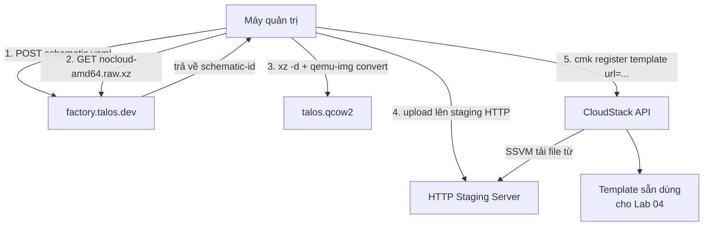

# Talos Image Factory - Build và Register Template Talos lên CloudStack

- **Bối cảnh và vấn đề**: CloudStack cần 1 Template (ảnh đĩa) để deploy VM. Talos không publish sẵn image dạng QCOW2 cho CloudStack (CloudStack không phải 1 trong các platform Talos hỗ trợ "chính danh" như AWS/Azure/OpenStack) — phải tự build qua Image Factory rồi convert cho đúng định dạng CloudStack/KVM cần.
- **Cách giải quyết**: dùng Talos Image Factory tạo "schematic" (khai báo extension `qemu-guest-agent` cần cho VM chạy trên KVM), tải image dạng `nocloud` (platform generic gần nhất với CloudStack), convert sang QCOW2, rồi `register template` lên CloudStack.
- **Kết quả sau khi hoàn thành**: có 1 Template Talos sẵn sàng dùng trong [[04-trien-khai-tenant-cluster]].

> [!WARNING]
> **Đây là phần rủi ro kỹ thuật lớn nhất của toàn series.** Talos platform `nocloud` triển khai chuẩn **NoCloud** gốc của cloud-init (đọc `user-data`/`meta-data` trực tiếp dưới URL `seedfrom`), nhưng CloudStack có **datasource riêng của nó** (`http://data-server./latest/user-data`), không theo đúng chuẩn NoCloud path. Tại thời điểm viết lab này (04/10/2026), **chưa tìm thấy case study nào** xác nhận công khai rằng Talos `nocloud` đọc được metadata của CloudStack theo đúng cách mô tả dưới đây. Cách làm ở Bước 2 là suy luận kỹ thuật dựa trên 2 tài liệu chính thức (NoCloud kernel arg contract của Talos + metadata path contract của CloudStack) khớp nhau về mặt lý thuyết — **phải tự kiểm chứng bằng 1 VM test trước khi tin tưởng dùng cho production** (xem mục Kiểm tra kết quả).

## Prerequisites

- **Hạ tầng**: đã hoàn thành [[01-chuan-bi-cloudstack]] (có Zone ID, Account).
- **Máy chủ / VM**: máy quản trị có `curl`, `qemu-img` (package `qemu-utils` trên Debian/Ubuntu, `qemu-img` trên RHEL/Fedora), và 1 chỗ host file QCOW2 mà **CloudStack Secondary Storage VM (SSVM) reach được qua HTTP** (ví dụ 1 web server nội bộ, hoặc S3-compatible storage) — SSVM là thành phần tải file template về, không phải máy quản trị của bạn.
- **Tài khoản và quyền**: quyền tạo Template trên CloudStack (user ở Lab 01 đủ quyền trong account của chính nó).
- **Mạng**: máy quản trị cần internet-out để gọi `factory.talos.dev`.
- **Kiến thức nền**: [[Talos]] (đặc biệt phần Image Factory ở mục 5), [[Image-Pipeline]].

## Thông tin Planning liên quan

| Thành phần | Giá trị | Ghi chú |
|---|---|---|
| Talos version | `v1.14.2` | khớp version pin ở [[00-README]] |
| Schematic ID | `<schematic-id>` | sinh ra ở Bước 1, hash content-addressable |
| File QCOW2 host tạm | `<http-staging-url>` | URL mà SSVM tải được, ví dụ `http://10.0.0.5/images/talos-v1.14.2.qcow2` |
| Template name trên CloudStack | `<cs-talos-template>` | ví dụ `talos-v1.14.2-cloudstack` |
| OS Type dùng khi register | `<cs-ostype-id>` | xem Bước 4, dùng OS type Linux generic |

## Diagram



---

## Installation

### Bước 1 - Tạo schematic với extension `qemu-guest-agent`

Talos trên KVM cần extension `qemu-guest-agent` để hypervisor thấy đúng IP/trạng thái VM (CloudStack UI/metric phụ thuộc vào guest agent này cho một số thông tin, dù Talos vẫn boot được nếu thiếu).

```yaml
# schematic.yaml
customization:
  systemExtensions:
    officialExtensions:
      - siderolabs/qemu-guest-agent
  extraKernelArgs:
    - ds=nocloud-net;s=http://data-server./latest/
```

> [!WARNING]
> Tham số `ds=nocloud-net;s=http://data-server./latest/` chính là phần **suy luận chưa được verify** nêu ở đầu file. `data-server.` là hostname CloudStack VR tự resolve cho VM trong Isolated Network (xem [User-Data and Meta-Data](http://docs.cloudstack.apache.org/en/4.11.3.0/adminguide/virtual_machines/user-data.html)). Theo chuẩn NoCloud, Talos sẽ gọi `{seedfrom}user-data` và `{seedfrom}meta-data` — ghép vào thành `http://data-server./latest/user-data` và `http://data-server./latest/meta-data`, đúng khớp 2 endpoint CloudStack thật sự serve. `seedfrom` bắt buộc kết thúc bằng `/` theo docs Talos — đã có sẵn ở trên.

```bash
curl -X POST --data-binary @schematic.yaml https://factory.talos.dev/schematics
```

- Kiểm tra kết quả bước này:

Kết quả mong đợi: response JSON trả về field `id` — đây là `<schematic-id>`, dùng cho mọi URL tải image ở bước sau.

### Bước 2 - Tải image dạng nocloud

```bash
curl -LO https://factory.talos.dev/image/<schematic-id>/v1.14.2/nocloud-amd64.raw.xz
```

- Kiểm tra kết quả bước này:

```bash
file nocloud-amd64.raw.xz
```

Kết quả mong đợi: báo đúng định dạng `XZ compressed data`.

### Bước 3 - Giải nén và convert sang QCOW2

CloudStack KVM cần template dạng QCOW2 (hoặc RAW), không nhận trực tiếp file `.raw.xz`.

```bash
xz -d nocloud-amd64.raw.xz
qemu-img convert -f raw -O qcow2 nocloud-amd64.raw talos-v1.14.2.qcow2
```

- Kiểm tra kết quả bước này:

```bash
qemu-img info talos-v1.14.2.qcow2
```

Kết quả mong đợi: `file format: qcow2`, `virtual size` hiển thị đúng dung lượng disk Talos mặc định (thường vài GB, sẽ tự giãn theo `rootfs`/`EPHEMERAL` khi boot nếu disk thật lớn hơn).

### Bước 4 - Upload file lên HTTP staging và register Template

Copy `talos-v1.14.2.qcow2` lên `<http-staging-url>` (bất kỳ cách nào — `scp`, `rsync`, hay web server nội bộ sẵn có). Xác nhận SSVM reach được URL này trước khi register (SSVM nằm trong mạng quản trị CloudStack, không phải mạng của máy bạn).

Tra OS Type phù hợp (Talos không có ostype riêng, dùng 1 type Linux generic):

```bash
cmk list ostypes keyword="Other Linux"
```

> [!TODO] Cần xác nhận
> Chưa tìm được khuyến nghị chính thức từ Sidero Labs về `ostypeid` nên chọn khi register template Talos lên CloudStack. OS Type ở CloudStack chỉ ảnh hưởng vài default setting (driver gợi ý, không quyết định việc VM boot được hay không) — dùng tạm "Other Linux (64-bit)" là lựa chọn an toàn, ghi lại `id` trả về làm `<cs-ostype-id>`.

```bash
cmk register template name=<cs-talos-template> \
  displaytext="Talos v1.14.2 for CAPC" \
  format=QCOW2 hypervisor=KVM \
  ostypeid=<cs-ostype-id> \
  url=<http-staging-url>/talos-v1.14.2.qcow2 \
  zoneid=<cs-zone-id> \
  isdynamicallyscalable=false \
  isextractable=false
```

> [!WARNING]
> `isdynamicallyscalable=false` vì Talos không có CloudStack guest-scaling agent (tính năng resize CPU/RAM live cần agent riêng mà Talos không cài được theo kiểu cloud-init truyền thống). Đặt `true` sẽ không có tác dụng thật và có thể gây hiểu nhầm khi vận hành.

- Kiểm tra kết quả bước này:

```bash
cmk list templates templatefilter=self name=<cs-talos-template>
```

Kết quả mong đợi: `isready: true` sau khi SSVM tải và xử lý xong file (có thể mất vài phút tuỳ tốc độ mạng tới staging server).

## Kiểm tra kết quả

- **Xác nhận bắt buộc trước khi dùng cho production** (ứng với cảnh báo đầu file): deploy thử 1 VM test trực tiếp từ Template này (không qua CAPC, dùng `cmk deploy virtualmachine` hoặc UI) với `userdata` test là 1 đoạn YAML đơn giản, rồi dùng `talosctl` kiểm tra VM có nhận được machine config không:

```bash
talosctl -n <test-vm-ip> get machineconfig --insecure
```

Kết quả đúng: trả về nội dung machine config đã truyền qua `userdata`, không phải lỗi timeout/connection refused. Nếu lỗi → cơ chế `ds=nocloud-net` ở Bước 1 chưa đúng với cách CloudStack serve metadata trên cụm cụ thể này, cần tra lại `talosctl get platformconfig` hoặc dmesg lúc boot qua console CloudStack để debug tiếp.

| Hạng mục cần kiểm tra | Cách kiểm tra | Kết quả đúng |
|---|---|---|
| Template sẵn sàng | `cmk list templates templatefilter=self name=<cs-talos-template>` | `isready: true` |
| VM test boot được | Console VM qua CloudStack UI | Thấy log boot Talos, không kernel panic |
| VM test nhận machine config | `talosctl get machineconfig --insecure -n <test-vm-ip>` | Trả về đúng nội dung đã truyền qua `userdata` |

## Troubleshooting

| Triệu chứng | Nguyên nhân | Cách xử lý |
|---|---|---|
| VM test boot nhưng không join được machine config (đứng ở màn hình chờ) | `ds=nocloud-net` không match path CloudStack serve trên bản CloudStack này | Vào console VM xem log tìm dòng `nocloud`/`fetching`, đối chiếu lại path thật CloudStack serve qua `curl http://data-server./latest/user-data` test từ chính VM |
| `register template` báo `isready: false` kéo dài | SSVM không tải được file từ `<http-staging-url>` | Kiểm tra SSVM reach được staging server (ping/curl từ trong SSVM qua console), kiểm tra firewall giữa 2 mạng |

## Rollback

- Xoá Template nếu build sai:

```bash
cmk delete template id=<template-id> zoneid=<cs-zone-id>
```

> [!CAUTION]
> Nếu Template đã được dùng để deploy VM thật (Lab 04), xoá Template không xoá VM đang chạy từ nó — nhưng sẽ không deploy thêm được VM mới từ Template này. Tạo Template version mới (tên khác) thay vì xoá nếu cluster đang production dùng Template cũ.

## Reference

- [Talos Image Factory](https://docs.siderolabs.com/talos/v1.14/learn-more/image-factory)
- [Talos NoCloud platform](https://www.talos.dev/v1.10/talos-guides/install/cloud-platforms/nocloud/)
- [CloudStack User-Data and Meta-Data](http://docs.cloudstack.apache.org/en/4.11.3.0/adminguide/virtual_machines/user-data.html)
- [cloud-init CloudStack datasource](https://docs.cloud-init.io/en/latest/reference/datasources/cloudstack.html)
- [[Image-Pipeline]], [[Talos]]
