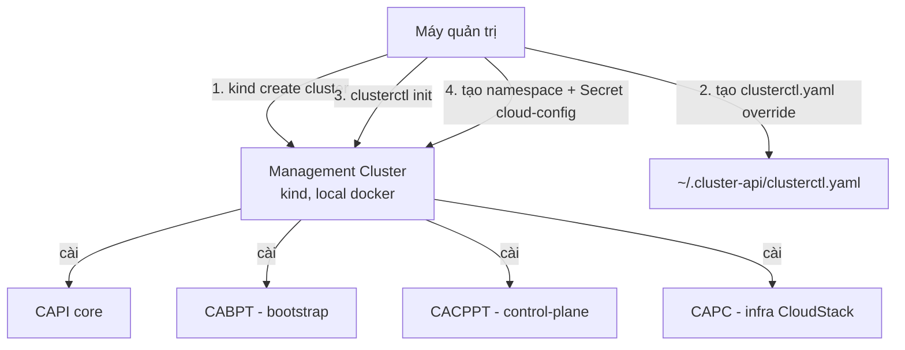

# CAPI - Bootstrap Management Cluster với CAPC + Talos Provider

- **Bối cảnh và vấn đề**: CAPI cần 1 Kubernetes cluster "mồi" (management cluster) để chạy controller trước khi có thể tạo cluster nào khác. Chưa có cluster nào tồn tại ở giai đoạn này.
- **Cách giải quyết**: dùng `kind` tạo 1 management cluster tạm trên máy quản trị, rồi `clusterctl init` cài CAPI core + CABPT/CACPPT (bootstrap/control-plane provider cho Talos) + CAPC (infrastructure provider cho CloudStack, dùng fork `leaseweb` vì bản `kubernetes-sigs` gốc đã dừng release từ 2024).
- **Kết quả sau khi hoàn thành**: có 1 management cluster sẵn sàng nhận `Cluster`/`TalosControlPlane`/`CloudStackMachineTemplate` object ở [[04-trien-khai-tenant-cluster]].

> [!NOTE]
> Management cluster dựng bằng `kind` ở đây là **tạm, không HA** — đủ để lab và để pivot sau. Không dùng thẳng cluster này cho production lâu dài; xem [[Management-Plane]] cho hướng dẫn pivot sang management cluster HA thật bằng `clusterctl move` (nằm ngoài phạm vi series lab này).

> [!NOTE]
> README chính thức của CABPT/CACPPT có banner "Sidero Labs is no longer actively developing" (khuyến nghị dùng [Omni](https://github.com/siderolabs/omni) thay thế, support chuyển sang community) — nhưng đã verify trực tiếp `metadata.yaml` của CABPT v0.6.13, CACPPT v0.5.14, và CAPC fork `leaseweb` v0.15.0 (04/10/2026): **cả 3 đều khai contract `v1beta1`**, khớp nhau, và CAPI core v1.14.2 vẫn serve `v1beta1` (unserved từ v1.16). Version-skew **không** phải rủi ro chính ở bước này như bản trước của lab này từng cảnh báo.
>
> [!WARNING]
> Rủi ro thật ở bước này: **chưa có ai public verify tổ hợp CAPC (CloudStack) + CABPT/CACPPT (Talos) chạy được cùng nhau** — 2 provider này chỉ có template mẫu chính thức cho tổ hợp khác (CAPA/CAPO/CAPV + Talos, hoặc CAPC + kubeadm). Theo dõi pod log ngay sau `clusterctl init` (Bước 3) và đừng coi healthy-looking log là bằng chứng đủ — bằng chứng thật chỉ có ở [[04-trien-khai-tenant-cluster]] khi `Machine` đầu tiên lên `Ready`. Ngoài ra CABPT đã có nhánh `v0.7.0-alpha.3` (17/09/2026, pre-release) implement contract `v1beta2`, nhưng CACPPT **chưa có** nhánh tương đương tại thời điểm viết — trước khi upgrade CAPI core qua v1.16 sau này, phải tự kiểm tra lại trang Releases của CACPPT xem đã có bản `v1beta2` hay chưa.

## Prerequisites

- **Hạ tầng**: đã hoàn thành [[01-chuan-bi-cloudstack]] (có API key/secret key) và [[02-build-talos-image-cloudstack]] (có Template).
- **Máy chủ / VM**: máy quản trị có Docker (để `kind` chạy container làm node), tối thiểu 4 GB RAM rảnh.
- **Tài khoản và quyền**: không cần quyền gì thêm ngoài Docker.
- **Mạng**: máy quản trị cần internet-out để tải image provider từ GitHub Releases.
- **Kiến thức nền**: [[CAPI]] (đặc biệt [[capi--clusterctl]]), [[talos--capi-integration]].

## Thông tin Planning liên quan

| Thành phần | Giá trị | Ghi chú |
|---|---|---|
| CAPI core version | `v1.14.2` | contract `v1beta1` — đã verify khớp CABPT/CACPPT/CAPC, xem NOTE ở trên |
| CABPT version | `v0.6.13` | contract `v1beta1`, cập nhật Talos 1.14 (18/09/2026) |
| CACPPT version | `v0.5.14` | contract `v1beta1`, cập nhật Talos 1.14 (21/09/2026) |
| CAPC version (fork leaseweb) | `v0.15.0` | upstream `kubernetes-sigs` đã dừng ở v0.6.1 (2024), không dùng |
| Namespace chứa CR sau này | `<capi-namespace>` | tạo ở Bước 4 |

## Diagram



---

## Installation

### Bước 1 - Tạo Management Cluster tạm bằng kind

```bash
kind create cluster --name capi-mgmt
kubectl cluster-info --context kind-capi-mgmt
```

- Kiểm tra kết quả bước này:

```bash
kubectl get nodes
```

Kết quả mong đợi: 1 node `capi-mgmt-control-plane` ở trạng thái `Ready`.

### Bước 2 - Khai báo clusterctl.yaml override cho CAPC (fork leaseweb)

`clusterctl` mặc định chỉ biết tới danh sách provider chính thức (trong đó CloudStack trỏ về `kubernetes-sigs`, bản cũ 2024). Phải override để trỏ đúng sang fork đang active.

`~/.cluster-api/clusterctl.yaml`:

```yaml
providers:
  - name: cloudstack
    url: https://github.com/leaseweb/cluster-api-provider-cloudstack/releases/download/v0.15.0/infrastructure-components.yaml
    type: InfrastructureProvider
```

> [!NOTE]
> Dùng fork của bên thứ 3 (không phải `kubernetes-sigs` chính thức) là đánh đổi có chủ ý ở lab này — bản `kubernetes-sigs/cluster-api-provider-cloudstack` chính thức không còn release từ v0.6.1 (07/2024), không tương thích CAPI core v1.14.x. Đây là rủi ro về nguồn gốc (supply-chain) cần tự đánh giá trước khi dùng cho production — xem thêm [[Provider-Security]].

### Bước 3 - Khai báo credential CloudStack và chạy clusterctl init

Tạo file `cloud-config` (định dạng INI, **không phải YAML**) với API key/secret key lấy ở [[01-chuan-bi-cloudstack]]:

```ini
[Global]
api-url = <cs-api-url>
api-key = <apikey>
secret-key = <secretkey>
```

> [!WARNING]
> Không commit file `cloud-config` này vào Git dưới bất kỳ hình thức nào — nó chứa secret key có quyền tạo/xoá VM trên CloudStack. Xoá file ngay sau khi export vào biến môi trường ở dưới.

```bash
export CLOUDSTACK_B64ENCODED_SECRET=$(base64 -w0 cloud-config)
shred -u cloud-config
```

Chạy `clusterctl init` với cả 3 provider cùng lúc:

```bash
clusterctl init \
  --core cluster-api:v1.14.2 \
  --bootstrap talos:v0.6.13 \
  --control-plane talos:v0.5.14 \
  --infrastructure cloudstack:v0.15.0
```

- Kiểm tra kết quả bước này:

```bash
kubectl get pods -A | grep -E "capi-system|capi-bootstrap|capi-controlplane|capc-system"
```

Kết quả mong đợi: mỗi namespace đều có pod controller ở trạng thái `Running`, không `CrashLoopBackOff`. Nếu CACPPT/CABPT crash loop ngay sau khi tạo — đây chính là dấu hiệu version-skew đã cảnh báo ở đầu file, cần hạ `--core` xuống bản CAPI tương thích hơn.

### Bước 4 - Tạo namespace riêng cho cluster tenant

Tách namespace riêng để dễ dọn dẹp/RBAC sau này nếu quản lý nhiều tenant cluster trên cùng management cluster.

```bash
kubectl create namespace <capi-namespace>
```

- Kiểm tra kết quả bước này:

```bash
kubectl get namespace <capi-namespace>
```

Kết quả mong đợi: namespace ở trạng thái `Active`.

### Khai báo thông tin nhạy cảm

- Secret credential CloudStack (`cloud-config`) đã được `clusterctl init` tự động tạo thành Kubernetes Secret trong namespace `capc-system` thông qua biến `CLOUDSTACK_B64ENCODED_SECRET` — không cần tạo tay thêm. Kiểm tra:

```bash
kubectl get secret -n capc-system
```

- Nếu cần xoay credential sau này (API key bị lộ, hoặc theo chính sách rotate), tạo lại key mới ở CloudStack (Lab 01 Bước 3) rồi update trực tiếp Secret, **không** chạy lại `clusterctl init`:

```bash
kubectl -n capc-system create secret generic <ten-secret-cu> \
  --from-literal=cloud-config="$(cat cloud-config-moi)" \
  --dry-run=client -o yaml | kubectl apply -f -
```

> [!TODO] Cần xác nhận
> Chưa xác nhận CAPC (fork leaseweb) có tự hot-reload khi Secret này đổi hay chỉ đọc 1 lần lúc pod start. Nếu không hot-reload, cần `kubectl rollout restart deployment -n capc-system` sau khi update Secret.

## Kiểm tra kết quả

- Toàn bộ 4 provider (core, bootstrap, control-plane, infrastructure) đã cài, trạng thái `Running`.

| Hạng mục cần kiểm tra | Cách kiểm tra | Kết quả đúng |
|---|---|---|
| CAPI core | `kubectl get pods -n capi-system` | `Running` |
| CABPT | `kubectl get pods -n capi-bootstrap-talos-system` | `Running` |
| CACPPT | `kubectl get pods -n capi-controlplane-talos-system` | `Running` |
| CAPC | `kubectl get pods -n capc-system` | `Running` |
| Secret credential | `kubectl get secret -n capc-system` | Có secret chứa `cloud-config` |

## Troubleshooting

| Triệu chứng | Nguyên nhân | Cách xử lý |
|---|---|---|
| Provider pod `CrashLoopBackOff` ngay sau init | Version pin sai (gõ nhầm tag) hoặc lỗi runtime khác — **không phải** version-skew contract vì 3 provider đã verify cùng `v1beta1` | `kubectl logs -n <namespace> <pod>` đọc lỗi thật, đối chiếu lại đúng tag đã pin ở bảng Planning |
| `clusterctl init` báo không tìm thấy provider `cloudstack` | File `~/.cluster-api/clusterctl.yaml` sai cú pháp hoặc sai đường dẫn | Chạy `clusterctl config repositories` xem danh sách provider đã nhận override đúng chưa |

## Rollback

- Gỡ toàn bộ provider khỏi management cluster (không xoá cluster `kind`):

```bash
clusterctl delete --all
```

- Xoá hẳn management cluster tạm:

```bash
kind delete cluster --name capi-mgmt
```

> [!CAUTION]
> `kind delete cluster` xoá luôn mọi CR (`Cluster`, `TalosControlPlane`...) đang lưu trong management cluster này — nếu đã có tenant cluster thật đang chạy (sau Lab 04), **không** xoá management cluster trước khi đã `clusterctl move` dữ liệu sang cluster khác hoặc xoá tenant cluster theo đúng quy trình trước.

## Reference

- [clusterctl Commands](https://cluster-api.sigs.k8s.io/clusterctl/commands/commands)
- [clusterctl Configuration File](https://cluster-api.sigs.k8s.io/clusterctl/configuration)
- [The Cluster API Provider CloudStack Book - Getting Started](https://cluster-api-cloudstack.sigs.k8s.io/getting-started.html)
- [leaseweb/cluster-api-provider-cloudstack releases](https://github.com/leaseweb/cluster-api-provider-cloudstack/releases)
- [[capi--clusterctl]], [[talos--capi-integration]]
