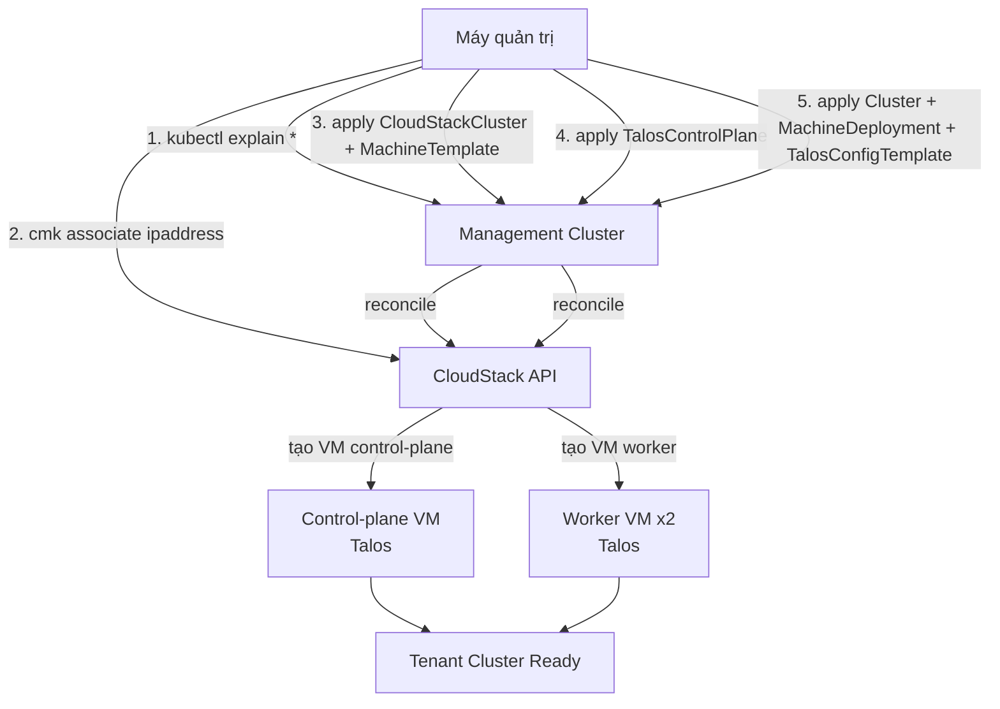

# CAPI - Triển khai Tenant Cluster đầu tiên (CloudStack + Talos)

- **Bối cảnh và vấn đề**: chưa có manifest `cluster-template` chính thức nào kết hợp CAPC (CloudStack) với Talos provider (CABPT/CACPPT) — cả CAPC và CABPT/CACPPT đều publish template mẫu riêng cho tổ hợp phổ biến hơn (CAPC+kubeadm, Talos+CAPA/CAPO/CAPV), không có tổ hợp CloudStack+Talos.
- **Cách giải quyết**: tự viết manifest ghép 2 provider theo đúng CAPI provider contract (infra provider không quan tâm bootstrap provider nào, và ngược lại) — `CloudStackCluster`/`CloudStackMachineTemplate` lo phần hạ tầng, `TalosControlPlane`/`TalosConfigTemplate` lo phần machine config.
- **Kết quả sau khi hoàn thành**: có 1 tenant cluster Talos+Kubernetes chạy thật trên CloudStack, `kubectl`/`talosctl` truy cập được.

> [!WARNING]
> Vì đây là tổ hợp tự ghép (chưa có template chính thức), **apiVersion chính xác của từng CRD phụ thuộc đúng version provider đã cài ở [[03-setup-management-cluster]]** — không copy nguyên văn con số version trong lab này nếu chưa chạy Bước 1 để xác nhận lại trên cluster thật.

## Prerequisites

- **Hạ tầng**: đã hoàn thành [[01-chuan-bi-cloudstack]], [[02-build-talos-image-cloudstack]], [[03-setup-management-cluster]].
- **Máy chủ / VM**: máy quản trị đã có `kubectl` context trỏ vào management cluster (`kind-capi-mgmt`).
- **Tài khoản và quyền**: account CAPC ở Lab 01 có quyền tạo VM/Network/LB trong account của nó.
- **Mạng**: cần 1 Public IP rảnh trong pool của Zone để làm control-plane endpoint.
- **Kiến thức nền**: [[capi--clusterclass-topology]] (không dùng ClusterClass ở lab đầu tiên này, viết object trực tiếp cho dễ follow — xem ghi chú cuối bài để biết khi nào nên chuyển sang ClusterClass), [[talos--capi-integration]].

## Thông tin Planning liên quan

| Thành phần | Giá trị | Ghi chú |
|---|---|---|
| apiVersion `CloudStackCluster`/`CloudStackMachineTemplate` | `<capc-apiversion>` | xác nhận ở Bước 1 |
| apiVersion `TalosControlPlane` | `<talos-cp-apiversion>` | xác nhận ở Bước 1 |
| apiVersion `TalosConfigTemplate` | `<talos-bootstrap-apiversion>` | xác nhận ở Bước 1 |
| Public IP control-plane endpoint | `<cluster-endpoint-ip>` | acquire ở Bước 2 |
| Số control-plane replica | `1` (lab) / `3` (production) | xem ghi chú HA cuối bài |
| Số worker replica | `2` | tuỳ chỉnh theo capacity |

## Diagram



---

## Installation

### Bước 1 - Xác nhận đúng apiVersion của từng CRD

```bash
kubectl explain cloudstackcluster.spec --api-version infrastructure.cluster.x-k8s.io/v1beta3 2>&1 | head -1
kubectl api-resources | grep -iE "cloudstack|talos"
```

Lệnh `kubectl api-resources` trả về cột `APIVERSION` đúng theo bản provider đã cài — ghi lại 3 giá trị `<capc-apiversion>`, `<talos-cp-apiversion>`, `<talos-bootstrap-apiversion>` dùng xuyên suốt các YAML dưới đây (thay vào mọi chỗ ghi placeholder này).

- Kiểm tra kết quả bước này: cả 4 kind (`CloudStackCluster`, `CloudStackMachineTemplate`, `TalosControlPlane`, `TalosConfigTemplate`) đều xuất hiện trong output, không bị lỗi `the server doesn't have a resource type`.

### Bước 2 - Acquire Public IP cho control-plane endpoint

```bash
cmk associate ipaddress zoneid=<cs-zone-id>
```

- Kiểm tra kết quả bước này:

```bash
cmk list publicipaddresses zoneid=<cs-zone-id> state=Allocated
```

Kết quả mong đợi: ghi lại `ipaddress` trả về làm `<cluster-endpoint-ip>`.

### Bước 3 - CloudStackCluster và CloudStackMachineTemplate

`cloudstack-cluster.yaml`:

```yaml
apiVersion: infrastructure.cluster.x-k8s.io/<capc-apiversion>
kind: CloudStackCluster
metadata:
  name: <cluster-name>
  namespace: <capi-namespace>
spec:
  controlPlaneEndpoint:
    host: <cluster-endpoint-ip>
    port: 6443
  failureDomains:
    - name: fd1
      zone:
        name: <cs-zone>
        network:
          name: <cs-network-name>
          offering: <cs-network-offering>
      acsEndpoint:
        name: capi-capc-credentials
        namespace: capc-system
---
apiVersion: infrastructure.cluster.x-k8s.io/<capc-apiversion>
kind: CloudStackMachineTemplate
metadata:
  name: <cluster-name>-control-plane
  namespace: <capi-namespace>
spec:
  template:
    spec:
      offering:
        name: <cs-offering-cp>
      template:
        name: <cs-talos-template>
      uncompressedUserData: true
---
apiVersion: infrastructure.cluster.x-k8s.io/<capc-apiversion>
kind: CloudStackMachineTemplate
metadata:
  name: <cluster-name>-worker
  namespace: <capi-namespace>
spec:
  template:
    spec:
      offering:
        name: <cs-offering-worker>
      template:
        name: <cs-talos-template>
      uncompressedUserData: true
```

> [!WARNING]
> `uncompressedUserData: true` là field **bắt buộc phải set** cho Talos. Mặc định CAPC gzip-compress user-data vì giả định bootstrap provider là cloud-init (có hỗ trợ giải nén gzip sẵn) — Talos **không** tự giải nén gzip user-data. Bỏ qua field này, VM Talos sẽ boot lên nhưng không đọc được machine config (symptom giống hệt lỗi ở cảnh báo metadata path của [[02-build-talos-image-cloudstack]], dễ nhầm nguyên nhân khi debug).

> [!NOTE]
> `acsEndpoint` trỏ tới Secret `capi-capc-credentials` trong namespace `capc-system` — đây là Secret `clusterctl init` tự tạo từ `CLOUDSTACK_B64ENCODED_SECRET` ở Lab 03. **Tên Secret thật có thể khác** tuỳ version CAPC, chạy `kubectl get secret -n capc-system` để xác nhận tên đúng trước khi apply.

- Kiểm tra kết quả bước này: chưa apply, chỉ chuẩn bị file — chạy `kubectl apply --dry-run=server -f cloudstack-cluster.yaml` để validate schema trước.

### Bước 4 - TalosControlPlane

`talos-control-plane.yaml`:

```yaml
apiVersion: controlplane.cluster.x-k8s.io/<talos-cp-apiversion>
kind: TalosControlPlane
metadata:
  name: <cluster-name>-control-plane
  namespace: <capi-namespace>
spec:
  version: v1.33.0
  replicas: 1
  infrastructureTemplate:
    apiVersion: infrastructure.cluster.x-k8s.io/<capc-apiversion>
    kind: CloudStackMachineTemplate
    name: <cluster-name>-control-plane
  controlPlaneConfig:
    controlplane:
      generateType: controlplane
      talosVersion: v1.14.2
```

> [!TODO] Cần xác nhận
> `spec.version` (Kubernetes version cho control plane) ghi `v1.33.0` ở đây chỉ là ví dụ — kiểm tra lại support matrix Kubernetes mà Talos v1.14.2 hỗ trợ (xem [[Talos]] hoặc release notes) trước khi chốt, đừng copy số này mà không tra lại.

> [!NOTE]
> `generateType: controlplane` để CACPPT tự sinh machine config + tự quản lý Talos CA/PKI — xem chi tiết 2 cách sinh config (`controlplane` tự động vs `none` viết tay) ở [[talos--capi-integration]]. Dùng `controlplane` (khuyến nghị) trừ khi có lý do đặc biệt.

### Bước 5 - Cluster, TalosConfigTemplate và MachineDeployment

`cluster.yaml`:

```yaml
apiVersion: cluster.x-k8s.io/v1beta1
kind: Cluster
metadata:
  name: <cluster-name>
  namespace: <capi-namespace>
spec:
  clusterNetwork:
    pods:
      cidrBlocks: ["10.244.0.0/16"]
  controlPlaneRef:
    apiVersion: controlplane.cluster.x-k8s.io/<talos-cp-apiversion>
    kind: TalosControlPlane
    name: <cluster-name>-control-plane
  infrastructureRef:
    apiVersion: infrastructure.cluster.x-k8s.io/<capc-apiversion>
    kind: CloudStackCluster
    name: <cluster-name>
---
apiVersion: bootstrap.cluster.x-k8s.io/<talos-bootstrap-apiversion>
kind: TalosConfigTemplate
metadata:
  name: <cluster-name>-worker
  namespace: <capi-namespace>
spec:
  template:
    spec:
      generateType: worker
      talosVersion: v1.14.2
---
apiVersion: cluster.x-k8s.io/v1beta1
kind: MachineDeployment
metadata:
  name: <cluster-name>-worker
  namespace: <capi-namespace>
  labels:
    cluster.x-k8s.io/cluster-name: <cluster-name>
spec:
  clusterName: <cluster-name>
  replicas: 2
  selector:
    matchLabels:
      cluster.x-k8s.io/cluster-name: <cluster-name>
  template:
    metadata:
      labels:
        cluster.x-k8s.io/cluster-name: <cluster-name>
    spec:
      clusterName: <cluster-name>
      version: v1.33.0
      bootstrap:
        configRef:
          apiVersion: bootstrap.cluster.x-k8s.io/<talos-bootstrap-apiversion>
          kind: TalosConfigTemplate
          name: <cluster-name>-worker
      infrastructureRef:
        apiVersion: infrastructure.cluster.x-k8s.io/<capc-apiversion>
        kind: CloudStackMachineTemplate
        name: <cluster-name>-worker
```

> [!NOTE]
> `apiVersion: cluster.x-k8s.io/v1beta1` cho `Cluster`/`MachineDeployment` — core CAPI v1.14.2 đang trong giai đoạn chuyển sang `v1beta2`, `v1beta1` **vẫn được serve** ở bản này nhưng **sẽ unserved ở CAPI v1.16** (xem [[CAPI]] mục 9). Dùng `v1beta1` tạm cho lab này vì tương thích rộng hơn với provider cộng đồng chưa chắc theo kịp `v1beta2`; lên kế hoạch migrate trước khi upgrade management cluster lên CAPI v1.16.

### Áp dụng toàn bộ theo đúng thứ tự dependency

```bash
kubectl apply -f cloudstack-cluster.yaml
kubectl apply -f talos-control-plane.yaml
kubectl apply -f cluster.yaml
```

- Kiểm tra kết quả bước này:

```bash
kubectl get cluster <cluster-name> -n <capi-namespace> -w
```

Kết quả mong đợi: cột `PHASE` chuyển dần `Provisioning` → `Provisioned`. Có thể mất vài phút (thời gian CloudStack tạo VM + Talos boot + CACPPT bootstrap etcd).

## Kiểm tra kết quả

- Theo dõi toàn bộ cây trạng thái cluster:

```bash
clusterctl describe cluster <cluster-name> -n <capi-namespace>
```

Kết quả mong đợi: `Cluster`, `TalosControlPlane`, `Machine` đều `Ready`/`True`, không có điều kiện `False` kéo dài.

- Lấy kubeconfig và `talosconfig` của tenant cluster:

```bash
clusterctl get kubeconfig <cluster-name> -n <capi-namespace> > <cluster-name>.kubeconfig
kubectl --kubeconfig <cluster-name>.kubeconfig get nodes
```

Kết quả mong đợi: node control-plane ở trạng thái `Ready` (worker có thể chưa `Ready` nếu chưa cài CNI — xem [[05-cni-ccm-csi]]).

| Hạng mục cần kiểm tra | Cách kiểm tra | Kết quả đúng |
|---|---|---|
| Cluster object | `kubectl get cluster -n <capi-namespace>` | `PHASE: Provisioned` |
| VM thật trên CloudStack | `cmk list virtualmachines account=<cs-account>` | Thấy đúng số VM control-plane + worker, `state: Running` |
| Node K8s | `kubectl --kubeconfig <cluster-name>.kubeconfig get nodes` | Control-plane `Ready` |

- **Hoàn tất bước mở port đã hoãn ở [[01-chuan-bi-cloudstack]] Bước 6**: giờ đã có VM thật, lấy `virtualmachineid` của control-plane VM và `ipaddressid` của Public IP ở Bước 2, chạy lại 2 lệnh `cmk create portforwardingrule` (port 6443 và 50000) đã ghi ở Lab 01.

## Troubleshooting

| Triệu chứng | Nguyên nhân | Cách xử lý |
|---|---|---|
| `Cluster` đứng ở `Provisioning` lâu, `Machine` không lên `Ready` | VM Talos không nhận machine config (lỗi metadata path, xem [[02-build-talos-image-cloudstack]]) hoặc thiếu `uncompressedUserData: true` | Console VM qua CloudStack UI xem log boot; nếu thấy Talos đứng ở màn hình chờ config, kiểm tra lại 2 nguyên nhân trên |
| `CloudStackCluster` báo lỗi `failed to resolve network offering` | `<cs-network-offering>` không tồn tại hoặc thiếu service `Lb`/`SourceNat` | Quay lại [[01-chuan-bi-cloudstack]] Bước 5 xác nhận lại ID offering |
| `kubectl apply` báo `no matches for kind "TalosControlPlane"` | Sai `apiVersion`, chưa xác nhận lại ở Bước 1 | Chạy lại `kubectl api-resources \| grep talos` lấy đúng version |

## Rollback

- Xoá cluster (CAPI tự xoá VM/network trên CloudStack theo thứ tự ngược lại khi finalizer chạy xong):

```bash
kubectl delete cluster <cluster-name> -n <capi-namespace>
```

- Theo dõi quá trình xoá (có thể mất vài phút vì CAPI drain node trước khi xoá VM):

```bash
kubectl get cluster <cluster-name> -n <capi-namespace> -w
```

> [!CAUTION]
> Nếu `kubectl delete cluster` bị treo (finalizer không tự xoá hết), **không** patch xoá finalizer bằng tay trước khi xác nhận VM trên CloudStack đã được xoá thật (`cmk list virtualmachines`) — xoá finalizer ép buộc có thể để lại VM/network orphan trên CloudStack mà CAPI không còn biết để dọn.

## Ghi chú production

- **ClusterClass**: lab này viết `Cluster`/`TalosControlPlane`/`CloudStackMachineTemplate` trực tiếp cho dễ follow lần đầu. Khi cần tạo nhiều cluster tenant giống nhau (nhiều khách hàng), nên chuyển sang [[capi--clusterclass-topology]] để không phải copy-paste toàn bộ manifest này mỗi lần.
- **HA control-plane**: tăng `TalosControlPlane.spec.replicas` lên `3` cho production — khi đó network offering phải có service `Lb` hoạt động thật (CAPC dùng để load-balance port 6443 across 3 node) đúng như đã chuẩn bị ở [[01-chuan-bi-cloudstack]].

## Reference

- [Configuration - The Cluster API Provider CloudStack Book](https://cluster-api-cloudstack.sigs.k8s.io/clustercloudstack/configuration)
- [CloudStackMachineSpec - pkg.go.dev](https://pkg.go.dev/sigs.k8s.io/cluster-api-provider-cloudstack/api/v1beta3)
- [[talos--capi-integration]], [[CAPC]], [[capi--clusterclass-topology]]
