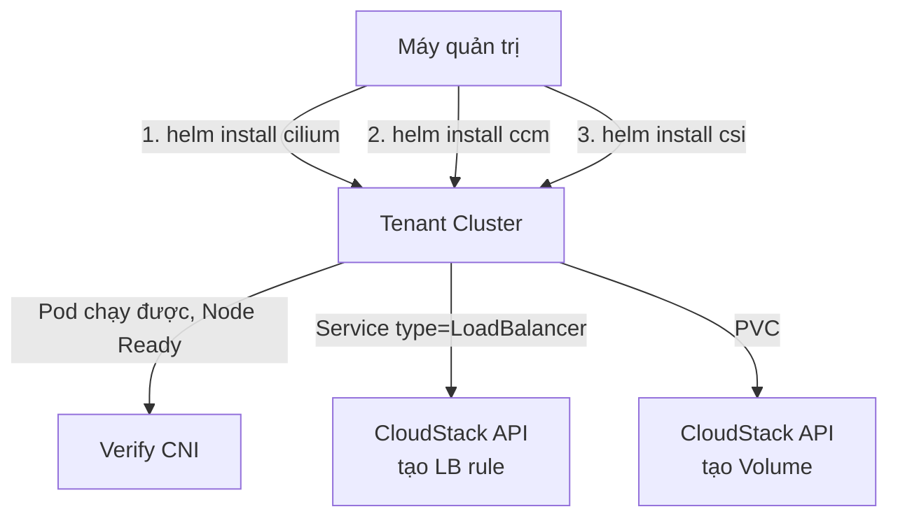

# Tenant Cluster - Cài CNI (Cilium), CCM, CSI cho CloudStack

- **Bối cảnh và vấn đề**: tenant cluster ở [[04-trien-khai-tenant-cluster]] mới có control-plane/worker `Ready` ở mức hạ tầng — chưa có network giữa Pod (chưa cài CNI), chưa thể dùng `Service type=LoadBalancer` (chưa có CCM), chưa thể dùng `PersistentVolume` (chưa có CSI).
- **Cách giải quyết**: cài Cilium làm CNI (theo đúng giá trị Talos chính thức khuyến nghị), cài `leaseweb/cloudstack-kubernetes-provider` làm CCM, và `leaseweb/cloudstack-csi-driver` làm CSI — dùng cùng 1 "họ" maintainer (leaseweb) với CAPC đã dùng ở Lab 03 để nhất quán tốc độ release.
- **Kết quả sau khi hoàn thành**: Pod giao tiếp được giữa các node, `Service type=LoadBalancer` tạo ra LB rule thật trên CloudStack, `PersistentVolumeClaim` tạo ra volume thật và attach vào node.

## Prerequisites

- **Hạ tầng**: đã hoàn thành [[04-trien-khai-tenant-cluster]], có `kubeconfig` của tenant cluster.
- **Máy chủ / VM**: máy quản trị có `helm` v3.
- **Tài khoản và quyền**: dùng lại API key/secret key CAPC ở [[01-chuan-bi-cloudstack]] cho CCM/CSI (cùng quyền, không cần tạo account riêng).
- **Mạng**: tenant cluster's node phải reach được CloudStack API endpoint (để CCM/CSI gọi API).
- **Kiến thức nền**: [[Networking]], [[Storage]].

## Thông tin Planning liên quan

| Thành phần | Giá trị | Ghi chú |
|---|---|---|
| Cilium version | theo `cilium.io` tương thích K8s v1.33.x đang dùng | xem Bước 1 |
| CCM (`leaseweb/cloudstack-kubernetes-provider`) | `v1.10.0` | 21/09/2026 |
| CSI (`leaseweb/cloudstack-csi-driver`) | `cloudstack-csi-2.8.0` (driver v0.14.0) | |
| kubeconfig tenant cluster | `<cluster-name>.kubeconfig` | tạo ở Lab 04 |

## Diagram



---

## Installation

### Bước 1 - Cài Cilium theo cấu hình chính thức cho Talos

Talos **không chạy kube-proxy theo kiểu thường** nếu dùng Cilium kube-proxy replacement — phải tắt trước qua machine config (patch vào `TalosControlPlane`/`TalosConfigTemplate` ở Lab 04 nếu chưa làm, hoặc patch runtime qua `talosctl patch machineconfig`):

```bash
talosctl --talosconfig <cluster-name>.talosconfig patch machineconfig \
  -n <control-plane-ip> \
  -p '[{"op": "add", "path": "/cluster/proxy", "value": {"disabled": true}}]'
```

Cài Cilium qua Helm với giá trị Talos khuyến nghị:

```bash
helm repo add cilium https://helm.cilium.io/
helm repo update

helm install cilium cilium/cilium \
  --kubeconfig <cluster-name>.kubeconfig \
  --namespace kube-system \
  --set ipam.mode=kubernetes \
  --set kubeProxyReplacement=true \
  --set k8sServiceHost=localhost \
  --set k8sServicePort=7445 \
  --set cgroup.autoMount.enabled=false \
  --set cgroup.hostRoot=/sys/fs/cgroup \
  --set securityContext.capabilities.ciliumAgent="{CHOWN,KILL,NET_ADMIN,NET_RAW,IPC_LOCK,SYS_ADMIN,SYS_RESOURCE,DAC_OVERRIDE,FOWNER,SETGID,SETUID}" \
  --set securityContext.capabilities.cleanCiliumState="{NET_ADMIN,SYS_ADMIN,SYS_RESOURCE}"
```

> [!NOTE]
> `k8sServiceHost=localhost` + `k8sServicePort=7445` dùng **KubePrism** — cơ chế Talos tự chạy local load-balancer tới API server trên mọi node (control-plane lẫn worker), tránh phụ thuộc trực tiếp vào 1 IP control-plane cố định cho riêng việc CNI khởi động. Đây là giá trị chính thức theo [Deploy Cilium CNI](https://docs.siderolabs.com/kubernetes-guides/cni/deploying-cilium), không phải tự suy ra.

- Kiểm tra kết quả bước này:

```bash
kubectl --kubeconfig <cluster-name>.kubeconfig get nodes
kubectl --kubeconfig <cluster-name>.kubeconfig get pods -n kube-system -l k8s-app=cilium
```

Kết quả mong đợi: toàn bộ node (control-plane + worker) chuyển `Ready`, pod `cilium` ở mỗi node `Running`.

### Bước 2 - Cài Cloud Controller Manager (CCM)

```bash
helm install cloud-controller-manager \
  --kubeconfig <cluster-name>.kubeconfig \
  --repo https://leaseweb.github.io/cloudstack-kubernetes-provider charts/cloud-controller-manager \
  --namespace kube-system \
  --set cloudConfig.global.api-url="<cs-api-url>" \
  --set cloudConfig.global.api-key="<apikey>" \
  --set cloudConfig.global.secret-key="<secretkey>"
```

> [!TODO] Cần xác nhận
> Chưa xác nhận chắc chắn tên Helm repo index chính xác (`https://leaseweb.github.io/cloudstack-kubernetes-provider`) có publish qua GitHub Pages hay chỉ qua source `charts/` trong repo. Nếu `helm repo add` lỗi 404, clone repo và `helm install` trực tiếp từ path `charts/cloud-controller-manager/` theo README của repo.

> [!WARNING]
> `api-key`/`secret-key` ở trên là secret thật — **không gõ trực tiếp vào lệnh `helm install` chạy từ lịch sử shell lưu lại**. Dùng `--set-file` trỏ tới file tạm hoặc `-f values-secret.yaml` (không commit) thay vì gõ thẳng trên production.

- Kiểm tra kết quả bước này:

```bash
kubectl --kubeconfig <cluster-name>.kubeconfig get pods -n kube-system -l app=cloud-controller-manager
kubectl --kubeconfig <cluster-name>.kubeconfig get nodes -o json | jq '.items[].spec.providerID'
```

Kết quả mong đợi: pod CCM `Running`, mọi node đều có `providerID` dạng `external-cloudstack://<instance-uuid>` (đã verify từ README chính thức `apache/cloudstack-kubernetes-provider` — đúng theo flag `--cloud-provider=external-cloudstack` mà CCM chạy, **không phải** `cloudstack://<vm-id>`; trước khi có CCM, field này rỗng).

### Bước 3 - Cài CSI driver

```bash
helm repo add cloudstack-csi https://leaseweb.github.io/cloudstack-csi-driver
helm repo update

helm install cloudstack-csi cloudstack-csi/cloudstack-csi \
  --kubeconfig <cluster-name>.kubeconfig \
  --namespace kube-system \
  --set cloudConfig.global.api-url="<cs-api-url>" \
  --set cloudConfig.global.api-key="<apikey>" \
  --set cloudConfig.global.secret-key="<secretkey>"
```

> [!TODO] Cần xác nhận
> Chưa xác nhận DaemonSet node-plugin của `cloudstack-csi-driver` có cần quyền `privileged`/`hostPath` mount nào đặc biệt (khác với CSI driver của OpenStack Cinder, CloudStack thường attach volume ở tầng hypervisor qua virtio-blk, không qua iSCSI từ guest — nên nhiều khả năng **không** cần extension `iscsi-tools` cho Talos như note [[Storage]] đã cảnh báo cho trường hợp Cinder). Đọc kỹ `requirements`/README của chart trước khi cài, test trên node worker không chứa workload quan trọng trước.

- Kiểm tra kết quả bước này:

```bash
kubectl --kubeconfig <cluster-name>.kubeconfig get pods -n kube-system -l app=cloudstack-csi
kubectl --kubeconfig <cluster-name>.kubeconfig get csidrivers
```

Kết quả mong đợi: pod controller + node-plugin `Running`, `csidrivers` có entry của CloudStack CSI driver.

## Kiểm tra kết quả

- Test end-to-end `Service type=LoadBalancer`:

```yaml
# test-lb.yaml
apiVersion: v1
kind: Service
metadata:
  name: test-lb
spec:
  type: LoadBalancer
  selector:
    app: test-lb
  ports:
    - port: 80
      targetPort: 80
```

```bash
kubectl --kubeconfig <cluster-name>.kubeconfig apply -f test-lb.yaml
kubectl --kubeconfig <cluster-name>.kubeconfig get svc test-lb -w
```

Kết quả mong đợi: `EXTERNAL-IP` chuyển từ `<pending>` sang 1 IP thật — kiểm tra chéo bằng `cmk list loadbalancerrules account=<cs-account>` thấy có rule mới tạo tương ứng.

- Test end-to-end `PersistentVolumeClaim`:

```yaml
# test-pvc.yaml
apiVersion: v1
kind: PersistentVolumeClaim
metadata:
  name: test-pvc
spec:
  accessModes: ["ReadWriteOnce"]
  resources:
    requests:
      storage: 5Gi
```

```bash
kubectl --kubeconfig <cluster-name>.kubeconfig apply -f test-pvc.yaml
kubectl --kubeconfig <cluster-name>.kubeconfig get pvc test-pvc -w
```

Kết quả mong đợi: `STATUS` chuyển `Bound` — kiểm tra chéo `cmk list volumes account=<cs-account>` thấy volume mới tạo.

| Hạng mục cần kiểm tra | Cách kiểm tra | Kết quả đúng |
|---|---|---|
| CNI | `kubectl get nodes` | Tất cả `Ready` |
| CCM | `kubectl get nodes -o json \| jq '.items[].spec.providerID'` | Không rỗng |
| CSI | `kubectl get pvc test-pvc` | `Bound` |
| LB | `kubectl get svc test-lb` | Có `EXTERNAL-IP` |

## Troubleshooting

| Triệu chứng | Nguyên nhân | Cách xử lý |
|---|---|---|
| Node không `Ready` sau khi cài Cilium | Chưa tắt kube-proxy đúng cách, hoặc `cgroup.hostRoot` sai path | `talosctl logs -n <node-ip> kubelet`, kiểm tra lỗi liên quan network plugin not ready |
| `Service type=LoadBalancer` đứng `<pending>` mãi | CCM chưa đọc đúng credential, hoặc network offering thiếu service `Lb` | `kubectl logs -n kube-system -l app=cloud-controller-manager`, xác nhận lại Bước 5 ở [[01-chuan-bi-cloudstack]] |

## Rollback

```bash
helm uninstall cloudstack-csi --kubeconfig <cluster-name>.kubeconfig -n kube-system
helm uninstall cloud-controller-manager --kubeconfig <cluster-name>.kubeconfig -n kube-system
helm uninstall cilium --kubeconfig <cluster-name>.kubeconfig -n kube-system
```

> [!CAUTION]
> Gỡ Cilium khi cluster đang có workload chạy sẽ làm mất network giữa Pod ngay lập tức (downtime toàn cluster) — chỉ gỡ khi đang troubleshoot lab, không gỡ trên cluster production đang phục vụ traffic thật.

## Reference

- [Deploy Cilium CNI - Sidero Documentation](https://docs.siderolabs.com/kubernetes-guides/cni/deploying-cilium)
- [leaseweb/cloudstack-kubernetes-provider](https://github.com/leaseweb/cloudstack-kubernetes-provider)
- [leaseweb/cloudstack-csi-driver](https://github.com/leaseweb/cloudstack-csi-driver)
- [[Networking]], [[Storage]]
