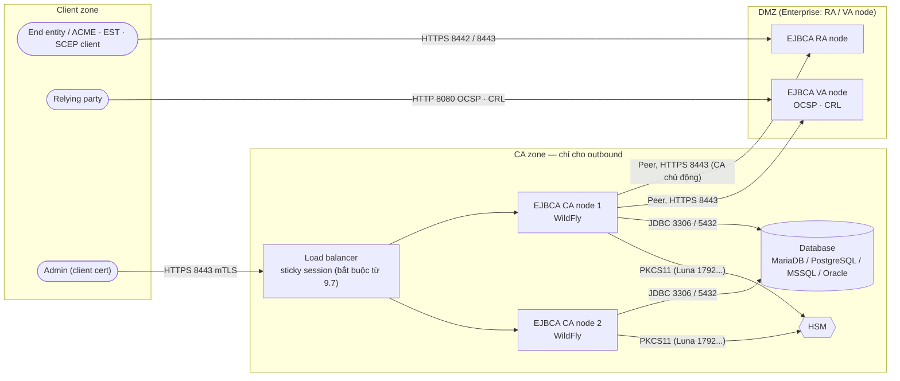
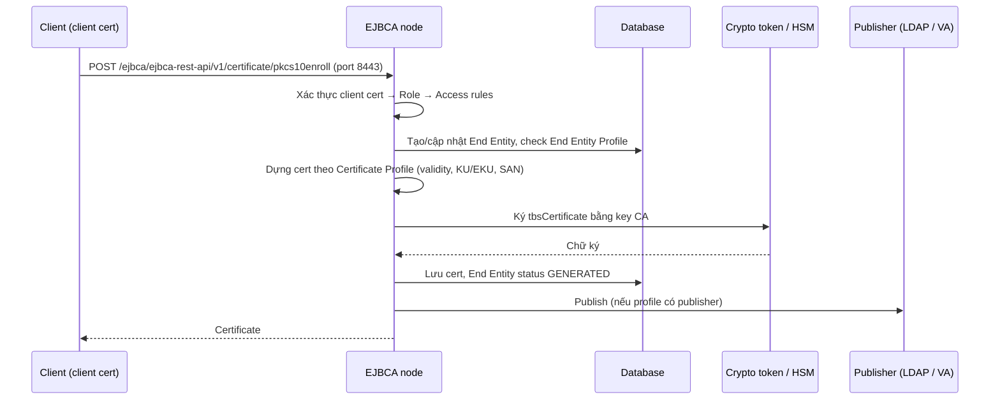

# EJBCA — Enterprise Java Beans Certificate Authority

> [!info] Phạm vi version
> Note áp dụng cho **EJBCA 9.7.0** (latest stable Enterprise, phát hành 09/2026). Bản **Community (CE)** mới
> nhất là **9.6.3** — CE đi sau Enterprise và thiếu một số tính năng (đánh dấu `(Enterprise)` trong note).
> Khác biệt theo version được đánh dấu inline: `(từ v9.x)`.

> [!warning] Community Edition và HSM
> Từ **EJBCA CE 9.6**, crypto token dùng HSM (PKCS#11) **chỉ còn ở Enterprise**. Đang chạy CE với HSM thì
> **không được** upgrade CE lên 9.6+ — xem [[#CE 9.6 bỏ HSM crypto token]].

## 1. What — Nó là cái gì?

> Nếu [[PKI]] là "cơ quan cấp CCCD" thì EJBCA là **nguyên cái phường**: quầy tiếp nhận (RA), máy in thẻ có con
> dấu (CA), bảng tra cứu thẻ bị huỷ (CRL/OCSP), sổ sách (audit log) và phân quyền nhân viên (RBAC) — gói chung 1 chỗ.

EJBCA là phần mềm CA mã nguồn mở do **Keyfactor** phát triển (trước là PrimeKey), chạy trên Java/WildFly. Nó hiện
thực gần như mọi khái niệm của [[PKI]] thành 1 sản phẩm: quản lý nhiều CA, cấp/thu hồi cert, sinh CRL, OCSP
responder, RA, RBAC, audit log và các giao thức enrollment (ACME, EST, SCEP, CMP, REST).

## 2. Why — Tại sao tồn tại / Vấn đề nó giải quyết?

Tự làm CA bằng script OpenSSL thì vài chục cert vẫn chill. Lên tới hàng nghìn cert là bắt đầu thiếu đủ thứ: RBAC,
audit log, approval workflow, CRL publish tự động, OCSP, giao thức enrollment cho device, tích hợp HSM. Khi PKI
thành hạ tầng production thật, mấy thứ đó là bắt buộc — EJBCA gói sẵn thành 1 hệ thống có UI, API và đáp ứng
được yêu cầu compliance.

## 3. When — Dùng khi nào / KHÔNG dùng khi nào?

**Dùng khi:**
- Vận hành CA nội bộ lâu dài, số lượng cert lớn, nhiều kiểu client (server, device, MDM, user).
- Cần audit trail, RBAC, approval cho cấp/thu hồi (yêu cầu compliance).
- Cần tách RA/VA ra DMZ trong khi CA nằm sau firewall chỉ cho outbound (Enterprise, xem
  [[ejbca--peer-systems-ra-va]]).

**KHÔNG dùng / cân nhắc thay thế khi:**
- Vài chục cert, không cần automation → `step-ca` hoặc script OpenSSL nhẹ hơn rất nhiều.
- Đã ở cloud và không có lý do compliance để tự vận hành CA → AWS Private CA, Google CAS, Vault PKI — gánh
  WildFly + DB + HSM + upgrade của EJBCA là chi phí vận hành thật.
- Cert sống vài phút cho workload trong mesh → SPIFFE/SPIRE, Vault PKI nhẹ và nhanh hơn.
- Cần HSM nhưng chỉ có ngân sách cho Community → từ CE 9.6 không làm được nữa, phải Enterprise hoặc chọn
  sản phẩm khác.

## 4. Where — Architecture & Deployment



Chiều mũi tên Peer là **CA → RA/VA**: CA không nhận kết nối vào từ DMZ. Đây là điểm network team hay "sửa
ngược" — xem [[#Peer connection bị chặn vì mở sai chiều]].

- **Vị trí trong hệ thống:** trung tâm phát hành cert nội bộ; mọi hệ thống cần cert enroll qua nó trực tiếp
  (Admin/RA Web, REST, CLI) hoặc qua protocol (ACME/EST/SCEP/CMP).
- **Component chính:**
  - **App server** — WildFly (9.7 dùng WildFly 41 trong container) hoặc JBoss EAP; chạy toàn bộ logic.
  - **Database** — lưu cert, CA config, profile, end entity, audit log. Không có DB là EJBCA đứng.
  - **Crypto token** — nơi giữ key của CA: soft (keystore trong DB) hoặc PKCS#11 tới HSM.
    → [[ejbca--crypto-tokens]]
  - **Profiles & End Entities** — quyết định cert được cấp ra sao. → [[ejbca--profiles-end-entities]]
  - **Services & Publishers** — job nền (sinh CRL...) và đẩy cert/CRL ra ngoài. → [[ejbca--crl-ocsp-services]]
  - **Peer Systems** (Enterprise) — nối CA với RA/VA tách rời. → [[ejbca--peer-systems-ra-va]]
  - **Roles & Access Rules** — RBAC cho admin. → [[ejbca--rbac-admin-roles]]
- **Traffic/data flow:** request → xác thực + áp End Entity Profile → CA ký qua crypto token theo Certificate
  Profile → lưu DB → Publisher đẩy ra (nếu có) → trả cert.
- **Dependency:** DB (bắt buộc), crypto token/HSM (để ký), NTP, DNS (Nodes in Cluster dùng reverse DNS cho
  clear cache; CAA check của ACME), SMTP (notification).

### Mô hình triển khai

| Mô hình | Khi nào chọn | Số node tối thiểu | Không bảo vệ được |
|---|---|---|---|
| Single node (CE hoặc Enterprise) | Lab, PKI nhỏ | 1 + DB | Node/DB chết = không cấp cert, không OCSP |
| Cluster — nhiều node chung 1 DB sau LB | CA cần HA | 2 + DB HA | DB là single point; LB phải sticky session (từ 9.7) |
| CA + RA + VA tách qua Peer (Enterprise) | CA trong zone cao, RA/VA ở DMZ | 1 CA + 1 RA/VA | RA/VA lỗi vẫn ảnh hưởng client; CA vẫn cần HA riêng |
| Container / Helm | Kubernetes | 1 pod + DB ngoài | Giống cluster; thêm phụ thuộc ingress/proxy và secret của k8s |
| Software / Hardware Appliance (Enterprise) | Muốn vendor đóng gói OS + HSM | Theo appliance | Bị khoá vào vòng đời appliance |

## 5. How — Cơ chế hoạt động

Core concepts:

- **Crypto Token** — mỗi CA gắn với 1 crypto token chứa key; token offline = CA không ký được dù mọi thứ khác
  xanh. → [[ejbca--crypto-tokens]]
- **Certificate Profile & End Entity Profile** — 2 tầng cấu hình: Certificate Profile quyết định *nội dung cert*
  (validity, KU/EKU, extension), End Entity Profile quyết định *requester được điền gì* (DN, SAN, CA, profile
  nào). → [[ejbca--profiles-end-entities]]
- **End Entity** — bản ghi "ai/cái gì được cấp cert", có username + one-time password; enroll xong status thành
  `GENERATED` và password không dùng lại được. → [[ejbca--profiles-end-entities]]
- **Services, Publishers, OCSP** — CRL Updater Service sinh CRL, Publisher đẩy ra LDAP/VA, OCSP key binding ký
  response. → [[ejbca--crl-ocsp-services]]
- **Peer Systems** (Enterprise) — CA giữ kết nối tới RA/VA. → [[ejbca--peer-systems-ra-va]]
- **RBAC** — role, member match theo client cert/OAuth, access rule. → [[ejbca--rbac-admin-roles]]
- **API & protocols** — REST, ACME, EST, SCEP, CMP, CLI và URL của chúng. → [[ejbca--api-protocols]]
- **Upgrade & backup** — upgrade từng node, post-upgrade, backup DB + token. → [[ejbca--upgrade-backup]]

**Cấp 1 cert qua REST API (luồng tiêu biểu):**



1. Quyền được check 2 lớp: Role của admin/client và giới hạn của End Entity Profile — có quyền gọi API vẫn
   không xin được field profile không cho.
2. CSR chỉ là đề xuất; nội dung thật do 2 profile quyết định, trừ khi bật override (xem Key Config).
3. Publish fail **không** làm request fail — cert vẫn cấp, bản publish vào hàng đợi chờ retry.

### Ai thắng khi xung đột

Nguyên tắc chung: **mọi lớp phải cùng cho phép thì mới được** (role ∩ EEP ∩ CertP), và **profile luôn thắng
CSR**. Chi tiết từng combo profile: [[ejbca--profiles-end-entities#Ai thắng khi xung đột]].

| Bên A | Bên B | Kết quả | Im lặng hay báo lỗi? |
|---|---|---|---|
| Role cho phép tạo End Entity | EEP không cho field/CA/CertP đó | Bị từ chối — EEP thắng | Báo lỗi |
| EEP cho điền SAN | CertP không bật SAN | Cert **không có SAN** | **Im lặng** |
| CSR có SAN/DN/EKU riêng | CertP tắt override (default) | Dùng dữ liệu End Entity + CertP, bỏ phần trong CSR | Im lặng |
| CertP tick *Use CA defined CRL Distribution Point* | URL CDP gõ trong CertP | Dùng URL cấu hình ở CA | Im lặng |
| Sửa profile/config trên node 1 | Cache ở node khác | Node khác dùng cấu hình cũ tới khi cache được clear | Im lặng → [[#Clear cache không lan sang node khác]] |

## 6. Key Config — Cấu hình cần nhớ

| Config | Default | Khuyến nghị | Vì sao |
|---|---|---|---|
| Certificate Profile → *Allow Subject DN Override by CSR* | Tắt | Giữ tắt, trừ RA rất tin cậy | Bật thì DN lấy thẳng từ CSR, EJBCA **không validate** nội dung |
| Certificate Profile → *Allow Extension Override* | Tắt | Giữ tắt; nếu cần dùng *Overridable extension OID list* | Bật thì extension trong CSR (vd SAN) được dùng nguyên, không validate |
| End Entity Profile → SAN fields | Theo profile | Chỉ field cần thiết, đặt *Required*/validation | SAN tự do = xin cert cho domain không thuộc mình |
| CA → *CRL Expire Period* / *CRL Issue Interval* / *CRL Overlap Time* | Issue interval `0`, overlap `10 min` | Issue interval ngắn hơn hẳn expire period (vd 24h expire, issue vài giờ/lần) | Default chỉ phát CRL mới 10 phút trước khi bản cũ hết hạn → sự cố nhỏ là CRL expired |
| CRL Updater Service | Phải tự tạo | Tạo cho mọi CA, interval ≥ 10 phút | Service chỉ **lưu** CRL vào DB, không publish đi đâu cả |
| `healthcheck.authorizedips` (`conf/ejbca.properties`) | `127.0.0.1` | Thêm IP LB/monitoring | LB gọi healthcheck bị từ chối → đánh dấu mọi node down |
| `healthcheck.catokensigntest` | `false` | `true` | Mặc định chỉ check token "connected"; bật để healthcheck thật sự ký thử |
| `TLS_SETUP_ENABLED` (container) | — | `true`, hoặc `later` khi sau reverse proxy | `simple` = ai truy cập HTTPS được cũng quản trị được |
| LB sticky session | — | Bắt buộc cho multi-node (từ v9.7) | Yêu cầu chính thức trong upgrade notes 9.7 |
| DB user privileges | Installer cần quyền DDL | Sau khi cài: chỉ `SELECT, INSERT, UPDATE, DELETE` | Tài khoản app bị lộ không drop/alter được schema |
| WildFly heap / DB connection pool | Cấu hình cho môi trường nhỏ | Tune theo tải enrollment cao điểm (batch issue, renew hàng loạt) | Default nhỏ → batch lớn làm cạn pool, request timeout hàng loạt |

`conf/web.properties` (cài từ source/WildFly, không áp dụng cho container) — đổi port:

```ini
httpserver.pubhttp=8080
httpserver.pubhttps=8442
httpserver.privhttps=8443
```

Sau khi đổi phải `ant deploy`, `ant web-configure` và restart app server.

## 7. Network — Port & Firewall Rules

| Nguồn → Đích | Port/Proto | Mục đích | Default? | Triệu chứng khi bị chặn |
|---|---|---|---|---|
| Client / relying party → EJBCA | `8080/tcp` | HTTP public: OCSP (`/ejbca/publicweb/status/ocsp`), tải CRL/CA cert, SCEP, healthcheck | `httpserver.pubhttp` | Client báo revocation offline; OCSP stapling fail; LB đánh dấu node down |
| Client → EJBCA | `8442/tcp` | HTTPS server-auth only: public enrollment, ACME | `httpserver.pubhttps` | ACME client timeout `/ejbca/acme/directory`; public RA web không vào được |
| Admin / client có cert → EJBCA | `8443/tcp` | HTTPS bắt buộc client cert: Admin Web, RA Web, REST, EST... | `httpserver.privhttps` | Admin không vào Admin Web; REST/EST client `connection timed out` |
| Reverse proxy → EJBCA container | `8081/tcp`, `8082/tcp` | Proxy HTTP; `8082` nhận header `SSL_CLIENT_CERT` | Bật bằng `PROXY_HTTP_BIND` | Proxy trả 502/504; nếu `8082` bị chặn: đăng nhập admin qua proxy fail |
| EJBCA CA → RA / VA node (Enterprise) | `8443/tcp` **outbound từ CA** | Peer Systems, mTLS | URL trong Peer Connector | RA không thấy CA/profile để enroll; VA không nhận cert/CRL mới, OCSP trả trạng thái cũ |
| EJBCA → Database | `3306` (MariaDB) / `5432` (PostgreSQL) / `1433` (MSSQL) / `1521` (Oracle) | JDBC | Theo datasource / `DATABASE_JDBC_URL` | Healthcheck: `JDBC Connection to the database failed`; mọi thao tác fail |
| EJBCA → HSM | Luna `1792/tcp`, nShield `9004/tcp`, Utimaco `288/tcp` | PKCS#11 (Enterprise từ CE 9.6) | Theo vendor | Healthcheck: `CA Token is disconnected`; crypto token *Offline*; không ký cert/CRL |
| EJBCA node ↔ node | HTTP tới ClearCacheServlet | *Clear All Caches* trên mọi node trong *Nodes in Cluster* | — | Đổi profile/config chỉ có hiệu lực ở node vừa sửa; node khác dùng cache cũ |
| Monitoring / LB → EJBCA | `8080/tcp` | `/ejbca/publicweb/healthcheck/ejbcahealth` | IP phải nằm trong `healthcheck.authorizedips` | Monitoring báo down dù EJBCA chạy; hoặc ngược lại không phát hiện node hỏng |
| Admin → WildFly | `9990/tcp` | WildFly management console/CLI | WildFly default | Không quản trị WildFly từ xa (port này nên chỉ mở localhost) |
| EJBCA → LDAP/AD | `389/tcp`, `636/tcp` | LDAP Publisher | có | Cert/CRL không lên directory; publisher queue tăng dần |
| EJBCA → SMTP | `25/tcp` / `587/tcp` | Notification (expiry, approval) | Theo mail config WildFly | Không ai nhận cảnh báo cert sắp hết hạn |
| EJBCA → DNS | `53/udp+tcp` | Reverse DNS cho Nodes in Cluster; CAA check cho ACME | có | Clear cache giữa node fail; ACME từ chối cấp vì không check được CAA |
| EJBCA → NTP | `123/udp` | Đồng bộ giờ | có | Cert/CRL/OCSP có `notBefore`/`thisUpdate` lệch, client reject |

^ports

> [!todo] Cần xác nhận
> Port mà node dùng để gọi ClearCacheServlet của node khác — docs chỉ ghi "http request", không ghi port.
> Kiểm tra trong môi trường thực tế (thường là port HTTP public của node).

Ngoài ra docs EJBCA khuyến nghị **chặn từ bên ngoài** các port JBoss/WildFly còn lại (`1099`, `1476`, `4444`,
`8082`, `8083` theo tài liệu security; với container, `8082` là port proxy nội bộ — chỉ cho reverse proxy gọi).

**Kiểm tra nhanh khi nghi rule bị xoá:**

```bash
# Healthcheck (từ IP nằm trong healthcheck.authorizedips) — kết quả đúng: ALLOK
curl -s http://<ejbca-node>:8080/ejbca/publicweb/healthcheck/ejbcahealth
# Port admin cần client cert: handshake phải yêu cầu certificate
openssl s_client -connect <ejbca-node>:8443 -servername <fqdn> </dev/null 2>/dev/null | grep -i "Acceptable client certificate CA names"
# Từ CA node: peer tới RA/VA có thông không (chạy trên CA, không phải trên RA)
nc -vz -w 3 <ra-node> 8443
# DB và HSM
nc -vz -w 3 <db-host> 5432
nc -vz -w 3 <luna-hsm> 1792
```

> [!tip] Timeout vs refused
> `Connection timed out` gần như luôn là firewall/security group drop packet. `Connection refused` là mạng đã
> thông nhưng không có process listen (WildFly chết hoặc bind sai interface).

## 8. Security Considerations

### Attack surface

- **Port 8443 (Admin Web, REST, RA)** — xác thực bằng client cert; ai có cert map vào role mạnh là admin.
- **Port 8442/8080 (public)** — enrollment không cần client cert, OCSP, SCEP; lộ ra ngoài thì mọi endpoint
  public đều bị dò.
- **Database** — chứa mọi thứ trừ key HSM; với soft crypto token, DB **chứa luôn key CA** (đã mã hoá bằng PIN).
- **Server chạy WildFly** — có quyền dùng crypto token; chiếm server = ký được cert.

### Misconfiguration gây breach

| Misconfiguration | Hậu quả |
|---|---|
| Container chạy `TLS_SETUP_ENABLED=simple` ở production | Ai truy cập HTTPS cũng quản trị được CA |
| Bật *Allow Subject DN Override* / *Allow Extension Override* cho profile mà requester không tin cậy dùng | Xin được cert với DN/SAN tuỳ ý — giả danh service khác |
| Role member match chỉ theo CN, không giới hạn CA phát hành | Ai xin được cert cùng CN từ CA khác cũng thành admin |
| Soft crypto token + auto-activation cho Issuing CA production | Ai có DB backup + PIN trong config là có key CA |
| Admin Web (8443) và REST mở ra Internet | Bề mặt tấn công brute-force/0-day trực tiếp vào CA |

### Hardening checklist tối thiểu

- [ ] Chỉ expose qua reverse proxy những URL cần thiết (thường là OCSP/CRL, ACME); Admin Web, EST, SCEP chỉ mạng nội bộ — theo khuyến nghị security của EJBCA.
- [ ] Issuing CA dùng HSM (Enterprise), không soft token — key không nằm trong DB.
- [ ] Role member match theo serial number cert hoặc CN + đúng CA phát hành — chặn admin giả.
- [ ] DB user của app chỉ `SELECT, INSERT, UPDATE, DELETE`; tài khoản DDL riêng cho upgrade.
- [ ] Audit log dùng `IntegrityProtectedDevice` và export ra SIEM — chống sửa/xoá log.
- [ ] Approval profile (nhiều người duyệt) cho thao tác nhạy cảm: tạo/sửa CA, activate CA, revoke hàng loạt.
- [ ] WildFly chạy bằng user riêng, file config/keystore chỉ user đó đọc được.

## 9. Ops Runbook — Production Notes

> [!tip] Checklist hằng ngày & triage sự cố
> Phần này giải thích *vì sao*. Làm gì mỗi ngày và xử lý sự cố theo triệu chứng: [[PKI--Runbook]].

- **Health check:** `GET http://<node>:8080/ejbca/publicweb/healthcheck/ejbcahealth` → `ALLOK` (HTTP 200).
  Lỗi trả HTTP 500 kèm message: `JDBC Connection to the database failed`, `CA Token is disconnected`,
  `Virtual Memory is about to run out`... Chọn CA nào được check ở *CA Activation* hoặc *Edit CA*
  (*Include in health check*). Đặt `healthcheck.maintenancefile` để rút node khỏi LB có chủ đích.
- **Log quan trọng:** server log WildFly (`standalone/log/server.log` khi cài thủ công; stdout của container) —
  grep `CryptoTokenOfflineException`, lỗi JDBC, exception khi enroll. Audit log xem ở Admin Web → *Audit Log*.
- **Metric cần alert:**
  - Healthcheck khác `ALLOK` trên bất kỳ node nào.
  - Expiry của CA cert, OCSP signer cert, Peer/TLS cert của chính EJBCA, cert admin — 90/60/30 ngày.
  - CRL: thời gian còn lại tới `nextUpdate` (đo từ URL client tải, không phải từ DB).
  - Publisher queue length tăng liên tục — publish đang fail.
  - Service (đặc biệt CRL Updater) không chạy đúng lịch.
- **Restart:** trong cluster restart **từng node**, rút khỏi LB trước (maintenance file), chờ `ALLOK` mới chuyển
  node tiếp. Sau restart, crypto token không auto-activation phải activate tay — nếu không CA không ký được.
- **Backup / upgrade:** → [[ejbca--upgrade-backup]].

## 10. Gotchas & Lessons Learned

### Hay nhầm lẫn

| Dễ nhầm | Thực tế | Hậu quả khi nhầm |
|---|---|---|
| Certificate Profile vs End Entity Profile | CertP: cert chứa gì. EEP: requester được nhập gì, dùng CA/CertP nào | Sửa sai chỗ → thay đổi không có hiệu lực hoặc mở quá rộng |
| Port 8442 vs 8443 | 8442 TLS server-only (public); 8443 bắt buộc client cert | Mở nhầm port → admin không vào được, hoặc client không cert gọi nhầm port |
| CRL Updater Service vs Publisher | Service sinh CRL vào DB; Publisher mới đẩy ra ngoài | Có service mà không publisher → CRL ngoài CDP vẫn cũ |
| Admin Web vs RA Web | Admin Web: cấu hình toàn hệ thống. RA Web (`/ejbca/ra/`): enroll/quản lý cert hàng ngày | Cấp quyền Admin Web cho người chỉ cần RA |
| Delete End Entity vs revoke | Xoá End Entity không làm cert đã cấp mất hiệu lực | Tưởng đã thu hồi nhưng cert vẫn valid tới `notAfter` |
| Community vs Enterprise | Peer Systems, HSM (từ CE 9.6), ConfigDump... chỉ có ở Enterprise | Thiết kế kiến trúc trên CE rồi mới phát hiện thiếu tính năng |

### Bẫy vận hành

#### CE 9.6 bỏ HSM crypto token

- **Triệu chứng:** upgrade EJBCA Community lên 9.6+, CA dùng PKCS#11 không còn ký được.
- **Nguyên nhân:** "As of EJBCA Community 9.6, the use of HSM Crypto Tokens requires EJBCA Enterprise Edition."
- **Cách tránh / xử lý:** CE + HSM thì dừng ở 9.3.x hoặc chuyển Enterprise; đọc release notes CE trước mọi
  upgrade.
- **Nguồn:** [Keyfactor/ejbca-ce releases](https://github.com/Keyfactor/ejbca-ce/releases)

#### Peer connection bị chặn vì mở sai chiều

- **Triệu chứng:** RA node ở DMZ không enroll được; network team mở thêm rule RA → CA mà vẫn không chạy.
- **Nguyên nhân:** mọi kết nối Peer do **CA khởi tạo** tới RA/VA (long-hanging connection), không có kết nối
  vào CA. Rule cần là CA → RA:8443.
- **Cách tránh / xử lý:** ghi rõ chiều trong firewall request; kiểm tra bằng `nc` **từ CA node**.
- **Nguồn:** [EJBCA — Peer Systems](https://docs.keyfactor.com/ejbca/latest/peer-systems)

#### CRL hết hạn vì default overlap chỉ 10 phút

- **Triệu chứng:** client fail-closed (VPN, 802.1x) với lỗi revocation offline sau khi CRL Updater/publisher có
  sự cố ngắn.
- **Nguyên nhân:** default *CRL Issue Interval* `0` + *Overlap* `10 min` → CRL mới chỉ sinh 10 phút trước khi bản
  cũ hết hạn; CRL Updater Service chỉ lưu DB, publish là việc riêng.
- **Cách tránh / xử lý:** đặt *CRL Issue Interval* ngắn hơn nhiều so với *Expire Period*; alert theo `nextUpdate`
  ở CDP.
- **Nguồn:** [EJBCA — CRL Updater Service](https://docs.keyfactor.com/ejbca/latest/crl-updater-service)

#### Upgrade multi-node lên 9.7 không bật sticky session

- **Triệu chứng:** (suy luận từ yêu cầu của docs) thao tác Admin/RA Web lỗi ngẫu nhiên khi request rơi sang
  node khác.
- **Nguyên nhân:** "All multi-node EJBCA 9.7 deployments must use sticky sessions when deployed with a load
  balancer".
- **Cách tránh / xử lý:** cấu hình sticky session trên LB **trước** khi upgrade.
- **Nguồn:** [EJBCA 9.7 Upgrade Notes](https://docs.keyfactor.com/ejbca/latest/ejbca-9-7-upgrade-notes)

#### Post-upgrade chạy khi cluster chưa upgrade hết

- **Triệu chứng:** node chưa upgrade lỗi sau khi ai đó bấm *System Upgrade*.
- **Nguyên nhân:** EJBCA không biết cluster có bao nhiêu node; post-upgrade phải chạy **sau khi mọi node đã lên
  version mới**, và chỉ chạy 1 lần trên 1 node.
- **Cách tránh / xử lý:** xem quy trình ở [[ejbca--upgrade-backup]].
- **Nguồn:** [Upgrading EJBCA](https://docs.keyfactor.com/ejbca/latest/upgrading-ejbca)

#### Healthcheck chỉ trả lời localhost

- **Triệu chứng:** vừa đưa node sau LB, LB đánh dấu mọi node down dù EJBCA chạy bình thường.
- **Nguyên nhân:** `healthcheck.authorizedips` default `127.0.0.1`.
- **Cách tránh / xử lý:** thêm IP LB/monitoring (phân cách bằng `;`).
- **Nguồn:** [EJBCA — Monitoring and Healthcheck](https://docs.keyfactor.com/ejbca/latest/monitoring-and-healthcheck)

#### Clear cache không lan sang node khác

- **Triệu chứng:** sửa profile ở node 1, request vào node 2 vẫn dùng cấu hình cũ.
- **Nguyên nhân:** *Clear All Caches* chỉ gọi node trong *Nodes in Cluster*, và node gọi được xác thực bằng IP
  qua reverse DNS — hostname/DNS sai là bị từ chối.
- **Cách tránh / xử lý:** kiểm tra danh sách *Nodes in Cluster* + reverse DNS mỗi khi đổi IP/hostname node.
- **Nguồn:** [EJBCA — Clearing System Caches](https://docs.keyfactor.com/ejbca/latest/clearing-system-caches)

### Lesson learned thực tế

> [!todo] Bổ sung khi có sự cố hoặc kinh nghiệm thực tế
> Format: `YYYY-MM-DD — <chuyện gì xảy ra> — <impact> — <root cause> — <bài học>` + link `[[incident note]]` nếu có.

## 11. Resources

- **Official docs (latest = 9.7):** https://docs.keyfactor.com/ejbca/latest/
- **Release notes / upgrade notes:** [Release notes summary](https://docs.keyfactor.com/ejbca/latest/ejbca-release-notes-summary)
  · [Upgrade notes summary](https://docs.keyfactor.com/ejbca/latest/ejbca-upgrade-notes-summary)
- **Security guide:** [EJBCA Security](https://docs.keyfactor.com/ejbca/latest/ejbca-security)
- **Source & discussions (CE):** https://github.com/Keyfactor/ejbca-ce
- **Helm chart (CE):** https://github.com/Keyfactor/ejbca-community-helm
- **Note liên quan:** [[PKI]] — lý thuyết nền của mọi khái niệm EJBCA hiện thực.

---

## Glossary

| Term | Nghĩa ngắn gọn |
|---|---|
| **Crypto Token** | Nơi chứa key của CA/key binding: soft hoặc PKCS#11 → [[ejbca--crypto-tokens]] |
| **Certificate Profile** | Template nội dung cert → [[ejbca--profiles-end-entities]] |
| **End Entity Profile** | Ràng buộc dữ liệu requester được nhập → [[ejbca--profiles-end-entities]] |
| **End Entity** | Bản ghi chủ thể được cấp cert (username, DN, SAN, status) |
| **Publisher** | Thành phần đẩy cert/CRL ra hệ thống ngoài → [[ejbca--crl-ocsp-services]] |
| **Service** | Job nền chạy theo lịch (CRL Updater, notification...) |
| **Internal Key Binding / OcspKeyBinding** | Key + cert dùng cho mục đích nội bộ, vd ký OCSP |
| **Peer Connector** | Kết nối từ CA tới EJBCA RA/VA khác (Enterprise) → [[ejbca--peer-systems-ra-va]] |
| **Role / Access Rule** | Nhóm admin và quyền của nhóm → [[ejbca--rbac-admin-roles]] |
| **Approval Profile** | Quy định thao tác nào cần bao nhiêu người duyệt |
| **ManagementCA** | CA được tạo lúc cài đặt để cấp cert cho admin và TLS của EJBCA |
| **Post-upgrade** | Bước migrate dữ liệu chạy 1 lần sau khi mọi node đã upgrade → [[ejbca--upgrade-backup]] |
