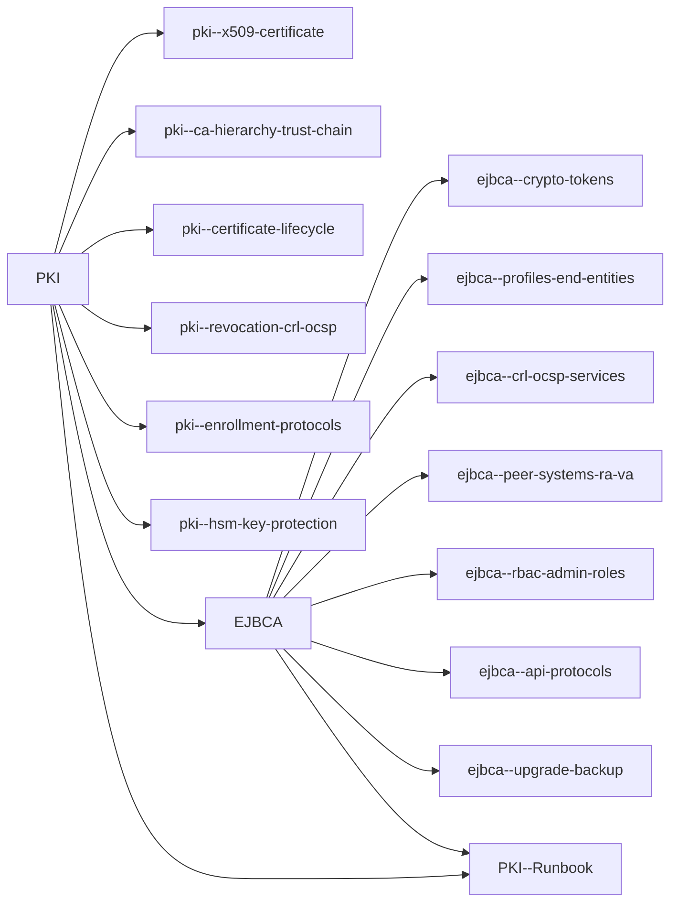

# PKI — Index (MOC)

Toàn bộ note về PKI (lý thuyết, version-independent theo RFC 5280) và EJBCA (áp dụng cho **EJBCA 9.7.0**
Enterprise; Community mới nhất là 9.6.3). Học từ đầu thì đọc theo thứ tự gợi ý; đang cháy thì mở thẳng
[[PKI--Runbook]].

## Thứ tự đọc gợi ý

1. [[PKI]] — bắt đầu ở đây, có glossary tra nhanh.
2. [[pki--x509-certificate]] — cert chứa gì, extension nào nguy hiểm.
3. [[pki--ca-hierarchy-trust-chain]] — vì sao Root offline, chain được build thế nào.
4. [[pki--certificate-lifecycle]] — CSR → issue → renew → revoke/expire.
5. [[pki--revocation-crl-ocsp]] — CRL/OCSP và fail-open vs fail-closed.
6. [[pki--enrollment-protocols]] — ACME/EST/SCEP/CMP.
7. [[pki--hsm-key-protection]] — HSM, key ceremony.
8. [[EJBCA]] — chuyển sang công cụ thực tế; đọc kỹ mục Gotchas.
9. [[ejbca--profiles-end-entities]] — khái niệm quan trọng nhất của EJBCA.
10. [[ejbca--crypto-tokens]]
11. [[ejbca--crl-ocsp-services]]
12. [[ejbca--rbac-admin-roles]]
13. [[ejbca--api-protocols]]
14. [[ejbca--peer-systems-ra-va]] — Enterprise, khi tách RA/VA ra DMZ.
15. [[ejbca--upgrade-backup]] — đọc trước mọi lần upgrade.
16. [[PKI--Runbook]] — checklist vận hành hằng ngày + triage sự cố.

## Theo chủ đề

**Nền tảng chuẩn:**
- [[PKI]]
- [[pki--x509-certificate]]
- [[pki--ca-hierarchy-trust-chain]]

**Vòng đời & revocation:**
- [[pki--certificate-lifecycle]]
- [[pki--revocation-crl-ocsp]]
- [[ejbca--crl-ocsp-services]]

**Enrollment & tự động hoá:**
- [[pki--enrollment-protocols]]
- [[ejbca--api-protocols]]
- [[ejbca--profiles-end-entities]]

**Bảo vệ key:**
- [[pki--hsm-key-protection]]
- [[ejbca--crypto-tokens]]

**Kiến trúc & vận hành EJBCA:**
- [[PKI--Runbook]]
- [[EJBCA]]
- [[ejbca--peer-systems-ra-va]]
- [[ejbca--rbac-admin-roles]]
- [[ejbca--upgrade-backup]]

## Network matrix tổng hợp

### PKI (port theo giao thức)

![[PKI#^ports]]

### EJBCA

![[EJBCA#^ports]]

## Ops quick links

- **[[PKI--Runbook]] — đọc đầu tiên khi có sự cố, checklist hằng ngày**
- [[EJBCA#9. Ops Runbook — Production Notes|EJBCA — Ops]]
- [[EJBCA#10. Gotchas & Lessons Learned|EJBCA — Gotchas]]
- [[PKI#9. Ops Runbook — Production Notes|PKI — Ops]]
- [[PKI#10. Gotchas & Lessons Learned|PKI — Gotchas]]
- [[ejbca--upgrade-backup|EJBCA — Upgrade & Backup]]
