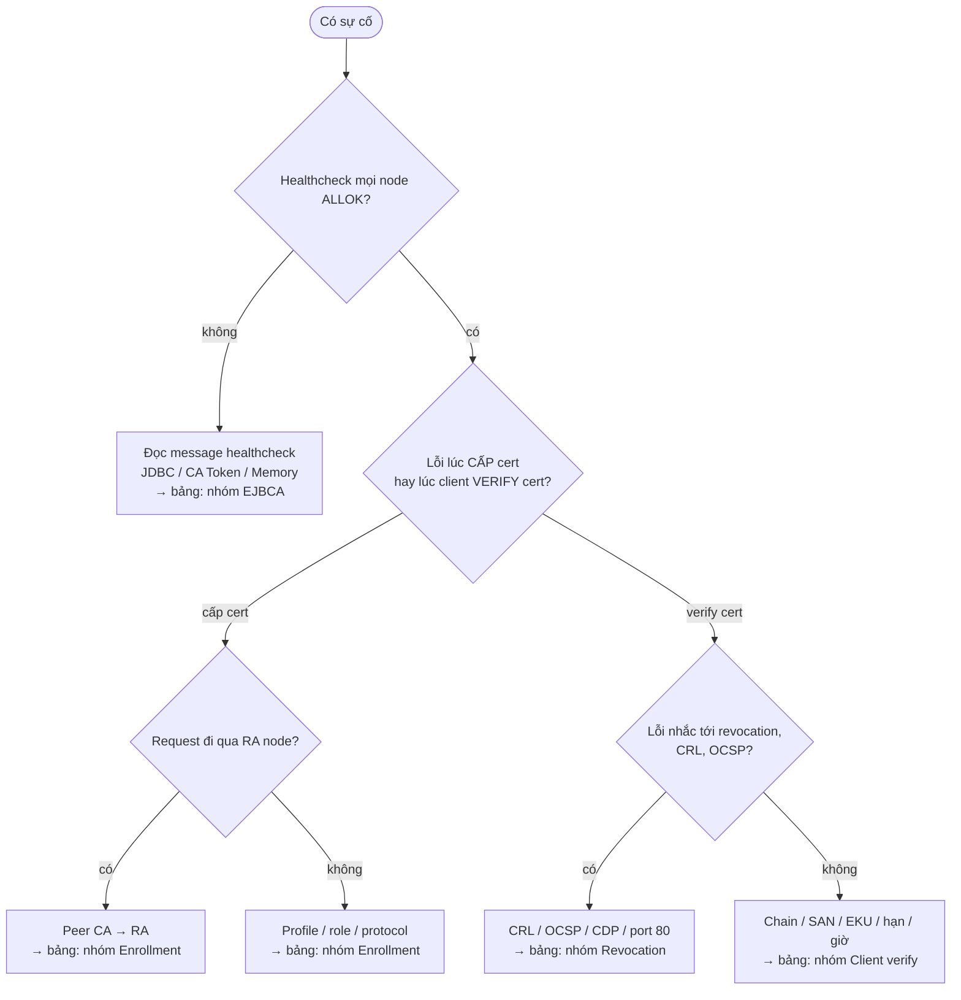

# PKI — Runbook vận hành

> [!important] Đọc file này đầu tiên khi có sự cố
> Đang cháy → nhảy thẳng [[#3. Triage — gặp lỗi thì xem ở đây]], dò theo triệu chứng.
> Ngày thường → làm [[#1. Checklist hằng ngày]] (~10 phút).
> File này chỉ giữ phần "làm gì"; "vì sao" nằm ở note được link sau mỗi dòng.

PKI là kiểu hạ tầng chạy êm thì không ai nhớ tới, mà toang thì toang cả đám (VPN, mTLS, 802.1x, web nội bộ cùng
lúc). Phần lớn sự cố PKI **báo trước** bằng ngày hết hạn — checklist này để mình nhìn thấy trước khi user thấy.

## 0. Thông tin môi trường

| Thành phần | Host / URL | Owner / ghi chú |
|---|---|---|
| EJBCA CA node 1, 2 | `<ejbca-node-1>`, `<ejbca-node-2>` | <team>, sau LB `<ejbca-lb>` |
| EJBCA RA node (Enterprise) | `<ra-node>` | DMZ |
| EJBCA VA / OCSP | `<ocsp-url>` | vd `http://<host>:8080/ejbca/publicweb/status/ocsp` |
| CRL Distribution Point | `<cdp-url>` | URL ghi trong cert (CDP) |
| Database | `<db-host>:<db-port>` | MariaDB/PostgreSQL... |
| HSM | `<hsm-host>:<hsm-port>` | Vendor, model, slot |
| Cert test để check OCSP | `test-leaf.pem`, `issuing-ca.pem` | Cert còn hạn, không revoke, cấp riêng cho monitoring |
| Monitoring / SIEM | `<monitoring-url>` | |

> [!todo] Điền thông tin môi trường
> Thay các giá trị `<...>` trong bảng trên và trong các lệnh bên dưới bằng giá trị thật.

## 1. Checklist hằng ngày

- [ ] **Healthcheck mọi node = `ALLOK`** (chạy từ IP nằm trong `healthcheck.authorizedips`) → [[EJBCA#9. Ops Runbook — Production Notes]]
  ```bash
  for n in <ejbca-node-1> <ejbca-node-2>; do
    printf '%s: ' "$n"; curl -s -m 5 "http://$n:8080/ejbca/publicweb/healthcheck/ejbcahealth"; echo
  done
  ```
- [ ] **Không có crypto token offline** — healthcheck không báo `CA Token is disconnected`; Admin Web → *CA Activation*
  mọi CA *Active* → [[ejbca--crypto-tokens#Ops notes]]
- [ ] **CRL tại CDP còn hạn xa** — `nextUpdate` còn hơn 50% chu kỳ → [[EJBCA#CRL hết hạn vì default overlap chỉ 10 phút]]
  ```bash
  curl -s -m 10 "<cdp-url>" | openssl crl -inform DER -noout -lastupdate -nextupdate
  ```
- [ ] **OCSP trả `good` cho cert test** → [[ejbca--crl-ocsp-services#Ops notes]]
  ```bash
  openssl ocsp -issuer issuing-ca.pem -cert test-leaf.pem -url "<ocsp-url>" -noverify | head -1
  # Kết quả đúng: "test-leaf.pem: good"
  ```
- [ ] **Publisher queue không tăng** — Admin Web → *Publishers* / publish queue; số item bằng 0 hoặc không tăng so với
  hôm qua → [[ejbca--crl-ocsp-services#Hay nhầm lẫn]]
- [ ] **CRL Updater Service và Publish Queue Process Service đã chạy đúng lịch** — Admin Web → *Services*, xem lần chạy
  gần nhất → [[ejbca--crl-ocsp-services#Config gotchas]]
- [ ] **Không có cert quan trọng hết hạn trong 30 ngày** — xem [[#6. Lịch hết hạn & mốc quan trọng]] và scanner expiry
  ```bash
  for ep in <ejbca-lb>:8443 <ejbca-lb>:8442 <service-quan-trong>:443; do
    printf '%s  ' "$ep"; echo | openssl s_client -connect "$ep" 2>/dev/null | openssl x509 -noout -enddate
  done
  ```
- [ ] **Server log không có lỗi crypto token / DB** (cài thủ công: `standalone/log/server.log`; container: stdout)
  → [[EJBCA#9. Ops Runbook — Production Notes]]
  ```bash
  grep -cE 'CryptoTokenOfflineException|JDBC|Connection refused' <wildfly-home>/standalone/log/server.log
  ```
- [ ] **(Enterprise) Peer connector tới RA/VA đang connected** — Admin Web → *Peer Systems* → [[ejbca--peer-systems-ra-va#Ops notes]]

## 2. Checklist định kỳ

### Hằng tuần

- [ ] Review audit log các thao tác nhạy cảm: revoke, sửa profile, sửa role, activate/deactivate CA → [[EJBCA#Hardening checklist tối thiểu]]
- [ ] Backup DB + config chạy thành công (kiểm tra job, dung lượng file, timestamp) → [[ejbca--upgrade-backup]]
- [ ] Xem lịch hết hạn 90 ngày tới, tạo ticket renew → [[#6. Lịch hết hạn & mốc quan trọng]]

### Hằng tháng

- [ ] Review member của các role mạnh (Super Administrator, CA Administrator); gỡ người đã nghỉ/chuyển team → [[ejbca--rbac-admin-roles#Ops notes]]
- [ ] Rà CertP có validity dài bất thường hoặc bật *Allow ... Override* → [[ejbca--profiles-end-entities#Ops notes]]
- [ ] *Nodes in Cluster* đúng danh sách node, reverse DNS từng node khớp → [[EJBCA#Clear cache không lan sang node khác]]
- [ ] Đọc release notes / security advisory mới của EJBCA và HSM vendor → [[ejbca--upgrade-backup]]

### Hằng quý

- [ ] **Restore test**: dựng EJBCA từ backup trên môi trường riêng, activate token, cấp thử 1 cert, sinh CRL → [[ejbca--upgrade-backup#Ops notes]]
- [ ] Diễn tập [[#Revoke khẩn cấp 1 cert bị lộ key]] trên môi trường test
- [ ] Test failover: rút 1 node khỏi LB, kiểm tra cấp cert + OCSP vẫn chạy

### Hằng năm

- [ ] Diễn tập restore key HSM từ backup (M of N), cập nhật danh sách người giữ smartcard → [[pki--hsm-key-protection#Ops notes]]
- [ ] Ký lại CRL của Root CA offline trước `nextUpdate` (Root offline vẫn phải phát CRL định kỳ) → [[pki--ca-hierarchy-trust-chain#Ops notes]]
- [ ] Review CP/CPS, kiểm tra profile còn khớp → [[PKI#5. How — Cơ chế hoạt động]]
- [ ] Kiểm tra trạng thái chứng nhận FIPS của HSM (140-2 đã Historical từ 2026-09-21) → [[pki--hsm-key-protection#Các lựa chọn — FIPS 140 security level]]

## 3. Triage — gặp lỗi thì xem ở đây



| Triệu chứng | Check đầu tiên | Nguyên nhân hay gặp | Chi tiết |
|---|---|---|---|
| **— Nhóm EJBCA —** | | | |
| Healthcheck: `JDBC Connection to the database failed` | `nc -vz -w 3 <db-host> <db-port>` từ node EJBCA | DB down, rule tới DB bị xoá, sai JDBC URL sau upgrade | [[EJBCA#7. Network — Port & Firewall Rules]] · [[ejbca--upgrade-backup#Config gotchas]] |
| Healthcheck: `CA Token is disconnected`; log `CryptoTokenOfflineException` | Admin Web → *CA Activation*; `nc -vz -w 3 <hsm-host> <hsm-port>` | Token chưa activate sau restart; mất kết nối HSM; library PKCS#11 thiếu ở 1 node | [[ejbca--crypto-tokens#Ops notes]] |
| LB đánh dấu mọi node down, EJBCA vẫn chạy | `curl` healthcheck từ IP của LB | `healthcheck.authorizedips` chỉ có `127.0.0.1` | [[EJBCA#Healthcheck chỉ trả lời localhost]] |
| Sửa profile ở node 1, node 2 vẫn dùng cấu hình cũ | *Nodes in Cluster*, `dig -x <node-ip>` | Clear cache không tới được node khác | [[EJBCA#Clear cache không lan sang node khác]] |
| Sau upgrade 9.7 multi-node: thao tác Admin/RA Web lỗi ngẫu nhiên | Cấu hình LB | Chưa bật sticky session | [[EJBCA#Upgrade multi-node lên 9.7 không bật sticky session]] |
| Sau upgrade CE lên 9.6+: CA dùng HSM không ký được | Edition + crypto token type | CE 9.6 bỏ HSM crypto token | [[EJBCA#CE 9.6 bỏ HSM crypto token]] |
| Admin không vào được Admin Web | Cert admin còn hạn? `nc -vz <ejbca-lb> 8443`? Member trong role? | Cert admin hết hạn; rule 8443 bị xoá; bị gỡ khỏi role | [[ejbca--rbac-admin-roles#Ops notes]] |
| **— Nhóm Enrollment —** | | | |
| RA node không enroll được, không thấy CA/profile | **Từ CA node**: `nc -vz -w 3 <ra-node> 8443`; *Peer Systems* | Rule CA → RA bị xoá / mở sai chiều; cert Remote Authenticator hết hạn | [[EJBCA#Peer connection bị chặn vì mở sai chiều]] |
| REST trả 403 dù TLS ok | Role của client cert, access rule cho CA/EEP | Thiếu access rule | [[ejbca--api-protocols#How it works]] · [[ejbca--rbac-admin-roles#How it works]] |
| REST/ACME/EST trả lỗi "disabled"/404 | *System Configuration → Protocol Configuration* | Protocol chưa bật (REST tắt mặc định) | [[ejbca--api-protocols#How it works]] |
| Request bị từ chối vì key length / CertP / token | Thông báo lỗi + EEP/CertP đang dùng | Request nằm ngoài *Available* của EEP/CertP | [[ejbca--profiles-end-entities#Ai thắng khi xung đột]] |
| ACME: `Timeout during connect (likely firewall problem)` | Inbound `80/tcp` tới host xin cert | `http-01` bị firewall chặn | [[pki--enrollment-protocols#How it works]] |
| **— Nhóm Revocation —** | | | |
| VPN / 802.1x / mTLS từ chối **mọi** cert cùng lúc | `curl -s <cdp-url> \| openssl crl -inform DER -noout -nextupdate` | CRL quá hạn (service/publisher lỗi, rule tới CDP bị xoá) | [[PKI#CRL quá hạn làm client fail-closed hàng loạt]] · [[#CRL sắp hoặc đã hết hạn]] |
| Windows: `CRYPT_E_REVOCATION_OFFLINE` (0x80092013) | `curl -I <cdp-url>` từ mạng của client | Rule HTTP 80 tới CDP/OCSP bị xoá | [[PKI#7. Network — Port & Firewall Rules]] |
| nginx: `OCSP responder timed out` | `curl -I <ocsp-url>` từ web server | Rule tới OCSP bị xoá | [[PKI#7. Network — Port & Firewall Rules]] |
| Cert đã revoke vẫn được chấp nhận | `openssl ocsp ...` cho cert đó; chế độ revocation của client | Client fail-open; VA chưa nhận dữ liệu (publisher queue); CRL chưa sinh lại | [[pki--revocation-crl-ocsp#Config gotchas]] · [[ejbca--crl-ocsp-services#Hay nhầm lẫn]] |
| **— Nhóm Client verify —** | | | |
| `curl`/Java: `unable to get local issuer certificate`, browser vẫn ok | `openssl s_client -connect <host>:443 -showcerts` | Server không gửi intermediate | [[PKI#Server không gửi intermediate cert]] |
| Java: `PKIX path building failed`, `curl` ok | `keytool -list -cacerts \| grep -i <root-name>` | Root chưa có trong trust store của JVM/container | [[PKI#Hay nhầm lẫn]] |
| Hostname mismatch dù RA đã điền SAN | `openssl x509 -in cert.pem -noout -ext subjectAltName` | CertP không bật SAN | [[ejbca--profiles-end-entities#Ai thắng khi xung đột]] |
| mTLS fail sau khi renew từ public CA | `openssl x509 -noout -ext extendedKeyUsage` | Cert mới không còn `clientAuth` | [[PKI#Dùng public TLS cert cho mTLS]] |
| `certificate is not yet valid` | `chronyc tracking` trên cả client và CA | Lệch giờ, NTP `123/udp` bị chặn | [[PKI#7. Network — Port & Firewall Rules]] |
| Hàng loạt client cũ lỗi cùng lúc, leaf còn hạn | Hạn của intermediate/root trong chain | CA trong chain hết hạn | [[PKI#Root/intermediate hết hạn trong khi leaf còn hạn]] |
| Import .p12 báo "invalid password" dù đúng password | Client cũ? | PKCS#12 mã hoá kiểu mới (OpenSSL 3) | [[pki--certificate-lifecycle#Config gotchas]] |

## 4. Network quick check

```bash
# Chạy TỪ CA NODE — kiểm tra outbound của CA (DB, HSM, peer tới RA/VA)
for target in <db-host>:<db-port> <hsm-host>:<hsm-port> <ra-node>:8443 <va-node>:8443; do
  nc -vz -w 3 "${target%%:*}" "${target##*:}"
done

# Chạy TỪ MẠNG CLIENT — kiểm tra inbound tới EJBCA và CDP/OCSP
for target in <ejbca-lb>:8080 <ejbca-lb>:8442 <ejbca-lb>:8443 <cdp-host>:80; do
  nc -vz -w 3 "${target%%:*}" "${target##*:}"
done
# timeout = firewall drop → gọi network team; refused = service không listen → tự xem service
```

### PKI (port theo giao thức)

![[PKI#^ports]]

### EJBCA

![[EJBCA#^ports]]

## 5. Playbook khẩn cấp

### CA không ký được (crypto token offline)

**Khi nào dùng:** healthcheck `CA Token is disconnected`, log `CryptoTokenOfflineException`, mọi enrollment fail.

1. Xác định node bị: chạy vòng healthcheck ở [[#1. Checklist hằng ngày]].
2. Rút node lỗi khỏi LB (maintenance file `healthcheck.maintenancefile`, hoặc tắt trên LB).
3. Từ node lỗi: `nc -vz -w 3 <hsm-host> <hsm-port>` — timeout → gọi network team kèm bảng port [[pki--hsm-key-protection#Network]].
4. Mạng ok → Admin Web → *CA Activation* → activate crypto token bằng PIN (cần người giữ PIN).
5. Vẫn offline → kiểm tra library PKCS#11 trên node, log phía HSM; liên hệ vendor (xem [[#7. Escalation & liên hệ]]).

**Verify:** healthcheck node đó trả `ALLOK`; cấp thử 1 cert test thành công; đưa node lại vào LB.
**Chi tiết:** [[ejbca--crypto-tokens]]

### CRL sắp hoặc đã hết hạn

**Khi nào dùng:** `nextUpdate` tại CDP còn ít hơn 25% chu kỳ, hoặc client fail-closed vì CRL.

1. Admin Web → *CA Functions* → *Create CRL* cho CA bị ảnh hưởng (hoặc CLI, xem [[ejbca--api-protocols]]).
2. Kiểm tra *Services*: CRL Updater Service có đang chạy/enable không; sửa nguyên nhân (service disabled, CA token offline).
3. Nếu CDP là LDAP/VA: kiểm tra publisher queue, chạy lại publish.
4. Tải lại từ đúng URL client dùng:
   ```bash
   curl -s -m 10 "<cdp-url>" | openssl crl -inform DER -noout -lastupdate -nextupdate
   ```

**Verify:** `lastUpdate` là thời điểm vừa sinh; client thử kết nối lại thành công (client có cache CRL cũ có thể cần
xoá cache hoặc chờ).
**Chi tiết:** [[EJBCA#CRL hết hạn vì default overlap chỉ 10 phút]] · [[ejbca--crl-ocsp-services]]

### Revoke khẩn cấp 1 cert bị lộ key

**Khi nào dùng:** private key của 1 leaf cert bị lộ hoặc nghi lộ.

1. Tìm cert (Admin Web/RA Web → search theo username hoặc serial).
2. Revoke với reason **`keyCompromise`** (Admin/RA Web), hoặc REST:
   ```bash
   curl --cert <rest-client>.pem --key <rest-client>.key -X PUT \
     "https://<ejbca-lb>:8443/ejbca/ejbca-rest-api/v1/certificate/<issuer-dn-urlencoded>/<serial-hex>/revoke?reason=KEY_COMPROMISE"
   ```
3. Sinh CRL ngay (không chờ interval) — các bước ở [[#CRL sắp hoặc đã hết hạn]].
4. Cấp cert thay thế với **key mới** (rekey, không phải renew).

**Verify:**
```bash
openssl ocsp -issuer issuing-ca.pem -cert <leaked-cert>.pem -url "<ocsp-url>" -noverify | head -1
# Kết quả đúng: "...: revoked"
```
**Chi tiết:** [[pki--certificate-lifecycle#Security notes]] · [[pki--revocation-crl-ocsp]]

> [!todo] Cần xác nhận
> Path REST revoke và tên reason ở 9.7 — đối chiếu [EJBCA REST Interface](https://docs.keyfactor.com/ejbca/latest/ejbca-rest-interface).

### Issuing CA bị lộ key

**Khi nào dùng:** nghi ngờ key của Issuing CA bị lộ hoặc bị lạm dụng ký.

1. Báo ngay theo [[#7. Escalation & liên hệ]] — đây là sự cố cấp cao nhất, cần nhiều người (Root CA offline, key ceremony).
2. Tắt các đường cấp cert của CA đó (protocol alias, EEP) để ngừng cấp thêm.
3. Phần còn lại (Root revoke Issuing CA, dựng CA mới, re-issue toàn bộ leaf) quá dài cho playbook — chưa có
   runbook riêng; nên viết bằng skill technical-writer trước khi cần tới.

**Chi tiết:** [[pki--ca-hierarchy-trust-chain]] · [[pki--hsm-key-protection]]

### Rút 1 node EJBCA ra để sửa / restart

1. Tạo maintenance file theo `healthcheck.maintenancefile` để healthcheck báo maintenance → LB tự rút node.
2. Chờ LB xác nhận node đã ra khỏi pool.
3. Restart/sửa node; activate crypto token nếu không auto-activation.
4. Xoá maintenance file, chờ healthcheck `ALLOK`, rồi mới làm node tiếp theo.

**Chi tiết:** [[EJBCA#9. Ops Runbook — Production Notes]]

> [!todo] Cần xác nhận
> Nội dung chính xác của maintenance file (property `healthcheck.maintenancepropertyname`, default
> `DOWN_FOR_MAINTENANCE`) — đối chiếu [Monitoring and Healthcheck](https://docs.keyfactor.com/ejbca/latest/monitoring-and-healthcheck).

## 6. Lịch hết hạn & mốc quan trọng

| Cái gì | Hết hạn / mốc | Ai lo | Bắt đầu xử lý trước |
|---|---|---|---|
| Root CA cert | `<YYYY-MM-DD>` | <owner> | Vài năm (phân phối root mới vào trust store) |
| CRL của Root CA offline (`nextUpdate`) | `<YYYY-MM-DD>` | <owner> | 1 tháng (cần key ceremony nhỏ) |
| Issuing CA cert(s) | `<YYYY-MM-DD>` | <owner> | ≥ validity tối đa của leaf |
| ManagementCA + cert superadmin/admin | `<YYYY-MM-DD>` | <owner> | 90 ngày — hết hạn là bị khoá ngoài |
| TLS cert của EJBCA (8442/8443) | `<YYYY-MM-DD>` | <owner> | 30-60 ngày |
| OCSP signer (OcspKeyBinding) | `<YYYY-MM-DD>` | <owner> | 30 ngày |
| Cert Remote Authenticator (Peer, Enterprise) | `<YYYY-MM-DD>` | <owner> | 30 ngày |
| HSM client cert (vd Luna NTLS) | `<YYYY-MM-DD>` | <owner> | 30 ngày |
| Hỗ trợ version EJBCA / firmware HSM | `<YYYY-MM-DD>` | <owner> | 6 tháng |

## 7. Escalation & liên hệ

| Tình huống | Gọi ai | Kênh |
|---|---|---|
| Rule mạng bị xoá / cần mở rule | <network team> | `<kênh>` |
| HSM lỗi phần cứng / firmware | <HSM vendor support> | `<số hợp đồng / kênh>` |
| Bug EJBCA (Enterprise) | Keyfactor support | `<kênh>` |
| Nghi lộ key CA | <security lead> + <người giữ smartcard M of N> | `<kênh>` |

## 8. Nhật ký sự cố

- [[PKI#Lesson learned thực tế]]
- [[EJBCA#Lesson learned thực tế]]
