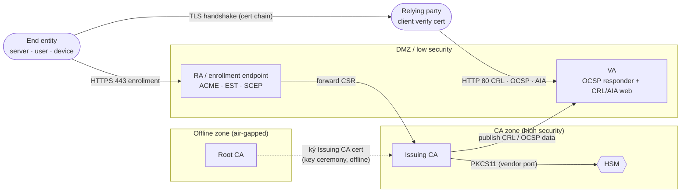
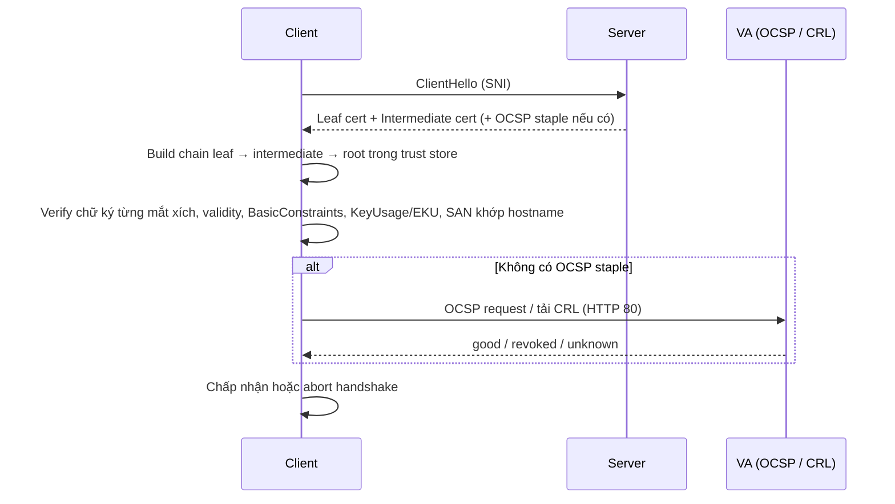

# PKI — Public Key Infrastructure

> [!info] Phạm vi version
> PKI là tập chuẩn chứ không phải 1 phần mềm, nên note bám theo **RFC 5280** (X.509 profile),
> **RFC 6960** (OCSP) và **CA/Browser Forum Baseline Requirements** tại ngày 2026-10-04 (bao gồm lịch rút
> ngắn validity của ballot SC-081v3). Phần hiện thực cụ thể bằng EJBCA xem [[EJBCA]].

## 1. What — Nó là cái gì?

> PKI là **"cơ quan cấp CCCD" cho máy móc**: CA là công an phường đóng dấu, certificate là cái thẻ, còn ai
> cầm thẻ tới thì người kia chỉ cần nhìn con dấu là biết thẻ thật hay giả — khỏi cần quen biết trước.

Nói chính xác: PKI là tập hợp người, chính sách, quy trình và hệ thống để tạo, phát hành, quản lý, phân phối và
thu hồi **certificate** — thứ gắn 1 public key với 1 danh tính (server, user, device, service), để hai bên lạ hoắc
vẫn xác thực được nhau và trao đổi dữ liệu mã hoá.

## 2. Why — Tại sao tồn tại / Vấn đề nó giải quyết?

Không có PKI thì còn 2 lựa chọn, cả 2 đều tệ:

- **Trust-on-first-use** kiểu SSH: lần đầu kết nối thì "tin đại", mỗi client tự nhớ fingerprint của từng
  server. Vài chục server còn được, hàng nghìn service là khum nổi — và lần đầu đó vẫn có thể bị MITM.
- **Shared secret trao tay**: mỗi cặp bên giữ 1 secret riêng. N service là cỡ N² secret phải phân phát và
  rotate — nghe thôi đã thấy căng đét.

PKI gỡ bài này bằng 1 bên thứ ba ai cũng tin (CA): client chỉ cần tin **1 root certificate** là tin được mọi
cert do CA đó (và CA con) ký. Thiếu PKI là mất luôn HTTPS đáng tin, mTLS service-to-service, ký code/document,
xác thực VPN/802.1x bằng cert.

## 3. When — Dùng khi nào / KHÔNG dùng khi nào?

**Dùng khi:**
- Cần xác thực máy/service giữa các bên không có trust sẵn: TLS server, mTLS giữa microservice, VPN client,
  802.1x, IoT device identity.
- Cần chữ ký số có non-repudiation: code signing, document signing, S/MIME.
- Số lượng định danh lớn đến mức password/shared secret không quản lý nổi.

**KHÔNG dùng / cân nhắc thay thế khi:**
- Chỉ xác thực **người dùng cuối** → OAuth2/OIDC + MFA rẻ và dễ vận hành hơn certificate-based auth.
- Service mesh đã tự cấp short-lived cert (Istio, Linkerd, SPIFFE/SPIRE) → PKI vẫn tồn tại nhưng nằm trong
  mesh, đừng build CA riêng song song.
- Không có ai vận hành (renew, revoke, theo dõi CRL) → một CA bị bỏ quên nguy hiểm hơn không có CA, vì nó tạo
  ảo giác an toàn và sẽ gây outage hàng loạt vào ngày cert/CRL hết hạn.
- Cần cert cho mTLS nhưng định dùng **public TLS cert** → không còn khả thi: các public CA đã ngừng cấp
  `clientAuth` EKU trong TLS cert (xem [[#Dùng public TLS cert cho mTLS]]). Dùng private PKI.

## 4. Where — Architecture & Deployment



Root CA không nối mạng — mũi tên nét đứt là thao tác thủ công vài năm 1 lần. Mọi traffic hàng ngày chỉ chạm
Issuing CA, RA và VA; client verify cert **cần tới VA qua HTTP 80**, đây là rule hay bị quên nhất.

- **Vị trí trong hệ thống:** lớp hạ tầng nền giống DNS — mọi TLS, mTLS, VPN, 802.1x, code signing đều phụ
  thuộc vào nó, và nó "vô hình" khi chạy đúng.
- **Component chính:**
  - **CA** — ký certificate. Phân tầng Root/Intermediate/Issuing → [[pki--ca-hierarchy-trust-chain]].
  - **RA** — xác minh danh tính trước khi CA ký; có thể gộp vào CA hoặc tách ra DMZ.
  - **VA** — trả lời "cert này còn hiệu lực không" qua CRL/OCSP → [[pki--revocation-crl-ocsp]].
  - **Repository** — nơi publish CA cert và CRL (HTTP, LDAP).
  - **HSM** — giữ private key của CA → [[pki--hsm-key-protection]].
- **Traffic/data flow:** entity sinh keypair → gửi CSR tới RA → RA verify → CA ký → cert trả về entity →
  entity trình cert khi handshake → relying party build chain + check revocation.
- **Dependency:**
  - **NTP** — cert có `notBefore`/`notAfter`, CRL có `nextUpdate`; lệch giờ vài phút là lỗi "not yet valid".
  - **Trust store** của client (OS, Java `cacerts`, browser, container image) — thiếu root là fail toàn bộ.
  - **VA reachable** — tuỳ client fail-open hay fail-closed khi không check được revocation.
  - **HSM** — mất HSM là CA không ký được, dù mọi thứ khác vẫn xanh.

### Mô hình triển khai

| Mô hình | Khi nào chọn | Số tầng CA | Không bảo vệ được |
|---|---|---|---|
| 1-tier (Root ký thẳng leaf) | Lab, PoC | 1 | Root key phải online → lộ là mất toàn bộ, không revoke được root |
| 2-tier (Root offline + Issuing) | Đa số PKI nội bộ | 2 | Issuing CA bị lộ → phải revoke + dựng lại Issuing, re-issue toàn bộ leaf |
| 3-tier (Root + Policy CA + Issuing) | Nhiều policy/đơn vị độc lập, yêu cầu compliance | 3 | Thêm 1 tầng phải vận hành (CRL, renew) — tầng giữa hay bị bỏ quên |

## 5. How — Cơ chế hoạt động

Core concepts cần nắm:

- **Asymmetric crypto** — giống **con dấu và mẫu dấu**: private key là con dấu (giữ kỹ), public key là mẫu dấu
  (phát cho ai cũng được để đối chiếu). Ký = hash nội dung rồi "đóng dấu" bằng private key; verify = dùng public
  key kiểm tra dấu đó khớp với hash tự tính. "CA ký cert" chính là CA đóng dấu lên toàn bộ nội dung cert. PKI
  không giải bài toán học, nó giải câu hỏi "mẫu dấu này của ai".
  - Thuật toán: **RSA** (2048 là tối thiểu, tương thích rộng nhất), **ECDSA** P-256/P-384 (cùng độ an toàn, key
    nhỏ và nhanh hơn), **EdDSA/Ed25519** (hiện đại nhưng HSM/hệ thống enterprise cũ hỗ trợ còn hạn chế — check
    trước). Post-quantum **ML-DSA, SLH-DSA** đã chuẩn hoá và có trong CA software (xem [[EJBCA]]), client hỗ trợ
    còn ít.
  - Đừng dùng **1 key cho nhiều mục đích** (TLS + code signing): lộ 1 chỗ là lộ hết. Trộn RSA/ECC trong 1 chain
    vẫn hợp lệ nhưng làm debug rối hơn.
  - Key sinh bằng RNG yếu là lỗ hổng kinh điển (bug OpenSSL của Debian năm 2008 làm key đoán được) — luôn dùng
    CSPRNG của hệ thống/thư viện crypto, khum tự chế.
- **X.509 certificate** — định dạng buộc public key với danh tính + extension giới hạn cách dùng.
  → [[pki--x509-certificate]]
- **CA hierarchy & chain of trust** — vì sao Root phải offline, chain được build ra sao.
  → [[pki--ca-hierarchy-trust-chain]]
- **Certificate lifecycle** — CSR → issue → renew/rekey → expire/revoke. → [[pki--certificate-lifecycle]]
- **Revocation** — CRL, OCSP, stapling, fail-open vs fail-closed. → [[pki--revocation-crl-ocsp]]
- **Enrollment protocols** — ACME, EST, SCEP, CMP: tự động hoá việc xin cert.
  → [[pki--enrollment-protocols]]
- **HSM & key protection** — bảo vệ private key CA, key ceremony. → [[pki--hsm-key-protection]]
- **CP/CPS** — kiểu **luật và nghị định hướng dẫn**: Certificate Policy (CP) nói *cái gì* được phép (ai được cert
  loại nào, validity bao lâu, key bao nhiêu bit, verify danh tính chặt tới đâu); Certification Practice Statement
  (CPS) nói CA *làm thế nào* để đúng CP (ai vận hành, RA verify ra sao, HSM loại gì, quy trình revoke, audit).
  - Mỗi CP có 1 **OID**, nhúng vào cert qua extension `certificatePolicies` → máy đọc được cert này cấp theo
    chính sách nào.
  - PKI nội bộ không cần CP/CPS dày như CA public, nhưng tối thiểu phải trả lời được: ai duyệt cấp cert, revoke
    khi nghi lộ key thế nào, ai được chạm vào HSM/key CA. Thiếu CPS là người cũ nghỉ thì không ai biết quy trình.
  - Mỗi Certificate Profile trên CA nên map 1-1 với 1 CP — không thì vài năm sau chả ai nhớ profile X sinh ra
    để làm gì.

**Chain validation khi client nhận 1 certificate:**



1. Server phải gửi **cả intermediate** — client chỉ có root trong trust store, thiếu intermediate là không
   build được chain (xem [[#Server không gửi intermediate cert]]).
2. Mỗi cert trong chain được check độc lập: còn hạn, chữ ký đúng, CA cert phải có `CA:TRUE`, leaf phải có EKU
   đúng mục đích.
3. Revocation check là bước duy nhất cần network ra ngoài — nên nó là bước hay fail nhất và cũng là bước
   client hay "bỏ qua cho êm" (fail-open).

### Ai thắng khi xung đột

Nguyên tắc chung: **chính sách phía CA thắng nội dung request; phía client, cấu hình của chính app thắng mặc
định của OS.**

| Bên A | Bên B | Kết quả | Im lặng hay báo lỗi? |
|---|---|---|---|
| CSR xin `CA:TRUE` / SAN / EKU tuỳ ý | Profile của CA không cho | CA bỏ qua hoặc ghi đè theo profile (cách cụ thể tuỳ CA software, vd [[ejbca--profiles-end-entities#Ai thắng khi xung đột]]) | Thường im lặng |
| Cert có cả `CN` và SAN `dNSName` | Client hiện đại match hostname | Chỉ SAN được dùng, `CN` bị bỏ qua | Im lặng — mismatch nếu SAN thiếu tên |
| OS trust store có root nội bộ | App dùng trust store riêng (Java `cacerts`, container image, Node `NODE_EXTRA_CA_CERTS`...) | App dùng trust store của nó → **không** tin root nội bộ | Lỗi `PKIX path building failed` / `unable to get local issuer` |
| CA cha có `nameConstraints` / `pathLen` | CA con hoặc leaf vi phạm | Client reject cả chain | Báo lỗi lúc verify |
| CRL nói cert bị revoke | OCSP nói `good` (VA chưa cập nhật) | Tuỳ client dùng nguồn nào — kết quả không nhất quán giữa các client | Im lặng |

## 6. Key Config — Cấu hình cần nhớ

| Config | Default | Khuyến nghị | Vì sao |
|---|---|---|---|
| Key algorithm/size | Tuỳ tool (OpenSSL 3: RSA 2048) | Leaf: RSA 2048 / ECDSA P-256. CA: RSA 4096 / ECDSA P-384 | CA sống 10-20 năm, key phải chịu được lâu hơn leaf |
| Signature hash | SHA-256 | SHA-256 trở lên | SHA-1 đã bị collision thực tế, client hiện đại reject |
| Validity — public TLS leaf | Theo CA | ≤ 200 ngày (từ 2026-03-15), ≤ 100 ngày (từ 2027-03-15), ≤ 47 ngày (từ 2029-03-15) | CA/B Forum SC-081v3; cert dài hơn sẽ bị public CA từ chối cấp |
| Validity — private leaf | Tự đặt | Ngắn nhất mà automation chịu được (vd 90 ngày) | Giảm blast radius khi key lộ, buộc phải có auto-renew |
| `basicConstraints` | Không có | Leaf: `CA:FALSE` (critical). CA: `CA:TRUE` + `pathLenConstraint` | Leaf có `CA:TRUE` = leaf tự ký được cert khác → phá toàn bộ trust |
| `keyUsage` / `extendedKeyUsage` | Không có | Chỉ đúng mục đích: `serverAuth`, `clientAuth`, `codeSigning`... | Thiếu/quá rộng → cert bị dùng sai mục đích, hoặc mTLS fail vì thiếu `clientAuth` |
| `subjectAltName` | Không có | Luôn có, chứa mọi hostname/IP | Client hiện đại bỏ qua `CN`, không có SAN = hostname mismatch |
| CRL Distribution Point / AIA URL | Không có | `http://` (không phải `https://`) | Tải CRL qua HTTPS cần verify cert của web server → cần CRL → vòng lặp |
| CRL validity (`nextUpdate`) | Tuỳ CA | Overlap đủ lớn để kịp publish lại khi sự cố | CRL quá hạn = client fail-closed hàng loạt |

## 7. Network — Port & Firewall Rules

Port ở đây là default của **giao thức**; port thực tế nằm trong URL ghi trên cert (CDP, AIA) và cấu hình CA.
Port riêng của EJBCA xem [[EJBCA#7. Network — Port & Firewall Rules]].

| Nguồn → Đích | Port/Proto | Mục đích | Default? | Triệu chứng khi bị chặn |
|---|---|---|---|---|
| Relying party → CRL/AIA web | `80/tcp` | Tải CRL (CDP) và CA cert (AIA caIssuers) | Theo URL trong cert | Windows: `CRYPT_E_REVOCATION_OFFLINE` (0x80092013); client strict revocation reject handshake; client fail-open thì **không thấy gì** |
| Relying party / TLS server → OCSP | `80/tcp` | OCSP request (RFC 6960) và OCSP stapling | Theo URL OCSP trong AIA | nginx stapling log `OCSP responder timed out`; handshake chậm thêm vài giây do client chờ timeout |
| End entity → ACME server | `443/tcp` | ACME (RFC 8555) | có | Renewal job fail âm thầm → **outage vài tuần sau** khi cert hết hạn |
| ACME server → End entity | `80/tcp` | `http-01` challenge | có | Let's Encrypt: `Timeout during connect (likely firewall problem)` |
| Device → EST server | `443/tcp` | EST (RFC 7030), mTLS | có | Device không re-enroll được, `/.well-known/est` timeout |
| Device → SCEP server | `80/tcp` hoặc `443/tcp` | SCEP (RFC 8894), hay dùng cho MDM/network device | Theo URL cấu hình | MDM báo enrollment fail; router/AP không lấy được cert 802.1x |
| CA / Publisher → LDAP/AD | `389/tcp`, `636/tcp` | Publish CRL/cert lên directory (CDP dạng `ldap://`) | có | Client domain-joined fail revocation với CDP `ldap://` |
| CA → HSM | Vendor (Luna `1792/tcp`, nShield `9004/tcp`, Utimaco `288/tcp`) | PKCS#11 tới network HSM | Theo vendor | CA không ký được cert/CRL; xem [[pki--hsm-key-protection]] |
| Mọi node → NTP | `123/udp` | Đồng bộ giờ | có | Không lỗi ngay; về sau `certificate is not yet valid`, OCSP response bị reject vì lệch `thisUpdate` |

^ports

**Kiểm tra nhanh khi nghi rule bị xoá:**

```bash
# CRL / OCSP endpoint (lấy URL từ cert): timeout = firewall drop, refused = service không listen
openssl x509 -in leaf.pem -noout -ext crlDistributionPoints,authorityInfoAccess
curl -sS -o /dev/null -w '%{http_code} %{time_total}s\n' http://<crl-host>/<path>.crl
# OCSP check thực tế
openssl ocsp -issuer intermediate.pem -cert leaf.pem -url http://<ocsp-host>/<path> -resp_text
# TLS server có gửi đủ chain không
openssl s_client -connect <host>:443 -servername <fqdn> -showcerts </dev/null
# NTP là UDP: nc không kiểm tra tin cậy được, hỏi trực tiếp time source
chronyc sources -v
```

> [!tip] Timeout vs refused
> `Connection timed out` gần như luôn là firewall/security group drop packet. `Connection refused` là mạng đã
> thông nhưng không có process listen. Phân biệt được là biết nên gọi network team hay tự xem lại service.

## 8. Security Considerations

### Attack surface

- **Private key của CA** — tài sản quan trọng nhất; lộ key = attacker mint được cert giả cho bất kỳ ai.
- **RA / enrollment endpoint** — nơi xin cert; kiểm soát lỏng = xin được cert cho danh tính người khác.
- **Trust store của client** — ai thêm được root vào trust store là MITM được mọi kết nối của client đó.
- **Admin interface của CA** — chiếm được là cấp/revoke tuỳ ý.

### Misconfiguration gây breach

| Misconfiguration | Hậu quả |
|---|---|
| Root CA online 24/7 | Root key lộ → phải thay trust anchor trên **mọi** client |
| Leaf có `CA:TRUE` hoặc CA thiếu `pathLenConstraint` | Holder của cert tự tạo sub-CA ngoài kiểm soát |
| RA/profile cho requester tự đặt SAN tuỳ ý | Xin được cert hợp lệ cho domain/service không thuộc mình |
| Client tắt revocation check / fail-open | Cert đã revoke vì lộ key vẫn được chấp nhận |
| Private key CA trong file trên disk, backup cùng password | Ai đọc được backup là có CA key |

### Hardening checklist tối thiểu

- [ ] Root CA offline/air-gapped, chỉ bật khi ký Issuing CA hoặc CRL của root — giảm tối đa cửa sổ lộ key.
- [ ] Private key CA nằm trong HSM, non-exportable — key không bao giờ xuất hiện dạng plaintext.
- [ ] Profile giới hạn SAN/EKU/validity theo CP; requester không override được — chặn cert giả danh.
- [ ] `pathLenConstraint` và (nếu được) Name Constraints trên Issuing CA — giới hạn blast radius.
- [ ] Quy trình revoke khẩn cấp đã diễn tập — lần đầu revoke không nên là lúc sự cố thật.
- [ ] Audit log issue/revoke đẩy ra SIEM ngoài CA — attacker chiếm CA không xoá được dấu vết.

## 9. Ops Runbook — Production Notes

> [!tip] Checklist hằng ngày & triage sự cố
> Phần này giải thích *vì sao*. Làm gì mỗi ngày và xử lý sự cố theo triệu chứng: [[PKI--Runbook]].

- **Health check:** CA còn ký được (issue thử 1 cert test), OCSP trả `good` cho cert test, CRL mới nhất có
  `nextUpdate` còn xa: `openssl crl -in <file>.crl -noout -nextupdate`.
- **Log quan trọng:** log issue/revoke (ai, khi nào, cho ai), log enrollment endpoint, log truy cập HSM.
- **Metric cần alert:**
  - Cert của **CA** và của chính **hạ tầng PKI** (OCSP signer, TLS của admin web) sắp hết hạn — 90/60/30 ngày.
  - CRL còn < 50% thời gian tới `nextUpdate` mà chưa có bản mới.
  - Số cert revoke/ngày tăng bất thường — dấu hiệu sự cố hoặc lạm dụng.
  - OCSP latency/error rate, HSM connectivity.
- **Monitoring độc lập:** expiry scanner quét cert từ bên ngoài (không phụ thuộc CA còn sống) — CA chết thì nó
  không tự báo được.
- **Rollover CA:** renew Issuing CA trước khi hết hạn ít nhất bằng validity tối đa của leaf nó cấp, vì CA không
  được cấp leaf sống lâu hơn chính nó.
- Vận hành cụ thể trên EJBCA: [[EJBCA#9. Ops Runbook — Production Notes]].

## 10. Gotchas & Lessons Learned

### Hay nhầm lẫn

| Dễ nhầm | Thực tế | Hậu quả khi nhầm |
|---|---|---|
| `CN` vs `SAN` | Client hiện đại chỉ match hostname với SAN, bỏ qua CN | Cert "đúng tên" vẫn bị hostname mismatch |
| Renew vs rekey | Renew có thể giữ key cũ; rekey sinh key mới | Tưởng đã rotate key sau sự cố lộ key nhưng thực ra chỉ renew |
| Expire vs revoke | Expire là hết hạn tự nhiên; revoke là thu hồi trước hạn và chỉ có tác dụng nếu client check | Revoke xong tưởng an toàn, nhưng client fail-open vẫn chấp nhận |
| OS trust store vs Java `cacerts` / container trust store | Mỗi runtime có trust store riêng | `curl` chạy được, app Java/container báo `PKIX path building failed` |
| PKCS#10 vs PKCS#12 | #10 là CSR (không có private key); #12 là bundle cert + private key có password | Gửi nhầm file .p12 cho người khác = gửi luôn private key |
| CP vs CPS | CP: quy định cái gì; CPS: CA làm thế nào | Audit hỏi CPS mà chỉ có CP, hoặc ngược lại |

### Bẫy vận hành

#### Server không gửi intermediate cert

- **Triệu chứng:** browser vào được, nhưng `curl`, Java, mobile app báo `unable to get local issuer certificate`.
- **Nguyên nhân:** server chỉ cấu hình leaf. Browser che lỗi nhờ cache intermediate hoặc tự tải qua AIA; các
  client khác không làm vậy.
- **Cách tránh / xử lý:** cấu hình full chain (leaf + intermediate, **không** kèm root); test bằng
  `openssl s_client -showcerts`, đừng test bằng browser.
- **Nguồn:** [RFC 5280 §4.2.2.1 — Authority Information Access](https://datatracker.ietf.org/doc/html/rfc5280#section-4.2.2.1)

#### Root/intermediate hết hạn trong khi leaf còn hạn

- **Triệu chứng:** hàng loạt client cũ đồng loạt lỗi cùng 1 thời điểm dù leaf cert còn hạn.
- **Nguyên nhân:** chain validation check hạn **từng** cert. Sự cố điển hình: root `DST Root CA X3` của Let's
  Encrypt hết hạn 2021-09-30 làm vỡ client cũ không có root mới.
- **Cách tránh / xử lý:** theo dõi expiry của **mọi** cert trong chain; phát hành root/intermediate mới và
  phân phối vào trust store từ rất sớm (năm, không phải tháng).
- **Nguồn:** [Let's Encrypt — DST Root CA X3 Expiration](https://letsencrypt.org/docs/dst-root-ca-x3-expiration-september-2021/)

#### CRL quá hạn làm client fail-closed hàng loạt

- **Triệu chứng:** VPN/802.1x/mTLS đột ngột từ chối mọi cert; log báo revocation status unknown/offline.
- **Nguyên nhân:** CRL đã qua `nextUpdate` mà chưa có bản mới (job sinh CRL chết, publish fail, rule HTTP 80
  tới CDP bị xoá).
- **Cách tránh / xử lý:** alert theo `nextUpdate` của CRL **ở phía phân phối** (tải về từ URL thật mà client
  dùng), không chỉ ở phía CA.
- **Nguồn:** [RFC 5280 §5.1.2.5 — nextUpdate](https://datatracker.ietf.org/doc/html/rfc5280#section-5.1.2.5)

#### Dùng public TLS cert cho mTLS

- **Triệu chứng:** sau khi renew từ public CA, mTLS giữa 2 hệ thống fail vì cert mới thiếu `clientAuth`.
- **Nguyên nhân:** Chrome Root Program yêu cầu hierarchy chỉ dành cho `serverAuth`; Let's Encrypt, Sectigo và
  các public CA khác đã bỏ `clientAuth` EKU khỏi TLS cert trong năm 2026.
- **Cách tránh / xử lý:** cert dùng cho client authentication cấp từ private PKI (vd [[EJBCA]]).
- **Nguồn:** [The SSL Store — Chrome clientAuth change](https://www.thesslstore.com/blog/chrome-ssl-certificate-client-authentication-ends-june-2026/)

#### Validity public TLS rút ngắn theo lịch SC-081v3

- **Triệu chứng:** quy trình renew thủ công hàng năm đột nhiên không đủ, cert hết hạn giữa chu kỳ.
- **Nguyên nhân:** max validity: 200 ngày từ 2026-03-15, 100 ngày từ 2027-03-15, 47 ngày từ 2029-03-15.
- **Cách tránh / xử lý:** chuyển sang ACME/automation ngay (xem [[pki--enrollment-protocols]]).
- **Nguồn:** [CA/B Forum SC-081v3 timeline](https://fixmycert.com/guides/47-day-certificate-timeline)

### Lesson learned thực tế

> [!todo] Bổ sung khi có sự cố hoặc kinh nghiệm thực tế
> Format: `YYYY-MM-DD — <chuyện gì xảy ra> — <impact> — <root cause> — <bài học>` + link `[[incident note]]` nếu có.

## 11. Resources

- **RFC 5280** — X.509 certificate & CRL profile: https://datatracker.ietf.org/doc/html/rfc5280
- **RFC 6960** — OCSP: https://datatracker.ietf.org/doc/html/rfc6960
- **CA/B Forum Baseline Requirements**: https://cabforum.org/working-groups/server/baseline-requirements/
- **Bài viết thực tế:** [Let's Encrypt — DST Root CA X3 Expiration](https://letsencrypt.org/docs/dst-root-ca-x3-expiration-september-2021/)
  — case study về root hết hạn làm vỡ client cũ.
- **Note liên quan:** [[EJBCA]] — phần mềm CA hiện thực toàn bộ khái niệm trong note này.

---

## Glossary

| Term | Nghĩa ngắn gọn |
|---|---|
| **CA** (Certificate Authority) | Bên ký và phát hành certificate |
| **RA** (Registration Authority) | Bên xác minh danh tính trước khi CA ký |
| **VA** (Validation Authority) | Trả lời trạng thái revocation (OCSP responder, CRL) |
| **Root CA** | CA gốc, self-signed, là trust anchor → [[pki--ca-hierarchy-trust-chain]] |
| **Intermediate / Issuing CA** | CA con do Root ký, cấp cert hàng ngày |
| **Trust anchor / trust store** | Cert được client tin sẵn / nơi chứa chúng |
| **CSR** (PKCS#10) | Yêu cầu cấp cert: public key + danh tính, ký bằng private key → [[pki--certificate-lifecycle]] |
| **PKCS#12** (.p12/.pfx) | Bundle cert + private key có password |
| **X.509** | Chuẩn định dạng certificate → [[pki--x509-certificate]] |
| **SAN** | Danh sách DNS/IP/email mà cert đại diện |
| **KeyUsage / EKU** | Giới hạn mục đích dùng key |
| **CRL / Delta CRL** | Danh sách cert bị thu hồi / phần thay đổi từ CRL đầy đủ gần nhất → [[pki--revocation-crl-ocsp]] |
| **OCSP / OCSP stapling** | Hỏi trạng thái 1 cert real-time / server đính kèm sẵn OCSP response vào handshake |
| **CDP / AIA** | Extension chứa URL tải CRL / URL tải CA cert và OCSP |
| **HSM** | Thiết bị phần cứng giữ private key, không cho export → [[pki--hsm-key-protection]] |
| **ACME / EST / SCEP / CMP** | Giao thức tự động hoá enrollment → [[pki--enrollment-protocols]] |
| **CP / CPS** | Certificate Policy / Certification Practice Statement |
| **End Entity** | Chủ thể cuối được cấp cert — thuật ngữ EJBCA hay dùng |
