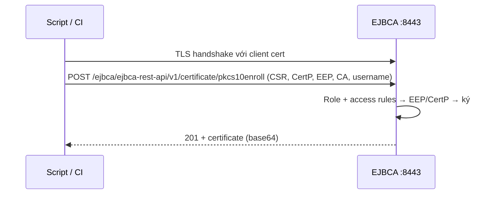

# EJBCA — API, Protocols & Endpoints

## What it does

Tổng hợp mọi cửa vào EJBCA để tự động hoá: REST API, các giao thức enrollment chuẩn (ACME, EST, SCEP, CMP) và CLI
local — kèm URL và port để debug/viết firewall rule.

## Why it exists

Mỗi loại client nói 1 giao thức khác nhau (cert-manager nói ACME, Intune nói SCEP, device công nghiệp nói CMP/EST,
script nội bộ gọi REST). EJBCA hỗ trợ tất cả để PKI team không phải viết adapter riêng.

## How it works

| Endpoint | URL (path) | Port | Xác thực |
|---|---|---|---|
| Admin Web | `/ejbca/adminweb/` | `8443` | Client cert / OAuth |
| RA Web | `/ejbca/ra/` | `8443` (hoặc `8442` cho phần public) | Client cert / OAuth / enrollment code |
| REST API | `/ejbca/ejbca-rest-api/v1/...` (`certificate`, `ca`, `ca_management`, `approval`, `acme`...) | `8443` | Client cert / OAuth |
| ACME | `/ejbca/acme/directory` (alias: `/ejbca/acme/<alias>/directory`) | `8442` | ACME challenge / EAB |
| EST | `/.well-known/est/<alias>/...` | `8443` / `8442` | TLS client cert hoặc username/password |
| SCEP | `/ejbca/publicweb/apply/scep/<alias>/pkiclient.exe` | `8080` | Challenge password |
| CMP | `/ejbca/publicweb/cmp/<alias>` | `8080` | Chữ ký/MAC trên message |
| OCSP | `/ejbca/publicweb/status/ocsp` | `8080` | Không |
| Healthcheck | `/ejbca/publicweb/healthcheck/ejbcahealth` | `8080` | IP trong `healthcheck.authorizedips` |
| CLI | `bin/ejbca.sh <category> <command>` | Local trên node | CLI user (xem [[ejbca--rbac-admin-roles]]) |

> [!todo] Cần xác nhận
> Đường dẫn chính xác của ACME/EST/CMP khi dùng alias, và port EST theo cấu hình thực tế — kiểm tra trong
> *System Configuration → Protocol Configuration* và trang cấu hình alias của từng giao thức.



1. Mọi protocol **bật/tắt** ở *System Configuration → Protocol Configuration*. REST Certificate Management mặc
   định **tắt**.
2. ACME/EST/SCEP/CMP cấu hình theo **alias**: mỗi alias trỏ tới 1 CA + EEP + CertP + cách xác thực riêng →
   giới hạn mỗi kiểu client vào đúng profile của nó.
3. REST trả lỗi quyền (403) khi role thiếu access rule cho CA/EEP được chỉ định, dù TLS đã thành công.

Lệnh CLI hay dùng:

```bash
bin/ejbca.sh ca listcas                 # liệt kê CA
bin/ejbca.sh ca activateca <CA name>    # activate crypto token của CA (nhập PIN)
bin/ejbca.sh ra findendentity <username>
bin/ejbca.sh ca createcrl <CA name>     # sinh CRL ngay, không chờ service
```

> [!todo] Cần xác nhận
> Tên subcommand CLI chính xác ở 9.7 — chạy `bin/ejbca.sh <category>` không tham số để xem danh sách.

## Config gotchas

| Config | Default | Khuyến nghị | Vì sao |
|---|---|---|---|
| Protocol Configuration | Nhiều protocol tắt (REST tắt) | Chỉ bật protocol đang dùng | Mỗi protocol bật là 1 attack surface |
| SCEP/CMP alias dùng RA mode với shared secret | Tuỳ alias | Secret mạnh, rotate; giới hạn EEP/CertP | Secret lộ = ai cũng xin được cert theo profile của alias |
| ACME alias | — | Bật EAB nếu không muốn mọi host tự xin cert; cấu hình CAA (từ v9.6) nếu dùng domain public | ACME mở = bất kỳ ai chứng minh được domain là xin được |

## Hay nhầm lẫn

| Dễ nhầm | Thực tế | Hậu quả khi nhầm |
|---|---|---|
| REST API gọi port 8442 | REST cần client cert → port 8443 | Lỗi TLS/403 mơ hồ |
| ACME default alias vs alias riêng | Mỗi alias có directory URL riêng | Client trỏ nhầm alias → nhận cert theo profile khác |

## Network

Port và triệu chứng khi bị chặn: [[EJBCA#7. Network — Port & Firewall Rules]].

## Security notes

- Credential REST (client cert của script/CI) cấp từ profile riêng, role chỉ có quyền đúng CA/EEP cần.
- Chỉ public ra ngoài những endpoint cần thiết qua reverse proxy (thường OCSP/CRL, ACME).
- Endpoint tự động (REST/protocol) là cổng cấp cert **không có người duyệt từng request** — EEP/CertP phải đủ
  chặt vì đó là lớp phòng thủ chính; log đầy đủ mọi request để còn điều tra.

## Refs

- [[EJBCA]] — note gốc.
- [[pki--enrollment-protocols]] — so sánh ACME/EST/SCEP/CMP.
- [EJBCA REST Interface](https://docs.keyfactor.com/ejbca/latest/ejbca-rest-interface) · [EJBCA CLI](https://docs.keyfactor.com/ejbca/latest/command-line-interfaces)
