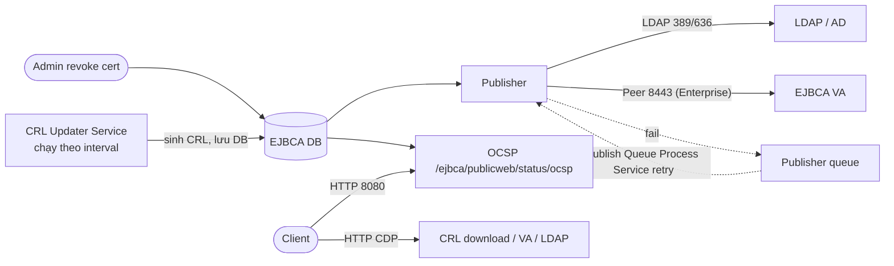

# EJBCA — CRL, OCSP, Services & Publishers

## What it does

- **CRL Updater Service** — job nền kiểm tra các CA và sinh CRL mới khi cần, **lưu vào DB**.
- **Publisher** — đẩy cert/CRL ra hệ thống ngoài: LDAP/AD, EJBCA VA (Enterprise), custom. Publish fail vào
  **publisher queue**, được *Publish Queue Process Service* thử lại.
- **OCSP responder** — tích hợp sẵn trong mọi node EJBCA tại `/ejbca/publicweb/status/ocsp`; response ký bằng
  key của CA hoặc bằng **OcspKeyBinding** (signer riêng).

## Why it exists

CA biết cert nào bị revoke, nhưng client chỉ biết qua CRL ở CDP hoặc qua OCSP. Ba thành phần trên là đường đi
của thông tin revoke từ DB của CA tới client — đứt ở đâu thì client nhận thông tin cũ ở đó.

## How it works

1. **CRL timing** (cấu hình trên CA): *CRL Expire Period* (bắt buộc — `nextUpdate` = thời điểm issue + period),
   *CRL Issue Interval* (default `0` = chỉ phát khi bản cũ sắp hết hạn), *CRL Overlap Time* (default `10 min`).
   Ví dụ default: expire 24h → CRL mới phát ở mốc 23h50m.
2. CRL Updater Service nên chạy **không ngắn hơn 10 phút** để tránh nhiều lần sinh CRL chạy song song khi CA lớn.
3. **OCSP signer:** CA tự ký response được nếu CA cert có KeyUsage `digitalSignature` (profile CA mặc định có).
   Dùng OcspKeyBinding để tách signer khỏi key CA và cấu hình extension/`nextUpdate` của response.
4. `ocsp.untilNextUpdate` (hoặc trong OcspKeyBinding) đặt `nextUpdate` cho OCSP response → client/proxy cache được,
   giảm tải responder.

## Config gotchas

| Config | Default | Khuyến nghị | Vì sao |
|---|---|---|---|
| *CRL Issue Interval* | `0` | Nhỏ hơn nhiều so với *Expire Period* (vd expire 24h, issue mỗi vài giờ) | Có thời gian sửa sự cố trước khi CRL đang lưu hành hết hạn |
| *CRL Overlap Time* | `10 min` | Đủ lớn để mọi cache/publisher kịp nhận bản mới | 10 phút quá ngắn khi publish qua nhiều tầng |
| CRL Updater Service | Không tự có | Tạo, chọn đúng CA, interval ≥ 10 phút | Không có service = không có CRL mới |
| Delta CRL (*Delta CRL Period*) | `0` (tắt) | Bật khi CRL lớn | CRL nhiều MB làm client tải chậm |
| OCSP `untilNextUpdate` | Cần xác nhận | Đặt giá trị > 0 khi có cache/proxy phía trước | Response không có `nextUpdate` không cache được, mọi request đổ vào responder |

> [!todo] Cần xác nhận
> Giá trị default của `ocsp.untilNextUpdate` ở 9.7.

## Hay nhầm lẫn

| Dễ nhầm | Thực tế | Hậu quả khi nhầm |
|---|---|---|
| CRL Updater Service "publish" CRL | Service chỉ lưu DB; publish là việc của Publisher hoặc client tải trực tiếp từ EJBCA | CDP trỏ LDAP/VA mà không có publisher → CRL ở đó không bao giờ mới |
| Publish fail = revoke fail | Revoke vẫn thành công trong DB; chỉ bản publish nằm trong queue | Client đọc CRL/VA vẫn thấy cert chưa revoke |
| *Publish Queue Process Service* có sẵn | Phải tạo service | Queue tăng mãi, không ai retry |

## Ops notes

- Alert: số item trong publisher queue, thời gian còn lại tới `nextUpdate` của CRL đo tại CDP.
- Kiểm tra OCSP: `openssl ocsp -issuer ca.pem -cert leaf.pem -url http://<host>:8080/ejbca/publicweb/status/ocsp -resp_text`.
- Healthcheck có thể check OCSP qua query parameter `ocsp` / `ocspDetailed`.
- Sau mỗi lần upgrade hoặc đổi cấu hình lớn: vào *Services* kiểm tra các service (CRL Updater, Publish Queue
  Process, notification) vẫn **Active** — service bị disable mà không ai để ý là CRL hết hạn vài ngày sau.
- Muốn cảnh báo cert sắp hết hạn qua email: tạo thêm service gửi notification theo ngưỡng ngày (cần SMTP, xem
  [[EJBCA#7. Network — Port & Firewall Rules]]).
- VA tách node: dữ liệu trên VA chỉ mới bằng lần publish gần nhất — publisher lỗi là VA trả `good` cho cert đã
  revoke trên CA.

## Security notes

- OcspKeyBinding tách key ký OCSP khỏi key CA — node VA ở DMZ không cần giữ key CA.
- Custom Publisher (plugin tự viết) chạy code ngay trong tiến trình EJBCA, quyền ngang EJBCA — review kỹ như
  review code chạy trên CA.
- Revoke khẩn cấp vì lộ key: sau khi revoke, **sinh CRL ngay** (không chờ interval) và kiểm tra nó đã tới CDP.

## Refs

- [[EJBCA]] — note gốc.
- [[pki--revocation-crl-ocsp]] — lý thuyết CRL/OCSP, fail-open/closed.
- [EJBCA — CRL Updater Service](https://docs.keyfactor.com/ejbca/latest/crl-updater-service) · [EJBCA — OCSP](https://docs.keyfactor.com/ejbca/latest/ocsp)
