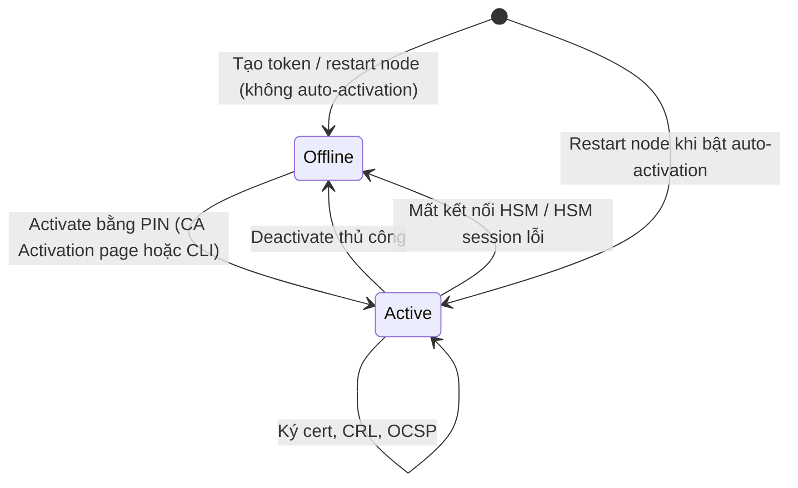

# EJBCA — Crypto Tokens

## What it does

> Crypto token là **cái két** chứa con dấu của CA. CA là người đóng dấu, nhưng con dấu nằm trong két nào —
> ngăn kéo có khoá số (soft) hay két ngân hàng (HSM) — là chuyện của crypto token.

Mỗi CA trỏ tới 1 crypto token + các key alias trong đó. Crypto token cũng giữ key cho internal key binding (OCSP
signer, peer authenticator). Két mà đóng (*Offline*) thì CA vẫn "sống" trên UI nhưng không ký được gì cả.

## Why it exists

Tách "CA là gì" (DN, profile, CRL settings) khỏi "key nằm đâu" để cùng 1 logic CA chạy được với soft keystore lúc
lab và HSM lúc production, và để key có vòng đời riêng (activate, deactivate, rekey) — đổi két mà không phải
dựng lại cả CA.

## How it works

1. Key trong token được gọi bằng **alias**. Quy ước hay dùng: `signKey` (ký cert/CRL), `defaultKey` (mã hoá),
   `testKey` (key test cho healthcheck ký thử).
2. CA chỉ ký được khi token **Active**. Token offline thì mọi request ký fail với `CryptoTokenOfflineException`
   trong server log — UI không báo đỏ rực gì đâu, phải tự đi xem.
3. Trong cluster, trạng thái activate là **theo từng node**. Activate ở node 1 khum có nghĩa node 2 cũng active.
4. **Auto-activation** = lưu PIN (đã mã hoá) trong DB để token luôn active. Với PKCS#11, nó còn tự khởi tạo lại
   library nếu bị de-initialize — đỡ hẳn mấy vụ network HSM chập chờn.

### Các lựa chọn — Loại crypto token

| Lựa chọn | Là gì | Khi nào dùng | Bẫy |
|---|---|---|---|
| **PKCS#11 (HSM)** *(Enterprise từ CE 9.6)* | Key nằm trong HSM vật lý/network, EJBCA gọi qua library của vendor (Luna, nShield, Utimaco, Securosys, AWS CloudHSM, Azure Managed HSM, SoftHSM...). Enterprise có thêm *PKCS#11 NG* | Issuing/Root CA production | Library phải có và giống nhau trên mọi node; lệch version firmware ↔ library là lỗi khó debug |
| **Azure Key Vault** *(Enterprise)* | Key nằm trong Azure Key Vault / Managed HSM, gọi qua REST | Chạy trên Azure, muốn managed key | Phụ thuộc network + identity tới Azure; latency mỗi lần ký |
| **AWS KMS** *(Enterprise)* | Key nằm trong AWS KMS, gọi qua REST | Chạy trên AWS | Như trên; KMS là managed service, không phải dedicated HSM |
| **Fortanix DSM / Securosys Primus** *(Enterprise)* | Tích hợp riêng cho các HSM-as-a-service này | Đã dùng sẵn các dịch vụ đó | Tính năng phụ thuộc vendor |
| **Soft** | Keystore PKCS#12 lưu **ngay trong database**, bọc bằng PIN | Lab, test, ManagementCA nhỏ — hoặc CE 9.6+ (không còn lựa chọn khác) | Ai có backup DB + PIN là có key CA. Red flag cho Issuing CA production |

Danh sách HSM chi tiết và hướng dẫn từng vendor xem docs Keyfactor (link ở Refs). Lý thuyết HSM, cloud HSM vs
cloud KMS, FIPS level: [[pki--hsm-key-protection]].

## Config gotchas

| Config | Default | Khuyến nghị | Vì sao |
|---|---|---|---|
| Loại token cho Issuing CA production | Soft (cài nhanh) | PKCS#11 / cloud HSM (Enterprise) | Soft token = key CA nằm trong DB, đi theo mọi bản backup DB |
| Auto-activation | Tắt | Cân nhắc: bật thì restart không cần người nhập PIN, đổi lại PIN nằm cạnh hệ thống | Tắt: restart xong CA offline tới khi có người activate. Bật: ai có DB + config là activate được |
| Đường dẫn thư viện PKCS#11 | — | Khai báo đúng và **giống nhau trên mọi node** (`cryptotoken.p11.lib.*` trong `conf/web.properties` khi cài thủ công) | Node thiếu library → token offline chỉ trên node đó, lỗi lúc có lúc không qua LB — ảo thật sự |
| Key cho healthcheck | — | Có key `testKey` + bật `healthcheck.catokensigntest` | Healthcheck mặc định chỉ check "connected", không phát hiện HSM từ chối ký |

## Hay nhầm lẫn

| Dễ nhầm | Thực tế | Hậu quả khi nhầm |
|---|---|---|
| CA "Active" vs Crypto token "Active" | Hai trạng thái riêng; CA cần cả hai | CA hiện Active mà token offline → không ký được |
| Activate trên 1 node = cả cluster | Activate theo node | Request rơi vào node khác fail |
| Cloud KMS = HSM riêng | KMS là dịch vụ multi-tenant (bên dưới vẫn là HSM của provider); CloudHSM/Managed HSM mới là HSM dành riêng | Báo compliance sai loại thiết bị/FIPS level |

## Ops notes

- Sau **mọi** lần restart node: vào *CA Activation* kiểm tra — đây là nguyên nhân số 1 của "sao không cấp cert
  được".
- Healthcheck báo `CA Token is disconnected` là tín hiệu rõ nhất; grep `CryptoTokenOfflineException` trong server log.

## Network

Port HSM xem [[pki--hsm-key-protection#Network]] và [[EJBCA#7. Network — Port & Firewall Rules]]. Cloud token
(Azure Key Vault, AWS KMS) cần outbound HTTPS `443/tcp` tới endpoint của provider.

## Security notes

- Soft token: DB backup + PIN = key CA. Lưu PIN tách khỏi backup, giới hạn người đọc backup.
- Đừng dùng chung 1 crypto token cho nhiều CA khác mục đích — lộ PIN 1 token là lộ nhiều CA.

## Refs

- [[EJBCA]] — note gốc.
- [[pki--hsm-key-protection]] — lý thuyết HSM, key ceremony, FIPS.
- [EJBCA — Crypto Tokens Overview](https://docs.keyfactor.com/ejbca/latest/crypto-tokens-overview)
- [EJBCA — Hardware Security Modules (danh sách HSM hỗ trợ)](https://docs.keyfactor.com/ejbca/9.3.2/hardware-security-modules-hsm)
- [Keyfactor/ejbca-ce releases — CE 9.6 HSM note](https://github.com/Keyfactor/ejbca-ce/releases)
