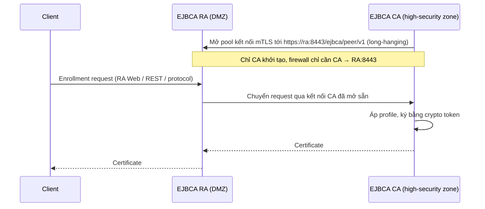

# EJBCA — Peer Systems (RA / VA tách rời) — Enterprise

## What it does

Peer Systems (chỉ Enterprise) nối 1 EJBCA CA với các EJBCA instance khác đóng vai **RA** (nhận enrollment) hoặc
**VA** (OCSP/CRL). CA giữ 1 pool kết nối HTTPS mTLS tới từng peer, dùng cho cả chiều CA → peer lẫn chiều peer
gửi request lên CA.

## Why it exists

RA/VA phải tiếp xúc client (DMZ, có khi Internet); CA giữ key phải ở zone an toàn nhất. Peer Systems cho phép
**không có kết nối nào đi vào CA**: firewall giữa 2 zone chỉ cho outbound từ CA, RA vẫn chuyển request lên CA
đồng bộ được nhờ kết nối mà CA đã mở sẵn.

## How it works

1. CA xác thực tới peer bằng **Remote Authenticator**: client TLS cert + key nằm trong crypto token của CA.
2. Trên RA/VA, cert đó phải là member của 1 role có quyền peer tương ứng; RA xác thực ngược về CA bằng server TLS
   cert của nó.
3. Outgoing connection bật mặc định, admin có quyền `/peer/modify` tắt được.

## Config gotchas

| Config | Default | Khuyến nghị | Vì sao |
|---|---|---|---|
| Chiều firewall | — | CA → RA/VA `8443/tcp`; **không** mở RA → CA | Mở ngược vô ích và phá mô hình bảo mật |
| Cert của Remote Authenticator | Theo profile cấp | Đưa vào alert expiry | Hết hạn → mọi peer đứt cùng lúc, RA ngừng cấp cert |
| Role cho CA trên RA/VA | Phải tự cấu hình | Chỉ cấp quyền peer cần thiết | Role rộng → ai có cert đó điều khiển được RA |

## Hay nhầm lẫn

| Dễ nhầm | Thực tế | Hậu quả khi nhầm |
|---|---|---|
| RA gọi lên CA | CA mở kết nối xuống RA, RA "trả lời" qua kết nối đó | Firewall request sai chiều, debug sai phía |
| RA Web trên node CA vs RA node riêng | Node CA cũng có `/ejbca/ra/`; RA node riêng mới là mô hình tách zone | Tưởng đã tách RA nhưng client vẫn chạm thẳng node CA |

## Ops notes

- Trạng thái kết nối xem ở *Peer Systems* trên CA. Debug bắt đầu **từ CA node**: `nc -vz <ra> 8443`, rồi
  `openssl s_client -connect <ra>:8443 -cert <authenticator>.pem -key <...>`.
- Firewall stateful có idle timeout có thể cắt kết nối long-hanging — nếu peer đứt định kỳ theo chu kỳ cố định,
  nghi ngờ idle timeout trước.

## Network

| Nguồn → Đích | Port/Proto | Mục đích | Default? | Triệu chứng khi bị chặn |
|---|---|---|---|---|
| CA → RA node | `8443/tcp` | Peer connector, mTLS | URL trong Peer Connector | RA không thấy CA/profile, enrollment trên RA fail |
| CA → VA node | `8443/tcp` | Publish cert/CRL, quản lý OcspKeyBinding từ xa | URL trong Peer Connector | VA trả trạng thái cũ: cert mới revoke vẫn `good` |
| Client → RA node | `8442/tcp`, `8443/tcp` | Enrollment | `httpserver.*` | Client không enroll được (CA vẫn khoẻ) |
| Client → VA node | `8080/tcp` | OCSP / CRL | `httpserver.pubhttp` | Client revocation offline |

## Security notes

- RA/VA bị chiếm vẫn không chạm được key CA, nhưng gửi được request trong phạm vi role của nó — giới hạn
  profile/CA mà RA được dùng.
- Tắt outgoing connection là "công tắc khẩn cấp" cắt mọi RA/VA khỏi CA khi nghi RA bị xâm nhập.

## Refs

- [[EJBCA]] — note gốc.
- [EJBCA — Peer Systems](https://docs.keyfactor.com/ejbca/latest/peer-systems) · [Peer Systems Operations](https://docs.keyfactor.com/ejbca/latest/peer-systems-operations)
- [Segmenting the PKI using EJBCA Peer](https://docs.keyfactor.com/solution-areas/latest/segmenting-the-pki-using-ejbca-peer)
