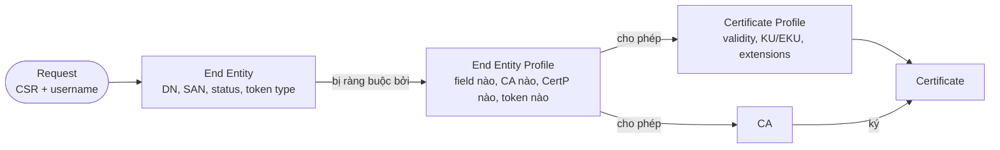
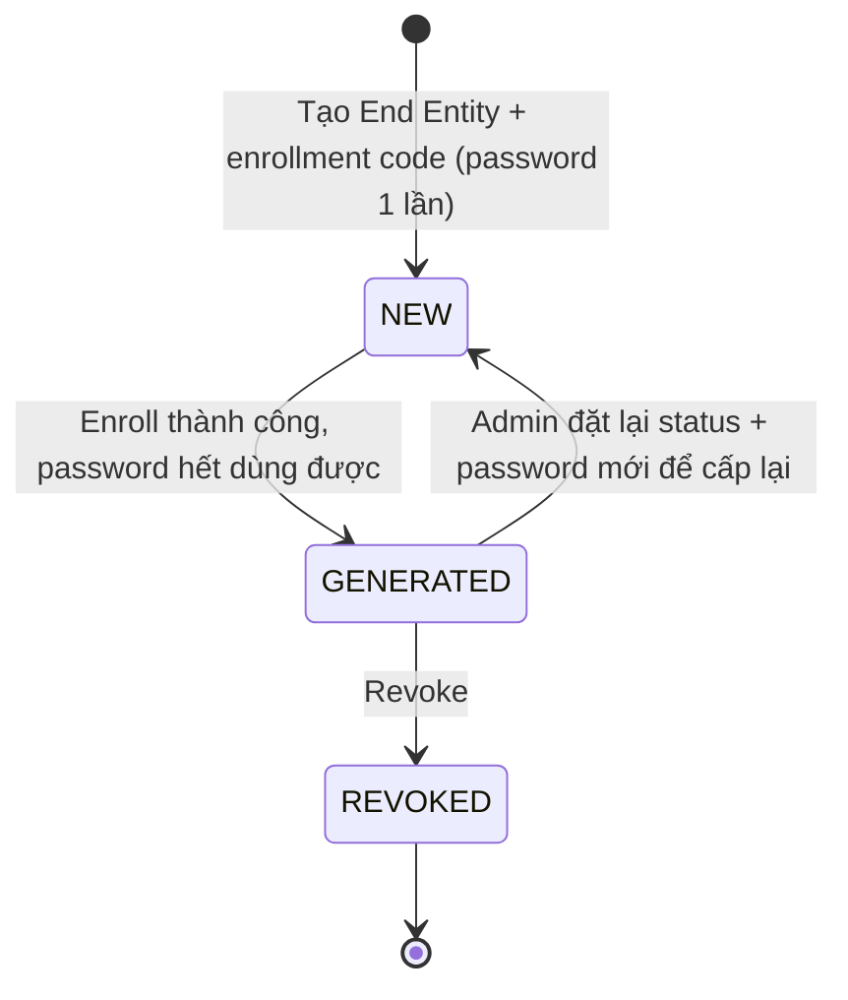

# EJBCA — Profiles & End Entities

## What it does

> Hình dung đi làm CCCD: **End Entity Profile** là tờ khai ở quầy, **Certificate Profile** là khuôn in thẻ,
> **CA** là cái máy in có con dấu, còn **End Entity** là hồ sơ của từng người.

Ba (bốn) thứ này cùng quyết định 1 cert được cấp ra sao:

- **Certificate Profile (CertP)** — cert *chứa gì*: validity, key algorithm/size cho phép, KeyUsage/EKU, có
  extension SAN không, CDP/OCSP URL, publisher nào.
- **End Entity Profile (EEP)** — requester *được xin gì*: được điền field DN/SAN nào, field nào bắt buộc hay cố
  định, được chọn CA nào, CertP nào, token type nào.
- **End Entity** — bản ghi 1 chủ thể cụ thể (username, DN, SAN, password 1 lần, status), gắn với 1 EEP + 1 CertP
  + 1 CA.

Nói thẳng: đây là khái niệm quan trọng nhất của EJBCA, và phần lớn lỗi cấu hình thực tế nằm ở **chỗ giao nhau**
giữa mấy profile này chứ không nằm trong từng cái.

## Why it exists

Nếu gộp hết vào 1 config thì không tách được "cert *có thể* chứa gì" khỏi "*ai* được xin loại cert đó". Tách ra
thì 1 CertP "TLS Server 1 năm" (PKI team giữ, khớp CP/CPS) dùng chung được cho nhiều EEP: "Server team A" chỉ
cho điền SAN `*.a.corp`, "Server team B" chỉ cho `*.b.corp`. Đổi chính sách cert thì sửa 1 chỗ, đổi quyền xin cert
thì sửa chỗ khác — khum đụng nhau.

## How it works

Vòng đời End Entity — giống vé xem phim: dùng 1 lần là bị xé.

1. Enroll xong status thành `GENERATED`, password không dùng lại được. Muốn renew bằng password thì phải set lại
   `NEW` + password mới, hoặc dùng protocol renew bằng cert cũ (EST re-enroll, ACME...). Status **không tự reset**
   khi cert hết hạn.
2. Profile có sẵn (`ENDUSER`, `SERVER`, `SUBCA`, `ROOTCA`...) là profile cố định, sửa không được — clone ra rồi
   chỉnh, đừng xài thẳng cho production.
3. Thao tác nhạy cảm (tạo End Entity cho profile quan trọng, revoke) gắn **Approval Profile** được: người tạo
   request không tự duyệt được request của chính mình.

### Ai thắng khi xung đột

Nguyên tắc chung: **CertP quyết định cert chứa gì, EEP quyết định được xin gì, CSR chỉ là "gợi ý"** — CSR chỉ
được dùng tới đâu hai profile cho phép tới đó.

| Bên A | Bên B | Kết quả | Im lặng hay báo lỗi? |
|---|---|---|---|
| EEP cho điền SAN, RA đã điền DNS name | CertP **không bật** extension SAN | Cert ra **không có SAN** dù RA đã nhập | **Im lặng** — tới lúc client báo hostname mismatch mới biết |
| CSR có SAN khác với End Entity | CertP tắt *Allow Extension Override* (default) | SAN lấy từ End Entity, SAN trong CSR bị bỏ qua | Im lặng |
| CSR có subject DN khác End Entity | CertP tắt *Allow Subject DN Override by CSR* (default) | DN lấy từ End Entity | Im lặng |
| CSR xin EKU `clientAuth` | CertP chỉ có `serverAuth`, không cho override | Cert chỉ có `serverAuth` | Im lặng — mTLS fail sau này |
| CSR dùng RSA 1024 | CertP chỉ cho phép 2048+ | Request bị từ chối | Báo lỗi |
| Request chỉ định CertP / CA không nằm trong danh sách *Available* của EEP | — | Request bị từ chối | Báo lỗi |
| Request xin token P12 | EEP *Available Tokens* chỉ có *User Generated* | Request bị từ chối | Báo lỗi |
| Sửa CertP | Cert đã cấp trước đó | Cert cũ **giữ nguyên**, chỉ cert cấp sau mới theo profile mới | Im lặng |

Mấy dòng "im lặng" là chỗ đáng sợ nhất: EJBCA vẫn cấp cert ngon lành, chỉ là cert không giống cái mình tưởng.
Sau mỗi lần sửa profile, cấp thử 1 cert và soi lại bằng `openssl x509 -noout -text`.

### Các lựa chọn — Token type (cách giao key cho End Entity)

Chọn trong EEP (*Available Tokens*, *Default Token*) — quyết định **ai sinh private key** và **key về tay entity
bằng cách nào**.

| Lựa chọn | Là gì | Khi nào dùng | Bẫy |
|---|---|---|---|
| **User Generated** | Entity tự sinh key, chỉ gửi CSR — giống tự làm chìa rồi mang ổ khoá đi đăng ký | Mặc định cho server, device, mọi thứ chạy protocol (ACME/EST/SCEP/CMP/REST) | Không có — đây là lựa chọn nên ưu tiên vì private key không rời máy entity |
| **P12 file** | CA sinh key + cert, đóng gói PKCS#12 có password | Entity không tự sinh key được (user kém kỹ thuật, app cũ chỉ nhận .p12) | CA từng giữ private key; file .p12 phải gửi đi → gửi password qua kênh khác. Client cũ có thể không đọc được mã hoá mới (xem [[pki--certificate-lifecycle]]) |
| **JKS file** | Như P12 nhưng định dạng Java KeyStore; keystore password và key password đều là password của user | App Java đời cũ (Tomcat...) | JKS là định dạng legacy; Java hiện đại đọc thẳng PKCS#12 được rồi |
| **PEM file** | CA sinh key + cert dạng PEM | App kiểu Apache/nginx cần file PEM | **Private key KHÔNG có password** — file này lọt ra ngoài là lộ key ngay. Red flag nếu dùng tràn lan |

> [!todo] Cần xác nhận
> Danh sách token type đầy đủ ở 9.7 (bản mới có thể có thêm định dạng như BCFKS). Kiểm tra trong EEP →
> *Available Tokens*.

Với 3 loại do CA sinh key (P12/JKS/PEM), EJBCA có thể lưu bản sao key đã mã hoá để **key recovery** nếu bật key
recovery cho hệ thống và cho EEP — tiện khi user mất key mã hoá email, nhưng nghĩa là CA đang giữ bản sao private
key của user. Với key dùng để **ký/xác thực**, đừng bật key recovery.

## Config gotchas

| Config | Default | Khuyến nghị | Vì sao |
|---|---|---|---|
| CertP → *Allow Subject DN Override by CSR* | Tắt | Giữ tắt | Bật là DN lấy nguyên từ CSR, EJBCA **không validate** nội dung |
| CertP → *Allow Extension Override* | Tắt | Giữ tắt; cần thì dùng *Overridable extension OID list* chỉ cho OID cụ thể | Bật là extension (kể cả SAN `2.5.29.17`) lấy nguyên từ CSR, không validate |
| CertP → validity | Theo profile gốc | Khớp CP; leaf ngắn | Validity dài = blast radius lớn khi lộ key |
| CertP → CDP / OCSP URL | Trống hoặc theo hostname lúc cài | URL DNS ổn định, đặt **trước khi** cấp cert | URL in vào cert vĩnh viễn; sai là phải re-issue toàn bộ |
| EEP → SAN fields | Tuỳ profile | Chỉ field cần, *Required*, hạn chế *Modifiable* | SAN tự do = xin cert cho hostname không thuộc mình |
| EEP → Available CAs / CertPs / Tokens | Tuỳ | Tối thiểu cần thiết; Token ưu tiên *User Generated* | Requester chọn được CA/CertP mạnh hơn mục đích, hoặc nhận key không password |
| Enrollment code | Do admin đặt | Random, đủ dài, gửi qua kênh riêng | Code đoán được = ai cũng enroll giả danh entity đó |

## Hay nhầm lẫn

| Dễ nhầm | Thực tế | Hậu quả khi nhầm |
|---|---|---|
| Sửa CertP sửa luôn cert đã cấp | Chỉ áp dụng cho cert cấp sau | Tưởng đã fix EKU cho cả hệ thống, cert cũ vẫn sai |
| *Delete* End Entity vs *Revoke and Delete* | Delete chỉ xoá bản ghi; cert vẫn valid | Cert của người đã nghỉ việc vẫn xài được |
| EEP *Modifiable* vs *Required* | Modifiable: requester sửa được giá trị; Required: bắt buộc có | Bật Modifiable cho SAN → điền gì cũng được |
| EEP trỏ nhầm CertP | Không báo lỗi gì | EEP cho server mà trỏ CertP chỉ có `clientAuth` → TLS handshake fail khi deploy |

## Ops notes

- Trước khi sửa CertP đang chạy production: clone ra profile mới, test, rồi chuyển EEP sang dần. Sửa thẳng là đổi
  hành vi của mọi client đang enroll bằng profile đó ngay lập tức (sau khi cache được clear trên các node).
- Review định kỳ các CertP có validity dài bất thường hoặc bật override — dấu hiệu cấu hình sai.

## Security notes

- EEP mới là lớp "authorization" thật sự: ai tạo được End Entity tuỳ ý thì mọi kiểm soát ở CertP phía sau đều vô
  nghĩa. Bước RA verify danh tính là chỗ con người dễ bị social-engineer nhất.
- Override chỉ dành cho RA cực kỳ tin cậy (CMP/RA tích hợp); không bao giờ bật cho profile dùng qua ACME/SCEP/public
  enrollment.
- Ai sửa được profile là sửa được chính sách cert — giới hạn bằng access rule (xem [[ejbca--rbac-admin-roles]]).

## Refs

- [[EJBCA]] — note gốc.
- [[pki--x509-certificate]] — ý nghĩa từng extension mà CertP cấu hình.
- [EJBCA — Certificate Profile Fields](https://docs.keyfactor.com/ejbca/latest/certificate-profile-fields)
- [EJBCA Security — one-time password, status GENERATED](https://docs.keyfactor.com/ejbca/latest/ejbca-security)
- [EJBCA User Guide — token types User Generated / P12 / JKS / PEM](https://ca.mibcon.cz/ejbca/doc/userguide.html) (docs đời cũ, đối chiếu lại với 9.7)
