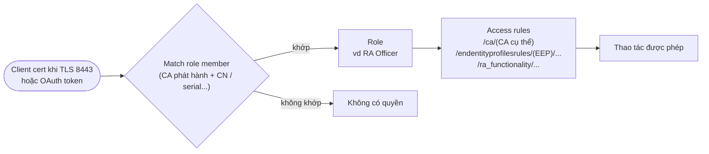

# EJBCA — RBAC — Roles, Members & Access Rules

## What it does

Phân quyền admin và API client trong EJBCA: **Role** là nhóm quyền, **Role member** là cách nhận diện ai thuộc
role (thuộc tính của client cert, OAuth token, CLI user), **Access rule** là quyền cụ thể (resource path +
allow/deny).

## Why it exists

Mọi thao tác trên CA — cấp cert, revoke, sửa profile, activate token — đều là thao tác bảo mật. Không phân quyền
thì 1 tài khoản RA bị lộ là sửa được cả chính sách CA.

## How it works

1. Member match luôn gắn với **CA phát hành** cert + 1 thuộc tính (CN, serial number, UID, email...). OAuth làm
   phương thức xác thực có ở CE từ 9.3.
2. Quyền là giao của: rule chức năng (được revoke không) **và** rule dữ liệu (với CA nào, EEP nào). Thiếu 1 trong
   2 là admin "đăng nhập được nhưng không thấy gì".
3. Lúc cài đặt có sẵn *Super Administrator Role* với cert superadmin.
4. CLI (`bin/ejbca.sh`) xác thực bằng user mặc định trong `ejbca.properties`: `ejbca.cli.defaultusername` /
   `ejbca.cli.defaultpassword`, default **`ejbca` / `ejbca`**.

## Config gotchas

| Config | Default | Khuyến nghị | Vì sao |
|---|---|---|---|
| Kiểu match member | Tuỳ người tạo | Serial number, hoặc CN + đúng CA phát hành | Match CN quá rộng → ai xin được cert cùng CN là thành admin |
| Số member của Super Administrator Role | 1 superadmin lúc cài | Ít nhất 2 người (tránh khoá ngoài), nhưng tối thiểu | Quá nhiều super admin = không còn phân quyền; chỉ 1 = cert đó hết hạn là mất quyền |
| CLI default user | `ejbca` / `ejbca` | Đổi password (`bin/ejbca.sh ra setpwd ejbca <new>`) hoặc tắt nếu không dùng CLI | Ai có shell trên server là chạy được CLI với quyền của user này |
| Approval Profile cho thao tác nhạy cảm | Không có | Bật cho tạo/sửa CA, activate CA, revoke | 1 người bị lộ/thao tác nhầm không tự gây sự cố lớn được |

## Hay nhầm lẫn

| Dễ nhầm | Thực tế | Hậu quả khi nhầm |
|---|---|---|
| Có quyền RA = thấy mọi End Entity | Chỉ thấy EE thuộc EEP/CA được cấp quyền | Debug "mất dữ liệu" trong khi chỉ là thiếu access rule |
| Revoke cert admin = gỡ quyền | Gỡ khỏi role mới là gỡ quyền; revoke chỉ chặn được nếu EJBCA check revocation cert đó | Admin nghỉ việc vẫn còn quyền |

## Ops notes

- Định kỳ review member của các role mạnh; theo dõi expiry của cert admin (nhất là superadmin) để không bị
  khoá ngoài.
- Thay đổi role/rule được ghi audit log — kiểm tra khi có thay đổi quyền bất thường.
- Access rule theo kiểu **deny nếu không có rule cho phép**: "admin X không thấy chức năng Y" thường là thiếu
  rule, không phải bug.
- Offboarding: **gỡ khỏi role** và revoke cert admin — cert admin không đổi được như password, quên bước này là
  người cũ vẫn còn cửa vào.

## Security notes

- Least privilege: tách *CA Administrator*, *RA Officer*, *Auditor* (chỉ đọc audit log).
- Cert admin nên cấp từ CA/profile riêng cho admin, key trên smartcard/token nếu có thể.
- File `.p12` của admin quý ngang password super admin — đừng để nằm lung tung trên laptop không mã hoá.

## Refs

- [[EJBCA]] — note gốc.
- [EJBCA — Command Line Interfaces](https://docs.keyfactor.com/ejbca/latest/command-line-interfaces)
- [EJBCA Security](https://docs.keyfactor.com/ejbca/latest/ejbca-security)
