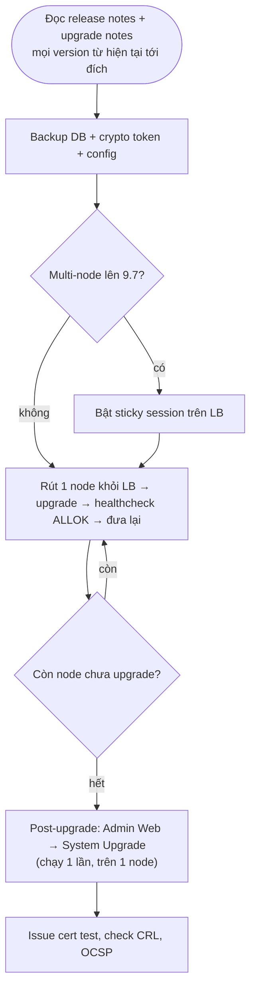

# EJBCA — Upgrade & Backup

## What it does

Quy trình đưa EJBCA lên version mới mà không làm gián đoạn cấp cert/OCSP, và những thứ phải backup để dựng lại
được CA khi mất node.

## Why it exists

EJBCA là hạ tầng nền: upgrade sai thứ tự hoặc restore thiếu thành phần là CA không ký được, hoặc tệ hơn, mất
key CA. Upgrade còn kéo theo đổi Java, WildFly, JDBC driver giữa các major version.

## How it works

1. Từ EJBCA 6.4.x trở lên: upgrade thẳng lên version mới nhất được (kèm nâng JDK/WildFly nếu cần), rồi chạy
   post-upgrade.
2. **Post-upgrade chỉ chạy khi mọi node đã ở version mới**, và chỉ cần chạy trên 1 node — EJBCA không biết cluster
   có bao nhiêu node.
3. Menu *System Upgrade* chỉ xuất hiện khi có post-upgrade cần chạy (từ 6.8.0).

**Ghi chú theo version:**

| Đích | Lưu ý |
|---|---|
| 8.x → 9.0 | Java 17; WildFly 32 / JBoss EAP 8; Java EE 8 → Jakarta EE 10 (phải nâng toàn bộ stack). MariaDB connector 3.0+: thêm `?permitMysqlScheme` vào JDBC URL hoặc dùng identifier `mariadb` |
| 9.3 | Tương thích Java 21, WildFly 35 |
| 9.5 | WildFly 39; release notes ghi có thay đổi file cấu hình — đọc kỹ |
| CE 9.6 | Bỏ HSM crypto token khỏi Community |
| 9.7 | Container lên WildFly 41; multi-node **bắt buộc sticky session**; AJP listener deprecated (chuyển sang HTTP proxy); C-ITS deprecated, dự kiến bỏ ở 9.8 |

**Backup cần có (đồng bộ thời điểm):**
- **Database** — cert, CA, profile, role, audit log, và **key của soft crypto token**.
- **Crypto token** — soft: PIN (lưu tách khỏi DB backup). HSM: backup theo quy trình vendor (key ceremony, M of N).
- **Cấu hình ngoài DB** — `conf/*.properties`, cấu hình WildFly (datasource, TLS keystore/truststore), biến môi
  trường container/Helm values.

## Config gotchas

| Config | Default | Khuyến nghị | Vì sao |
|---|---|---|---|
| LB sticky session | Tuỳ LB | Bật trước khi upgrade lên 9.7 | Yêu cầu bắt buộc trong upgrade notes 9.7 |
| AJP giữa Apache và EJBCA | — | Chuyển sang HTTP proxy | Deprecated ở 9.7, sẽ bị gỡ |
| JDBC URL MariaDB khi lên 9.x | `jdbc:mysql://...` | Thêm `?permitMysqlScheme` hoặc `jdbc:mariadb://` | Connector 3.0+ từ chối scheme `mysql` → EJBCA không kết nối được DB |

## Hay nhầm lẫn

| Dễ nhầm | Thực tế | Hậu quả khi nhầm |
|---|---|---|
| Backup DB = backup CA | Với HSM, key không nằm trong DB | Restore DB xong vẫn không ký được |
| Post-upgrade chạy trên từng node | Chạy 1 lần, sau khi mọi node đã upgrade | Chạy sớm làm hỏng node còn ở version cũ |

## Ops notes

- Restore-test định kỳ lên môi trường riêng: dựng EJBCA từ backup, activate token, issue thử 1 cert, sinh CRL.
  Backup chưa từng restore thì coi như không có.
- Upgrade test trên staging có dữ liệu giống production trước.

## Security notes

- Backup DB của soft token là tài sản tối mật (chứa key CA đã mã hoá) — mã hoá backup, giới hạn người đọc.
- File cấu hình chứa password DB/PIN — không commit vào repo, không để trong image container.

## Refs

- [[EJBCA]] — note gốc.
- [Upgrading EJBCA](https://docs.keyfactor.com/ejbca/latest/upgrading-ejbca) · [EJBCA 9.0 Upgrade Notes](https://docs.keyfactor.com/ejbca/latest/ejbca-9-0-upgrade-notes) · [EJBCA 9.7 Upgrade Notes](https://docs.keyfactor.com/ejbca/latest/ejbca-9-7-upgrade-notes)
- [EJBCA Release Notes Summary](https://docs.keyfactor.com/ejbca/latest/ejbca-release-notes-summary)
