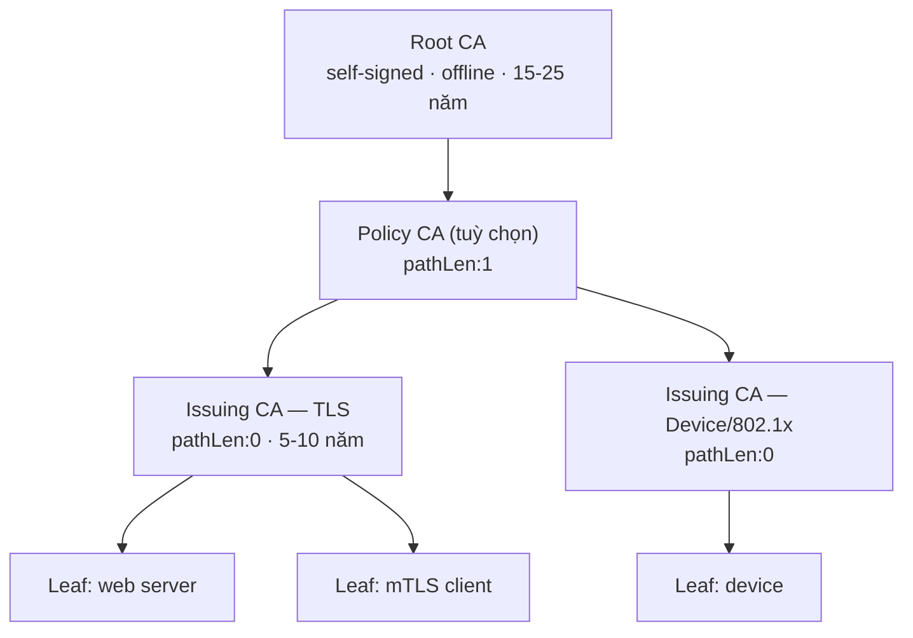

# PKI — CA Hierarchy & Chain of Trust

## What it does

Tổ chức CA thành nhiều tầng: **Root CA** (self-signed, trust anchor) ký cho **Intermediate/Issuing CA**,
Issuing CA ký cho leaf. Client chỉ cần tin Root; mọi cert còn lại được tin thông qua chuỗi chữ ký.

## Why it exists

Nếu Root ký thẳng leaf, Root key phải online hàng ngày — lộ Root key là phải thay trust anchor trên mọi
client, việc gần như không thể làm nhanh. Tách tầng cho phép Root **offline**, còn tầng online (Issuing) nếu
bị lộ thì chỉ cần Root revoke nó và dựng Issuing mới, trust anchor giữ nguyên.

## How it works

Mỗi Issuing CA phục vụ 1 mục đích → revoke 1 Issuing chỉ ảnh hưởng 1 nhóm hệ thống. `pathLen` giảm dần
theo tầng để CA dưới cùng không tạo được CA con.

1. **Chain building:** client bắt đầu từ leaf, tìm cert có `subject` = `issuer` của leaf (và
   `subjectKeyIdentifier` = `authorityKeyIdentifier`), lặp tới khi gặp cert trong trust store.
2. **Nguồn intermediate:** server gửi kèm trong handshake (cách đúng), hoặc client tự tải qua AIA
   `caIssuers` (browser làm, đa số library không làm).
3. **Cross-signing:** 1 CA có thể có 2 cert (cùng key) do 2 root khác nhau ký — dùng khi chuyển root mới mà
   client cũ chưa có root mới. Client có thể build ra nhiều path; path nào được chọn tuỳ implementation.

## Config gotchas

| Config | Default | Khuyến nghị | Vì sao |
|---|---|---|---|
| `pathLenConstraint` | Không giới hạn | Root: theo số tầng; Issuing: `0` | Không giới hạn → Issuing CA tạo sub-CA ngoài kiểm soát |
| Validity Issuing CA | Tự đặt | ≥ 2× validity tối đa của leaf, và renew sớm | CA không cấp được leaf sống lâu hơn chính nó; renew muộn → leaf mới bị cắt ngắn |
| Rekey vs renew Issuing CA | Tuỳ CA software | Rekey (key mới) khi rollover định kỳ | Giữ key cũ quá lâu tăng rủi ro tích luỹ; nhưng key mới cần phân phối intermediate mới tới server |
| Name Constraints | Không có | Giới hạn domain nội bộ (vd `.corp.example`) | Issuing CA bị lạm dụng cũng không cấp được cert cho domain ngoài |

## Hay nhầm lẫn

| Dễ nhầm | Thực tế | Hậu quả khi nhầm |
|---|---|---|
| Bundle chain có kèm root | Server chỉ gửi leaf + intermediate; root nằm sẵn ở client | Gửi root là thừa (tốn băng thông), không gửi intermediate mới là lỗi |
| "Renew CA" = "cert cũ vẫn chạy" | Nếu rekey, leaf mới được ký bởi key mới → server phải dùng intermediate mới | Deploy leaf mới với intermediate cũ → chain mismatch |
| Revoke Root | Root không revoke được theo nghĩa thông thường — chỉ có cách gỡ khỏi trust store | Kế hoạch "revoke root khi lộ" không hoạt động |

## Ops notes

- Theo dõi hạn của **từng** CA cert trong chain, kể cả Root — xem gotcha root hết hạn ở
  [[PKI#Root/intermediate hết hạn trong khi leaf còn hạn]].
- Khi phát hành Issuing CA mới: phân phối intermediate mới tới **mọi** chỗ cấu hình chain (web server, LB,
  ingress, CDN) trước khi bắt đầu cấp leaf từ CA mới.

## Security notes

- Root offline, key trong HSM, key ceremony có nhiều người chứng kiến — xem [[pki--hsm-key-protection]].
- Mỗi Issuing CA 1 mục đích: lộ CA TLS không kéo theo device/VPN.

## Refs

- [[PKI]] — note gốc.
- [[pki--x509-certificate]] — `basicConstraints`, `nameConstraints`, key identifier.
- [RFC 5280 §6 — Certification Path Validation](https://datatracker.ietf.org/doc/html/rfc5280#section-6)
