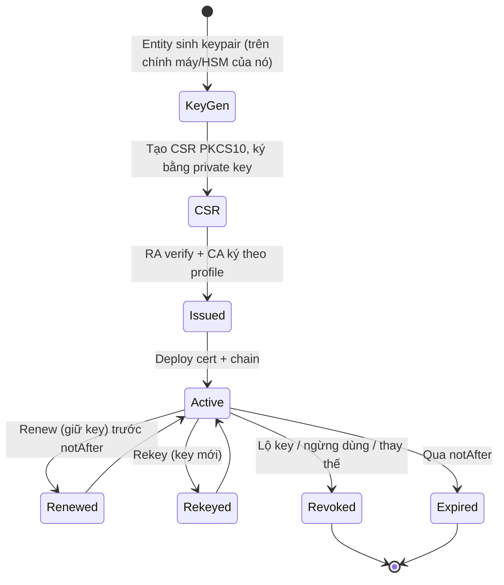

# PKI — Certificate Lifecycle (CSR → Issue → Renew → Expire/Revoke)

## What it does

Mô tả mọi trạng thái 1 certificate đi qua: entity sinh keypair và CSR, CA cấp cert, cert được deploy và dùng,
rồi được renew/rekey trước hạn, hoặc kết thúc bằng expire hay revoke.

## Why it exists

Cert hết hạn là nguyên nhân outage PKI phổ biến nhất, và nó luôn "báo trước" bằng `notAfter` — chỉ là không ai
nhìn. Hiểu lifecycle để biết mỗi trạng thái cần automation/monitoring gì.

## How it works



1. **Private key sinh tại nơi dùng nó** — CSR chỉ mang public key, nên private key không cần đi qua mạng.
   Server-side keygen (CA sinh key, trả về PKCS#12) chỉ dùng khi device không tự sinh được.
2. **CSR là "đề xuất", không phải "mệnh lệnh"** — CA/profile quyết định subject, SAN, EKU, validity thực
   tế. CSR xin SAN không được phép thì CA bỏ đi hoặc từ chối.
   CSR được ký bằng chính private key tương ứng → CA kiểm tra được requester **thật sự giữ** key đó
   (*proof of possession*). Nhưng PoP chỉ chứng minh "có key", không chứng minh "là ai" — đó là việc của RA.
3. **Renew sớm**, khoảng 2/3 lifetime: còn thời gian xử lý nếu renew fail.
4. **Revoke** chỉ có tác dụng khi client check revocation → [[pki--revocation-crl-ocsp]].

Lệnh hay dùng:

```bash
# Sinh key + CSR có SAN (OpenSSL 1.1.1+)
openssl req -new -newkey ec -pkeyopt ec_paramgen_curve:P-256 -nodes \
  -keyout server.key -out server.csr \
  -subj "/CN=app.corp.example" -addext "subjectAltName=DNS:app.corp.example,DNS:app"
# Xem CSR thực sự chứa gì trước khi gửi
openssl req -in server.csr -noout -text
# Kiểm tra cert và key có khớp nhau (so sánh public key)
diff <(openssl x509 -in server.crt -noout -pubkey) <(openssl pkey -in server.key -pubout)
```

## Config gotchas

| Config | Default | Khuyến nghị | Vì sao |
|---|---|---|---|
| Thời điểm renew | Thủ công | Tự động ở ~2/3 lifetime | Validity ngày càng ngắn (xem [[PKI#6. Key Config — Cấu hình cần nhớ]]), làm tay sẽ sót |
| Mã hoá PKCS#12 | OpenSSL 3.x: AES-256-CBC + PBKDF2 | Thêm `-legacy` khi client cũ cần import | Java cũ, Windows Server cũ không đọc được thuật toán mới → "invalid password" dù password đúng |
| Private key permission | Theo umask | `0600`, owner là service user | Key đọc được bởi user khác = key đã lộ |

## Hay nhầm lẫn

| Dễ nhầm | Thực tế | Hậu quả khi nhầm |
|---|---|---|
| Renew vs rekey | Renew có thể giữ nguyên key | Sau sự cố lộ key mà chỉ renew → key lộ vẫn hợp lệ |
| Revoke vs xoá cert khỏi server | Gỡ cert khỏi server không làm cert mất hiệu lực | Ai đã copy key + cert vẫn dùng được tới `notAfter` |

## Ops notes

- Inventory: biết cert nào nằm ở đâu, ai sở hữu — không có inventory thì không có alert expiry.
- Alert expiry theo 2 nguồn: từ CA (danh sách đã cấp) và scanner quét endpoint thật (cert đang được serve).

## Security notes

- Không gửi private key qua email/chat; nếu buộc phải dùng PKCS#12, gửi password qua kênh khác.
- Lộ key → **rekey + revoke** cert cũ với reason `keyCompromise`, không chỉ renew.
- Bước RA verify danh tính là chỗ dễ bị social-engineer nhất cả hệ thống: toán học hoàn hảo cũng vô nghĩa nếu
  RA duyệt CSR ẩu.

## Refs

- [[PKI]] — note gốc.
- [[pki--enrollment-protocols]] — tự động hoá bước CSR → Issued → Renew.
- [RFC 2986 — PKCS #10](https://datatracker.ietf.org/doc/html/rfc2986)
- [OpenSSL 3.0 pkcs12 `-legacy`](https://docs.openssl.org/3.0/man1/openssl-pkcs12/)
