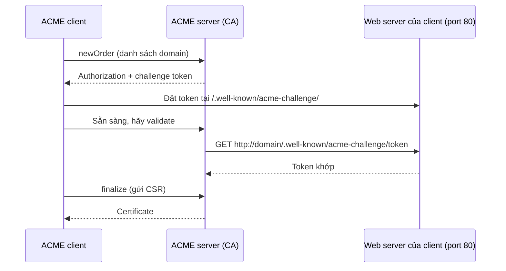

# PKI — Enrollment Protocols (ACME / EST / SCEP / CMP)

## What it does

Giao thức chuẩn để client tự xin và renew cert mà không cần người copy-paste CSR. Mỗi giao thức sinh ra cho
1 nhóm client khác nhau.

## Why it exists

Validity ngày càng ngắn (public TLS tiến tới 47 ngày vào 2029) và số lượng device ngày càng lớn — renew thủ
công không còn khả thi. Không có giao thức chuẩn thì mỗi team tự viết script gọi API riêng của CA, khó thay CA
và khó audit.

## How it works

| Giao thức | RFC | Client điển hình | Xác thực requester | Port thường dùng |
|---|---|---|---|---|
| **ACME** | 8555 | Web server, ingress (certbot, cert-manager) | Chứng minh kiểm soát domain (`http-01`, `dns-01`, `tls-alpn-01`) hoặc External Account Binding | `443/tcp` (+ `80/tcp` inbound cho `http-01`) |
| **EST** | 7030 | Device, IoT, server nội bộ | TLS client cert (re-enroll bằng cert cũ) hoặc username/password qua TLS | `443/tcp` |
| **SCEP** | 8894 | MDM (Intune...), network device, router | Challenge password dùng chung | `80/tcp` hoặc `443/tcp` |
| **CMP** | 4210 (v2), 9480 (v3) | Telecom, hệ thống công nghiệp, RA tích hợp | Chữ ký/MAC trên message | HTTP(S), port tuỳ cấu hình |

Luồng ACME `http-01` (giao thức hay gặp nhất):

Điểm mấu chốt: ở `http-01`, **CA kết nối ngược vào** client qua port 80. Firewall chỉ mở outbound 443 là
challenge fail.

## Config gotchas

| Config | Default | Khuyến nghị | Vì sao |
|---|---|---|---|
| ACME challenge type | `http-01` (certbot) | `dns-01` cho host không public port 80 hoặc cần wildcard | Wildcard chỉ cấp qua `dns-01`; `http-01` cần inbound 80 |
| SCEP challenge password | Shared, ít khi rotate | Dynamic challenge (1 lần/device) qua MDM hoặc RA | Password dùng chung lộ = ai cũng xin được cert |
| EST re-enroll | Dùng cert hiện tại làm client cert | Renew trước khi cert cũ hết hạn | Cert cũ hết hạn → device mất cách tự xác thực, phải enroll lại thủ công |

## Hay nhầm lẫn

| Dễ nhầm | Thực tế | Hậu quả khi nhầm |
|---|---|---|
| ACME = Let's Encrypt | ACME là giao thức; CA nội bộ (vd [[EJBCA]]) cũng có ACME server | Bỏ qua lựa chọn automation sẵn có cho private PKI |
| SCEP an toàn như EST | SCEP dựa trên shared secret + crypto cũ; EST dựa trên TLS | Dùng SCEP cho thứ cần bảo mật cao |

## Ops notes

- Renewal fail thường **im lặng** — job cron/cert-manager báo lỗi trong log mà không ai đọc; alert theo expiry
  của cert thực tế đang serve, không theo trạng thái job.

## Network

Ports và triệu chứng khi bị chặn: [[PKI#7. Network — Port & Firewall Rules]]. Endpoint cụ thể trên EJBCA:
[[ejbca--api-protocols]].

## Security notes

- Enrollment endpoint là cửa xin cert — giới hạn ai gọi được (network + xác thực) và profile nào được dùng qua
  mỗi endpoint.
- ACME nội bộ: bật External Account Binding nếu không muốn mọi máy trong mạng tự xin cert.

## Refs

- [[PKI]] — note gốc.
- [[ejbca--api-protocols]] — URL các protocol trên EJBCA.
- [RFC 8555 — ACME](https://datatracker.ietf.org/doc/html/rfc8555) · [RFC 7030 — EST](https://datatracker.ietf.org/doc/html/rfc7030) · [RFC 8894 — SCEP](https://datatracker.ietf.org/doc/html/rfc8894) · [RFC 9480 — CMP updates](https://datatracker.ietf.org/doc/html/rfc9480)
