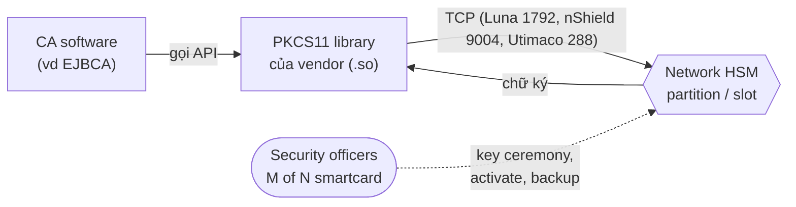

# PKI — HSM & Key Protection

## What it does

> HSM giống **két sắt ngân hàng có nhân viên đóng dấu bên trong**: mình đưa giấy vào khe, nhân viên đóng dấu rồi
> đưa ra, nhưng con dấu thì khum bao giờ rời két. Mình xài được con dấu, mà không ai mang nó về nhà được.

HSM (Hardware Security Module) là thiết bị sinh, lưu và dùng private key **bên trong phần cứng**: app gửi dữ liệu
cần ký vào, nhận chữ ký ra, key không bao giờ rời HSM ở dạng plaintext. App nói chuyện với HSM qua API chuẩn
**PKCS#11** (thư viện `.so` của vendor) hoặc REST API riêng (cloud KMS).

## Why it exists

Private key CA nằm trong file trên disk (dù có password) thì ai có root trên server, ai đọc được backup, đều copy
được — copy xong mang về crack offline, và việc copy **không để lại dấu vết gì**. HSM biến "lấy key" thành "phải
lấy được thiết bị vật lý và vượt qua tamper protection", đồng thời ghi log mọi lần dùng key.

Nhưng nhớ là HSM chỉ chặn được *ăn cắp* key, không chặn được *lạm dụng*: ai chiếm được server CA vẫn nhờ HSM ký
hộ được. Phần "ai được yêu cầu ký cái gì" là việc của RBAC ở tầng app.

## How it works

1. **Partition/slot** — HSM chia thành vùng độc lập, mỗi vùng có PIN riêng; CA dùng 1 slot. Kiểu chung cư: chung
   toà nhà nhưng mỗi căn 1 chìa.
2. **Key ceremony** — buổi sinh Root/Issuing key: nhiều người chứng kiến, có script từng bước, có biên bản, thường
   quay video. Đây gần như là sự kiện 1 lần trong đời PKI, và là bằng chứng key chưa từng bị copy.
3. **M of N** — thao tác nhạy cảm (backup, restore, activate) cần M trên N người cầm smartcard cùng có mặt (vd 3/5).
   Không ai một mình làm được — kiểu két nhà băng cần 2 chìa của 2 người.
4. **Backup** — key được export **dạng đã mã hoá** sang HSM/thiết bị backup cùng vendor, hoặc chia thành *key share*
   cho nhiều người giữ. Mất HSM mà không có backup = mất CA, real.

### Các lựa chọn — Kiểu HSM

| Lựa chọn | Là gì | Khi nào dùng | Bẫy |
|---|---|---|---|
| **Network HSM** (Thales Luna Network, Entrust nShield Connect, Utimaco) | Appliance trong datacenter, nhiều server dùng chung qua mạng | Issuing CA online, cluster nhiều node | Thêm 1 đường mạng phải giữ (port vendor); cần HA group nếu không muốn single point |
| **PCIe HSM** (Luna PCIe, nShield Solo) | Card cắm thẳng vào server | 1 server CA, không muốn phụ thuộc mạng | Gắn chặt với 1 máy — HA và thay server phức tạp hơn |
| **USB / portable HSM** (Luna USB HSM, YubiHSM 2, SmartCard-HSM) | Thiết bị nhỏ, cắm USB | **Root CA offline**: cất vào két, chỉ lấy ra khi ký | Hiệu năng thấp; dễ thất lạc → quy trình cất giữ vật lý phải chặt |
| **Cloud dedicated HSM** (AWS CloudHSM, Azure Managed HSM) | HSM single-tenant do cloud vận hành phần cứng, mình giữ quyền quản trị key | CA chạy trên cloud, cần HSM thật cho compliance | Vẫn phải tự lo HA cluster, backup, user management của HSM |
| **Cloud KMS** (AWS KMS, Azure Key Vault, Google Cloud KMS) | Dịch vụ quản lý key multi-tenant, bên dưới là HSM của provider | Muốn đơn giản, không cần HSM riêng | Không phải "HSM của mình"; mô hình trust phụ thuộc provider; check FIPS level của từng tier dịch vụ |

### Các lựa chọn — FIPS 140 security level

FIPS 140 (bản hiện hành **140-3**, dựa trên ISO/IEC 19790) chứng nhận module crypto theo 4 level tăng dần:

| Level | Yêu cầu chính | Hay gặp ở đâu |
|---|---|---|
| **1** | Module crypto chuẩn, chưa có yêu cầu bảo vệ vật lý đáng kể; software module đạt được | Thư viện crypto (OpenSSL FIPS provider, Bouncy Castle FIPS) |
| **2** | + **Tamper-evident** (niêm phong, thấy được dấu vết mở) + xác thực theo role | HSM tầm trung, một số cloud KMS tier thường |
| **3** | + **Tamper-resistant**: phát hiện xâm nhập và **tự xoá key** (zeroize); xác thực theo danh tính; tách kênh nhập/xuất key nhạy cảm | **Mức thường yêu cầu cho HSM giữ Root/Issuing CA** trong môi trường compliance |
| **4** | + Bảo vệ cả trước tấn công môi trường (điện áp, nhiệt độ bất thường), lớp bảo vệ bao kín toàn module | Rất hiếm, môi trường vật lý không tin cậy |

> [!warning] FIPS 140-2 đã thành "Historical" từ 2026-09-21
> NIST CMVP chuyển **mọi** chứng nhận FIPS 140-2 sang *Historical List* ngày 2026-09-21: chỉ còn được dùng cho hệ
> thống đã có, **không** dùng cho triển khai mới. HSM mua mới / hệ thống mới cần chứng nhận **FIPS 140-3**.

## Config gotchas

| Config | Default | Khuyến nghị | Vì sao |
|---|---|---|---|
| Version PKCS#11 library vs firmware HSM | Tuỳ cài đặt | Khớp theo compatibility matrix của vendor | Lệch version → CA start được nhưng ký fail, lỗi mơ hồ |
| HA / load balancing giữa nhiều HSM | Tắt | Bật HA group của vendor khi CA cần HA | 1 HSM chết = CA không ký được |
| Key attribute `CKA_EXTRACTABLE` | Tuỳ tool tạo key | `false` cho CA key | Key extractable thì HSM chỉ còn là "ổ cứng đắt tiền" |
| Auto-activation (PIN lưu phía app) | Tuỳ CA software | Cân nhắc rủi ro: tiện restart nhưng PIN nằm cạnh app | Ai lấy được app server + PIN là dùng được key (dù không copy được) |
| FIPS mode của HSM | Tuỳ model | Bật nếu cần compliance — **trước khi** sinh key | Một số HSM không cho đổi mode khi đã có key, hoặc đổi mode là xoá key |

## Hay nhầm lẫn

| Dễ nhầm | Thực tế | Hậu quả khi nhầm |
|---|---|---|
| Key "trong HSM" = an toàn tuyệt đối | Attacker chiếm app server vẫn **dùng** được key để ký (không copy được) | Lơ là bảo vệ app server và audit chữ ký |
| Backup HSM = backup DB của CA | Hai thứ khác nhau, quy trình khác nhau | Restore DB xong vẫn không ký được |
| "HSM đạt FIPS" = đang chạy ở FIPS mode | Chứng nhận là cho 1 cấu hình cụ thể; HSM có thể đang chạy non-FIPS mode | Audit fail dù thiết bị "có chứng nhận" |
| FIPS 140-2 vẫn ok cho hệ thống mới | Đã Historical từ 2026-09-21 | Mua thiết bị mới mà không dùng được cho triển khai mới theo yêu cầu FIPS |

## Ops notes

- Health: slot/partition online, số session đang dùng, cert/credential của HSM client (vd NTLS client cert của Luna)
  còn hạn.
- Diễn tập restore key từ backup ít nhất 1 lần/năm — quy trình M of N rất dễ quên, nhất là khi người cầm thẻ nghỉ
  việc.
- Theo dõi danh sách người giữ smartcard/key share; ai nghỉ việc phải chuyển giao theo quy trình.

## Network

| Nguồn → Đích | Port/Proto | Mục đích | Default? | Triệu chứng khi bị chặn |
|---|---|---|---|---|
| CA → Thales Luna Network HSM | `1792/tcp` | NTLS (application traffic) | có | Crypto token offline; CA không ký được |
| CA → Entrust nShield (hardserver) | `9004/tcp` | Client tới HSM | có | Như trên |
| CA → Utimaco CryptoServer | `288/tcp` | Client tới HSM | có | Như trên |
| Admin → Luna HSM | `22/tcp` | SSH quản trị appliance | có | Không quản trị/cấu hình được appliance |
| CA → Cloud KMS / Cloud HSM API | `443/tcp` | REST/API tới provider | có | Crypto token offline, lỗi timeout tới endpoint cloud |

> [!todo] Cần xác nhận
> Port theo model và version HSM thực tế đang dùng — các giá trị trên là default theo tài liệu vendor.

## Security notes

- Không lưu PIN HSM trong repo/config dạng plaintext; buộc phải auto-activation thì siết quyền đọc file config.
- Audit log của HSM đẩy ra SIEM — đó là bằng chứng ai đã dùng key CA, lúc nào.
- Cloud HSM/KMS: phân quyền IAM tối thiểu cho identity của CA; ai có quyền IAM đủ rộng là có quyền ký.

## Refs

- [[PKI]] — note gốc.
- [[ejbca--crypto-tokens]] — EJBCA nối HSM qua crypto token; CE 9.6+ không còn hỗ trợ HSM.
- [NIST — FIPS 140-3 Transition Effort](https://csrc.nist.gov/projects/fips-140-3-transition-effort)
- [Thales Luna Network HSM — Port usage](https://thalesdocs.com/gphsm/luna/7/docs/network/Content/admin_appliance/client_connections/port_usage.htm)
