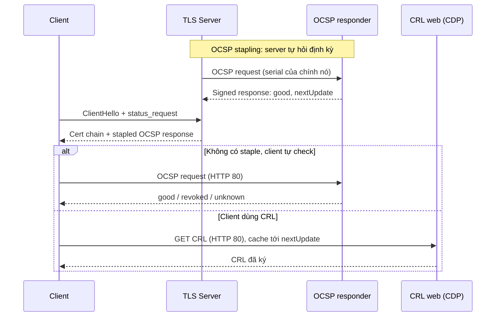

# PKI — Revocation (CRL & OCSP)

## What it does

Cơ chế báo cho client "cert này **còn hạn** nhưng không còn đáng tin". Hai cách: **CRL** — danh sách serial bị
thu hồi, CA ký và publish định kỳ; **OCSP** — hỏi trạng thái 1 cert cụ thể real-time.

## Why it exists

`notAfter` chỉ xử lý hết hạn tự nhiên. Key bị lộ hôm nay mà cert còn hạn tới năm sau thì cần cách thu hồi sớm —
nếu không, attacker cầm key lộ vẫn dùng cert hợp lệ tới ngày hết hạn.

## How it works

| | CRL | OCSP | OCSP stapling |
|---|---|---|---|
| Ai hỏi | Client tải cả danh sách | Client hỏi từng cert | Server hỏi, đính kèm vào handshake |
| Độ trễ thông tin | Tới chu kỳ publish kế tiếp | Gần real-time (tuỳ cache `nextUpdate` của response) | Như OCSP + chu kỳ refresh của server |
| Điểm yếu | Danh sách phình to; khoảng hở giữa 2 lần publish | Responder là điểm chịu tải + lộ "ai đang kết nối đâu" | Server phải được cấu hình; nhiều client không bắt buộc staple |

**Xu hướng public web:** CA/B Forum (ballot SC-063, hiệu lực 3/2024) làm OCSP thành tuỳ chọn và CRL bắt buộc;
Let's Encrypt đã tắt OCSP responder ngày 2025-08-06 vì lý do privacy. PKI nội bộ vẫn tự quyết định — OCSP vẫn
hữu ích khi cần trạng thái gần real-time (VPN, 802.1x).

## Config gotchas

| Config | Default | Khuyến nghị | Vì sao |
|---|---|---|---|
| Fail-open vs fail-closed ở client | Đa số browser: soft-fail (fail-open) | Quyết định rõ theo hệ thống; VPN/802.1x thường fail-closed | Fail-open bỏ lọt cert đã revoke; fail-closed biến OCSP/CRL down thành outage |
| CRL validity vs chu kỳ publish | Tuỳ CA | Publish mới trước khi bản cũ hết hạn một khoảng đủ cho mọi cache | Client cache CRL tới `nextUpdate`; publish sát giờ → client giữ bản sắp hết hạn |
| Delta CRL | Tắt | Bật khi CRL lớn (nhiều MB) | CRL lớn làm client tải chậm/timeout |
| OCSP signer cert | CA tự ký response | Delegated signer có EKU `OCSPSigning` + extension `ocsp-nocheck` | Không cần CA key online cho OCSP; `ocsp-nocheck` tránh vòng lặp check revocation của chính signer |
| URL CDP/OCSP | — | `http://` | Qua HTTPS phải verify cert của web server → lại cần revocation → vòng lặp |

## Hay nhầm lẫn

| Dễ nhầm | Thực tế | Hậu quả khi nhầm |
|---|---|---|
| OCSP `unknown` vs `good` | `unknown` = responder không biết cert này (không phải "không bị revoke") | Coi `unknown` là ok → chấp nhận cert do CA lạ cấp |
| `thisUpdate`/`nextUpdate` của CRL vs của cert | CRL có thời hạn riêng, ngắn (giờ/ngày) | Chỉ monitor hạn cert, quên hạn CRL |
| Revoke reason `certificateHold` | Là trạng thái tạm, có thể bỏ hold | Dùng hold cho key lộ → cert có thể "sống lại" |

## Ops notes

- Monitor CRL **từ URL client thực sự tải**: `curl -s http://<cdp>/x.crl | openssl crl -inform der -noout -nextupdate`.
- CRL size tăng đột biến = revoke hàng loạt — hoặc sự cố, hoặc ai đó đang revoke nhầm.

## Network

Client và TLS server (nếu stapling) cần `80/tcp` tới OCSP responder và CRL web — chi tiết triệu chứng xem
[[PKI#7. Network — Port & Firewall Rules]].

## Security notes

- Ghi đúng revocation reason (`keyCompromise`, `superseded`, `cessationOfOperation`...) — cần khi audit/điều tra.
- OCSP không stapling cho CA biết client nào đang kết nối tới đâu — cân nhắc privacy với hệ thống public.

## Refs

- [[PKI]] — note gốc.
- [[ejbca--crl-ocsp-services]] — EJBCA sinh CRL, publish và chạy OCSP thế nào.
- [RFC 5280 §5 — CRL profile](https://datatracker.ietf.org/doc/html/rfc5280#section-5) · [RFC 6960 — OCSP](https://datatracker.ietf.org/doc/html/rfc6960)
- [Let's Encrypt — Ending OCSP Support in 2025](https://community.letsencrypt.org/t/ending-ocsp-support-in-2025/229786)
