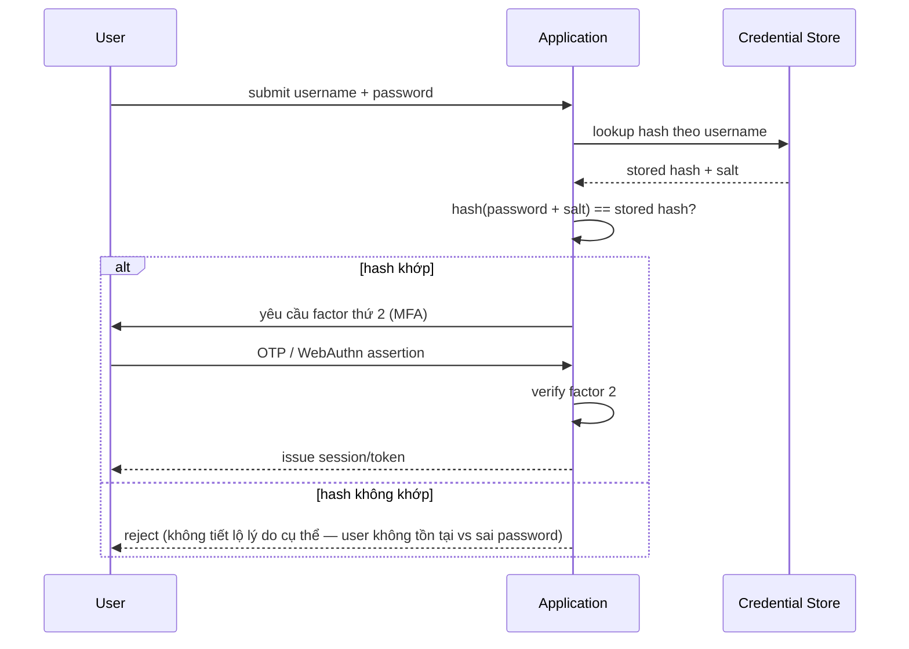

# IAM — Authentication (AuthN)
Tier: 2
Parent: [[Tech/iam/iam]]
Related: [[iam--mfa]], [[iam--authorization]], [[iam--session-token-management]], [[iam--sso]]
Tags: #iam #authentication #security

## What it does

Authentication (AuthN) là quá trình xác minh một identity (user/service/device) đúng là cái nó claim, dựa trên một hoặc nhiều **factor** chứng minh. Kết quả của AuthN là một "khẳng định danh tính đã được verify" — thường được đóng gói thành session hoặc token để dùng cho các bước tiếp theo (authorization).

## Why it exists

Không có AuthN, hệ thống không thể phân biệt request đến từ user thật hay kẻ giả mạo — mọi cơ chế authorization phía sau đều vô nghĩa vì "quyền" gán cho 1 danh tính không xác thực được. AuthN là **nền** bắt buộc phải đúng trước khi nói tới AuthZ; một lỗi AuthN (vd bypass login) làm sập toàn bộ mô hình bảo mật phía sau, bất kể AuthZ được thiết kế chặt chẽ thế nào.

## How it works (flow/diagram)

**3 nhóm factor kinh điển** (Something you know / have / are), một hệ thống MFA tốt kết hợp ≥ 2 nhóm khác nhau (xem [[iam--mfa]]):

| Nhóm | Ví dụ | Điểm yếu |
|---|---|---|
| Something you **know** | Password, PIN, security question | Phishable, đoán được, tái sử dụng giữa nhiều site |
| Something you **have** | OTP hardware token, phone (SMS/push), smart card | SIM-swap (SMS), mất thiết bị |
| Something you **are** | Vân tay, khuôn mặt (biometric) | Không đổi được nếu leak, false accept/reject rate |
| (mở rộng) Something you **do** | Behavioral biometrics (typing pattern, gait) | Ít chuẩn hoá, độ chính xác thấp hơn |

**Flow xác thực điển hình (password-based, có MFA):**

**Adaptive / risk-based authentication:** thay vì luôn hỏi factor 2, hệ thống tính risk score theo context (IP lạ, thiết bị chưa từng thấy, giờ đăng nhập bất thường, impossible travel) rồi quyết định step-up MFA hay không. Giảm friction cho traffic bình thường, siết chặt khi có dấu hiệu bất thường — đánh đổi là cần đủ dữ liệu hành vi để risk engine không sai (false negative bỏ lọt attacker, false positive làm phiền user thật).

**Password storage đúng cách** — không lưu plaintext, không dùng hash nhanh (MD5/SHA-1/SHA-256 trần):
- Dùng thuật toán chuyên cho password: **Argon2id** (khuyến nghị hiện tại), bcrypt, hoặc scrypt — cố tình chậm + tốn RAM để chống brute-force/GPU cracking.
- Salt riêng cho mỗi password (chống rainbow table), không tái sử dụng salt.
- Pepper (secret key thêm ở tầng application, tách khỏi DB) là lớp phòng thủ thêm nếu DB bị leak riêng lẻ.

## Config gotchas

- **Error message khi login sai** — trả message khác nhau cho "user không tồn tại" vs "sai password" là **user enumeration vulnerability**, để attacker dò được danh sách email/username hợp lệ. Luôn trả message generic ("thông tin đăng nhập không đúng").
- **Rate limiting/lockout** — không lockout account vĩnh viễn sau N lần sai (tạo DoS vector: attacker cố tình sai password để khoá account người khác), nên dùng exponential backoff hoặc CAPTCHA theo IP/device kết hợp.
- **Timing attack** — so sánh password/hash phải dùng constant-time compare; nếu early-return khi so sánh string thường, attacker có thể đo response time để dò từng ký tự.
- **"Remember me"** hay bị làm sai — set cookie sống rất lâu nhưng không tách biệt quyền hạn với session vừa MFA xong, vô tình bypass luôn MFA cho lần sau.

## Security notes

- **Credential stuffing** — vì user tái sử dụng password, breach ở site A dùng để thử hàng loạt ở site B. Phòng bằng: rate limit, kiểm tra password đã leak (vd theo kiểu HaveIBeenPwned k-anonymity API), bắt buộc MFA.
- **Phishing** — factor "something you know" (password, OTP đọc qua điện thoại) đều phishable; chỉ WebAuthn/FIDO2 (bind theo origin) mới thực sự chống phishing được — xem [[iam--mfa]].
- **Credential leak qua log/error** — không log password dù đã hash một phần (log request body chứa password là lỗi thường gặp), không để password lọt vào URL query string (bị log ở proxy/access log).
- **Session fixation liên quan AuthN** — phải cấp session ID **mới** sau khi login thành công, không tái sử dụng session ID có từ trước khi xác thực (nếu không, attacker có thể gài sẵn session ID rồi chờ victim login vào chính session đó).

## Tools / Implementations

- **Password hashing libs:** libsodium/Argon2 bindings (mọi ngôn ngữ), `bcrypt` (Node/Python/Go), Passlib (Python).
- **Identity providers có sẵn AuthN flow:** Keycloak, Auth0, Okta, Microsoft Entra ID, AWS Cognito, Supabase Auth, Firebase Auth.
- **Risk/adaptive engine:** Okta Adaptive MFA, Auth0 Attack Protection, tự xây bằng dữ liệu device fingerprint + IP reputation.
- **Breach password check:** Have I Been Pwned Pwned Passwords API (k-anonymity model, không gửi password thật lên server).

## Refs

- NIST SP 800-63B (Authentication & Lifecycle Management): https://pages.nist.gov/800-63-3/sp800-63b.html
- OWASP Authentication Cheat Sheet: https://cheatsheetseries.owasp.org/cheatsheets/Authentication_Cheat_Sheet.html
- OWASP Credential Stuffing Prevention Cheat Sheet: https://cheatsheetseries.owasp.org/cheatsheets/Credential_Stuffing_Prevention_Cheat_Sheet.html
