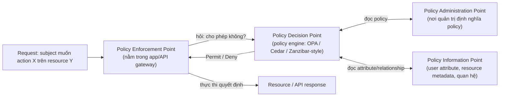

# IAM — Authorization (AuthZ)
Tier: 2
Parent: [[Tech/iam/iam]]
Related: [[iam--authentication]], [[iam--pam-privileged-access]]
Tags: #iam #authorization #security

## What it does

Authorization (AuthZ) quyết định một identity **đã xác thực** (xem [[iam--authentication]]) được phép thực hiện hành động gì trên tài nguyên nào. AuthN trả lời "anh là ai", AuthZ trả lời "anh được làm gì" — hai khái niệm độc lập, thường bị lẫn lộn (HTTP 401 = chưa xác thực, HTTP 403 = đã xác thực nhưng không có quyền).

## Why it exists

Nếu mọi user đã login đều có full quyền, hệ thống multi-tenant/multi-role không thể tồn tại — không phân biệt được "user thường" với "admin", không giới hạn được blast radius khi 1 tài khoản bị chiếm. AuthZ giải quyết bài toán least privilege: giới hạn quyền theo đúng nhu cầu công việc, giảm thiệt hại khi có breach hoặc insider threat.

## When — Dùng khi nào / KHÔNG dùng khi nào?

**Dùng RBAC khi:** quyền hạn map tự nhiên theo chức danh/nhóm (admin, editor, viewer) — đa số hệ thống B2B/SaaS dừng ở đây là đủ.

**Cân nhắc ABAC/ReBAC khi:** quyền phụ thuộc **thuộc tính động** (chỉ owner mới sửa được document của mình, chỉ truy cập được trong giờ hành chính, chỉ xem được data cùng phòng ban) — RBAC thuần sẽ phải tạo ra bùng nổ số lượng role (role explosion) để cover hết case.

**Đừng over-engineer khi:** hệ thống nhỏ, ít role — dùng policy engine phức tạp (OPA/Cedar) cho 3 role đơn giản là thêm surface lỗi (policy viết sai logic) mà không đổi lại giá trị tương xứng.

## How it works (flow/diagram)

**Các mô hình authorization chính:**

| Mô hình | Cơ chế | Ưu điểm | Nhược điểm |
|---|---|---|---|
| **RBAC** (Role-Based) | Gán role → role có set permission cố định | Đơn giản, dễ audit ("user X có role Y") | Role explosion khi cần granularity cao (vd "chỉ sửa doc của chính mình") |
| **ABAC** (Attribute-Based) | Policy đánh giá attribute của subject + resource + environment tại runtime | Linh hoạt, biểu đạt được rule phức tạp | Khó audit/debug ("tại sao request này bị deny?" phải trace qua nhiều attribute), performance cost khi evaluate |
| **ReBAC** (Relationship-Based) | Quyền suy ra từ **quan hệ** giữa entity (owner-of, member-of, parent-folder-of) | Tự nhiên cho hệ thống dạng đồ thị (Google Docs sharing, Slack channel) | Cần graph engine riêng để query hiệu quả ở scale lớn |
| **PBAC** (Policy-Based) | Umbrella term — policy engine trung tâm (thường triển khai ABAC) tách rời khỏi code nghiệp vụ | Centralize logic, 1 nơi audit toàn bộ policy | Thêm 1 hệ thống/network hop cần vận hành |

**Decision flow chung (PDP/PEP model — chuẩn hoá bởi NIST/XACML):**

**Nguyên tắc nền tảng bất kể chọn mô hình nào:**
- **Default deny** — không có rule match = từ chối, không phải cho phép.
- **Least privilege** — cấp đúng quyền cần thiết, không cấp dư "cho chắc".
- **Separation of duties** — hành động nhạy cảm (vd duyệt chi tiêu) cần ≥ 2 người khác nhau thực hiện + phê duyệt, không để 1 role làm được cả 2 bước.

## Config gotchas

- **Check authorization ở đúng chỗ** — validate quyền ở frontend/client không có giá trị bảo mật (chỉ là UX), **phải** enforce lại ở backend cho mọi request — lỗ hổng IDOR (Insecure Direct Object Reference) gần như luôn do thiếu bước này.
- **Deny-by-default bị đảo ngược** — code kiểu `if (!hasPermission) return; ...` dễ bị bug logic khiến nhánh deny bị skip (exception, early return sai chỗ) → fail open thay vì fail closed. Ưu tiên pattern "cho phép tường minh mới tiếp tục" hơn là "chặn tường minh rồi mặc định chạy tiếp".
- **Cache permission quá lâu** — user bị revoke quyền nhưng token/session cache cũ vẫn còn hiệu lực vài phút/giờ — cần cơ chế invalidate cache khi permission thay đổi, đặc biệt cho hành động nhạy cảm (revoke admin phải có hiệu lực gần như tức thời).
- **Multi-tenancy thiếu tenant check** — permission đúng role nhưng quên kiểm tra `resource.tenant_id == user.tenant_id` là lỗi kinh điển dẫn tới cross-tenant data leak.

## Security notes

- **IDOR/BOLA (Broken Object Level Authorization)** — đứng đầu OWASP API Security Top 10 nhiều năm liền: API nhận `resource_id` từ client mà không verify user có quyền trên chính resource đó (chỉ check đã login, quên check ownership).
- **Privilege escalation qua mass assignment** — API cho phép client gửi field `role` hoặc `is_admin` trong request body update profile, backend bind thẳng vào model mà không allowlist field.
- **Confused deputy** — service có quyền cao thực hiện hành động thay mặt user nhưng không truyền/verify lại identity gốc, bị lợi dụng để thực hiện hành động vượt quyền của chính user đó.
- **Audit log bắt buộc cho mọi thay đổi quyền** — cấp/thu hồi role, thay đổi policy — để trace lại khi có sự cố; nếu không log, không thể trả lời "ai cấp quyền này, khi nào" trong điều tra sự cố.

## Tools / Implementations

- **Policy engine (ABAC/PBAC):** Open Policy Agent (OPA) + Rego, AWS Cedar (dùng trong Amazon Verified Permissions), Casbin (đa ngôn ngữ, hỗ trợ nhiều model RBAC/ABAC).
- **ReBAC / Google Zanzibar-style:** SpiceDB, OpenFGA, Ory Keto.
- **RBAC built-in:** hầu hết framework có sẵn (Django permissions, Spring Security, Laravel Gates/Policies).
- **Cloud IAM (ví dụ thực tế của mô hình policy-based):** AWS IAM Policy (JSON), GCP IAM, Azure RBAC — đáng tham khảo vì đã production-hardened ở scale lớn.

## Refs

- OWASP API Security Top 10 — API1:2023 Broken Object Level Authorization: https://owasp.org/API-Security/editions/2023/en/0xa1-broken-object-level-authorization/
- NIST — ABAC guide (SP 800-162): https://csrc.nist.gov/pubs/sp/800/162/final
- Google Zanzibar paper (nền tảng cho ReBAC hiện đại): https://research.google/pubs/pub48190/
- Open Policy Agent docs: https://www.openpolicyagent.org/docs/latest/
