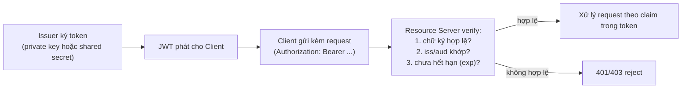

# IAM — JSON Web Token (JWT)
Tier: 2
Parent: [[Tech/iam/iam]]
Related: [[iam--oidc]], [[iam--oauth2]], [[iam--session-token-management]]
Tags: #iam #jwt #security

## What it does

JWT (RFC 7519) là định dạng token dạng chuỗi compact, tự chứa (self-contained) thông tin dưới dạng JSON, được ký số (hoặc mã hoá) để bên nhận verify được tính toàn vẹn mà **không cần hỏi ngược lại** nơi phát hành. Dùng làm ID Token trong OIDC (bắt buộc), và phổ biến làm access token trong nhiều hệ OAuth2/API tự thiết kế.

## Why it exists

Token truyền thống (session ID ngẫu nhiên) đòi hỏi server phải tra database/cache mỗi request để biết token đó ứng với ai — tốn 1 round-trip, và khó scale ngang giữa nhiều service khác nhau (mỗi service phải hỏi cùng 1 nơi lưu session). JWT giải quyết bằng cách **nhúng thẳng claim vào token**, ký số để chống giả mạo — bên nhận chỉ cần verify chữ ký (bằng public key hoặc shared secret) là biết chắc nội dung không bị sửa, không cần gọi mạng. Đánh đổi: vì tự chứa, **không revoke được tức thời** trừ khi thiết kế thêm cơ chế riêng (blacklist, thời hạn ngắn).

## How it works (flow/diagram)

**Cấu trúc: 3 phần, ngăn cách bởi dấu `.`, mỗi phần base64url-encode:**

```
header.payload.signature

header  = {"alg": "RS256", "typ": "JWT", "kid": "key-id-2026-08"}
payload = {"sub": "user-123", "iss": "https://idp.example.com",
           "aud": "app-client-id", "exp": 1756512000, "iat": 1756508400}
signature = SIGN(base64url(header) + "." + base64url(payload), private_key)
```

**Quan trọng: payload chỉ được encode, KHÔNG mã hoá** — bất kỳ ai cũng đọc được nội dung claim bằng cách base64-decode (vd trên jwt.io), kể cả khi không có key để verify chữ ký. **Không bao giờ nhét secret/dữ liệu nhạy cảm vào payload JWT.**



**2 họ thuật toán ký — chọn sai gây lỗ hổng nghiêm trọng:**

| Họ | Thuật toán | Verify bằng | Rủi ro nếu nhầm |
|---|---|---|---|
| **HMAC** (symmetric) | HS256/384/512 | Cùng 1 **shared secret** dùng để ký lẫn verify | Nếu Resource Server verify bằng cùng secret đã dùng ký — **bất kỳ ai giữ secret đều tự ký được token giả**; chỉ an toàn khi issuer và verifier là cùng 1 bên tin cậy tuyệt đối |
| **RSA/ECDSA** (asymmetric) | RS256/384/512, ES256... | **Public key** (verifier không cần biết private key) | An toàn hơn cho hệ nhiều bên verify (OIDC luôn dùng loại này) — private key chỉ IdP giữ |

## Config gotchas

- **Không set `exp` hoặc set quá dài** — vì không revoke được giữa chừng (trừ khi có blacklist), `exp` dài đồng nghĩa cửa sổ rủi ro dài nếu token bị leak.
- **Verify sai `aud`** — token phát cho app A bị app B chấp nhận vì quên check audience, y hệt lỗi tương ứng bên OIDC (xem [[iam--oidc]]).
- **Đổi `alg` từ RS256 sang HS256 lúc verify (Algorithm Confusion)** — nếu code verify **tự đọc `alg` từ header của token** để quyết định cách verify, và server dùng public key (RSA) của IdP làm secret để verify theo HS256, attacker có thể tự ký token bằng chính public key đó (public key ai cũng biết được) làm HMAC secret. **Luôn chỉ định cứng thuật toán mong đợi ở phía verifier**, không bao giờ tin `alg` trong token.
- **Key ID (`kid`) không validate, cho phép trỏ tới file/URL tuỳ ý** — 1 số thư viện cũ cho phép `kid` chỉ định đường dẫn key để load, nếu không kiểm soát input này attacker có thể trỏ tới file do họ kiểm soát (path traversal) hoặc SSRF nếu `kid` là URL.

## Security notes

- **`alg: none` attack** — spec JWT cho phép `alg=none` nghĩa là "không ký". Thư viện verify cũ hoặc cấu hình sai chấp nhận giá trị này mà không reject, coi như token không cần chữ ký hợp lệ vẫn pass — **luôn** whitelist thuật toán cho phép, reject `none` tường minh.
- **Không verify chữ ký, chỉ decode payload rồi trust** — lỗi cực kỳ phổ biến khi dev gọi nhầm hàm `decode()` (chỉ parse) thay vì `verify()` (parse + check signature) của thư viện — token giả mạo hoàn toàn với payload tự chọn vẫn được chấp nhận.
- **Token trong `localStorage` bị đánh cắp qua XSS** — JWT (hay bất kỳ token nào) lưu ở `localStorage`/`sessionStorage` đọc được bởi bất kỳ script nào chạy trên trang (kể cả 3rd-party lib bị compromise) — ưu tiên cookie `HttpOnly` + `Secure` + `SameSite` nếu kiến trúc cho phép (xem [[iam--session-token-management]]).
- **Revocation** — vì JWT tự chứa, "revoke" 1 token trước hạn `exp` đòi hỏi cơ chế ngoài spec: blacklist (defeat mục đích stateless), short-lived token + refresh token dài hạn có thể revoke ở phía server (pattern phổ biến nhất hiện nay), hoặc token binding.
- **Không nên dùng JWT cho session thông thường của web app truyền thống** nếu không thực sự cần tính chất stateless/cross-service — session ID + server-side store đơn giản hơn, revoke dễ hơn, và không có rủi ro của riêng JWT.

## Tools / Implementations

- **Debug/decode (không dùng để xử lý input thật từ user chưa verify):** jwt.io.
- **Thư viện verify chuẩn (không tự viết logic verify):** `jsonwebtoken`/`jose` (Node), `PyJWT`/`authlib` (Python), `jjwt`/`nimbus-jose-jwt` (Java), `golang-jwt` (Go).
- **JWKS (JSON Web Key Set)** — chuẩn để publish public key cho verifier fetch tự động (`jwks_uri` trong OIDC discovery), tránh phải hardcode/copy tay key.

## Refs

- RFC 7519 — JSON Web Token (JWT): https://datatracker.ietf.org/doc/html/rfc7519
- RFC 8725 — JWT Best Current Practices (tổng hợp toàn bộ pitfall trên): https://datatracker.ietf.org/doc/html/rfc8725
- Auth0 — JWT Handbook: https://auth0.com/resources/ebooks/jwt-handbook
- critical vulnerabilities in JSON Web Token libraries (Auth0 blog, algorithm confusion gốc): https://auth0.com/blog/critical-vulnerabilities-in-json-web-token-libraries/
