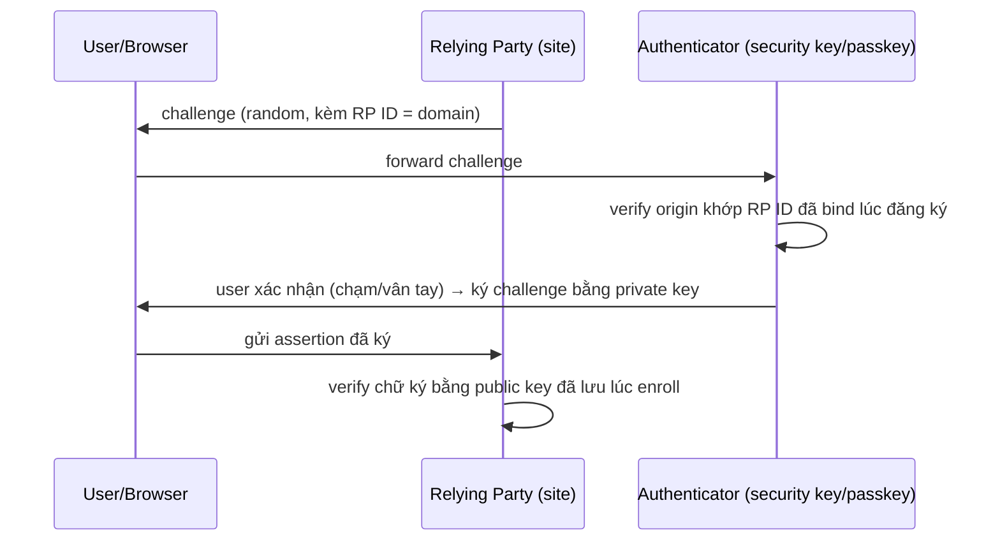

# IAM — Multi-Factor Authentication (MFA)
Tier: 2
Parent: [[Tech/iam/iam]]
Related: [[iam--authentication]], [[iam--sso]]
Tags: #iam #mfa #authentication #security

## What it does

MFA bắt buộc kết hợp ≥ 2 factor từ các nhóm khác nhau (know/have/are — xem [[iam--authentication]]) trước khi xác thực thành công. Mục tiêu: nếu 1 factor bị lộ (password leak) thì attacker vẫn không đăng nhập được vì thiếu factor còn lại.

## Why it exists

Password đơn lẻ là điểm yếu nhất trong AuthN — bị đoán, phish, tái sử dụng, hoặc leak hàng loạt qua breach ở site khác (credential stuffing). MFA không loại bỏ được rủi ro password bị lộ, nhưng chặn được việc lộ password 1 mình dẫn tới account takeover — đây là control đơn lẻ hiệu quả nhất theo hầu hết báo cáo incident (Microsoft/Google từng công bố MFA chặn > 99% automated account takeover).

## When — Dùng khi nào / KHÔNG dùng khi nào?

**Dùng khi:** mọi tài khoản có quyền truy cập dữ liệu nhạy cảm hoặc quyền admin — không có lý do chính đáng để không bật MFA cho các tài khoản này.

**Cân nhắc khi:** SMS OTP — dùng tạm được cho use case rủi ro thấp, nhưng **không** nên là factor duy nhất cho tài khoản quyền cao (dễ bị SIM-swap) — ưu tiên WebAuthn/FIDO2 hoặc TOTP app cho các tài khoản đó.

## How it works (flow/diagram)

**So sánh các phương thức MFA phổ biến:**

| Phương thức | Cơ chế | Chống phishing? | Điểm yếu chính |
|---|---|---|---|
| SMS OTP | Mã gửi qua tin nhắn | Không | SIM-swap, SS7 intercept, độ trễ mạng viễn thông |
| TOTP (Google Authenticator, Authy...) | Mã 6 số sinh từ shared secret + thời gian (RFC 6238) | Không (user vẫn có thể bị lừa nhập mã vào site giả) | Shared secret bị leak lúc setup = clone được; phishing real-time (proxy MITM) vẫn qua được |
| Push notification (Duo, Okta Verify) | App nhận request, user bấm "Approve" | Không hoàn toàn | **MFA fatigue attack** — spam request tới khi user bấm nhầm approve |
| WebAuthn / FIDO2 (security key, passkey) | Public-key challenge-response, **bind theo origin** | **Có** | Cần thiết bị hỗ trợ; recovery flow nếu mất khoá phải thiết kế cẩn thận |

**Vì sao WebAuthn chống phishing được mà TOTP/push không:** WebAuthn ký challenge kèm theo origin (domain) của site đang request — nếu user bị dẫn tới site giả mạo `evi1-bank.com`, trình duyệt sẽ **không** tạo được assertion hợp lệ cho `bank.com`, vì private key chỉ phản hồi đúng origin đã đăng ký lúc enroll. TOTP/push chỉ là 1 chuỗi số/1 cú tap — user hoàn toàn có thể bị lừa nhập/approve trên site giả (attacker relay real-time tới site thật).

## Config gotchas

- **Recovery/backup code** — nếu thiết kế lỏng lẻo (vd cho phép reset MFA chỉ bằng email) thì MFA coi như vô nghĩa vì attacker đi vòng qua account recovery flow thay vì tấn công thẳng vào MFA.
- **"Remember this device 30 ngày"** — tiện UX nhưng kéo dài cửa sổ nếu cookie/token đó bị đánh cắp; cần cân nhắc risk theo loại tài khoản (không nên bật cho tài khoản admin).
- **Enrollment không bắt buộc** — cho phép user tự chọn skip MFA khi login là nguyên nhân phổ biến nhất khiến MFA "có mà như không có" trong audit thực tế.
- **Chỉ hỗ trợ 1 phương thức MFA** — nếu user mất điện thoại (TOTP) mà không có phương án dự phòng hợp lý, sẽ tạo áp lực để helpdesk "tắt tạm MFA" — chính là cửa sau bị social-engineer.

## Security notes

- **MFA fatigue / push bombing** — attacker có password đúng, spam push request liên tục tới khi user bực mình bấm Approve (vụ Uber 2022 là ví dụ điển hình). Giảm thiểu bằng: number matching (user phải nhập số hiển thị trên màn hình login vào app, không chỉ bấm Approve/Deny), rate-limit số request, alert khi có nhiều lần từ chối liên tiếp.
- **SIM-swap** — SMS OTP phụ thuộc vào nhà mạng, kẻ tấn công social-engineer nhà mạng để chuyển số điện thoại nạn nhân sang SIM khác. Không dùng SMS làm factor duy nhất cho tài khoản nhạy cảm.
- **Real-time phishing proxy (AiTM — Adversary-in-the-Middle)** — công cụ như Evilginx proxy toàn bộ traffic qua site giả, lấy được cả password lẫn OTP/session cookie theo thời gian thực, vượt qua được TOTP/push. Chỉ WebAuthn (origin-bound) mới miễn nhiễm hoàn toàn với kiểu tấn công này.
- **Bảo vệ chính flow enrollment MFA** — nếu attacker chiếm được session tạm thời (vd qua XSS) và có thể tự đăng ký thêm 1 MFA method mới, họ tạo được "cửa sau" vĩnh viễn dù password đổi sau đó — enrollment cần re-auth (step-up) trước khi cho phép.

## Tools / Implementations

- **TOTP:** RFC 6238 chuẩn — Google Authenticator, Authy, 1Password, Bitwarden.
- **WebAuthn/FIDO2/Passkeys:** YubiKey (hardware), Touch ID/Face ID/Windows Hello (platform authenticator), thư viện server-side: `SimpleWebAuthn` (Node), `webauthn4j` (Java), `duo-labs/webauthn` (Go), `django-otp` + `django-webauthn` (Python).
- **Push-based MFA:** Duo Security, Okta Verify, Microsoft Authenticator.
- **Enterprise MFA platform:** Okta, Duo, Microsoft Entra ID MFA, Auth0 Guardian.

## Refs

- NIST SP 800-63B — Authenticator Assurance Levels (AAL1/2/3): https://pages.nist.gov/800-63-3/sp800-63b.html
- FIDO Alliance — FIDO2/WebAuthn spec: https://fidoalliance.org/fido2/
- W3C WebAuthn Level 3 spec: https://www.w3.org/TR/webauthn-3/
- CISA — Phishing-Resistant MFA guidance: https://www.cisa.gov/resources-tools/resources/implementing-phishing-resistant-mfa
