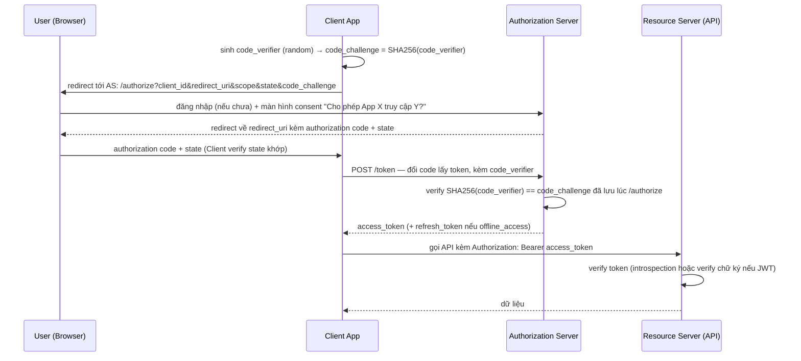

# IAM — OAuth 2.0
Tier: 2
Parent: [[Tech/iam/iam]]
Related: [[iam--oidc]], [[iam--jwt]], [[iam--session-token-management]]
Tags: #iam #oauth2 #federation #security

## What it does

OAuth 2.0 là **authorization framework** (RFC 6749) — cho phép 1 ứng dụng (Client) truy cập tài nguyên trên 1 server khác (Resource Server) **thay mặt** user, với quyền giới hạn (scope), **mà không cần biết password của user**. Quan trọng: OAuth2 **không phải** protocol xác thực — bản thân nó không định nghĩa cách biết user là ai (đó là việc của OIDC, xây trên nền OAuth — xem [[iam--oidc]]).

## Why it exists

Trước OAuth, cách duy nhất để app A dùng dữ liệu của user trên app B là xin **password** của user cho app B (password anti-pattern) — app A có toàn quyền như chính user, không giới hạn được phạm vi, không revoke riêng lẻ được. OAuth giải quyết: (1) app A không bao giờ thấy password thật, (2) quyền được giới hạn theo scope cụ thể (vd chỉ đọc email, không được xoá file), (3) access có thể revoke độc lập mà không cần đổi password gốc.

## When — Dùng khi nào / KHÔNG dùng khi nào?

**Dùng khi:** cần app A gọi API của app B thay mặt user ("Connect your Google Calendar", "Sign in with GitHub" cho mục đích lấy quyền truy cập API chứ không chỉ để biết danh tính), hoặc xây API công khai cho third-party developer.

**KHÔNG dùng khi:** chỉ cần biết "user này là ai" (đăng nhập thuần tuý) — dùng OIDC (xây trên OAuth, chuẩn hoá phần identity mà OAuth cố tình để ngỏ). Dùng OAuth thuần cho mục đích AuthN là nguồn gốc của rất nhiều lỗ hổng lịch sử (trước khi OIDC ra đời, mỗi bên tự chế cách suy ra identity từ access token, không nhất quán và dễ sai).

## How it works (flow/diagram)

**4 role cốt lõi:**
- **Resource Owner** — user, chủ sở hữu dữ liệu.
- **Client** — app muốn truy cập dữ liệu thay mặt user.
- **Authorization Server (AS)** — cấp token (thường gộp chung với IdP trong triển khai OIDC).
- **Resource Server** — API chứa dữ liệu, verify token trước khi trả response.

**Grant type nào dùng khi nào — bảng quyết định:**

| Grant type | Dùng cho | Còn khuyến nghị? |
|---|---|---|
| **Authorization Code + PKCE** | Mọi loại client (web server, SPA, mobile, desktop) | **Có** — khuyến nghị chuẩn duy nhất hiện tại (OAuth 2.1) |
| Authorization Code (không PKCE) | Confidential client cũ (server-side có thể giữ secret an toàn) | Deprecated dần, OAuth 2.1 loại bỏ hoàn toàn |
| **Client Credentials** | Machine-to-machine, không có user (service gọi service) | Có |
| **Device Code** | Thiết bị không có trình duyệt tiện dụng (Smart TV, CLI) | Có |
| Implicit Grant | (Lịch sử) SPA khi chưa có PKCE | **Không** — loại bỏ khỏi OAuth 2.1, token lộ qua URL fragment, không revoke được |
| Resource Owner Password Credentials (ROPC) | (Lịch sử) app tự tin cậy cao nhập thẳng password | **Không** — đi ngược lại chính mục đích OAuth (app lại thấy password) |

**Authorization Code Flow + PKCE (chuẩn hiện tại, dùng cho mọi loại client):**

**Vì sao cần PKCE:** authorization code bị đánh cắp giữa bước redirect (vd qua malicious app trên mobile bắt được custom URI scheme redirect, hoặc log ở proxy) thì kẻ tấn công vẫn không đổi được code lấy token vì thiếu `code_verifier` gốc (chỉ Client giữ, không bao giờ gửi qua URL). PKCE ban đầu thiết kế cho public client (SPA, mobile — không giữ được secret an toàn), nhưng OAuth 2.1 khuyến nghị dùng cho **mọi** loại client kể cả confidential, vì chi phí thêm gần như bằng 0 mà chặn thêm 1 lớp tấn công.

## Config gotchas

- **Redirect URI phải exact-match**, không dùng wildcard hay prefix match lỏng lẻo — đây là điểm bị khai thác nhiều nhất trong thực tế (open redirect chain để đánh cắp code/token qua `redirect_uri` được attacker kiểm soát 1 phần).
- **`state` parameter thiếu hoặc không verify** — mất khả năng chống CSRF trên chính authorization flow (attacker gài `state` của mình, ép victim hoàn tất flow với account của attacker mà victim không biết — login CSRF).
- **Scope quá rộng ("xin hết cho chắc")** — vi phạm least privilege, tăng blast radius nếu token bị leak. Chỉ xin đúng scope cần dùng.
- **Access token sống quá lâu** — nên ngắn (phút tới ~1 giờ); dùng refresh token (sống dài hơn nhưng revoke được, và nên **rotate** mỗi lần dùng — refresh token cũ bị vô hiệu ngay sau khi đổi lấy cái mới, phát hiện được replay nếu 1 refresh token cũ bị dùng lại).
- **Client secret của public client (SPA/mobile)** — **không có cách nào giấu được** secret trong code chạy trên client, vì vậy SPA/mobile phải dùng public client + PKCE, không bao giờ nhúng client_secret vào bundle JS hay APK.

## Security notes

- **Authorization code injection** — nếu AS không bind code với 1 client/redirect_uri cụ thể (hoặc thiếu PKCE), attacker can thiệp giữa flow để tự cấy code của mình vào session của victim.
- **Token leak qua Referer header/log** — access token đặt trong URL (thay vì Authorization header) sẽ lọt vào access log, browser history, Referer header khi navigate sang domain khác — luôn truyền token qua header, không qua query string.
- **Open redirect ở `redirect_uri` validation lỏng** — dùng để redirect user tới trang phishing sau khi có vẻ như "vừa đăng nhập xong" ở domain hợp lệ.
- **Mix-up attack (nhiều AS)** — client giao tiếp với nhiều Authorization Server khác nhau nhưng không phân biệt rõ response đến từ AS nào, dẫn tới gửi code/token cho AS sai. Giảm thiểu bằng cách luôn kiểm tra `iss` (issuer) trong response.
- **Third-party app OAuth phishing (consent phishing)** — attacker tạo 1 "app" hợp lệ về mặt kỹ thuật, xin scope nguy hiểm (đọc email, quản lý file), lừa user bấm "Allow" — vì đây là hành vi OAuth hợp lệ nên khó phát hiện bằng control kỹ thuật thuần, cần review app đăng ký + cảnh báo user.

## Tools / Implementations

- **Authorization Server tự host:** Keycloak, Ory Hydra, ORY Fosite (lib Go), IdentityServer (.NET).
- **AS/IdP SaaS:** Auth0, Okta, Entra ID, AWS Cognito, Google/GitHub OAuth (cho social login cấp API).
- **Debug/test:** `oauth.tools`/jwt.io style debuggers, Postman OAuth2 helper, RFC 8414 discovery endpoint (`/.well-known/oauth-authorization-server`).
- **Thư viện client:** `oauthlib`/`authlib` (Python), `oauth2-server` / Passport.js strategies (Node), Spring Security OAuth2 (Java).

## Refs

- RFC 6749 — The OAuth 2.0 Authorization Framework: https://datatracker.ietf.org/doc/html/rfc6749
- RFC 7636 — PKCE: https://datatracker.ietf.org/doc/html/rfc7636
- OAuth 2.1 draft (hợp nhất best practice, loại bỏ Implicit/ROPC): https://datatracker.ietf.org/doc/html/draft-ietf-oauth-v2-1
- RFC 8252 — OAuth for Native Apps: https://datatracker.ietf.org/doc/html/rfc8252
- OWASP OAuth2 security cheat sheet / IETF OAuth Security Best Current Practice (RFC 9700): https://datatracker.ietf.org/doc/html/rfc9700
