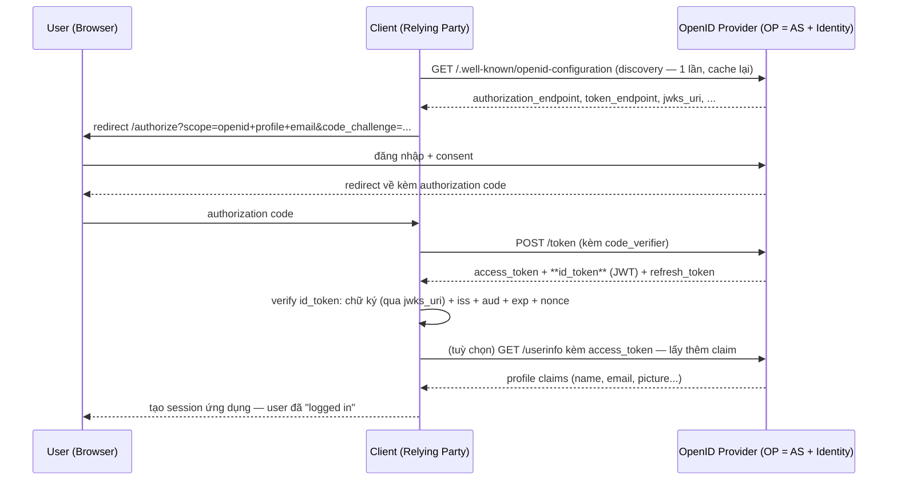

# IAM — OpenID Connect (OIDC)
Tier: 2
Parent: [[Tech/iam/iam]]
Related: [[iam--oauth2]], [[iam--jwt]], [[iam--sso]], [[iam--saml]]
Tags: #iam #oidc #federation #security

## What it does

OIDC là lớp **xác thực (identity layer)** xây **trên nền** OAuth 2.0 (xem [[iam--oauth2]]) — chuẩn hoá cách 1 Client biết chắc "user này là ai" bằng cách thêm vào 1 loại token mới: **ID Token** (luôn là JWT — xem [[iam--jwt]]), cùng với endpoint chuẩn hoá (`/userinfo`, discovery document) và scope đặc biệt `openid`.

## Why it exists

OAuth2 vốn **cố tình không định nghĩa** cách suy ra identity từ access token — mỗi provider (Google, Facebook, GitHub...) trước OIDC tự chế cách riêng để lấy thông tin user (thường bằng cách gọi 1 API riêng bằng access token), dẫn tới không interop được, mỗi tích hợp phải code riêng, và nhiều implementation tự chế mắc lỗi bảo mật (nhầm access token = bằng chứng identity, trong khi access token vốn không được thiết kế để làm việc đó). OIDC giải quyết bằng cách **chuẩn hoá** identity token, ký sẵn (JWT), có `sub` (subject — ID user ổn định), `aud` (audience), `exp`, và cơ chế discovery để client tự động biết endpoint của IdP.

## When — Dùng khi nào / KHÔNG dùng khi nào?

**Dùng khi:** cần "Login with X" đúng nghĩa xác thực — bất kỳ trường hợp nào trước đây định dùng OAuth2 access token để suy ra danh tính, nên chuyển sang OIDC.

**KHÔNG dùng khi:** chỉ cần authorize truy cập API mà không cần biết identity cụ thể (machine-to-machine, Client Credentials Grant) — lúc đó OIDC không áp dụng vì không có Resource Owner là người dùng thật.

## How it works (flow/diagram)

**OIDC tái sử dụng gần như nguyên vẹn các flow của OAuth2**, chỉ thêm scope `openid` và trả thêm ID Token cùng access token. Flow chuẩn hiện tại vẫn là **Authorization Code + PKCE**:

**3 nguồn thông tin identity — dễ nhầm lẫn khi implement:**

| Nguồn | Nội dung | Đã ký chưa? |
|---|---|---|
| **ID Token** | Claim về **thời điểm/sự kiện xác thực**: `sub`, `iss`, `aud`, `exp`, `iat`, `auth_time`, `nonce` | Có (JWT ký bởi OP) — verify được offline bằng public key |
| **UserInfo endpoint** | Claim **hồ sơ** chi tiết hơn (`name`, `email`, `picture`...), gọi bằng access_token | Response thường **không** ký riêng (chỉ bảo vệ bằng TLS + access token hợp lệ) |
| **Access Token** | Dùng để gọi API/UserInfo, **không phải để đọc identity** — với OIDC thường opaque hoặc JWT riêng cho resource server, không nên Client tự parse để lấy identity | Tuỳ AS |

**`nonce` — khác `state`, dễ nhầm:** `state` chống CSRF cho chính flow OAuth; `nonce` được nhúng vào **ID Token** để chống **replay** — Client sinh `nonce` ngẫu nhiên, gửi lúc `/authorize`, rồi bắt buộc phải khớp với claim `nonce` bên trong ID Token nhận về, đảm bảo token này được cấp cho đúng phiên xác thực hiện tại chứ không phải 1 ID Token cũ bị tái sử dụng.

## Config gotchas

- **Không verify `aud` (audience)** — nếu 1 OP phục vụ nhiều Client, thiếu check `aud` nghĩa là ID Token cấp cho Client A cũng được Client B chấp nhận — vi phạm cách ly giữa các app dùng chung 1 IdP.
- **Không verify chữ ký, chỉ decode base64** — thư viện JWT decode được payload mà không tự động verify signature nếu gọi sai hàm (`decode` vs `verify`) — xem chi tiết lỗi này ở [[iam--jwt]].
- **Cache `jwks_uri` quá cứng/không refresh** — khi OP rotate signing key, Client cache key cũ sẽ reject toàn bộ token mới hợp lệ; cần tôn trọng cache header hoặc có cơ chế fetch lại khi gặp `kid` (key ID) lạ.
- **Nhầm access token là bằng chứng identity** — dùng access token (đưa cho Resource Server) để tự suy luận "user là ai" ở Client là sai mục đích thiết kế — Client phải dùng ID Token cho việc này.
- **Bỏ qua `at_hash`** (khi có cả access_token và id_token) — claim này cho phép verify access token không bị thay thế/tráo trong quá trình truyền, hay bị bỏ qua khi implement thủ công.

## Security notes

- **ID Token không phải bearer token dùng để gọi API** — nó chỉ chứng minh sự kiện đăng nhập tại 1 thời điểm, không nên gửi kèm mọi API request như access token; dùng sai mục đích này là lỗi thiết kế phổ biến.
- **Front-channel vs back-channel logout** — OIDC có chuẩn riêng (Session Management, Front-Channel/Back-Channel Logout) để đồng bộ đăng xuất giữa OP và nhiều RP — thường bị bỏ qua khi triển khai nhanh, dẫn tới hành vi SSO logout không nhất quán (xem thêm [[iam--sso]]).
- **`response_type` sai** — dùng `id_token token` (Implicit) thay vì Authorization Code + PKCE sẽ lộ token qua URL fragment, đã bị loại khỏi khuyến nghị hiện tại giống OAuth2.
- **Self-issued OP / decentralized identity** — các mô hình mới hơn (SIOP, Verifiable Credentials) mở rộng OIDC cho identity phi tập trung, chưa phổ biến ở mức enterprise thông thường nhưng đáng biết tên nếu gặp trong tài liệu.

## Tools / Implementations

- **OP tự host:** Keycloak, Ory Hydra, Dex (nhẹ, hay dùng làm OIDC broker phía trước LDAP/AD trong Kubernetes ecosystem).
- **OP SaaS:** Google Identity, Microsoft Entra ID, Okta, Auth0.
- **Thư viện Client (RP):** `openid-client` (Node), `Authlib`/`oidc` (Python), `go-oidc` (Go), Spring Security OAuth2/OIDC (Java).
- **Debug:** truy cập trực tiếp `https://<issuer>/.well-known/openid-configuration` để xem discovery document; jwt.io để decode (không verify) ID Token khi debug local.

## Refs

- OpenID Connect Core 1.0 spec: https://openid.net/specs/openid-connect-core-1_0.html
- OpenID Connect Discovery 1.0: https://openid.net/specs/openid-connect-discovery-1_0.html
- Auth0 — ID Token vs Access Token: https://auth0.com/docs/secure/tokens/id-tokens
- OWASP — OIDC/OAuth threats trong IETF RFC 9700 (OAuth Security BCP, áp dụng chung cho OIDC): https://datatracker.ietf.org/doc/html/rfc9700
