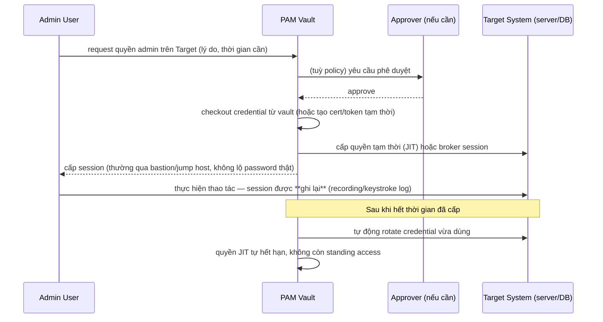

# IAM — Privileged Access Management (PAM)
Tier: 2
Parent: [[Tech/iam/iam]]
Related: [[iam--authorization]], [[iam--mfa]], [[iam--directory-ldap-ad]]
Tags: #iam #pam #security #privileged-access

## What it does

PAM là tập hợp control riêng cho các tài khoản/credential có **quyền cao bất thường** — admin hệ điều hành, root DB, service account, cloud IAM admin — tách biệt khỏi cách quản lý tài khoản user thông thường. Core practice: **vault hoá credential** (không ai biết password thật), cấp quyền **just-in-time** (JIT — chỉ tồn tại trong thời gian cần dùng), và **ghi lại (session recording)** mọi hành động thực hiện với quyền cao.

## Why it exists

Tài khoản quyền cao là mục tiêu giá trị nhất với attacker — 1 credential admin bị lộ có thể dẫn tới compromise toàn hệ thống, trong khi tài khoản user thường chỉ ảnh hưởng phạm vi hẹp. Quản lý các tài khoản này **giống hệt** user thường (password tĩnh, không rotate, ai cũng biết) là rủi ro tập trung quá lớn ở 1 điểm. PAM giải quyết: (1) loại bỏ shared static password (mỗi lần dùng phải "checkout" từ vault, tự động rotate sau khi dùng xong), (2) giới hạn thời gian có quyền (JIT — quyền admin chỉ tồn tại 1-2 giờ thay vì vĩnh viễn "standing access"), (3) audit trail đầy đủ cho hành động nhạy cảm nhất trong hệ thống.

## When — Dùng khi nào / KHÔNG dùng khi nào?

**Dùng khi:** có tài khoản service/admin dùng chung nhiều người biết password, có compliance yêu cầu (PCI-DSS, SOC2) chứng minh kiểm soát được truy cập đặc quyền, hoặc quy mô hạ tầng đủ lớn để "standing admin access" trở thành rủi ro thực sự thay vì lý thuyết.

**Cân nhắc mức độ khi:** team nhỏ, hạ tầng đơn giản — không nhất thiết cần vault đầy đủ tính năng (session recording, workflow phê duyệt phức tạp), nhưng nguyên tắc tối thiểu (không share password tĩnh, MFA cho account admin) vẫn nên áp dụng bất kể quy mô.

## How it works (flow/diagram)

**Standing access vs Just-in-Time (JIT) access — khác biệt cốt lõi của PAM hiện đại so với mô hình cũ:**

| | Standing Access (mô hình cũ) | JIT Access (PAM hiện đại) |
|---|---|---|
| Quyền admin | Có sẵn 24/7 dù không dùng | Chỉ tồn tại trong cửa sổ thời gian yêu cầu |
| Attack window nếu account bị chiếm | Toàn thời gian | Giới hạn theo thời gian cấp |
| Audit | Khó biết "quyền này có đang thực sự cần không" | Rõ ràng — mỗi lần cấp gắn với lý do/ticket cụ thể |

## Config gotchas

- **Vault chỉ lưu credential nhưng không tự rotate** — nếu password vẫn tĩnh sau khi checkout/checkin, giá trị bảo mật giảm đáng kể (khác gì lưu password ở chỗ khác) — rotate tự động sau mỗi lần dùng (hoặc theo lịch) là phần cốt lõi, không phải tính năng phụ.
- **Break-glass account không có quy trình riêng** — mọi tổ chức cần 1-2 tài khoản "khẩn cấp" dùng khi PAM chính bị down, nhưng nếu không giám sát riêng, đây trở thành backdoor không ai kiểm soát.
- **Approval workflow quá chậm cho tình huống incident thực sự khẩn** — nếu process phê duyệt cứng nhắc, team sẽ tìm cách lách (dùng chung 1 account có sẵn quyền để tránh phải xin JIT mỗi lần) — cân bằng giữa kiểm soát và khả năng phản ứng nhanh khi có sự cố.
- **Service account không nằm trong scope PAM** — nhiều tổ chức áp PAM chặt cho human admin nhưng bỏ sót service account/API key (thường có quyền tương đương hoặc cao hơn), trong khi service account thường khó rotate hơn (breaking change nếu không cẩn thận) nên hay bị để static vĩnh viễn.

## Security notes

- **PAM vault là mục tiêu tối thượng** — nó chứa/kiểm soát mọi credential quyền cao khác, compromise vault gần như tương đương compromise toàn hạ tầng — bảo vệ nó ở mức cao nhất (network isolation, MFA bắt buộc, HSM cho key mã hoá vault).
- **Session recording cần bảo vệ tính toàn vẹn** — log/recording chính nó phải immutable/ghi vào nơi admin (kể cả admin cấp cao) không tự xoá được, nếu không mất giá trị làm bằng chứng điều tra.
- **Kerberoasting/credential dumping vẫn là vector chính nhắm vào service account** trong môi trường AD nếu PAM không cover — xem thêm [[iam--directory-ldap-ad]].
- **Separation of duties** — người phê duyệt JIT access không nên là chính người request (trừ trường hợp emergency break-glass có audit riêng).

## Tools / Implementations

- **PAM/Secrets vault:** HashiCorp Vault (dynamic secrets, có thể tự sinh credential tạm thời cho DB/cloud), CyberArk (enterprise PAM truyền thống), BeyondTrust, Teleport (JIT access + session recording tích hợp cho SSH/K8s/DB).
- **Cloud-native JIT:** AWS IAM Identity Center + Permission Sets theo thời gian, GCP Privileged Access Manager, Azure PIM (Privileged Identity Management).
- **Bastion/jump host:** Teleport, AWS Systems Manager Session Manager (không cần mở SSH port trực tiếp), Google IAP.

## Refs

- NIST SP 800-53 — control family AC (Access Control) và PE liên quan đến privileged access: https://csrc.nist.gov/pubs/sp/800/53/r5/upd1/final
- CISA — Privileged Access Management guidance: https://www.cisa.gov/resources-tools/resources/identity-and-access-management
- HashiCorp Vault docs (dynamic secrets concept): https://developer.hashicorp.com/vault/docs/what-is-vault
