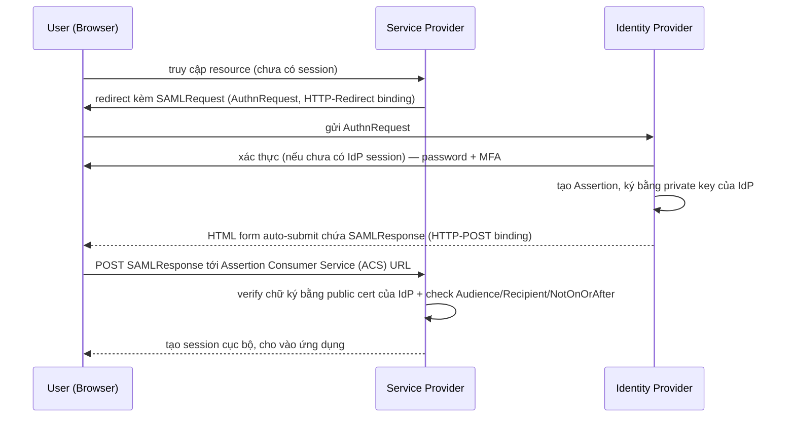

# IAM — SAML 2.0
Tier: 2
Parent: [[Tech/iam/iam]]
Related: [[iam--sso]], [[iam--oidc]]
Tags: #iam #saml #federation #security

## What it does

SAML (Security Assertion Markup Language) 2.0 là chuẩn XML-based để 1 Identity Provider (IdP) truyền đạt "user này đã xác thực, đây là thông tin của họ" cho 1 Service Provider (SP) dưới dạng **Assertion** đã ký số. Ra đời năm 2005, là nền tảng của phần lớn enterprise SSO trước khi OIDC phổ biến.

## Why it exists

Trước SAML, liên kết identity giữa 2 tổ chức (vd công ty A cho nhân viên SSO vào SaaS B) không có chuẩn chung — phải tự chế cơ chế trust riêng cho từng cặp. SAML chuẩn hoá: (1) định dạng assertion (XML, ký bằng XML-DSig) mà bất kỳ SP nào tuân chuẩn cũng verify được, (2) metadata exchange để 2 bên thiết lập trust (trao đổi certificate, endpoint URL) mà không cần custom code riêng cho từng integration.

## When — Dùng khi nào / KHÔNG dùng khi nào?

**Dùng khi:** tích hợp SSO enterprise B2B — rất nhiều SaaS lớn (Salesforce, Workday, SAP, ServiceNow) vẫn expect SAML làm chuẩn tích hợp chính cho khách hàng doanh nghiệp; nhiều tổ chức lớn/chính phủ có hạ tầng SAML lâu năm.

**KHÔNG dùng khi:** xây mới sản phẩm/API hiện đại không có ràng buộc legacy — OIDC nhẹ hơn (JSON thay vì XML), dễ implement đúng hơn (ít XML-signature edge case), phù hợp hơn cho mobile/SPA (SAML thiết kế cho web browser truyền thống, không có chuẩn tốt cho native app). Chỉ chọn SAML khi đối tác/SP yêu cầu cụ thể.

## How it works (flow/diagram)

**3 thành phần chính:**
- **IdP (Identity Provider)** — nơi xác thực user, phát hành Assertion.
- **SP (Service Provider)** — app tiêu thụ Assertion, tạo session cho user.
- **Assertion** — khối XML chứa: `Subject` (user là ai — thường là NameID), `AuthnStatement` (đã xác thực lúc nào, bằng phương thức gì), `AttributeStatement` (thông tin bổ sung: email, role, phòng ban), tất cả nằm trong 1 `<Response>` được **ký số** (XML Signature) để SP verify tính toàn vẹn.

**Binding** — cách assertion được vận chuyển giữa IdP/SP qua trình duyệt:
- **HTTP-Redirect** — dữ liệu nén + encode vào query string (giới hạn kích thước, thường dùng cho `AuthnRequest` đi từ SP→IdP vì nhỏ).
- **HTTP-POST** — dữ liệu nằm trong form tự động submit qua JS (dùng cho `Response`/Assertion đi từ IdP→SP vì thường lớn hơn giới hạn URL).

**SP-initiated flow (phổ biến nhất):**

**Metadata exchange** — trước khi flow trên chạy được, IdP và SP phải trao đổi **metadata XML** (chứa: entity ID, endpoint URL, public certificate để verify chữ ký) — thường làm 1 lần lúc setup integration, thủ công hoặc qua URL metadata tự động cập nhật.

## Config gotchas

- **`Audience` restriction thiếu hoặc sai** — nếu SP không kiểm tra `Audience` trong Assertion khớp đúng entity ID của chính nó, 1 Assertion phát hành cho SP khác (cùng IdP) có thể bị replay để login vào SP này — lỗi rất phổ biến trong implementation tự viết.
- **`NotBefore`/`NotOnOrAfter` không check hoặc clock skew quá lớn** — Assertion có cửa sổ hiệu lực rất ngắn (thường vài phút); lệch giờ giữa IdP/SP là nguyên nhân hàng đầu gây lỗi "assertion expired" ngẫu nhiên khó debug.
- **`InResponseTo` không verify (chỉ áp dụng SP-initiated)** — dùng để khớp Response với đúng AuthnRequest đã gửi, thiếu check này mở đường cho replay assertion cũ.
- **NameID Format lẫn lộn** — `emailAddress`, `persistent`, `transient` có ý nghĩa khác nhau (transient đổi mỗi session, persistent cố định lâu dài) — chọn sai format có thể khiến SP không match được user hiện có với NameID mới (tạo duplicate account) khi đổi cấu hình.
- **Certificate hết hạn** — signing cert của IdP hết hạn mà không rotate kịp = toàn bộ SP tích hợp **đồng loạt fail** verify chữ ký, thường phát hiện muộn vì không có cảnh báo tự động nếu không set riêng.

## Security notes

- **XML Signature Wrapping (XSW)** — lớp tấn công kinh điển của SAML: chèn thêm 1 phần tử XML giả mạo bên cạnh phần tử đã ký hợp lệ, lợi dụng cách parser XML xử lý namespace/thứ tự để SP đọc nhầm nội dung giả trong khi chữ ký vẫn verify đúng trên nội dung gốc. Phòng chống: dùng thư viện SAML đã production-hardened (không tự viết XML parsing/signature verification), luôn validate theo đúng ID đã ký (`Reference URI`) chứ không chỉ theo vị trí trong DOM.
- **Chưa verify chữ ký nhưng vẫn đọc field** — một số implementation lỗi decode Assertion để lấy thông tin trước khi verify signature xong, tương tự lớp lỗi `alg=none` bên JWT.
- **XXE (XML External Entity)** — vì SAML dựa trên XML, parser cấu hình sai (cho phép external entity resolution) có thể bị khai thác đọc file hệ thống hoặc SSRF — luôn disable external entity resolution ở XML parser dùng cho SAML.
- **IdP-initiated SAML dễ bị lợi dụng cho login CSRF hơn SP-initiated** — không có `AuthnRequest`/`InResponseTo` gốc để đối chiếu (xem thêm [[iam--sso]]).
- **Private key ký Assertion bị lộ = giả mạo được Assertion cho mọi user** — bảo vệ signing key của IdP ở mức tương đương root CA, luân chuyển (rotate) định kỳ, HSM nếu compliance yêu cầu.

## Tools / Implementations

- **IdP:** Keycloak, Microsoft AD FS, Shibboleth IdP, Okta, PingFederate, OneLogin.
- **SP libraries (đã hardened, không tự viết XML-DSig):** `python3-saml`/OneLogin SAML toolkit, `samlify` (Node), `ruby-saml`, Spring Security SAML (Java).
- **Debug:** SAML-tracer (browser extension) để xem raw AuthnRequest/Response, `xmlsec1` CLI để verify chữ ký thủ công khi cần điều tra.

## Refs

- OASIS SAML 2.0 Core spec: https://docs.oasis-open.org/security/saml/v2.0/saml-core-2.0-os.pdf
- OASIS SAML 2.0 Technical Overview: https://docs.oasis-open.org/security/saml/Post2.0/sstc-saml-tech-overview-2.0.html
- Duo Security — SAML Security cheat sheet (giải thích XSW dễ hiểu): https://duo.com/blog/duo-finds-saml-vulnerabilities
- OWASP — XXE Prevention Cheat Sheet: https://cheatsheetseries.owasp.org/cheatsheets/XML_External_Entity_Prevention_Cheat_Sheet.html
