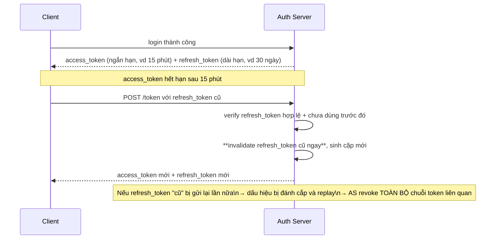

# IAM — Session & Token Management
Tier: 2
Parent: [[Tech/iam/iam]]
Related: [[iam--jwt]], [[iam--oauth2]], [[iam--sso]], [[iam--authentication]]
Tags: #iam #session #token #security

## What it does

Sau khi AuthN thành công, hệ thống cần một cơ chế để "nhớ" user đã xác thực cho các request tiếp theo — mà không bắt họ nhập lại credential mỗi lần. Có 2 cách tiếp cận chính: **session-based** (server giữ state, client chỉ giữ 1 ID tham chiếu) và **token-based** (client giữ token tự chứa thông tin, server verify mà không cần tra state — thường là JWT, xem [[iam--jwt]]).

## Why it exists

Không có cơ chế này, mỗi HTTP request (vốn stateless) sẽ phải xác thực lại từ đầu — không khả thi về UX lẫn hiệu năng. Bài toán thực chất là **cân bằng giữa 2 thứ đối nghịch**: khả năng revoke tức thời (mạnh nhất ở session server-side) và khả năng scale/stateless (mạnh nhất ở token tự chứa) — không có lựa chọn nào thắng tuyệt đối, phải chọn theo yêu cầu hệ thống.

## When — Dùng khi nào / KHÔNG dùng khi nào?

**Session-based (cookie + server-side store) khi:** web app truyền thống, cần revoke tức thời là ưu tiên cao (banking, admin panel), kiến trúc monolith hoặc ít service cần chia sẻ auth state.

**Token-based (JWT/opaque token) khi:** kiến trúc microservice cần nhiều service verify độc lập không muốn phụ thuộc 1 session store trung tâm, mobile/SPA gọi API, cần liên thông với chuẩn OAuth2/OIDC.

**Thực tế phổ biến nhất — kết hợp cả hai:** access token (JWT, ngắn hạn, stateless) cho việc gọi API tốc độ cao + refresh token (dài hạn hơn, lưu server-side, revoke được) để cấp lại access token mới — cân bằng cả 2 ưu điểm.

## How it works (flow/diagram)

**So sánh trực diện:**

| | Session-based | Token-based (JWT) |
|---|---|---|
| Client giữ gì | Session ID ngẫu nhiên (cookie) | Token tự chứa claim (thường trong header/cookie) |
| Server giữ gì | State đầy đủ (session store: Redis/DB) | Không cần giữ gì (verify bằng chữ ký) — trừ khi có blacklist/refresh token |
| Revoke | Tức thời — xoá record ở store | Khó — phải chờ hết hạn hoặc có cơ chế blacklist riêng |
| Scale ngang | Cần session store dùng chung (sticky session hoặc shared cache) | Dễ — mọi instance tự verify độc lập |
| Kích thước request | Nhỏ (chỉ ID) | Lớn hơn (chứa toàn bộ claim) |

**Refresh token rotation — pattern chuẩn hiện tại để vừa stateless (access token) vừa revoke được:**

Cơ chế "reuse detection" ở bước cuối là điểm mấu chốt: nếu attacker đánh cắp được refresh token và dùng nó, còn user thật vẫn tiếp tục dùng token của mình (giờ đã bị invalidate) → cả 2 request refresh gần như chắc chắn sẽ có 1 request dùng token cũ đã bị revoke, kích hoạt cảnh báo.

## Config gotchas

- **Cookie thiếu `HttpOnly`** — JavaScript đọc được session ID/token trong cookie, mất tác dụng chống XSS đánh cắp token vốn là lý do chính để dùng cookie thay vì localStorage.
- **Cookie thiếu `Secure`** — cookie bị gửi qua cả HTTP không mã hoá, lộ qua MITM trên mạng không tin cậy (wifi công cộng).
- **`SameSite` sai giá trị** — `SameSite=None` không kèm `Secure` thì browser hiện đại reject; `SameSite=Lax`/`Strict` cần cân nhắc kỹ nếu có flow cross-site hợp lệ (SSO redirect từ IdP), đặt sai gây mất session ngay sau khi vừa login qua SSO.
- **Session ID sinh không đủ ngẫu nhiên** — dùng nguồn random không phải CSPRNG hoặc entropy thấp, session ID có thể bị đoán/brute-force.
- **Không rotate session ID sau khi privilege thay đổi** (login, đổi password, nâng quyền) — để nguyên session ID cũ là session fixation vector (xem thêm [[iam--authentication]]).
- **Refresh token không giới hạn số thiết bị/không hiển thị cho user quản lý** — user không có cách nào tự revoke "phiên đăng nhập trên điện thoại bị mất" — nên có màn hình "Active sessions/devices" trong mọi hệ thống nghiêm túc.

## Security notes

- **XSS + token ở localStorage = account takeover hoàn toàn** — bất kỳ XSS nào (kể cả qua 1 dependency JS bị compromise) đọc được toàn bộ token, không cần thêm bước nào khác. Đây là lý do nhiều kiến trúc hiện đại chuyển hẳn sang cookie `HttpOnly` cho access/refresh token, chỉ giữ CSRF token (không nhạy cảm bằng) ở phía JS truy cập được.
- **CSRF vẫn là rủi ro của cookie-based session** — đổi lại, cần cặp với CSRF token riêng (double-submit cookie hoặc synchronizer token pattern) vì cookie tự động gửi kèm mọi request cross-site.
- **Token/session không có cơ chế "logout everywhere"** — nhiều incident response cần khả năng revoke toàn bộ session của 1 user (tài khoản bị chiếm) tức thời; nếu kiến trúc thuần JWT không có blacklist/short-TTL, khả năng này gần như không tồn tại cho tới khi token tự hết hạn.
- **Session/token leak qua log** — không log access token/session ID đầy đủ vào application log hay APM tool (chỉ log ID rút gọn/hash nếu cần trace).

## Tools / Implementations

- **Session store:** Redis (phổ biến nhất cho session distributed), Memcached, database-backed session (đơn giản hơn nhưng chậm hơn ở scale lớn).
- **Framework session middleware:** `express-session` (Node), Django sessions, Rails `ActionDispatch::Session`.
- **Refresh token rotation có sẵn:** Auth0, Okta, Keycloak đều hỗ trợ built-in; tự implement cần lưu ý reuse-detection như flow ở trên.
- **CSRF protection:** `csurf` (Node, deprecated nhưng khái niệm vẫn dùng), Django CSRF middleware, Rails `protect_from_forgery`.

## Refs

- OWASP Session Management Cheat Sheet: https://cheatsheetseries.owasp.org/cheatsheets/Session_Management_Cheat_Sheet.html
- OWASP CSRF Prevention Cheat Sheet: https://cheatsheetseries.owasp.org/cheatsheets/Cross-Site_Request_Forgery_Prevention_Cheat_Sheet.html
- RFC 6749 §10 (OAuth2 Security Considerations, refresh token) + RFC 9700 (OAuth Security BCP): https://datatracker.ietf.org/doc/html/rfc9700
- Auth0 — Refresh Token Rotation: https://auth0.com/docs/secure/tokens/refresh-tokens/refresh-token-rotation
