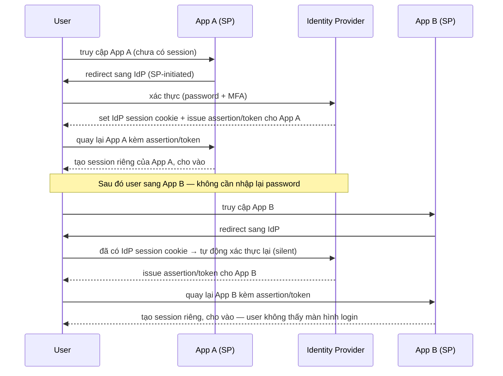

# IAM — Single Sign-On (SSO)
Tier: 2
Parent: [[Tech/iam/iam]]
Related: [[iam--saml]], [[iam--oidc]], [[iam--session-token-management]], [[iam--authentication]]
Tags: #iam #sso #federation

## What it does

SSO là **trải nghiệm** đăng nhập 1 lần vào Identity Provider (IdP) rồi truy cập được nhiều ứng dụng (Service Provider/SP) khác nhau mà không phải nhập lại credential ở từng app. SSO không phải là 1 protocol riêng — nó là kết quả đạt được bằng cách chạy SAML hoặc OIDC (web) hoặc Kerberos (mạng nội bộ Windows/AD) phía dưới.

## Why it exists

Không có SSO: user phải nhớ N bộ credential cho N app → xu hướng dùng password yếu/lặp lại (giảm bảo mật thực tế dù ý định ngược lại), IT không revoke được access tức thời khi user nghỉ việc (phải tắt account ở từng app), UX tệ (login liên tục). SSO tập trung điểm xác thực về 1 IdP — vừa cải thiện UX vừa cho phép enforce policy nhất quán (MFA, password policy) ở đúng 1 chỗ thay vì N chỗ.

## When — Dùng khi nào / KHÔNG dùng khi nào?

**Dùng khi:** tổ chức có ≥ vài app nội bộ/SaaS cần chung 1 danh tính nhân viên, hoặc B2C cần "Login with Google/Facebook" để giảm friction đăng ký.

**KHÔNG dùng / cân nhắc kỹ khi:** app đơn lẻ không có nhu cầu chia sẻ identity — thêm SSO vào chỉ tăng độ phức tạp vận hành (phụ thuộc IdP) mà không có lợi ích tương xứng. Ngoài ra SSO tạo **single point of failure** — nếu không tính toán HA cho IdP, 1 lần IdP down = **không ai đăng nhập được vào bất kỳ đâu**, nặng hơn nhiều so với 1 app riêng lẻ bị down.

## How it works (flow/diagram)

**2 mô hình khởi tạo flow — khác biệt quan trọng hay bị nhầm khi debug:**

- **SP-initiated:** user vào thẳng app trước → app phát hiện chưa có session → redirect user sang IdP → xác thực → quay lại app với token/assertion. Đây là flow phổ biến nhất, tự nhiên với hành vi "gõ URL app rồi mới login".
- **IdP-initiated:** user login vào IdP trước (vd portal nội bộ dạng "app launcher") → chọn app từ danh sách → IdP tự đẩy assertion sang app đó mà app chưa hề request. Rủi ro bảo mật cao hơn (không có `RelayState`/context ban đầu để verify, dễ bị lợi dụng cho login CSRF nếu SP không kiểm tra kỹ) — SAML spec khuyến cáo ưu tiên SP-initiated khi có thể.

Điểm mấu chốt: mỗi SP vẫn tự quản lý **session riêng** của nó (cookie riêng, thời hạn riêng) — SSO chỉ đảm bảo bước xác thực ban đầu không phải lặp lại, không có nghĩa là 1 session duy nhất chia sẻ giữa các app. Chi tiết quản lý session sau khi có token: [[iam--session-token-management]].

## Config gotchas

- **Single Logout (SLO)** — logout khỏi 1 app không tự động logout khỏi app khác trừ khi implement SLO (IdP broadcast logout signal tới mọi SP đã từng issue session). SLO rất hay bị bỏ qua khi triển khai vì phức tạp (back-channel logout cần callback tới từng SP, front-channel dễ bị chặn bởi browser third-party cookie policy) — hậu quả: user tưởng đã logout nhưng session ở app khác vẫn sống.
- **IdP session lifetime vs SP session lifetime lệch nhau** — IdP session dài (vd 8 giờ) nhưng SP set session ngắn (30 phút) → user cứ 30 phút bị "silent re-auth" qua IdP (không thấy form login vì IdP session còn hạn) — hành vi này bình thường nhưng dễ bị hiểu nhầm là bug nếu không biết cơ chế.
- **RelayState/state param không được validate** — trong SAML/OAuth dùng để nhớ "user định vào trang nào trước khi bị redirect" — nếu không validate origin của giá trị này, có thể bị lợi dụng làm open redirect.

## Security notes

- **IdP là single point of trust — compromise IdP = compromise mọi SP.** Đây là lý do IdP luôn cần hardening ở mức cao nhất trong toàn hệ thống (MFA bắt buộc cho tài khoản quản trị IdP, giám sát chặt truy cập, patch nhanh).
- **IdP-initiated SSO dễ bị lạm dụng hơn SP-initiated** — vì SP không có gì để verify "request này có thực sự bắt nguồn từ 1 action hợp lệ của user không", tăng rủi ro CSRF-like login injection nếu SP không kiểm tra kỹ InResponseTo/audience.
- **Third-party cookie blocking (Safari ITP, Chrome đang dần chặn)** ảnh hưởng trực tiếp tới front-channel SSO (silent re-auth qua iframe ẩn) — nhiều hệ thống SSO cũ dựa vào cookie IdP đọc được qua iframe sẽ dần bị breaking, cần chuyển hướng thiết kế sang redirect-based flow thay vì iframe-based.
- **Session/token sau SSO vẫn phải áp dụng đầy đủ nguyên tắc bảo mật session thông thường** (Secure/HttpOnly/SameSite cookie, revoke được) — SSO không tự động làm session "an toàn hơn", nó chỉ gộp bước xác thực.

## Tools / Implementations

- **IdP tự host:** Keycloak (mã nguồn mở, hỗ trợ cả SAML lẫn OIDC), Authentik, Ory Hydra + Kratos.
- **IdP SaaS:** Okta, Microsoft Entra ID (Azure AD), Auth0, PingFederate, OneLogin, JumpCloud.
- **Windows/AD nội bộ:** Kerberos + Active Directory Federation Services (AD FS) cho SSO trong mạng doanh nghiệp.
- **App launcher / portal pattern:** đa số IdP kể trên có sẵn "dashboard app" cho IdP-initiated flow.

## Refs

- OASIS SAML 2.0 Technical Overview (SP-initiated vs IdP-initiated): https://docs.oasis-open.org/security/saml/Post2.0/sstc-saml-tech-overview-2.0.html
- Okta — SP-Initiated vs IdP-Initiated SSO: https://developer.okta.com/docs/concepts/saml/
- OWASP — SSO security considerations trong Authentication Cheat Sheet: https://cheatsheetseries.owasp.org/cheatsheets/Authentication_Cheat_Sheet.html
