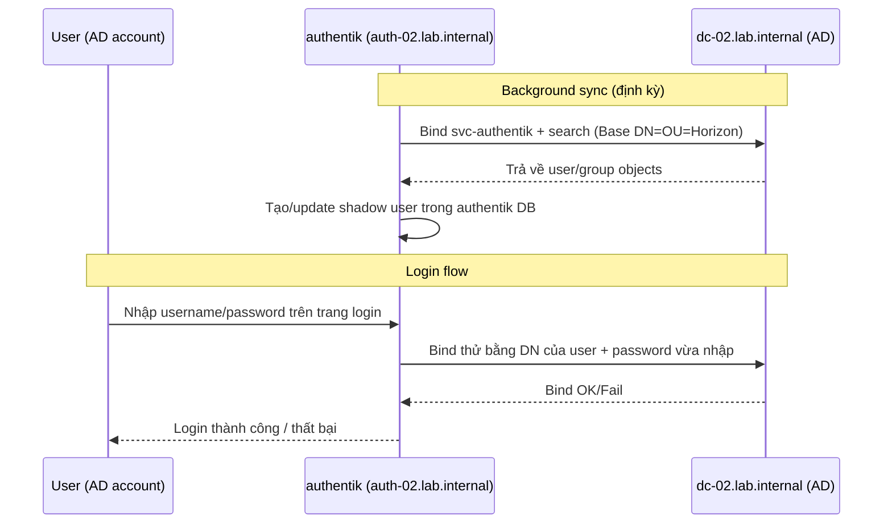

# lab-01 — Kết nối authentik (CE, docker) với Windows AD qua LDAP Source
Tags: #authentik #ldap #active-directory #lab
Last updated: 2026-09-21
Related: [[iam--directory-ldap-ad]], [[iam--authentication]]

> Nguồn: docs.goauthentik.io (bản mới nhất tại thời điểm viết — đường dẫn hiện tại đã đổi từ `sources/active-directory` cũ sang `users-sources/sources/directory-sync/active-directory/`). Xem mục Resources cuối bài.

---

## 0. Bối cảnh & quyết định scope lab này

| Câu hỏi | Quyết định cho lab-01 |
|---|---|
| authentik đã deploy chưa? | Đã chạy sẵn qua docker (CE, latest) tại `auth-02.lab.internal` — lab này **không** cover phần docker-compose deploy |
| Giao thức LDAP | **Plain `ldap://` (port 389)** — chỉ để test nhanh trong lab đóng, **không dùng ngoài môi trường test** (xem cảnh báo §1.3) |
| Scope sync | Chỉ **`OU=Horizon`** (không sync toàn domain `lab.internal`) |
| Password writeback | **Không** — chỉ read-only sync (authentik đọc user/group từ AD để login, không ghi ngược password về AD) |

**Môi trường:**
- Domain: `lab.internal`
- DC: `dc-02.lab.internal`
- authentik: `auth-02.lab.internal` (docker, CE)
- Service account có sẵn: `CN=svc-authentik,OU=ServiceAccount,OU=Horizon,DC=lab,DC=internal`
- Base DN sync: `OU=Horizon,DC=lab,DC=internal` (bao gồm `ServiceAccount`, `Team-01-Users`, `Team-02-Users`, `VDI-Core-Infra`)

```
lab.internal
└── OU=Horizon                          ← Base DN cho LDAP Source
    ├── OU=ServiceAccount
    │   ├── svc-horizon                 (không liên quan lab này)
    │   └── svc-authentik               ← bind account cho authentik
    ├── OU=Team-01-Users
    ├── OU=Team-01-VDIs
    ├── OU=Team-02-Users
    ├── OU=Team-02-VDIs
    └── OU=VDI-Core-Infra
```



---

## 1. Chuẩn bị phía AD (dc-02.lab.internal)

### 1.1 Xác nhận service account `svc-authentik`

Account đã tồn tại sẵn (`OU=ServiceAccount,OU=Horizon`). Kiểm tra/chỉnh lại các thuộc tính sau trong **Active Directory Users and Computers**:

- Đặt password mạnh, ví dụ tạo bằng `openssl rand -base64 36`.
- **Bỏ tick** "User must change password at next logon".
- Tick **"Password never expires"** — vì đây là service account, nếu không sync sẽ fail âm thầm khi password hết hạn theo domain policy (xem Gotchas §5).
- Không cần thêm vào nhóm đặc quyền nào — vì lab này **không dùng writeback**, account chỉ cần quyền **đọc** mặc định của "Authenticated Users" trong AD (mặc định đã đủ để search/read user, group, hầu hết attribute thông thường).

### 1.2 Kiểm tra quyền đọc trên OU Horizon

Không cần Delegation of Control Wizard cho lab read-only này. Chỉ cần xác nhận không có ACE nào **Deny Read** trên `OU=Horizon` áp dụng cho `svc-authentik` hoặc nhóm nó thuộc về (Properties > Security trên OU Horizon).

### 1.3 ⚠️ Cảnh báo — plain LDAP (port 389, không mã hoá)

- Bind password của `svc-authentik` sẽ đi qua mạng **dạng plaintext** (LDAP simple bind không mã hoá). Chỉ chấp nhận được vì đây là lab đóng, network cô lập.
- **Không** áp dụng cấu hình này ra ngoài lab/production. Khi lên production: đổi `ldap://` → `ldaps://` (port 636, cần AD CS cấp cert cho DC) hoặc bật StartTLS.

### 1.4 Kiểm tra LDAP signing requirement trên DC

Từ các bản vá bảo mật AD gần đây (ADV190023 trở đi), nhiều DC set **"Domain controller: LDAP server signing requirements"** = `Require signing`. Nếu đang ở mức này, **simple bind qua plain LDAP sẽ bị từ chối** (lỗi `ldap_bind: Strong(er) authentication required`, code 8) — dù password đúng.

Kiểm tra trên `dc-02`:
```powershell
# Xem policy hiện tại (Default Domain Controllers Policy hoặc local security policy trên DC)
# Computer Configuration > Windows Settings > Security Settings > Local Policies > Security Options
# > "Domain controller: LDAP server signing requirements"
```
Nếu là `Require signing` → cho lab này tạm đổi về `None`/`Negotiate signing`, hoặc chuyển sang LDAPS/StartTLS thay vì hạ cấp bảo mật DC.

### 1.5 Test bind từ ngoài trước khi cấu hình authentik

Từ một máy có `ldapsearch` (hoặc dùng `ldp.exe` trên Windows), test trước khi đụng vào UI authentik để tách lỗi mạng/AD khỏi lỗi cấu hình authentik:

```bash
ldapsearch -x -H ldap://dc-02.lab.internal -D "svc-authentik@lab.internal" -W \
  -b "OU=Horizon,DC=lab,DC=internal" "(objectClass=user)" sAMAccountName
```

Nếu lệnh này fail (timeout / bind refused), đừng sang bước 2 — fix network/AD trước (firewall port 389/tcp+udp giữa host chạy container authentik và `dc-02`, DNS resolve `dc-02.lab.internal` từ container).

---

## 2. Tạo LDAP Source trên authentik

Đăng nhập admin interface: `https://auth-02.lab.internal/if/admin/`

**Directory > Federation and Social login > Create > LDAP Source**

### 2.1 Basic

| Field   | Value             |
| ------- | ----------------- |
| Name    | `AD - Horizon OU` |
| Slug    | `ad-horizon`      |
| Enabled | ✅                 |

### 2.2 Connection settings

| Field           | Value                           | Ghi chú                                                                                           |
| --------------- | ------------------------------- | ------------------------------------------------------------------------------------------------- |
| Server URI      | `ldap://dc-02.lab.internal`     | Plain LDAP theo quyết định §0. Có thể liệt kê nhiều DC cách nhau bằng dấu phẩy nếu có DC dự phòng |
| Enable StartTLS | ❌ off                           | Bỏ qua cho lab này                                                                                |
| Bind CN         | `svc-authentik@lab.internal`    | Dùng UPN — đơn giản hơn full DN, cần đúng UPN suffix domain                                       |
| Bind Password   | *(password của svc-authentik)*  |                                                                                                   |
| Base DN         | `OU=Horizon,DC=lab,DC=internal` | Giới hạn scope sync đúng theo §0                                                                  |

### 2.3 LDAP Attribute mapping

- **User Property Mappings**: chọn tất cả mapping bắt đầu bằng `authentik default LDAP Mapping` **và** `authentik default Active Directory Mapping`.
- **Group Property Mappings**: chọn `authentik default LDAP Mapping: Name`.

> ⚠️ Nếu bật **Sync users**/**Sync groups** mà **không chọn property mapping tương ứng**, sync sẽ **không chạy** — và không báo lỗi rõ ràng ở form. Phải check **Dashboards > System Tasks** để thấy job fail/skip.

### 2.4 Additional settings

| Field                             | Value                                            | Vì sao                                                                                                                                                     |
| --------------------------------- | ------------------------------------------------ | ---------------------------------------------------------------------------------------------------------------------------------------------------------- |
| User object filter                | `(&(objectClass=user)(!(objectClass=computer)))` | Loại computer account (AD trả cả computer object nếu không lọc)                                                                                            |
| Group object filter               | `(objectClass=group)`                            |                                                                                                                                                            |
| Object uniqueness field           | `objectSid`                                      | SID là định danh ổn định nhất cho object AD                                                                                                                |
| Sync users                        | ✅                                                |                                                                                                                                                            |
| Sync groups                       | ✅                                                |                                                                                                                                                            |
| User password writeback           | ❌ off                                            | Theo quyết định §0 — không writeback                                                                                                                       |
| Update internal password on login | Tuỳ chọn — xem Gotchas §5 nếu bật                | Nếu bật: authentik lưu hash password sau lần bind LDAP thành công đầu tiên (hữu ích nếu AD tạm mất kết nối), nhưng tăng bề mặt cần bảo vệ (hash lưu local) |

Click **Finish** để lưu — sync chạy nền ngay sau đó.

---

## 3. Kích hoạt login bằng tài khoản AD

LDAP Source không tự động cho phép login — cần bật LDAP làm **backend xác thực password** trong flow login mặc định.

**Customization > Stages** → tìm stage password đang dùng trong `default-authentication-flow` (thường tên `default-authentication-password`) → **Edit**.

Trong field **Backends**, tick thêm:
- ✅ `User database + LDAP password`

Giữ nguyên `User database + standard password` nếu vẫn muốn các account local (built-in `akadmin`, v.v.) login bình thường song song.

Save. **Không cần** bind LDAP Source vào flow theo kiểu OAuth/SAML source (nút "Login with X") — cơ chế LDAP source hoạt động qua sync (tạo shadow user) + password backend, khác hẳn social/federation source.

---

## 4. Kiểm tra / Test

1. **Directory > Users** — xác nhận thấy user thật trong `OU=Horizon` (vd 1 user test trong `Team-01-Users`) xuất hiện, cột nguồn (source) trỏ về `AD - Horizon OU`.
2. **Dashboards > System Tasks** — xác nhận task sync LDAP chạy `successful`, không có lỗi.
3. Mở trang login authentik (`https://auth-02.lab.internal/if/flow/default-authentication-flow/`), đăng nhập bằng username + password của user AD thật (không phải svc-authentik) → phải login được.
4. Nếu có group AD thật (không phải OU) trong `OU=Horizon`, kiểm tra **Directory > Groups** thấy group được sync về.

---

## 5. Troubleshooting & Gotchas

- **Lỗi bind code 8 "Strong(er) authentication required"** → DC đang enforce LDAP signing, xem §1.4. Fix: đổi policy tạm cho lab, hoặc chuyển LDAPS/StartTLS (khuyến nghị lâu dài).
- **Sync "thành công" nhưng không thấy user nào** → thường do quên chọn property mapping (§2.3), hoặc `Base DN`/filter sai scope. Check System Tasks log chi tiết, không chỉ nhìn status xanh/đỏ.
- **OU ≠ Group** — `Team-01-Users`, `Team-02-Users` trong ảnh là **OU** (tổ chức), không phải AD Group. LDAP source chỉ sync object có `objectClass=group`, **không** tự tạo group tương ứng theo OU. Nếu sau này cần phân quyền theo Team-01/Team-02 trong authentik (policy binding theo group), phải tạo AD Group thật (vd `grp-team-01`) chứa user tương ứng, hoặc tách riêng LDAP source theo từng OU con.
- **svc-authentik password hết hạn theo domain policy** → sync fail âm thầm (không có ai gõ login để nhận biết vì đây là service account). Đã set "Password never expires" ở §1.1 để tránh, nhưng nếu domain có Fine-Grained Password Policy override riêng, cần kiểm tra lại — cân nhắc dùng gMSA cho production thay vì password tĩnh.
- **`objectSid` làm uniqueness field** — nếu về sau di chuyển object sang domain/forest khác, SID đổi → authentik coi là user mới, có thể tạo duplicate. Bình thường trong 1 domain thì ổn định, chỉ cần lưu ý nếu có kế hoạch migrate domain.
- **DNS** — container authentik phải resolve được `dc-02.lab.internal`; nếu chạy trong docker network riêng, kiểm tra DNS forwarder của container trỏ đúng về DC hoặc thêm entry thủ công.

---

## 6. Việc chưa làm trong lab này (để mở rộng sau)

- LDAPS/StartTLS với cert từ AD CS (khi ra khỏi lab đóng).
- Password writeback (cần Delegation of Control Wizard cấp quyền reset password cho `svc-authentik`).
- Phân quyền theo Team-01/Team-02 qua AD Group thật + policy binding trong authentik.
- Mở rộng Base DN ra toàn domain `lab.internal` nếu cần nhiều OU hơn ngoài Horizon.

---

## Resources

- Active Directory integration (authentik docs, bản mới nhất): https://docs.goauthentik.io/users-sources/sources/directory-sync/active-directory/
- Generic LDAP source (toàn bộ field reference): https://docs.goauthentik.io/users-sources/sources/protocols/ldap/
- Password stage (khái niệm Backends): https://docs.goauthentik.io/add-secure-apps/flows-stages/stages/password/
- [[iam--directory-ldap-ad]] — nền tảng LDAP/AD chung
