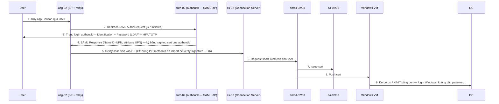

# lab-02 — Cấu hình authentik làm SAML IdP cho Horizon True SSO (thay ADFS)
Tags: #authentik #saml #idp #horizon #true-sso #lab
Last updated: 2026-09-21
Related: [[lab-01-authentik-ad-ldap-source]], [[iam--saml]], [[iam--sso]]

> Nguồn: docs.goauthentik.io (bản mới nhất tại thời điểm viết, xem mục Resources). Phần vdmUtil/Enrollment Server/AD CA **không đổi** so với lúc dùng ADFS — không viết lại trong bài này, xem lại file `true-sso-planning.xlsx` (sheet `TrueSSO-Release`) cho phần đó.

---

## 0. ⚠️ 3 quyết định chưa được bạn xác nhận trực tiếp

Mình đã hỏi lại nhưng chưa nhận được phản hồi, nên **tạm dùng phương án khuyến nghị** bên dưới để soạn bài lab — báo lại nếu muốn đổi, mình sẽ sửa phần tương ứng ngay (không phải viết lại từ đầu):

| Quyết định | Đã chọn tạm (default) | Vì sao | Đổi thì ảnh hưởng phần nào |
|---|---|---|---|
| **Auth method đứng sau SAML IdP** | Password (LDAP source `ad-horizon` từ [[lab-01-authentik-ad-ldap-source]]) **+ MFA TOTP** | ADFS cũ dùng Certificate Authentication (PIV) làm primary. Theo `true-sso-planning.xlsx` sheet `PIV-Authentication`, thử PIV trên authentik đã **Fail — "PIV authen trên Authentik cần license"** (2026-09-17). Đã verify lại qua docs mới nhất: **mTLS Stage là tính năng Enterprise**, bản CE không có ([docs.goauthentik.io/add-secure-apps/flows-stages/stages/mtls](https://docs.goauthentik.io/add-secure-apps/flows-stages/stages/mtls/)). Nên thêm MFA TOTP để bù lại phần "2 yếu tố" mà cert auth từng cung cấp | §2.3 (bỏ nếu chỉ muốn password) |
| **Signing certificate cho SAML Provider** | Self-signed, authentik tự generate riêng cho SAML (không dùng chung web cert) | Đơn giản cho lab, không phụ thuộc AD CA/EJBCA đang bận cho Enrollment Server. Giống cách ADFS dùng token-signing cert tự sinh riêng | §2.2 (đổi sang cert từ ca-02/ca-03 nếu muốn) |
| **Scope phần tích hợp Horizon** | Mirror đầy đủ **UAG + Connection Server** như ADFS đã làm (Identity Bridging trên UAG **và** import metadata vào CS Manage SAML Authenticators) | Đúng những gì `true-sso-planning.xlsx` đã làm với ADFS (bước 4-7 sheet `TrueSSO-Release`) — thiếu phần CS thì True SSO qua UAG relay assertion có thể không validate được signature | §5, §6 |

**Không giả định** (đã verify từ docs, không phải đoán):
- Danh sách 7 default SAML property mapping của authentik gồm sẵn `UPN` — khớp chính xác claim rule ADFS cũ đã cấu hình (NameID = UPN passthrough + attribute `UPN`) → không cần tạo custom mapping.
- `docs.goauthentik.io/.../mtls/` xác nhận mTLS Stage là Enterprise-only tại thời điểm viết bài (2026-09-21).

---

## 1. Môi trường (từ `true-sso-planning.xlsx` sheet `Infras-Lab`)

| Host | IP | Vai trò | Đổi trong lab-02? |
|---|---|---|---|
| `dc-02.lab.internal` | 172.29.25.95 | AD DC | Không |
| `cs-02.lab.internal` | 172.29.25.96 | Horizon Connection Server | Sửa: trỏ SAML Authenticator sang authentik (§6) |
| `uag-02.lab.internal` | 172.29.25.97 | Unified Access Gateway | Sửa: Identity Provider Metadata + Auth Method (§5, §7) |
| `ca-02.lab.internal`, `ca-03.lab.internal` | 172.29.25.98/99 | AD CA (subordinate, chain lên EJBCA) | Không |
| `enroll-02.lab.internal`, `enroll-03.lab.internal` | 172.29.25.100/101 | Horizon Enrollment Server | Không |
| `auth-02.lab.internal` | 172.29.25.90 | **authentik (CE, docker)** | Nhân vật chính bài lab |
| `adfs-02.lab.internal` | 172.29.25.102 | ADFS (đang là SAML IdP hiện tại) | Bị thay thế bởi authentik |

---

## 2. Kiến trúc — authentik thay vị trí ADFS ở đâu

**Điểm khác biệt duy nhất so với lúc dùng ADFS:** bước 2-4 (SAML AuthnRequest/Response) đổi endpoint từ `adfs-02` sang `auth-02`, và bước xác thực bên trong (3) đổi từ Certificate Authentication (PIV) sang Password+MFA vì giới hạn license CE (xem §0). **Từ bước 5 trở đi (relay, Enrollment Server, AD CA, PKINIT) hoàn toàn không đổi.**

---

## 3. Chuẩn bị trên authentik trước khi tạo SAML Provider

### 3.1 Xác nhận LDAP source từ lab-01 vẫn hoạt động

**Directory > Federation and Social login** → mở source `AD - Horizon OU` → tab **Sync** → confirm lần sync gần nhất `successful`. Nếu chưa làm lab-01, phải làm trước — SAML Provider ở đây dùng lại chính password backend đó.

### 3.2 Tạo Signing Certificate riêng cho SAML

**System > Certificates > Generate** (không dùng chung với cert web TLS mặc định của authentik):

| Field            | Value                                  |
| ---------------- | -------------------------------------- |
| Common Name      | `saml-signing.auth-02.lab.internal`    |
| Subject Alt Name | *(để trống, hoặc thêm nếu SP yêu cầu)* |
| Validity         | Theo policy nội bộ (vd 2 năm)          |

Lưu lại — sẽ chọn cert này làm **Signing Certificate** khi tạo Provider ở §4.

### 3.3 (Theo quyết định §0) Tạo MFA TOTP — Setup stage + Validation stage

**Bước A — Tạo TOTP Setup stage:**
Customization > Stages > Create > **Authenticator TOTP Setup Stage**
- Name: `totp-setup`
- Digits: 6 (mặc định)

**Bước B — Tạo Authenticator Validation stage:**
Customization > Stages > Create > **Authenticator Validation Stage**
- Name: `mfa-validate`
- Device classes: `TOTP`
- Not configured action: **Configure**
- Configuration stages: chọn `totp-setup` (stage vừa tạo ở Bước A) — user chưa có TOTP sẽ tự động được đưa qua setup ở lần login đầu tiên.

**Bước C — Bind `mfa-validate` vào `default-authentication-flow`:**
Flows and Stages > Flows > `default-authentication-flow` > tab **Stage Bindings** > **Bind stage** > chọn `mfa-validate`.
- Đặt **Order** lớn hơn stage password (đã bật LDAP backend ở lab-01) và nhỏ hơn stage login cuối cùng — mở tab Stage Bindings hiện tại để xem order đang dùng và chèn số ở giữa (vd password=20 → đặt mfa-validate=25 → login giữ nguyên).

> Đây là thay đổi trên **flow mặc định toàn hệ thống**, ảnh hưởng mọi login vào authentik chứ không riêng SAML app Horizon. Nếu muốn MFA chỉ áp dụng riêng cho app Horizon, cần clone `default-authentication-flow` thành flow riêng và gán flow đó cho Application ở §4 (Authentication flow field) thay vì sửa flow mặc định.

---

## 4. Tạo SAML Application + Provider (Phase A — skeleton)

**Applications > Applications > Create with wizard** (đây là cách authentik docs khuyến nghị — gộp Application + Provider trong 1 luồng).

### 4.1 New application

| Field | Value         |
| ----- | ------------- |
| Name  | `Horizon UAG` |
| Slug  | `horizon-uag` |

### 4.2 Provider Type → **SAML Provider**

### 4.3 Configure SAML Provider

| Field                    | Value                                                         | Ghi chú                                                                                                                                                                                                                                               |
| ------------------------ | ------------------------------------------------------------- | ----------------------------------------------------------------------------------------------------------------------------------------------------------------------------------------------------------------------------------------------------- |
| Authorization flow       | `default-provider-authorization-implicit-consent`             | Mặc định                                                                                                                                                                                                                                              |
| **ACS URL**              | *(placeholder tạm)* `https://uag-02.lab.internal/PLACEHOLDER` | ⚠️ Giá trị thật chưa biết — UAG chỉ sinh ra SP metadata **sau khi** đã nhận IdP metadata của authentik (giống hệt cách ADFS-UAG từng làm, xem bước 4-5 sheet `TrueSSO-Release`). Sẽ sửa lại chính xác ở §5.3 bằng cách import SP metadata thật từ UAG |
| Issuer / Audience        | `https://uag-02.lab.internal`                                 | Sẽ được ghi đè khi import SP metadata ở §5.3 nếu khác                                                                                                                                                                                                 |
| Service Provider Binding | `Post`                                                        | Chuẩn phổ biến nhất cho ACS, sẽ confirm lại theo SP metadata thật                                                                                                                                                                                     |
| Signing Certificate      | `saml-signing.auth-02.lab.internal` (đã tạo ở §3.2)           |                                                                                                                                                                                                                                                       |
| NameID Property Mapping  | `authentik default SAML Mapping: UPN`                         | Tương đương Rule 1 của ADFS cũ (Incoming UPN → outgoing Name ID, passthrough)                                                                                                                                                                         |
| Property mappings        | Chọn ít nhất `authentik default SAML Mapping: UPN`            | Tương đương Rule 2 của ADFS cũ (LDAP User-Principal-Name → claim `UPN`). Có thể chọn thêm Email/Username nếu muốn, không bắt buộc cho True SSO                                                                                                        |

Click **Submit/Finish**. Provider + Application được tạo — **lấy metadata ngay để dùng ở bước tiếp theo**:

Applications > Providers > `Horizon UAG` (provider) > tab **Metadata** hoặc nút download ở tab overview (Related objects) → tải file `.xml`, hoặc mở URL: `https://auth-02.lab.internal/application/saml/horizon-uag/metadata/`.

---

## 5. Tích hợp vào UAG (Identity Bridging)

*(Phần "hướng dẫn qua" — mirror đúng bước 4-5 mà ADFS đã làm trong `true-sso-planning.xlsx`, chỉ đổi nguồn metadata)*

### 5.1 Upload IdP metadata của authentik lên UAG
UAG Admin UI (`https://uag-02.lab.internal:9443/admin`) → **Advanced Settings > Identity Bridging Settings > Upload Identity Provider Metadata** → chọn file `.xml` tải ở §4 cuối bước.

### 5.2 Lấy SAML Service Provider metadata của UAG
**Edge Service Settings > Horizon Settings** → chuyển Auth Method sang **SAML** → chọn Identity Provider vừa upload (authentik) → nút **"Download SAML service provider metadata"** → lưu file SP metadata này lại.

### 5.3 Nạp SP metadata thật của UAG ngược vào authentik để chốt ACS/Audience
Applications > Providers > `Horizon UAG` > **Edit** → dùng phần import SP metadata (hoặc tạo mới qua **Applications > Providers > Create > "SAML Provider from Metadata"** nếu bản UI hiện tại không cho sửa trực tiếp field từ metadata đã có provider) → upload file SP metadata từ §5.2 → authentik tự điền lại chính xác **ACS URL**, **Audience/Issuer**, **SP Binding** theo đúng những gì UAG yêu cầu, thay cho placeholder ở §4.3.

> Đây là bước **bắt buộc** — placeholder ở §4.3 chỉ để có metadata ban đầu upload lên UAG (UAG không cần ACS URL của IdP để hoạt động, chỉ cần SSO URL + signing cert). Nếu bỏ qua §5.3, ACS URL sai thì UAG sẽ nhận SAML Response nhưng không đối chiếu được với AuthnRequest ban đầu → lỗi login.

---

## 6. Tích hợp vào Connection Server (Manage SAML Authenticators)

*(Mirror bước 7 sheet `TrueSSO-Release`, chỉ đổi nguồn metadata từ ADFS sang authentik)*

Horizon Console → **Settings > Servers > Connection Servers** → `cs-02` → **Edit** → tab **Authentication**:
- Đặt **"Delegation of Authentication to VMware Horizon (SAML 2.0 Authenticator)"** = **Allowed** (nếu chưa bật).
- **Manage SAML Authenticators > Add** → Type = **Static** → paste nội dung file IdP metadata của authentik (cùng file đã dùng ở §5.1).
- Tick **"Enabled for Connection Server"**.
- **Restart service VMware Horizon Connection Server** để áp dụng (giống lưu ý ADFS cũ).

> Mục đích: CS cần biết signing certificate của authentik để verify chữ ký trên SAML assertion được UAG relay vào — không phải CS tự làm SP thứ hai.

---

## 7. Chuyển authentication method sang authentik (không đổi so với quy trình ADFS)

Hai bước này **giống hệt** những gì đã làm với ADFS trong `true-sso-planning.xlsx` (mục "Thay đổi phương thức đăng nhập từ X509/Passthrough sang SAML") — chỉ khác Identity Provider đã chọn ở §5.1-5.2 giờ là authentik thay vì ADFS:

1. **UAG** → General Settings > Edge Service Settings > Auth Methods > SAML → chọn Identity Provider = authentik (đã upload §5.1).
2. **Connection Server** → Authentication > Current User Authentication > Accept logon as current user → **True-SSO integration = Enable**.

⚠️ Cùng lưu ý cũ: user sẽ tạm gián đoạn truy cập trong lúc chuyển đổi — nên làm ngoài giờ cao điểm, có backout plan (chuyển Auth Method về như cũ) sẵn sàng.

---

## 8. Test / Verify

1. **authentik**: Applications > Providers > `Horizon UAG` > tab Preview (nếu có) hoặc trực tiếp thử SP-initiated login từ UAG.
2. Truy cập Horizon qua UAG → phải redirect sang trang login authentik (`auth-02.lab.internal`), không phải ADFS.
3. Đăng nhập bằng user AD thật trong `OU=Horizon` (username/password qua LDAP source lab-01) → nếu bật MFA (§3.3), lần đầu sẽ bị bắt setup TOTP (quét QR) → nhập mã → login tiếp.
4. Sau khi authentik xác thực xong, kiểm tra:
   - User thực sự vào được desktop VDI (tức True SSO qua CS/Enrollment Server/CA vẫn hoạt động bình thường) — nếu bước này fail mà bước 3 pass, lỗi nằm ở CS/Enrollment Server chứ không phải authentik.
   - Trong authentik: **Events > Logs**, tìm event login thành công gắn đúng SAML application `horizon-uag`.
5. Nếu cần xác nhận claim gửi đi đúng UPN: trong authentik, Applications > Providers > `Horizon UAG` > tab **Preview** (test flow) hoặc dùng trình duyệt có extension "SAML-tracer" để bắt SAML Response, kiểm tra `<saml2:NameID>` và attribute `UPN` = đúng UPN của user AD.

---

## 9. Troubleshooting & Gotchas

- **PIV/certificate auth không chạy được** — đã biết trước (§0), do mTLS Stage là Enterprise-only trong authentik CE. Không phải bug cấu hình, đừng mất thời gian debug lại hướng này trừ khi có license Enterprise.
- **ACS URL sai / "InvalidSignature" ở UAG** — do bỏ qua bước re-import SP metadata ở §5.3, provider vẫn dùng placeholder ACS.
- **CS báo lỗi verify signature dù UAG đã login OK** — quên làm §6 (import IdP metadata vào Manage SAML Authenticators trên CS) hoặc quên restart Connection Server service sau khi thêm.
- **NameID/UPN không khớp user AD** — property mapping `UPN` trên authentik lấy giá trị từ attribute đã sync qua LDAP source lab-01 (`userPrincipalName`). Nếu OU=Horizon có user có UPN suffix khác domain chính, kiểm tra lại trước khi đổ lỗi cho authentik.
- **User bị stuck ở bước setup TOTP** mỗi lần login (không nhớ enrollment) — kiểm tra `Not configured action` ở stage `mfa-validate` có đúng là `Configure` (một lần) chứ không phải bị reset — hoặc user đang dùng nhiều trình duyệt/thiết bị khác nhau nên authentik không thấy TOTP device cũ (điều này bình thường, TOTP device gắn với user chứ không gắn thiết bị/trình duyệt, nên check lại secret đã lưu đúng app authenticator chưa).
- **Muốn rollback nhanh về ADFS** — vì cấu hình song song (không xoá ADFS), chỉ cần đổi lại Auth Method ở UAG (§7.1) và tắt True-SSO integration ở CS (§7.2) về trạng thái cũ trỏ ADFS — không cần đụng vào authentik.

---

## 10. Việc không đổi so với lúc dùng ADFS (không viết lại ở đây)

- Toàn bộ AD CA / EJBCA intermediate cert, GPO phân phối Intermediate CA, cert template cho Enrollment Server & Smartcard Logon.
- Cài đặt Horizon Enrollment Server, mutual trust CS ↔ Enrollment Server (export/import `vdm.ec` cert).
- Toàn bộ lệnh `vdmutil --truesso` (environment, connector, authenticator truessoMode) — các lệnh này thao tác ở tầng Horizon/AD CA, không phụ thuộc SAML IdP là ADFS hay authentik.

Xem lại `true-sso-planning.xlsx` (sheet `TrueSSO-Release`) cho các phần này nếu cần đối chiếu.

---

## Resources

- SAML Provider (authentik): https://docs.goauthentik.io/add-secure-apps/providers/saml/
- Tạo SAML Provider từng bước: https://docs.goauthentik.io/add-secure-apps/providers/saml/create-saml-provider/
- Property mappings: https://docs.goauthentik.io/add-secure-apps/providers/property-mappings/
- Authenticator Validation stage (MFA): https://docs.goauthentik.io/add-secure-apps/flows-stages/stages/authenticator_validate/
- Mutual TLS stage (xác nhận Enterprise-only): https://docs.goauthentik.io/add-secure-apps/flows-stages/stages/mtls/
- Enterprise features list: https://docs.goauthentik.io/enterprise/enterprise-features/
- [[lab-01-authentik-ad-ldap-source]] — LDAP source dùng làm password backend cho lab này
- `true-sso-planning.xlsx` (sheet `TrueSSO-Release`, `PIV-Authentication`, `Infras-Lab`) — nguồn tham chiếu quy trình ADFS gốc và giới hạn PIV đã ghi nhận
